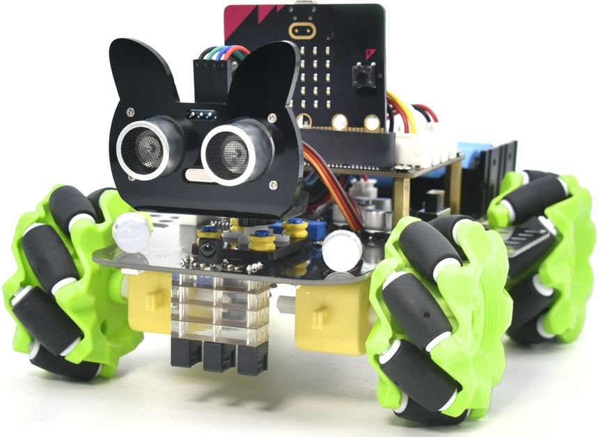

## 製品紹介

プログラミングを学んだり、自分のプログラム可能なロボットを持ちたいと思ったことはありませんか？近年、プログラミングはより低年齢層にも広がっており、micro:bit や Arduino、Raspberry Pi といったシンプルなグラフィカルプログラミングプラットフォームの普及により、誰にとってもトレンドになりつつあります。これらについてこれまで聞いたことがないかもしれません。しかし、本製品とチュートリアルを利用すれば、多機能なプログラミングカーを簡単に組み立て、メイカーとしての楽しさを体験できます。

Micro:bit は高い集積度を持つマイクロコントローラで、機能が豊富で小型です。コードプログラミングとグラフィカルプログラミングの組み合わせによってロボット、ウェアラブルデバイス、電子インタラクティブゲームを作成できるため、STEAM 教育への応用に非常に適しています。

この Keyestudio 4WD Mecanum Robot Car V2.0 は micro:bit 専用のスマート DIY カーです。本スマートカーは、拡張機能を備えた車体、モータードライバとセンサーが統合された PCB ベースプレート、4 台の減速 DC モータ、Mecanum ホイール、各種モジュールとセンサー、およびアクリル板で構成されています。したがって、クールな Mecanum ホイール式 4WD スマートカーを自分で簡単に組み立てられ、その後 Microsoft のオンライングラフィカルプログラミングプラットフォーム Make Code を使用して micro:bit コントロールボードをプログラムし、車体を制御できます。制作過程で、創作の楽しさを味わえるだけでなく、実践力を高め、プログラミングスキルも学べます。

MakeCode for micro:bit は、micro:bit 公式サイトで最も広く使用されているグラフィカルプログラミング環境です。これは Microsoft のオープンソースプロジェクト MakeCode により開発されたグラフィカルプログラミング環境に基づいています。このグラフィカルプログラミングは Python や JavaScript のコード言語に変換することもでき、プログラミング学習の敷居を下げます。同時に、MakeCode によるプログラミングはシミュレーション可能であり、実際の電子部品に対してプログラムを適用することもできます。

便宜上、各プロジェクトにはソースコードが提供されており、コードのプログラミング手順およびコードの詳細な説明も含まれています。これにより、より深く理解できることを願っています。