## Lista del kit de producto

Por favor, verifique la lista para asegurarse de que todas las piezas estén completas. Si encuentra elementos faltantes, comuníquese con nuestro personal de ventas de inmediato.

|#|Imagen|Nombre|Cant.|
|-|-|-|-|
|1|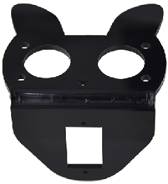|Placa acrílica T=3mm|1|
|2|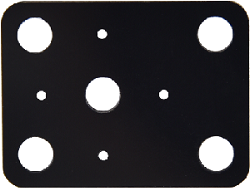|Placa acrílica con orificios para Lego T=3mm|1|
|3||Placa del motor|4|
|4||Motor|4|
|5|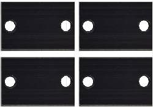|Placa de fijación 23*15*5MM|4|
|6||Servo|1|
|7||Ruedas Mecanum (dirección A)|2|
|8||Ruedas Mecanum (dirección B)|2|
|9||Placa de expansión keyestudio Micro:bit|1|
|10||Placa principal micro:bit V2.0|1|
|11|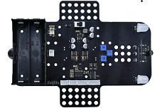|Placa inferior Keyestudio Mecanum Car|1|
|12||Pilar de cobre M3*20MM (pasante)|4|
|13|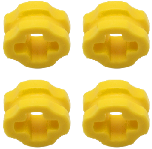|Pieza Lego 4265c|4|
|14||Pieza Lego 43093|4|
|15|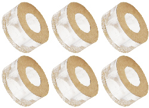|Junta acrílica|1|
|16|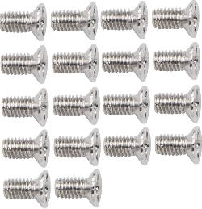|Tornillo avellanado M3*6MM|10|
|17||Sensor ultrasónico HC-SR04|1|
|18||Tornillo avellanado M3*8MM|10|
|19||Tuerca niquelada M3|10|
|20|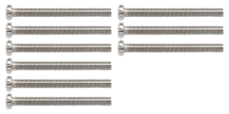|Tornillo cabeza redonda M3*30MM|9|
|21||Tuerca niquelada M2|3|
|22|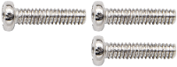|Tornillo cabeza redonda M2*8MM|3|
|23|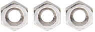|Tuerca niquelada M1.4|6|
|24||Tornillo cabeza redonda M1.4*10MM|6|
|25|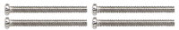|Tornillo cabeza redonda M2.5*14MM|4|
|26||Control remoto|1|
|27||Cordón plástico 3*100MM|5|
|28||Cable USB|1|
|29||Cable DuPont HX2.54 2P 100mm|1|
|30|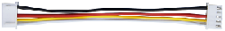|Cable DuPont XH2.54 5P 100mm|1|
|31|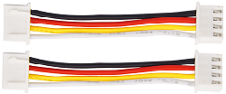|Cable DuPont HX2.54 4P 50mm|1|
|32|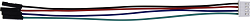|Cable DuPont HX2.54 4P a 2.54 F-F 150mm|1|
|33|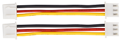|Cable DuPont XH2.54 3P 50mm|2|
|34||Destornillador 3*40MM|1|
|35|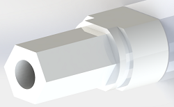|Acoplamiento TT|4|
|36||Tornillo autoforestante cabeza redonda M1.2*5MM|6|
|37|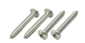|Tornillos cabeza redonda M2.3*16MM|4|

⚠️ **Recordatorio especial:** Control remoto (KS4034F/KS4035F con pilas; KS4034/KS4035 sin pilas, Tipo de pila: CR2025 (suministrada por usted))

⚠️ **Recordatorio especial:** Placa principal micro:bit V2.0 (KS4034/KS4034F incluida; KS4035/KS4035F no incluida)