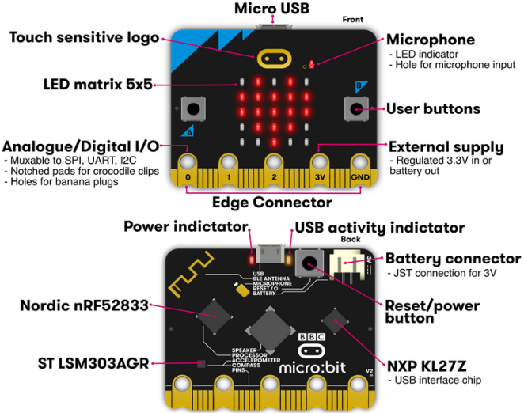
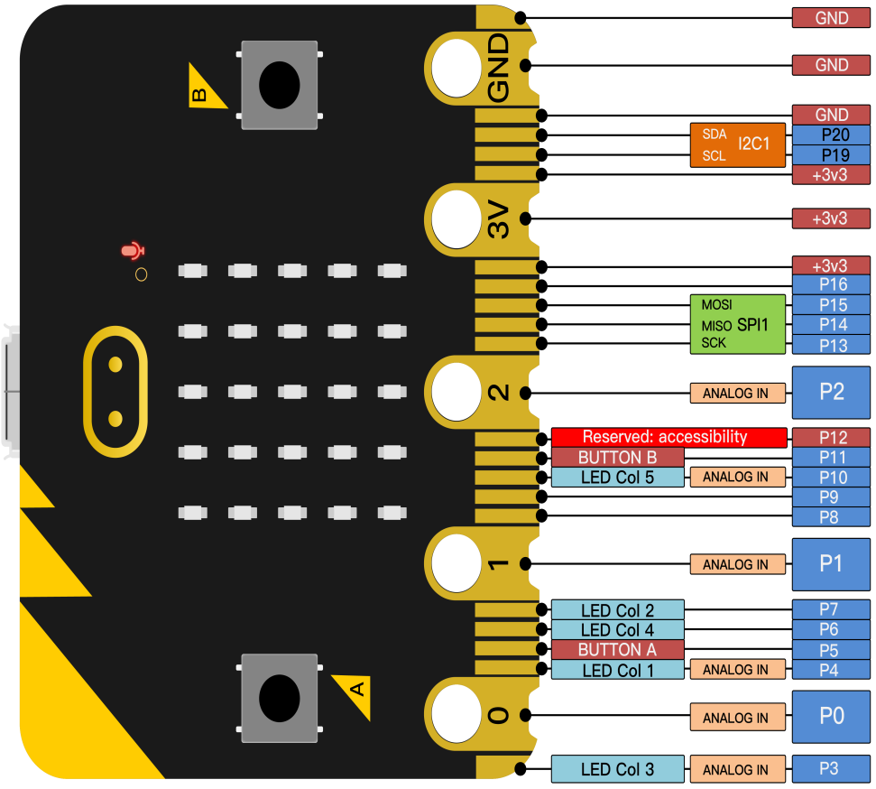

## BBC Micro:bit

### **(1) Was ist Micro:bit?**

Micro:bit ist eine Open-Source-Hardware-Plattform auf ARM-Architektur, die von der British Broadcasting Corporation (BBC) gemeinsam mit ARM, Barclays, element14, Microsoft und weiteren Institutionen initiiert wurde. Das Kernbauteil ist ein 32-Bit Arm Cortex‑M4 mit FPU.

Das Board hat nur die Größe einer Kreditkarte, ist aber sehr leistungsfähig. Die Micro:bit Hauptplatine ist mit zahlreichen Komponenten ausgestattet, wie einer 5×5 LED-Matrix, 2 programmierbaren Tasten, einem Beschleunigungssensor, einem Kompass, einem Thermometer, einem berührungsempfindlichen Logo, einem MEMS‑Mikrofon, einem Bluetooth‑Low‑Energy‑Modul sowie einem Summer, sodass es in der Lage ist, ohne externe Geräte verschiedene Töne wiederzugeben.

Darüber hinaus unterstützt dieses Board einen Schlafmodus zur Reduzierung des Batterieverbrauchs, der aktiviert werden kann, indem Benutzer die Reset‑ & Power‑Taste auf der Rückseite lange drücken.

Das Micro:bit‑Entwicklungsboard ist einfach zu verwenden und erweiterbar: Die unteren Kontakte (Goldfingers) am Edge Connector erlauben die Interaktion mit verschiedenen elektronischen Komponenten über festgeklemmte Krokodilklemmen. Es kann Sensordaten lesen, Servos und RGB‑Leuchten steuern und ein Erweiterungsboard aufnehmen, um diverse Sensoren anzuschließen.

Ferner werden verschiedene Programmiersprachen und grafische Programmierplattformen unterstützt; es ist mit nahezu allen PCs und mobilen Geräten kompatibel und benötigt keinen komplizierten Treiber. Es verfügt über stark integrierte elektronische Module und eine serielle Überwachungsfunktion für einfaches Debugging.

Das Board wird häufig eingesetzt für die Programmierung von Videospielen, Licht‑ und Ton‑Interaktionen, Robotersteuerung, wissenschaftliche Experimente, Wearables sowie kreative Erfindungen wie Roboter und Musikinstrumente.

### **(2) Aufbau**

Für weitere Informationen besuchen Sie bitte die folgenden Links:

[https://tech.microbit.org/hardware/](https://tech.microbit.org/hardware/)

[https://microbit.org/new-microbit/](https://microbit.org/new-microbit/)

[https://www.microbit.org/get-started/user-guide/overview/](https://www.microbit.org/get-started/user-guide/overview/)

[https://microbit.org/get-started/user-guide/features-in-depth/](https://microbit.org/get-started/user-guide/features-in-depth/)

### **(3) Pinbelegung**

**Funktionen:**

|                            |                                                                                                    |
|----------------------------|----------------------------------------------------------------------------------------------------|
| GPIO                       | P0, P1, P2, P3, P4, P5, P6, P7, P8, P9, P10, P11, P12, P13, P14, P15, P16, P19, P20                |
| ADC/DAC                    | P0, P1, P2, P3, P4, P10                                                                            |
| IIC                        | P19 (SCL), P20 (SDA)                                                                                |
| SPI                        | P13 (SCK), P14 (MISO), P15 (MOSI)                                                                  |
| PWM (häufig verwendet)     | P0, P1, P2, P3, P4, P10                                                                            |
| PWM (selten verwendet)     | P5, P6, P7, P8, P9, P11, P12, P13, P14, P15, P16, P19, P20                                         |
| Belegt                     | P3 (LED Col3), P4 (LED Col1), P5 (Button A), P6 (LED Col4), P7 (LED Col2), P10 (LED Col5), P11 (Button B) |

Bitte besuchen Sie die offizielle Webseite für weitere Details: [https://tech.microbit.org/hardware/edgeconnector/](https://tech.microbit.org/hardware/edgeconnector/)

[https://microbit.org/guide/hardware/pins/](https://microbit.org/guide/hardware/pins/)

### **(4) Vorsichtsmaßnahmen bei der Verwendung des Micro:bit‑Mainboards:**

a\. Es wird empfohlen, einen Silikonschutz (Gehäuse/Hülle) zu verwenden, um Kurzschlüsse an den empfindlichen elektronischen Komponenten zu vermeiden.

b\. Die IO‑Pins sind nur schwach belastbar und können lediglich Ströme unter 300 mA handhaben. Schließen Sie daher keine stromstarken Verbraucher wie MG995‑Servos oder DC‑Motoren direkt an, da diese das Board zerstören können. Ermitteln Sie vor dem Einsatz die Stromaufnahme der angeschlossenen Geräte; in der Regel wird empfohlen, das Board zusammen mit einem Micro:bit‑Erweiterungsboard zu verwenden.

c\. Es wird empfohlen, das Mainboard über die USB‑Schnittstelle oder eine 3V‑Batterie zu versorgen. Die IO‑Pins arbeiten mit 3V, daher werden 5V‑Sensoren nicht unterstützt. Zur Verwendung von 5V‑Sensoren ist ein Micro:bit‑Erweiterungsboard erforderlich.

d\. Werden Pins verwendet, die mit der LED‑Matrix geteilt sind (P3, P4, P6, P7 und P10), kann das Abschirmen dieser Pins gegenüber der Matrix dazu führen, dass die LEDs willkürlich leuchten und Sensordaten fehlerhaft sind.

e\. Die Pins 19 und 20 können nicht als allgemeine IO‑Pins benutzt werden, obwohl MakeCode dies eventuell anzeigt. Sie sind nur für die I2C‑Kommunikation vorgesehen.

f\. An den 3V‑Batterieanschluss dürfen keine Batterien mit mehr als 3,3V angeschlossen werden, da das Mainboard sonst beschädigt werden kann.

g\. Betreiben Sie das Board nicht auf Metalloberflächen, um Kurzschlüsse zu vermeiden.

Kurz gesagt: Das Micro:bit V2 Mainboard ist wie ein Kleinstrechner, der Programmieren greifbar macht und digitale Innovation fördert. Für die Programmierumgebung stellt die BBC die Webseite [https://microbit.org/code/](https://microbit.org/code/) zur Verfügung, die eine grafische MakeCode‑Umgebung bietet, die leicht zu bedienen ist.

---