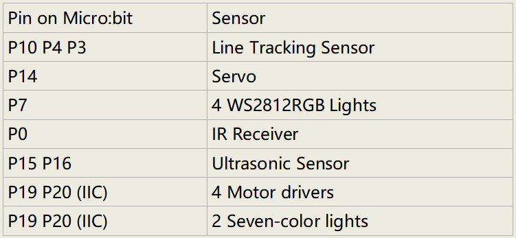

## Assemble Mecanum Robot  

It is a programmable car based on BBC micro:bit. It integrates a motor driver, a line tracking sensor and an IR receiver into the base plate, which also contains an ultrasonic sensor, a servo, 2 seven-color lights as well as 4 WS2812 RGB lights. The wiring is not complicated and it has Lego jacks to facilitate connection with other peripheral devices. Abundant hardware resources will enable you to master more knowledge and skills to create more technological inventions.

## Sensors and control pins of the 4WD Mecanum Robot Car V2.0

This car can help you to better learn how to use the Micro:bit and make electronic knowledge accessible to you.

**Functions**

|        |                   |                       |       |                   |                      |             |                  |              |
| ------ | ----------------- | --------------------- | ----- | ----------------- | -------------------- | ----------- | ---------------- | ------------ |
| Sensor | Seven-color light | Decelerating DC motor | Servo | Ultrasonic sensor | Line Tracking Sensor | IR Receiver | WS2812 RGB light | Power switch |
| QTY    | 2                 | 4                     | 1     | 1                 | 3                    | 1           | 4                | 1            |

**Note: the line tracking sensor, WS2812 RGB lights, IR receiver and moto river are integrated in the base plate.**

**Pins：**

**Power supply and Battery**

The keyestudio 4WD Mecanum Robot Car is powered by two 18650 batteries. The battery holder of the car is compatible with any type of 18650 lithium battery (rechargeable). You can use a universal battery charger to charge the 18650 lithium battery.

**Note:** This product does not contain batteries.
