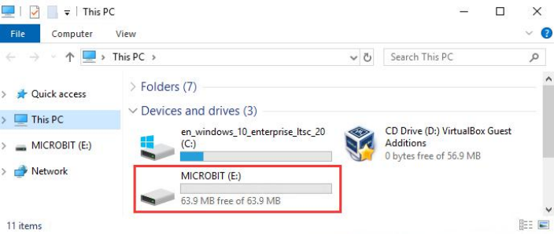

## 1.Démarrage avec Micro:bit

Étape 1 : connectez le Micro: Bit main board V2 à votre ordinateur

Tout d'abord, reliez le Micro: Bit main board V2 à votre ordinateur via le câble USB.

Étape 2 : si la LED rouge à l'arrière de la carte est allumée, cela signifie que la carte est alimentée. Ensuite, le Micro: Bit main board V2 apparaîtra sur votre ordinateur comme un lecteur nommé 'MICROBIT'. Veuillez noter qu'il ne s'agit pas d'un disque USB ordinaire comme montré ci-dessous.

Étape 3 : écrire des programmes

https://makecode.microbit.org/

Félicitations pour avoir terminé votre premier code ! Vous devriez maintenant voir la 5x5 LED dot matrix afficher différents motifs.

Ensuite, je vais montrer comment télécharger le code écrit sur l'ordinateur et le téléverser en utilisant une méthode différente.

