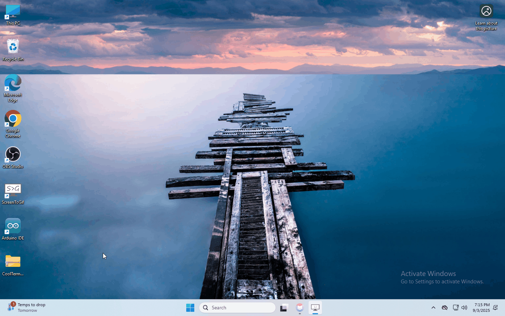

## 2. Instalación de CoolTerm

El programa CoolTerm se utiliza para leer los datos en el puerto serie.

Descargar el programa CoolTerm:

- macOS:

  - [Intel/ARM](https://freeware.the-meiers.org/CoolTermMac.dmg)
- Win:

  - [Intel 64Bit](https://freeware.the-meiers.org/CoolTermWin64Bit.zip)
  - [Intel 32Bit](https://freeware.the-meiers.org/CoolTermWin32Bit.zip)
  - [ARM 64Bit](https://freeware.the-meiers.org/CoolTermWinARM64Bit.zip)
- Linux:

  - [Intel 64Bit](https://freeware.the-meiers.org/CoolTermLinux64Bit.zip)
  - [Intel 32Bit](https://freeware.the-meiers.org/CoolTermLinux32Bit.zip)

(1) Después de la descarga, necesitamos instalar el archivo del programa CoolTerm; a continuación se toma como ejemplo el sistema Windows.

(2) Elija "win" para descargar el archivo zip de CoolTerm.

(3) Descomprima el archivo y ábralo. (también apto para sistemas Mac y Linux)

Las funciones de cada botón de la barra de herramientas se enumeran a continuación:

| Comando    | Descripción                                      |
| ---------- | ------------------------------------------------ |
| New        | Abre una nueva Terminal                          |
| Open       | Abre una Conexión guardada                       |
| Save       | Guarda la Conexión actual en el disco            |
| Connect    | Abre la Conexión Serie                            |
| Disconnect | Cierra la Conexión Serie                          |
| Clear Data | Borra los Datos Recibidos                         |
| Options    | Abre el cuadro de diálogo de Opciones de Conexión |
| HEX        | Muestra los datos del Terminal en formato hexadecimal |
| View       | Muestra la ventana de Ayuda                      |

Una vez completada la instalación, utilizaremos esta herramienta en las lecciones siguientes.