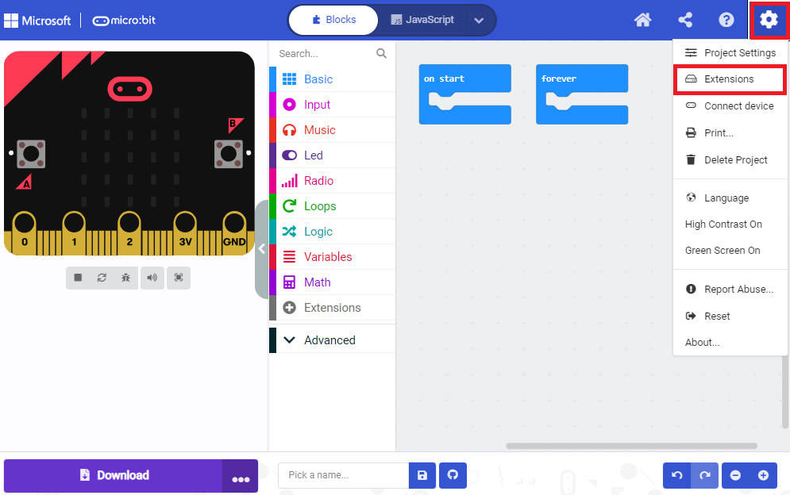
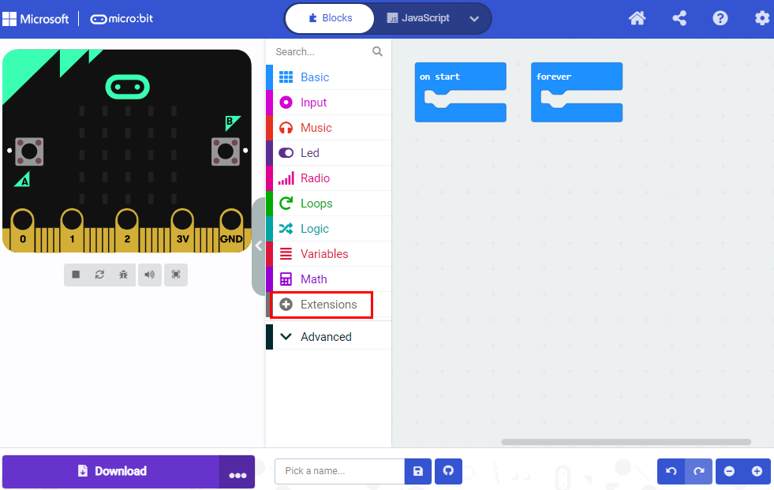
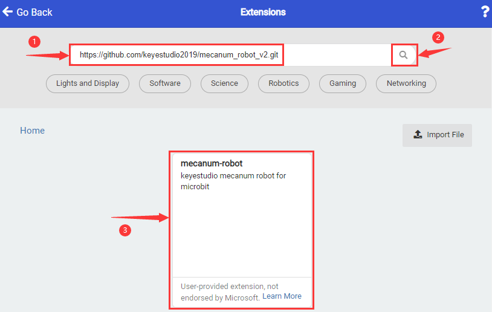
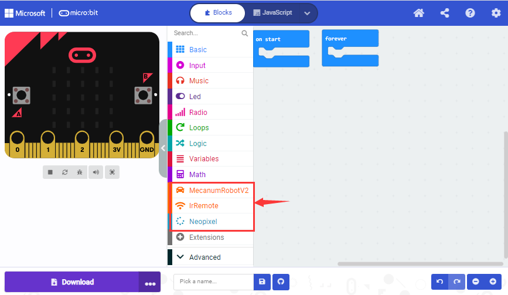

## 3.Makecode Extension Libraries

Hemos creado una biblioteca de extensión de Makecode para este coche robot Mecanum V2.0.

Agregar una biblioteca de extensión del coche robot Mecanum V2.0.

Siga los siguientes pasos para agregar los archivos de extensión:

Abra Makecode para entrar en un proyecto → haga clic en el icono con forma de engranaje (para la configuración) en la esquina superior derecha → elija “**Extensions**”;



O haga clic en “**Extensions**”, como se muestra a continuación:



Introduzca el enlace:

```
https://github.com/keyestudio2019/mecanum_robot_v2
```

Toque el resultado de búsqueda “**MecanumRobotV2**” para descargarlo e instalarlo. Este proceso puede tardar unos segundos.



Después de la instalación, podrá encontrar los archivos de extensión **Mecanum RobotV2** e **IrRemote** en el lado izquierdo.

Y el archivo de extensión Neopixel también está instalado.

