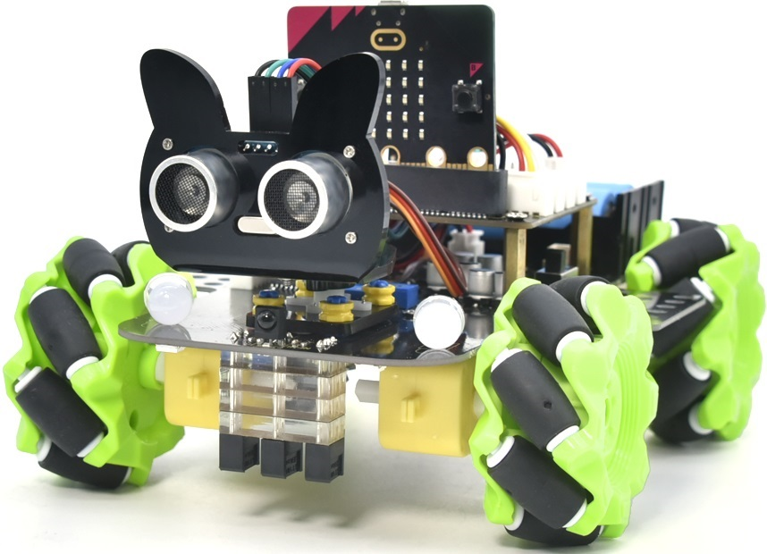

================
3. Makecode
================

|image1|

.. toctree::
   :maxdepth: 1

   00_Resource_Download
   01_1.Getting_Started_with_Microbit
   02_2._CoolTerm_Installation
   03_3.Makecode_Extension_Libraries
   Project_01_Project_1_Heartbeat
   Project_02_Project_2_Light_A_Single_LED
   Project_03_Project_3_LED_Dot_Matrix
   Project_04_Project_4_Programmable_Buttons
   Project_05_Project_5_Temperature_Detection
   Project_06_Project_6_Geomagnetic_Sensor
   Project_07_Project_7_Accelerometer
   Project_08_Project_8_Light_Detection
   Project_09_Project_9_Speaker
   Project_10_Project_10_Touch-sensitive_Logo
   Project_11_Project_11_Microphone
   Project_12_Project_12_Bluetooth_Wireless_Communication
   Project_13_Project_13Seven-Color_LED
   Project_15_Project_15Servo
   Project_16_Project_16Motor
   Project_17_Project_17Line_Tracking_Sensor
   Project_18_Project_18Ultrasonic_Sensor
   Project_19_Project_19IR_Remote_Control
   Project_20_Project_20Bluetooth_Multi-purpose_Smart_Car
   24_Common_Problems

