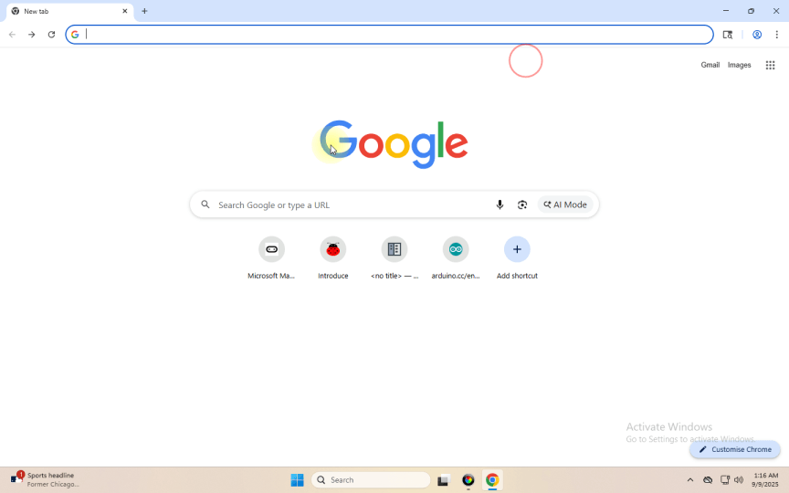

## Project 1: Hartslag

[Klik hier om code voor deze les te downloaden](./Code/Heartbeat.hex)

### (1)Project Description

(1) Project Description Dit project is eenvoudig uit te voeren met een Micro:bit main board V2, een Micro USB-kabel en een computer. De LED-dotmatrix van de Micro:bit toont eerst een relatief groot hartvormig patroon en daarna een kleiner patroon. Deze afwisselende wijziging van het patroon lijkt op een hartslag. Dit experiment dient als een starter voor je introductie in de programmeerwereld.

### (2)Components Needed:

Micro:bit main board V2 

Micro USB cable

### (3)Test Code:

Sluit de Micro:bit main board V2 via de Micro USB-kabel aan op je computer en begin met bewerken.

Complete Program :

Opmerking: "on start" betekent dat de code in dit blok slechts één keer wordt uitgevoerd, terwijl "forever" impliceert dat de code cyclisch draait.

### (4)Test Results:

Na het uploaden van de code zie je een hartslag-effect op de Micro:bit-board verschijnen.

