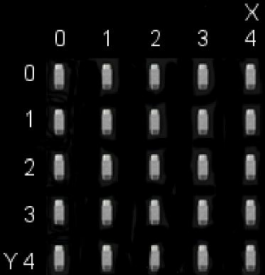
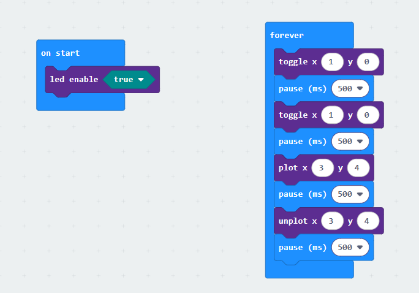

## Proyecto 2: Light A Single LED

[Haga clic para descargar el código de esta lección](./Code/Light-A-Single-LED.hex)

### (1)Descripción del proyecto:

(1)Descripción del proyecto: La matriz de puntos LED consta de 25 LED dispuestos en un cuadrado de 5 × 5. Para localizar estos LED rápidamente, como se muestra en la figura siguiente, podemos considerar esta matriz como un sistema de coordenadas y crear dos ejes marcando las filas de 0 a 4 de arriba a abajo y las columnas de 0 a 4 de izquierda a derecha. Por lo tanto, el LED situado en la segunda posición de la primera fila es (1,0) y el LED ubicado en la quinta de la cuarta columna es (3,4), y así sucesivamente.

### (2)Componentes necesarios:

Micro:bit main board V2

Cable Micro USB

### (3)Código de prueba:

Conecte el Micro:bit main board V2 a su ordenador mediante el cable Micro USB y comience a editar.

Programa completo:

### (4)Resultados de la prueba

Después de cargar el código, observará que la placa Microbit muestra el siguiente efecto: (1,0) se enciende durante 0,5 segundos y luego se apaga, seguido de (3,4) que se enciende durante 0,5 segundos y luego se apaga, repitiéndose en bucle.

