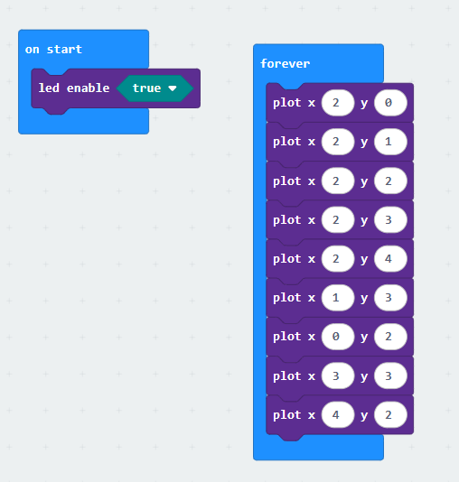
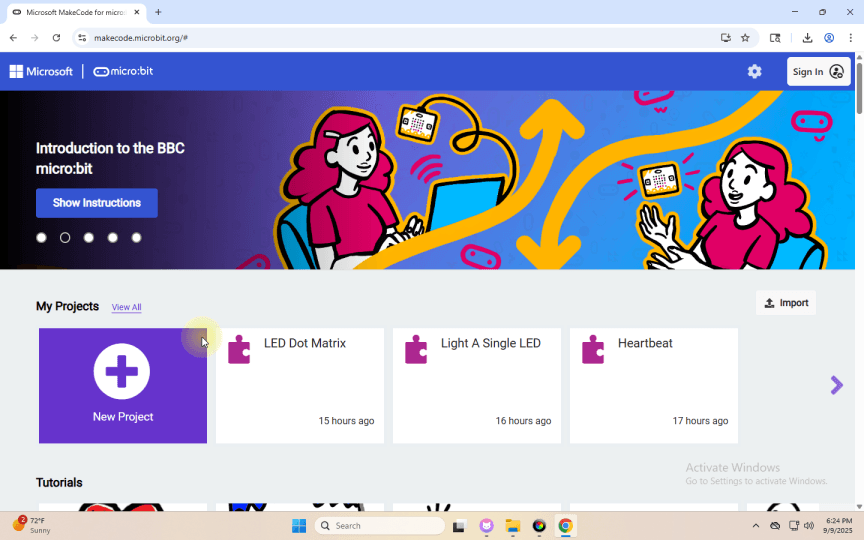
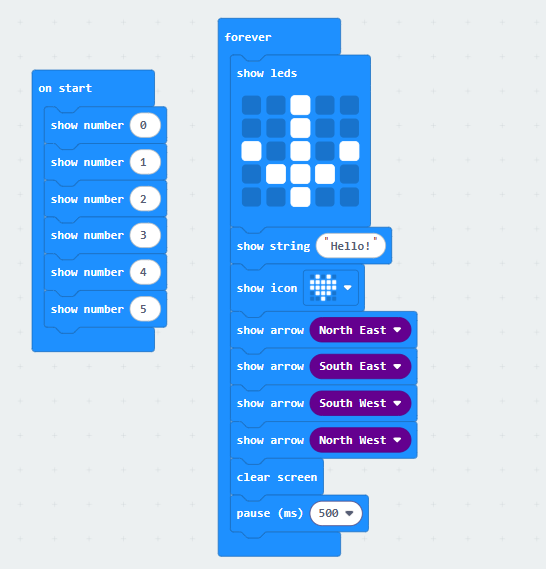

## Project 3: LED-Punktmatrix

[Klicken Sie hier, um den Code 1 für diese Lektion herunterzuladen](./Code/LED-Dot-Matrix.hex)

[Klicken Sie hier, um den Code 2 für diese Lektion herunterzuladen](./Code/LED-Dot-Matrix2.hex)

### (1)Project Description:

Punktmatrizen sind im Alltag weit verbreitet. Sie finden vielfältige Anwendungen in LED-Werbetafeln, Etagenanzeigen in Aufzügen, Fahrplananzeigen an Bushaltestellen und ähnlichen Bereichen.

Die LED-Punktmatrix des Micro:bit main board V2 besteht aus 25 LEDs in einem Raster. Zuvor ist es uns gelungen, eine bestimmte LED durch Einfügen ihres Positionswertes in den Testcode zu steuern. Auf der gleichen Grundlage können wir viele LEDs gleichzeitig einschalten, um Muster, Ziffern und Zeichen darzustellen.

Außerdem können wir durch Anklicken von "show icon" das gewünschte Anzeigemuster auswählen. Schließlich können wir auch eigene Muster entwerfen.

### (2)Components Needed:

Micro:bit main board V2 

Micro USB cable

### (3)Test Code 1:

Verbinden Sie den Computer mit dem Micro:bit-Board über ein Micro-USB-Kabel und programmieren Sie im MakeCode-Editor.

Vollständiges Programm :

### (4) Test Results 1:

Laden Sie Code 1 hoch und schalten Sie das Board ein, dann sehen Sie das Symbol.

### (5) Test Code 2:

Verbinden Sie den Computer mit dem Micro:bit-Board über ein Micro-USB-Kabel und programmieren Sie im MakeCode-Editor.

Vollständiges Programm :

### (6)Test Results 2 :

Nach dem Hochladen des Codes auf den Microbit sehen Sie, wie die 5x5-Punktmatrix die im Code angegebenen Muster und Texte zyklisch anzeigt.（Hinweis: "on start" bedeutet, dass der Code in diesem Block nur einmal ausgeführt wird, während "forever" anzeigt, dass der Code zyklisch ausgeführt wird.）

