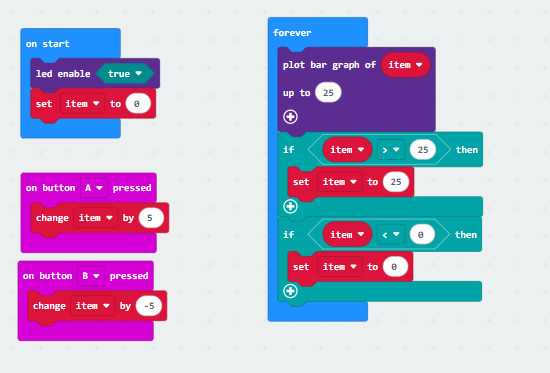

## Project 4: Programmable Buttons

[Click to download the code 1 for this lesson](./Code/Programmable-Buttons.hex)

[Click to download the code 2 for this lesson](./Code/Programmable-Buttons2.hex)

### (1)Project Description:

Buttons can be used to control circuits. In an integrated circuit with a button, the circuit is connected when pressing the button and it is open the other way around. Micro: Bit main board V2 boasts three buttons, two are programmable buttons(marked with A and B), and the one on the other side is a reset button. By pressing the two programmable buttons can input three different signals. We can press button A or B alone or press them together and the LED dot matrix shows A,B and AB respectively. Let's get started.

### (2)Components Needed:

Micro:bit main board V2 

Micro USB cable

### (3)Test Code 1 :

Link computer with micro:bit board by micro USB cable, and program in MakeCode editor,

Complete Code:

### (4)Test Results 1 :

After uploading test code 1 to micro:bit main board V2 , the 5*5 LED dot matrix shows A if button A is pressed, B if button B pressed, and AB if button A and B pressed together.

### (5) Test Code 2 :

Complete Program :

### (6)Test Results 2:

After uploading test code 2 to micro:bit main board V2, when pressing the button A the LEDs turning red increase while when pressing the button B the LEDs turning red reduce.

