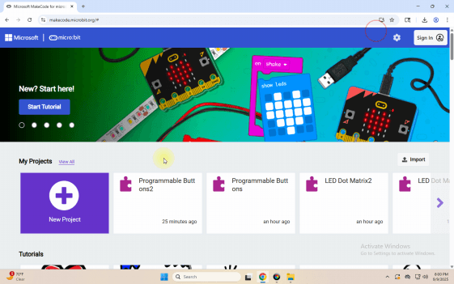

## Progetto 5: Rilevamento della temperatura

[Clicca per scaricare il codice 1 per questa lezione](./Code/Temperature-Detection.hex)

[Clicca per scaricare il codice 2 per questa lezione](./Code/Temperature-Detection2.hex)

### (1)Descrizione del progetto:

La Micro:bit main board V2 non è dotata di un sensore di temperatura dedicato, ma utilizza il sensore di temperatura integrato nel chip NFR52833 per la rilevazione. Pertanto, la temperatura rilevata è più vicina alla temperatura del chip e potrebbe discostarsi dalla temperatura ambiente.

### (2)Componenti necessari:

Micro:bit main board V2

Cavo Micro USB

### (3)Codice di test 1 :

### (4)Risultati del test 1:

Dopo aver caricato il codice di test 1 sulla Micro:bit main board V2, alimentato la scheda tramite il cavo USB e fatto clic su "Show console Device", i dati della temperatura vengono visualizzati nella pagina del monitor seriale come mostrato di seguito.

Se si utilizza Windows 7 o 8 invece di Windows 10, Google Chrome non sarà in grado di rilevare i dispositivi. È necessario utilizzare il software CoolTerm come monitor seriale per leggere i dati. Avviare CoolTerm, cliccare su Options, selezionare SerialPort, impostare la porta COM e impostare la velocità in baud su 115200 (dai test, la velocità di comunicazione USB SerialPort sulla Micro:bit main board V2 è 115200), cliccare OK e poi Connect. Il monitor seriale CoolTerm mostra la variazione della temperatura nell'ambiente corrente, come nelle figure seguenti:

### (5)Codice di test 2 :

Collegare il computer alla scheda micro:bit tramite cavo Micro USB e programmare nell'editor MakeCode,

Programma completo :

### (6)Risultati del test 2:

Dopo aver caricato il codice 2, quando la temperatura ambiente è inferiore a 35℃, la matrice di LED 5x5 mostra . Quando la temperatura è pari o superiore a 35℃ compare il motivo .

---