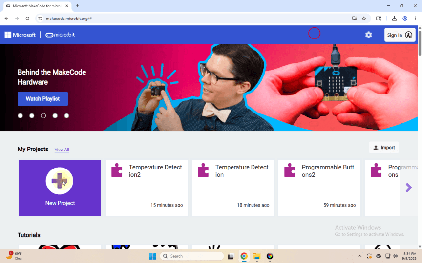
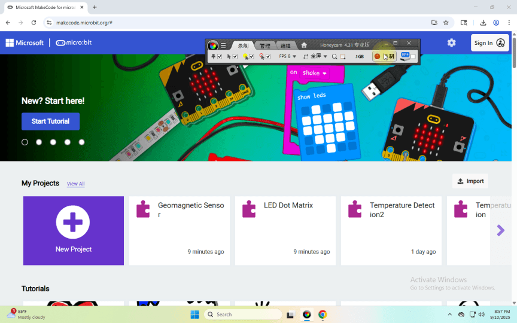
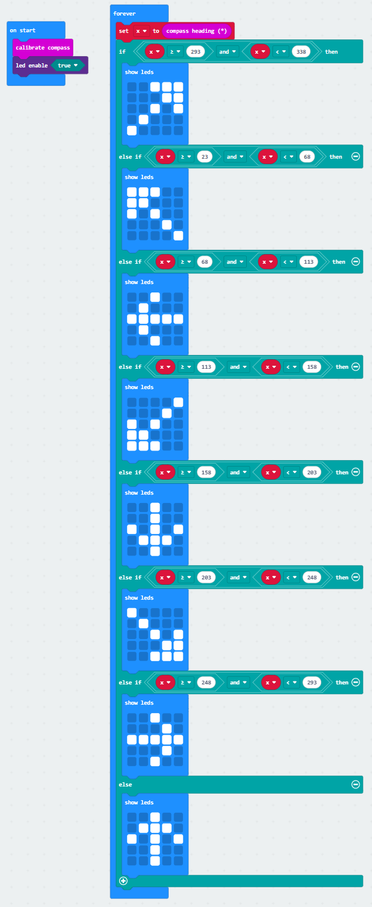

## Progetto 6: Sensore geomagnetico

[Fai clic per scaricare il codice 1 per questa lezione](./Code/Geomagnetic-Sensor.hex)

[Fai clic per scaricare il codice 2 per questa lezione](./Code/Geomagnetic-Sensor2.hex)

### (1)Descrizione del progetto:

(1) Descrizione del progetto: Questo progetto ha lo scopo di spiegare l'uso del sensore geomagnetico del Micro:bit, che può non solo rilevare l'intensità del campo geomagnetico, ma anche essere usato come bussola per trovare i punti cardinali. È anche una parte importante del sistema di riferimento di assetto e direzione (AHRS). Il Micro:bit main board V2 utilizza il sensore geomagnetico LSM303AGR, e l'intervallo dinamico del campo magnetico è ± 50 gauss. Sulla scheda, il modulo magnetometro è utilizzato sia per il rilevamento magnetico sia come bussola. In questo esperimento verrà introdotta prima la bussola, e poi verranno controllati i dati grezzi del magnetometro. Il componente principale di una bussola comune è un ago magnetico, che può essere ruotato dal campo geomagnetico e puntare verso il Polo Nord geomagnetico (che è vicino al Polo Sud geografico) per determinare la direzione.

### (2)Componenti necessari:

Micro:bit main board V2

 Cavo Micro USB

### (3)Codice di test 1 :

Collegare il computer alla scheda micro:bit con un cavo Micro-USB e programmare nell'editor MakeCode.

Programma completo :

### (4)Risultati del test 1 :

Dopo aver caricato il codice di test sul Micro:bit main board V2 e aver alimentato la scheda tramite il cavo USB, premendo il pulsante A la scheda ci chiede di calibrare la bussola e la matrice di punti LED mostra "TILT TO FILL SCREEN". Quindi si entra nella pagina di calibrazione. Ruotare la scheda finché tutti e 25 i LED non sono accesi in rosso come mostrato qui sotto.

calibrare la bussola:

Dopo ciò, appare un motivo a sorriso che implica che la calibrazione è completata. Quando il processo di calibrazione è terminato, premendo il pulsante A verrà visualizzata direttamente sullo schermo la lettura del magnetometro. E le direzioni nord, est, sud e ovest corrispondono rispettivamente a 0°, 90°, 180° e 270°.

### (5) Codice di test 2:

Questo modulo può continuare a leggere i dati per determinare la direzione, pertanto indica il polo nord magnetico attuale con una freccia.

Collegare il computer alla scheda micro:bit con un cavo Micro-USB e programmare nell'editor MakeCode,

Programma completo :

### (6) Risultati del test 2

Caricare il codice 2. Dopo la calibrazione, inclinare la scheda micro:bit e la matrice di punti LED visualizzerà i simboli di direzione.

---