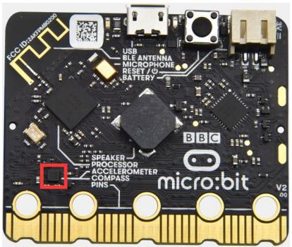
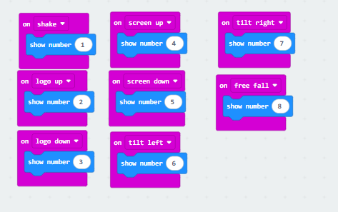
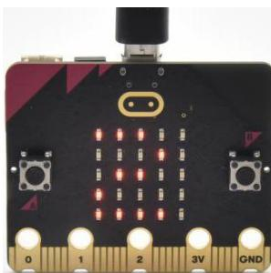
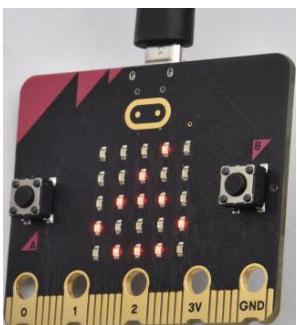

## Progetto 7: Accelerometer

[Fai clic per scaricare il codice 1 per questa lezione](./Code/Accelerometer.hex)

[Fai clic per scaricare il codice 2 per questa lezione](./Code/Accelerometer2.hex)

### (1)Descrizione del progetto:

La Micro: Bit main board V2 dispone di un sensore di accelerazione gravitazionale integrato LSM303AGR, noto anche come accelerometro, con risoluzione di 8/10/12 bit. Nella sezione del codice è possibile impostare l'intervallo su 1g, 2g, 4g e 8g.

Spesso utilizziamo accelerometri per rilevare lo stato delle macchine. In questo progetto introdurremo come misurare la posizione della scheda con l'accelerometro e quindi daremo un'occhiata ai dati tridimensionali grezzi emessi dall'accelerometro.

### (2)Componenti necessari:

Micro:bit main board V2

Cavo Micro USB

### (3)Codice di test 1:

Collegare il computer alla scheda micro:bit tramite cavo Micro USB e programmare nell'editor MakeCode,

Programma completo:

### (4)Risultati del test 1:

Dopo aver caricato il Test Code 1 sulla scheda micro:bit V2, modificare l'orientamento della scheda farà sì che la matrice di punti 5x5 visualizzi numeri diversi.

Se scuotiamo il Micro: Bit main board V2, in qualsiasi direzione, la matrice LED mostra la cifra "1".

Quando viene tenuta in posizione verticale (con il logo sopra la matrice LED), viene visualizzato il numero 2.

Quando viene tenuta a testa in giù (con il logo sotto la matrice LED), si presenta come sotto.

Quando è posata ferma sulla scrivania con il lato anteriore rivolto verso l'alto, appare il numero 4.

Quando è posata ferma sulla scrivania con il lato posteriore rivolto verso l'alto, appare il numero 5.

Quando la scheda è inclinata a sinistra, la matrice LED mostra il numero 6 come mostrato di seguito.

Quando la scheda è inclinata a destra, la matrice LED visualizza il numero 7 come mostrato di seguito.

Quando la scheda viene colpita a terra, questo processo può essere considerato una caduta libera e la matrice LED mostra il numero 8. (si prega di notare che questo test non è raccomandato in quanto potrebbe danneggiare la scheda principale.)

Attenzione: se desiderate provare questa funzione, potete impostare l'accelerazione anche su 3g, 6g o 8g. Tuttavia, non lo consigliamo.

### (5)Codice di test 2:

Programma completo:

### (6) Risultati del test 2

Caricare il codice di test sulla Micro: Bit main board V2, alimentare la scheda principale tramite il cavo USB e fare clic su "Show console Device".

L'interfaccia seguente mostra i valori di decomposizione dell'accelerazione sugli assi X, Y e Z rispettivamente, nonché la sintesi dell'accelerazione (sintesi della gravità e di altre forze esterne).

Facendo riferimento al manuale dati del MMA8653FC e allo schema hardware della Micro: Bit main board V2, le coordinate dell'accelerometro della scheda madre Micro: Bit V2 sono mostrate nella figura seguente:

Se state usando Windows 7 o 8 invece di Windows 10, Google Chrome non sarà in grado di abbinare i dispositivi. Dovrete utilizzare il software di monitor seriale CoolTerm per leggere i dati. Potete aprire CoolTerm, fare clic su Options, selezionare SerialPort, impostare la porta COM e impostare la velocità in baud a 115200 (dopo i test, la velocità di comunicazione della porta seriale USB sulla Micro: Bit main board V2 è 115200), fare clic su OK e Connect. Il monitor seriale CoolTerm mostra i dati degli assi X, Y e Z, come mostrato nelle figure seguenti:

