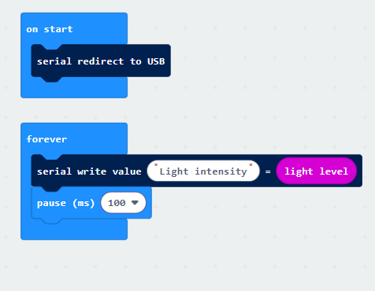

## Projekt 8: Lichtmessung

[Klicken Sie hier, um den Code für diese Lektion herunterzuladen](./Code/Light-Detection.hex)

### (1) Projektbeschreibung:

In diesem Projekt konzentrieren wir uns auf die Lichtdetektionsfunktion des Micro: Bit main board V2. Diese wird durch die LED-Punktmatrix realisiert, da die Hauptplatine nicht mit einem Fotowiderstand ausgestattet ist.

### (2) Benötigte Komponenten:

Micro:bit main board V2

Micro-USB-Kabel

### (3) Testcode:

Verbinden Sie den Computer mit dem micro:bit board über das Micro-USB-Kabel und programmieren Sie im MakeCode-Editor,

Vollständiges Programm :

### (4) Testergebnisse:

Laden Sie den Testcode auf das micro:bit main board V2 hoch, versorgen Sie das Board über das USB-Kabel mit Strom und klicken Sie auf "Show console Device".

Wenn die LED-Punktmatrix mit der Hand abgedeckt wird, beträgt die angezeigte Lichtstärke etwa 0; wenn die LED-Punktmatrix dem Licht ausgesetzt ist, wird die angezeigte Lichtstärke mit zunehmendem Licht stärker, wie unten gezeigt.

Wenn Sie Windows 7 oder 8 anstelle von Windows 10 verwenden, kann Google Chrome die Geräte nicht koppeln. Sie müssen die CoolTerm-Serial-Monitor-Software verwenden, um die Daten auszulesen.

Öffnen Sie die CoolTerm-Software, klicken Sie auf Options, wählen Sie SerialPort, legen Sie den COM port fest und stellen Sie die baud rate auf 115200 ein (nach Tests beträgt die Baudrate der USB SerialPort-Kommunikation auf dem Micro: Bit main board V2 115200), klicken Sie auf OK und Connect. Der CoolTerm-Seriellmonitor zeigt den Wert der Lichtstärke an, wie in den folgenden Abbildungen gezeigt:

---