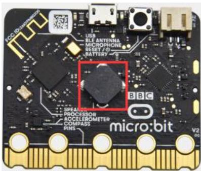
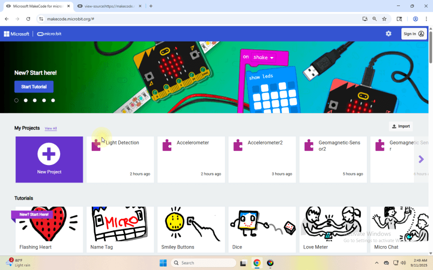
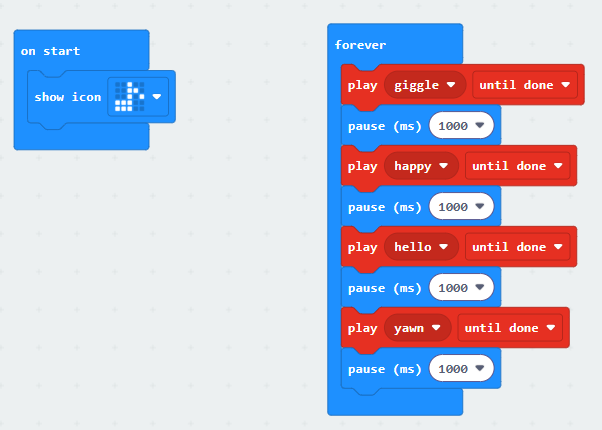
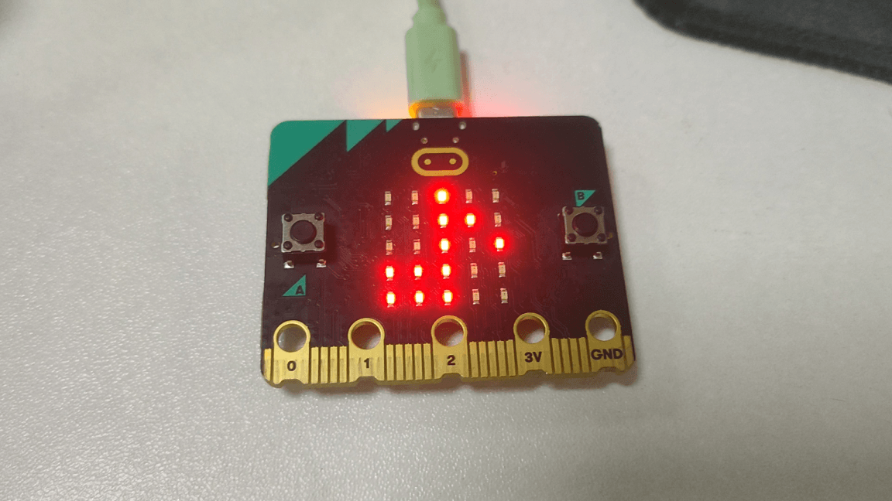

## プロジェクト 9: Speaker

[このレッスンのコードをダウンロードするにはクリックしてください](./Code/Speaker.hex)

### (1)Project Description:

Micro: Bit main board V2 には内蔵スピーカーが搭載されており、プログラムに音を追加する作業が簡単になります。スピーカーをプログラムしてさまざまな音色を再生させることができ、たとえば曲 *Ode to Joy* を演奏することもできます。

### (2)Components Needed:

Micro:bit main board V2 

Micro USB ケーブル

### (3)Test Code :

Micro USB ケーブルでコンピューターと micro:bit ボードを接続し、MakeCode エディターでプログラムします。

完成プログラム：

### (4)Test Results:

テストコードを micro:bit main board V2 にアップロードし、USB ケーブルでボードに電源を供給すると、スピーカーが音を発し、LED ドットマトリクスに音楽のロゴが表示されます。

