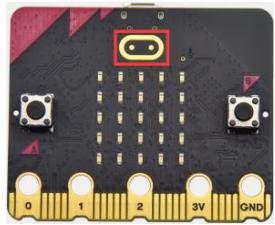
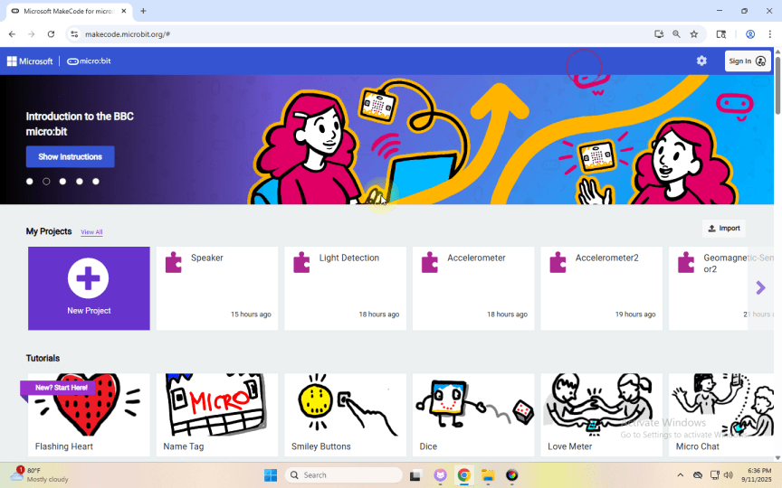
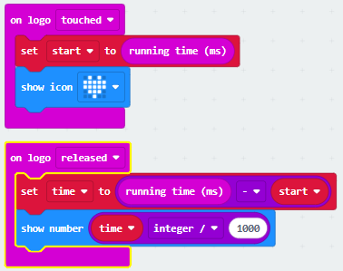

## Project 10: Touch-sensitive Logo

[Klik hier om de code voor deze les te downloaden](./Code/Touch-sensitive-Logo.hex)

### (1)Projectbeschrijving:

De Micro:bit main board V2 is uitgerust met een gouden, aanrakinggevoelig logo dat kan functioneren als een invoercomponent en als een extra knop kan werken.

Het bevat een capacitieve aanrakingssensor die bij indrukken (of aanraking) kleine veranderingen in het elektrische veld detecteert, net zoals het scherm van uw telefoon of tablet. Wanneer u erop drukt, kunt u het programma activeren.

### (2)Benodigde componenten:

Micro:bit main board V2

Micro-USB-kabel

### (3)Testcode:

Verbind de computer met de micro:bit-board via een Micro-USB-kabel en programmeer in de MakeCode-editor,

Volledig programma:

### (4)Testresultaten:

Na het uploaden van de code zal het aanraken van het logo met uw hand een hartvorm op de dotmatrix tonen. Wanneer u loslaat, verschijnt er een nummer; bij langere aanrakingstijden worden grotere nummers weergegeven.

