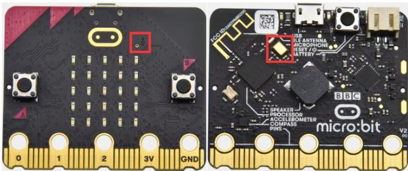
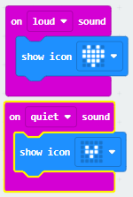
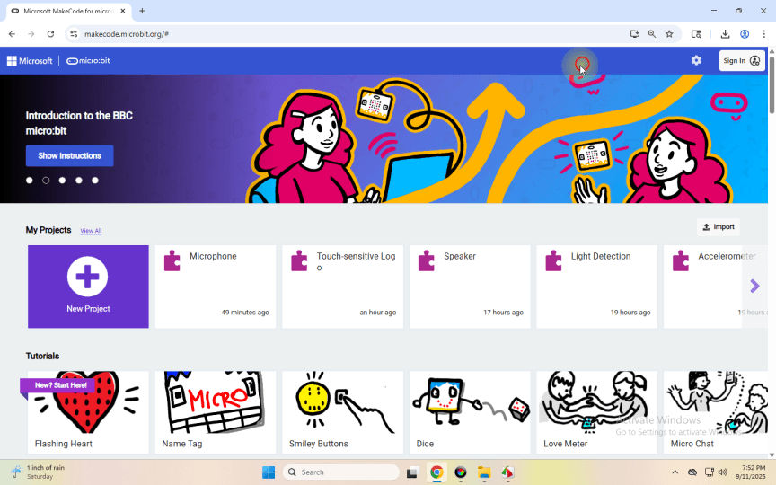

## Project 11: Microphone

[Click to download the code 1 for this lesson](./Code/Microphone.hex)

[Click to download the code 2 for this lesson](./Code/Microphone2.hex)

### (1)Project Description:

The Micro: Bit main board V2 is built with a microphone which can test the volume of ambient environment. When you clap, the microphone LED indicator turns on. Since it can measure the intensity of sound, you can make a noise scale or disco lighting changing with music. The microphone is placed on the opposite side of the microphone LED indicator and in proximity with holes that lets sound pass. When the board detects sound, the LED indicator lights up.

### (2) Components Needed:

Micro:bit main board V2 

Micro USB cable 

### (3) Test Code 1:

Link computer with micro:bit board by micro USB cable, and program in MakeCode editor,

Complete Program :

### (4)Test Results 1:

After uploading the code, display a large heart icon when ambient sound is detected, and a small heart icon when the surroundings are quiet (Note: Sounds too faint to detect will not trigger the response).

### (5)Test Code 2:

Link computer with micro:bit board by micro USB cable, and program in MakeCode editor,

Complete Program :

### (6)Test Results 2:

After uploading the code, the dot matrix pulses in sync with sound changes. Pressing the “A” key displays the numerical value of the current sound.
