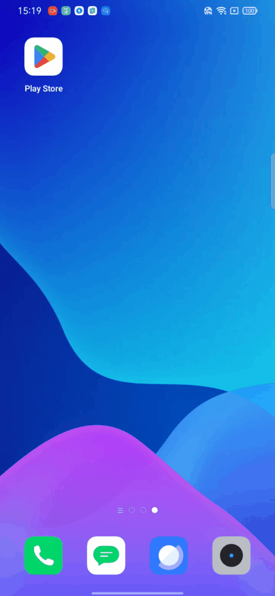
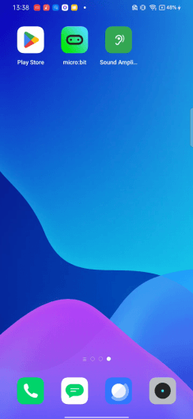
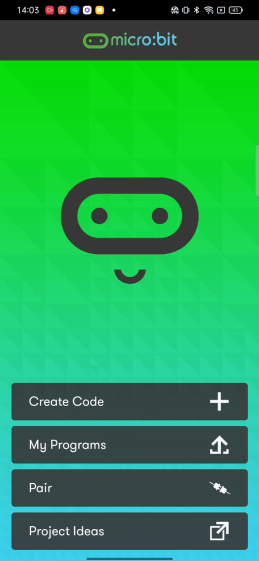
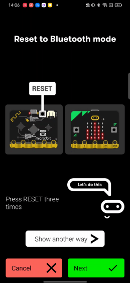

## Progetto 12: Comunicazione wireless Bluetooth

### (1)Descrizione del progetto:

Nota: Questa lezione si concentra su come caricare il codice tramite Bluetooth usando un'app, quindi non viene fornito codice. Si prega di seguire i passaggi nell'animazione gif.

La scheda principale Micro: Bit main board V2 è dotata di un processore nRF52833 (con un dispositivo BLE (Bluetooth Low Energy) integrato, Bluetooth 5.1) e di un'antenna 2,4 GHz per la comunicazione wireless Bluetooth e la comunicazione wireless a 2,4 GHz. Grazie a questi elementi, la scheda è in grado di comunicare con vari dispositivi Bluetooth, inclusi smartphone e tablet.

In questo progetto ci concentriamo principalmente sulla funzione di comunicazione wireless Bluetooth di questa scheda principale. Collegata tramite Bluetooth, può trasmettere codice o segnali. A tal fine, dobbiamo collegare un dispositivo Apple (un iPhone o un iPad) alla scheda.

Poiché la configurazione dei telefoni Android per ottenere la trasmissione wireless è simile a quella dei dispositivi Apple, non è necessario illustrarla di nuovo.

### (2) Preparazione

Collegare Micro:bit main board V2 al computer tramite il cavo Micro USB.

Un dispositivo Apple (un telefono o un iPad) o un dispositivo Android;

### (3) Installare Micro:bit:

Per Android

Per ios

(4)Codice di prova:

Successivamente useremo i nostri telefoni per scrivere codice e connetterci tramite Bluetooth (Nota: il processo è identico per dispositivi Android e iOS; questa dimostrazione utilizza un telefono Android).

1、Aprire il software e connettersi al Bluetooth.

2、Premere in sequenza il pulsante A del Microbit, il pulsante B e il pulsante di reset sul retro. La scheda principale mostrerà quindi un'icona.

3、Inserire il modello mostrato al punto due nell'interfaccia del telefono.

Scrivere il codice e caricarlo

1、Entrare nell'interfaccia di programmazione del codice e scrivere un codice.

2、Premere in sequenza il pulsante A, il pulsante B e il pulsante di reset. (Nota: questa procedura deve essere ripetuta ogni volta che il codice viene caricato tramite l'app.)

 

3、Dopo aver confermato che l'icona Microbit corrisponde a quella visualizzata sul telefono, fare semplicemente clic su “Next”.

Infine, è possibile vedere la scheda Microbit che mostra il modello del codice.

Qui abbiamo completato il processo di caricamento del codice sul telefono. È importante notare:

1. Per connettere il telefono alla scheda Microbit, premere in sequenza i pulsanti A, B e Reset. Il display a matrice a punti visualizzerà quindi un modello, che deve essere inserito nel telefono.
2. La scheda Microbit può essere alimentata tramite un cavo USB o fornendo 3V all'ingresso di alimentazione della scheda tramite un battery pack. Nota: la tensione non deve superare i 3V, poiché superare questo limite danneggerà la scheda.