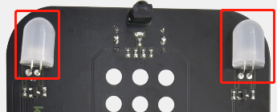
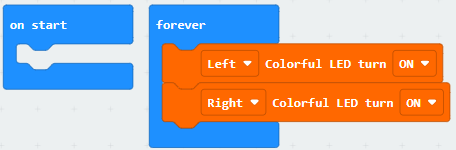
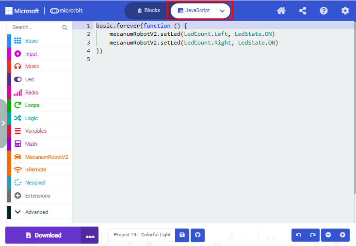
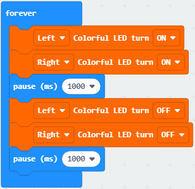
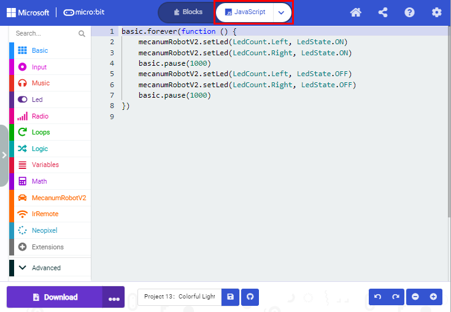

## Project 13：Seven-Color LED

1\.  **Beschrijving**

Deze module bestaat uit een veelgebruikte LED met 7 kleuren maar heeft een witte uitstraling. Wanneer een hoog niveau wordt toegepast zoals bij een normale LED, kan deze automatisch in verschillende kleuren knipperen om fantastische lichteffecten te creëren.

2\.  **Voorbereiding**

- Plaats de micro:bit-processor in de sleuf van de keyestudio   4WD Mecanum Robot Car V2.0

- Plaats batterijen in de batterijhouder

- Zet de POWER-schakelaar in de ON-stand

- Verbind de micro:bit met uw computer via een USB-kabel

- Open de webversie van Makecode.

3\.  **Test Code1**

Laat de RGB-LED afwisselend in 7 kleuren knipperen.

Klik op “JavaScript” om de overeenkomstige JavaScript-code te bekijken: 

4\.  **Testresultaat 1**

Download code 1 naar het micro:bit-board en zet de POWER-schakelaar op ON; de 2 RGB-lampen van de smart car geven achtereenvolgens en cyclisch de kleuren rood, groen, blauw, indigo, donkerrood, geel en wit.

5\.  **Test Code2**

Klik op “JavaScript” om de overeenkomstige JavaScript-code te bekijken: 

6\.  **Testresultaat 2**

Download code 2 naar het micro:bit-board; de 2 RGB-lampen knipperen 1 seconde en stoppen daarna 1 seconde met knipperen, cyclisch.