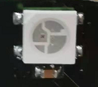
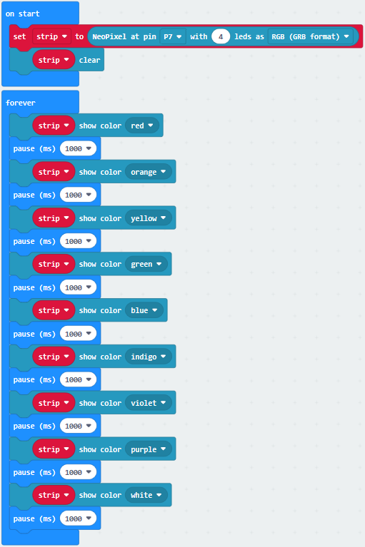
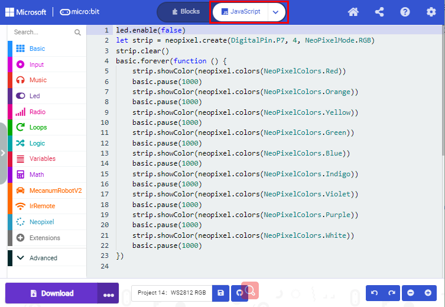
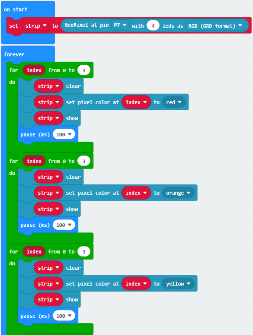
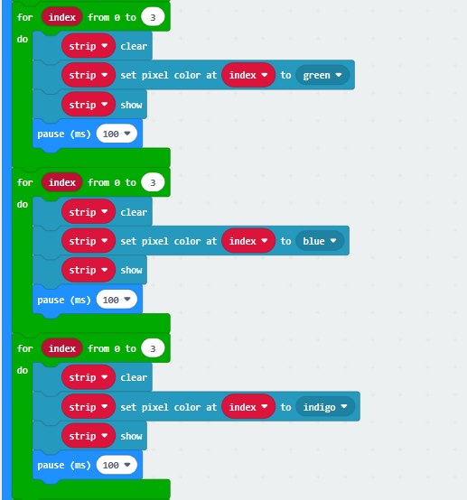
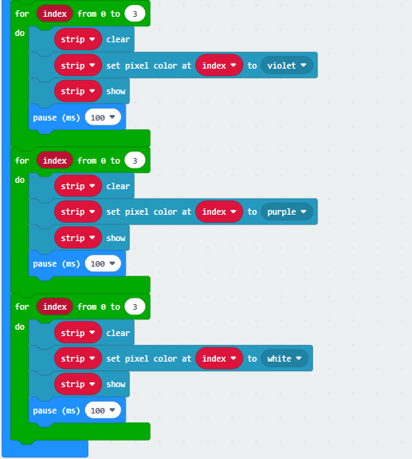
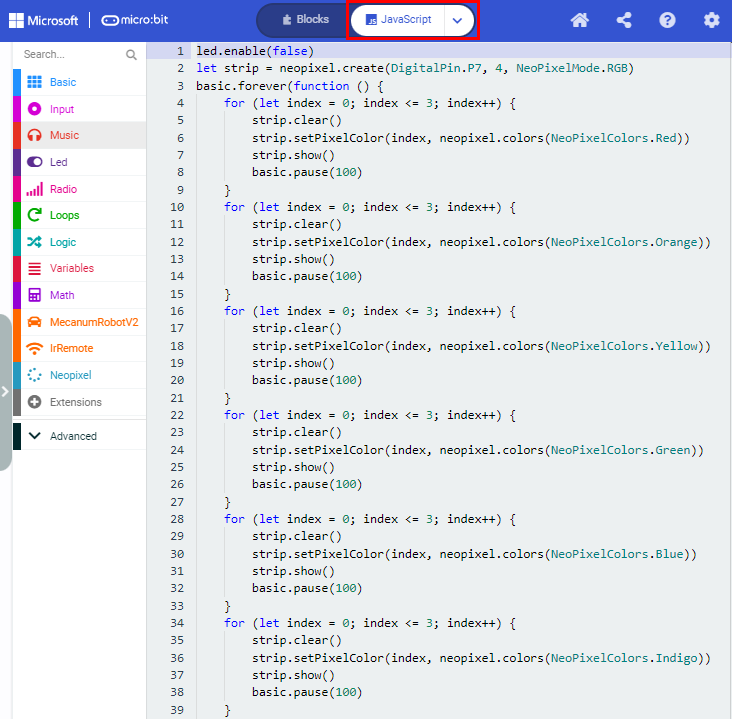
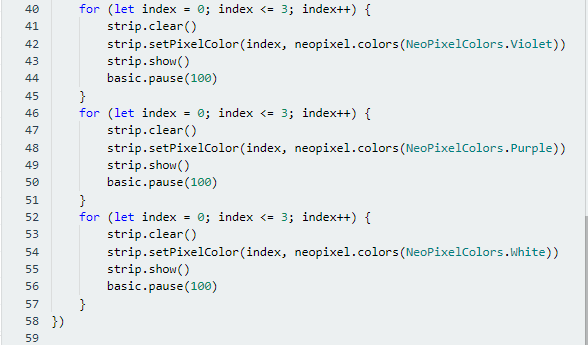
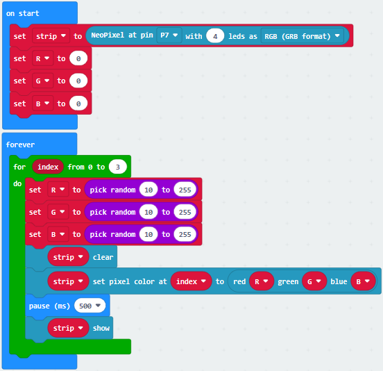
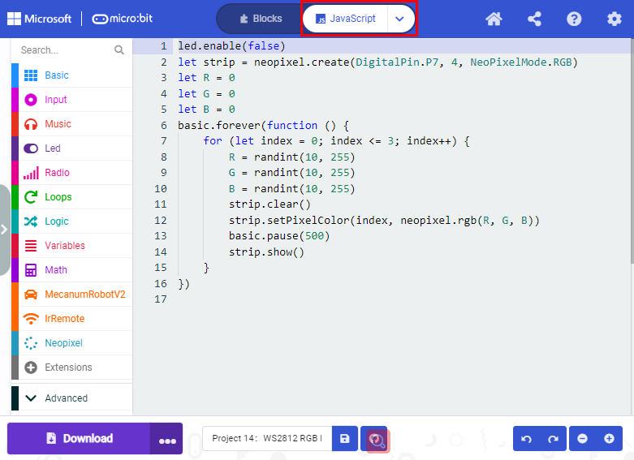

## Project 14：4 WS2812 RGB LEDs

1\.  **Beschrijving**

Het driver-shield stuurt 4 WS2812 RGB-LEDs aan, is compatibel met de micro:bit-board en wordt bestuurd via P7. In deze les laten we de RGB-LEDs verschillende kleuren weergeven via P7. Voor deze les worden 3 testcodesets geleverd om de 4 WS2812 RGB-LEDs verschillende effecten te laten tonen.

2\.  **Voorbereiding**

- Plaats de micro:bit-board in de sleuf van de keyestudio   4WD Mecanum Robot Car V2.0

- Plaats batterijen in de batterijhouder

- Zet de stroomschakelaar op ON

- Verbind de micro:bit met uw computer via een USB-kabel

- Open de webversie van Makecode.

3\.  **Test Code1**

Klik op "JavaScript" om over te schakelen naar de overeenkomstige JavaScript-code:

4\.  **Testresultaat 1**

Download code 1 naar de micro:bit en zet POWER op ON. Alle vier WS2812RGB-LEDs lichten om de beurt cyclisch op in verschillende kleuren.

5\.  **Test Code2**

Klik op "JavaScript" om over te schakelen naar de overeenkomstige JavaScript-code:

6\.  **Testresultaat 2**

Download code 2 naar de micro:bit. De WS2812RGB-LEDs tonen een lopend lichteffect.

7\.  **Test Code3**

Klik op "JavaScript" om over te schakelen naar de overeenkomstige JavaScript-code:

8\.  **Testresultaat 3**

Download code 3 naar de micro:bit. Elke WS2812RGB-LED toont één voor één een willekeurige kleur.