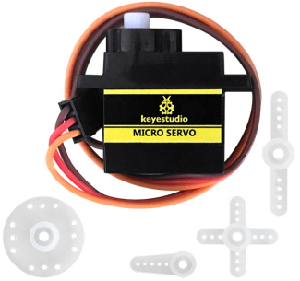
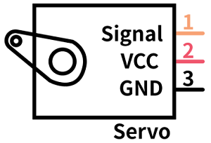
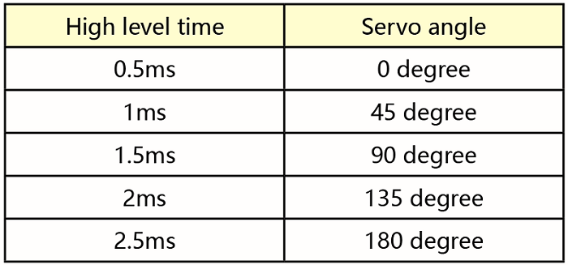
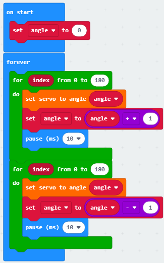
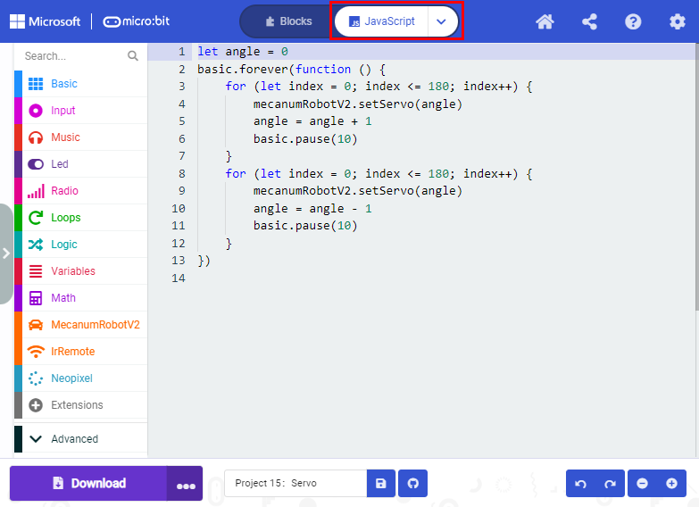

## Progetto 15：Servo

1\.  **Descrizione**

Per le auto smart fai-da-te, è spesso presente la funzione di evitamento automatico degli ostacoli. Nel processo di realizzazione dobbiamo usare un servo per controllare il modulo ad ultrasuoni affinché ruoti a sinistra e a destra, quindi rilevare la distanza tra l'auto e l'ostacolo, in modo da controllare l'auto per evitare l'ostacolo. Se si utilizzano altri microcontrollori per controllare la rotazione del servo, è necessario impostare una certa frequenza e una certa larghezza di impulso per controllare l'angolo del servo.

Tuttavia, se si utilizza la scheda principale micro:bit per controllare l'angolo del servo, è sufficiente impostare l'angolo di controllo nell'ambiente di sviluppo; l'impulso corrispondente viene impostato automaticamente per controllare la rotazione del servo. In questo progetto imparerai come controllare il servo per farlo oscillare tra 0° e 90°.

2\.  **Informazioni sul Servo**

Un servomotore è un attuatore rotante per il controllo della posizione. È costituito principalmente da involucro, circuito stampato, motore senza nucleo, ingranaggi e sensore di posizione. Il suo principio di funzionamento è che il servo riceve il segnale inviato dal MCU o dal ricevitore, produce un segnale di riferimento con periodo di 20 ms e larghezza di 1,5 ms, quindi confronta la tensione di polarizzazione continua acquisita con la tensione del potenziometro e ottiene la differenza di tensione in uscita.

Per il servo utilizzato in questo progetto, il filo marrone è la massa, quello rosso è il positivo e quello arancione è il filo del segnale.

L'angolo di rotazione del servomotore è controllato regolando il ciclo di lavoro del segnale PWM (Pulse-Width Modulation). Il ciclo standard del segnale PWM è di 20 ms (50 Hz). Teoricamente la larghezza è compresa tra 1 ms e 2 ms, ma in pratica è tra 0,5 ms e 2,5 ms. La larghezza corrisponde all'angolo di rotazione da 0° a 180°. Nota che per motori di marche diverse lo stesso segnale può produrre angoli di rotazione differenti.

Ulteriori dettagli:

3\.  **Parametri**

- Tensione di funzionamento: DC 4.8V ~ 6V

- Intervallo di angolo operativo: circa 180 ° (a 500 → 2500 μsec)

- Intervallo di larghezza d'impulso: 500 → 2500 μsec

- Velocità a vuoto: 0.12 ± 0.01 s / 60 (DC 4.8V) 0.1 ± 0.01 s / 60 (DC 6V)

- Corrente a vuoto: 200 ± 20mA (DC 4.8V) 220 ± 20mA (DC 6V)

- Coppia di arresto: 1.3 ± 0.01kg·cm (DC 4.8V) 1.5 ± 0.1kg·cm (DC 6V)

- Corrente di arresto: ≦ 850mA (DC 4.8V) ≦ 1000mA (DC 6V)

- Corrente in standby: 3 ± 1mA (DC 4.8V) 4 ± 1mA (DC 6V)

4\.  **Preparazione**

- Inserire la scheda micro:bit nello slot del keyestudio   4WD Mecanum Robot Car V2.0

- Inserire le batterie nel portabatterie

- Portare l'interruttore di alimentazione sulla posizione ON

- Collegare la micro:bit al computer tramite cavo USB

- Aprire la versione Web di Makecode

5\.  **Codice di test**

Cliccare su "JavaScript" per visualizzare il corrispondente codice JavaScript:

6.  **Risultato del test**

Dopo aver caricato il codice di test e portato l'interruttore POWER su ON, il servo ruota da 0 gradi a 180 gradi.