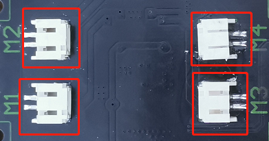
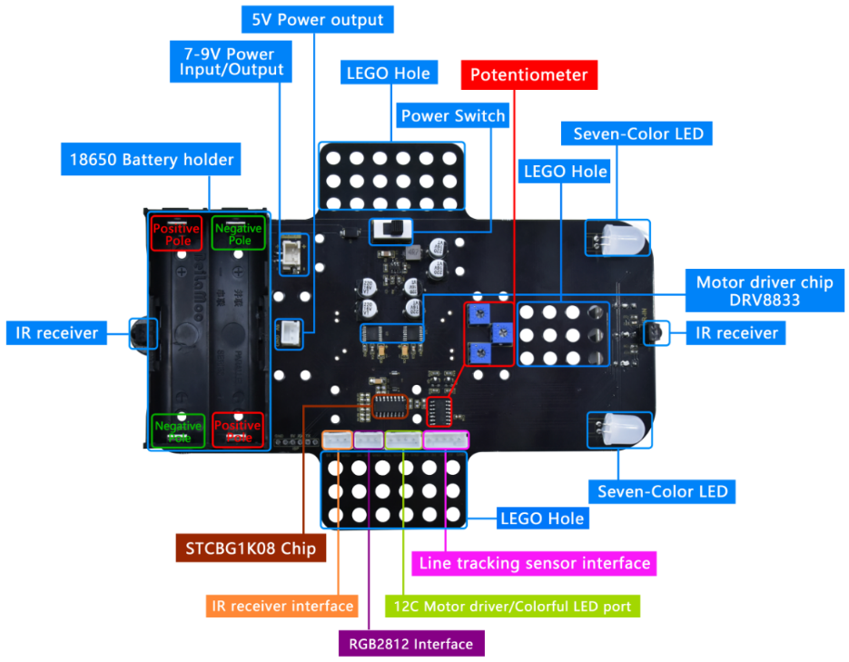
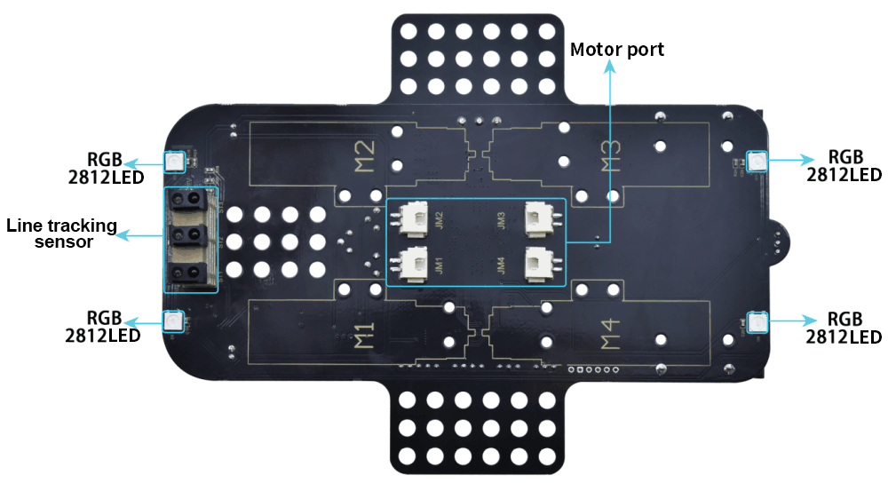
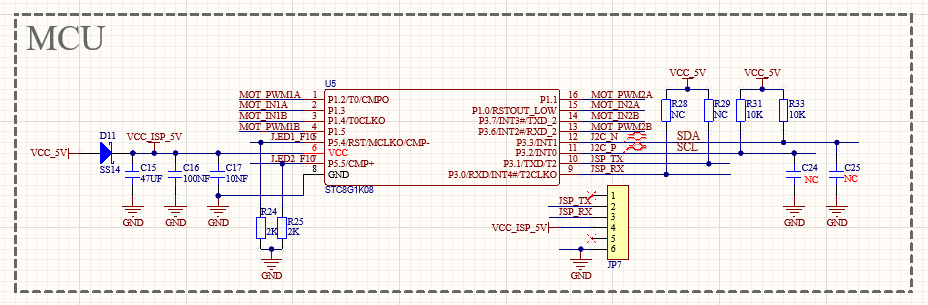
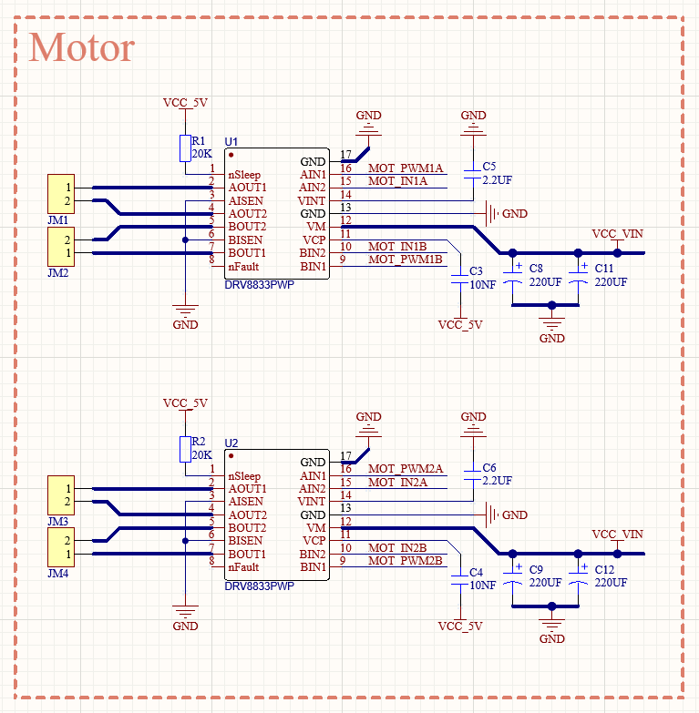
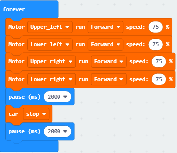
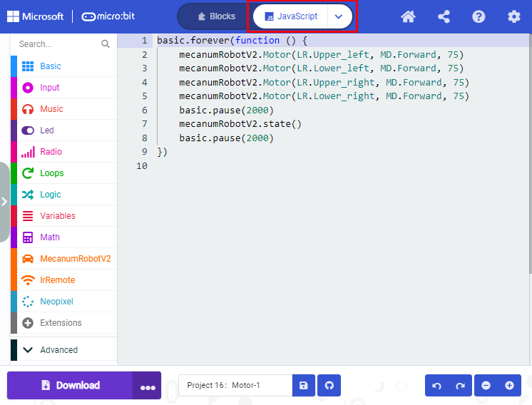
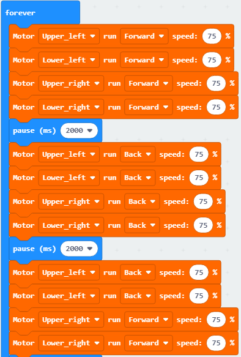
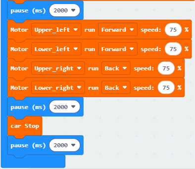
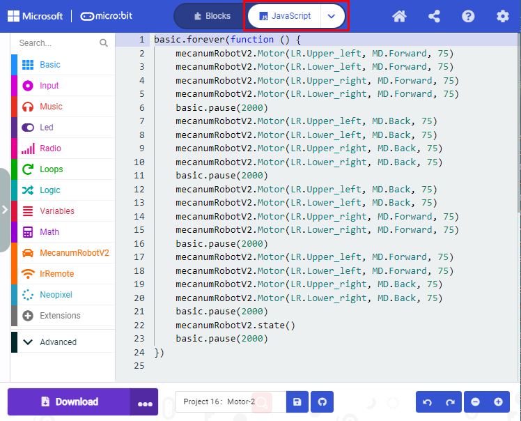

## Projet 16：Motor

1\.  **Description**

La Keyestudio 4WD Mecanum Robot Car est équipée de 4 moteurs à courant continu à réduction (également appelés moteurs à engrenages), développés à partir d'un moteur CC ordinaire. Il possède une boîte de réduction assortie qui fournit une vitesse plus faible mais un couple plus élevé. De plus, différents rapports de réduction de la boîte peuvent fournir différentes vitesses et couples.

Le moteur à engrenages est l'intégration d'un motoréducteur et d'un moteur, largement utilisé dans l'industrie sidérurgique et mécanique.

Le shield pilote moteur pour micro:bit est équipé d'une puce DRV8833. Afin d'économiser les broches IO, nous contrôlons la direction de rotation et la vitesse des 4 moteurs DC à engrenages avec la puce DRV8833.

Front

Back

STC8G1K08 Chip circuit

HR8833 Motor driver circuit

2\.  **Préparation**

- Insérez la carte micro:bit dans la fente du keyestudio 4WD Mecanum Robot Car V2.0

- Placez les piles dans le support de piles

- Positionnez l'interrupteur d'alimentation sur ON

- Connectez le micro:bit à votre ordinateur via un câble USB

- Ouvrez la version Web de Makecode

3\.  **Test Code1**

Cliquez sur“JavaScript" pour afficher le code JavaScript correspondant : 

4\.  **Résultat du test1**

Téléchargez le code 1 sur la carte micro:bit, positionnez l'interrupteur POWER sur ON. La voiture intelligente avance pendant 2s puis s'arrête pendant 2s.

5\.  **Test Code2**

Cliquez sur“JavaScript" pour afficher le code JavaScript correspondant : 

6\.  **Résultat du test2**

Téléchargez le code 2 sur la carte micro:bit, la voiture avance pendant 2s, recule pendant 2s, tourne à gauche pendant 2s, tourne à droite pendant 2s, s'arrête pendant 2s et répète ce cycle.