## プロジェクト 17：Line Tracking Sensor

### プロジェクト 17.1：Detect Line Tracking Sensor

1\. **説明**

Keyestudio 4WD Mecanum Robot Car のモータードライバーボードには、TCRT5000 IRモジュールと3つのポテンショメータを採用した3チャンネルのライン追跡センサーが搭載されています。

TCRT5000 IRモジュールは赤外線発光素子と赤外線受光素子を内蔵しています。発光素子から出された赤外線が反射して受光素子に到達すると、受光素子の抵抗が変化し、それが回路上の電圧変化として一般に現れます。  

受光素子が受ける赤外線の強度に応じて抵抗が変化し、これは反射面の色や反射面と受光素子間の距離に依存します。検出時には黒が高レベル（High）でアクティブ、白が低レベル（Low）でアクティブとなります。 

2\.  **動作原理**

車が白い路面の上を走ると、車体下部に取り付けられたIR発光素子が路面を検出するために赤外線を発し、受光素子が反射光を受け取ります。すると出力端は低レベル（0）を出力し、黒いラインを検出すると高レベル（1）を出力します。

4WD Mecanum Robot Car の底面に白い紙を置いた後、3wayトラッキングセンサーのポテンショメータを回します。センサーモジュールのインジケータが点灯したら、車を持ち上げて4WD Mecanum Robot Car の左右の車輪が浮くようにします。白紙とセンサーの距離は約1.5cmです。センサーモジュールのインジケータが消灯したら感度の調整が完了です。

3\.  **準備**

- micro:bit ボードを keyestudio 4WD Mecanum Robot Car V2.0 のスロットに差し込む

- 電池を電池ボックスに入れる

- 電源スイッチを ON にする

- USB ケーブルで micro:bit をコンピュータに接続する

- Web版 Makecode を開く

4\.  **テストコード**

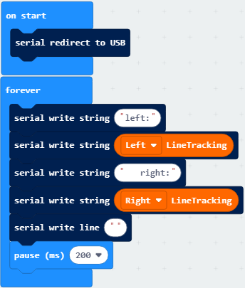

“JavaScript” をクリックして対応する JavaScript コードを表示します: 

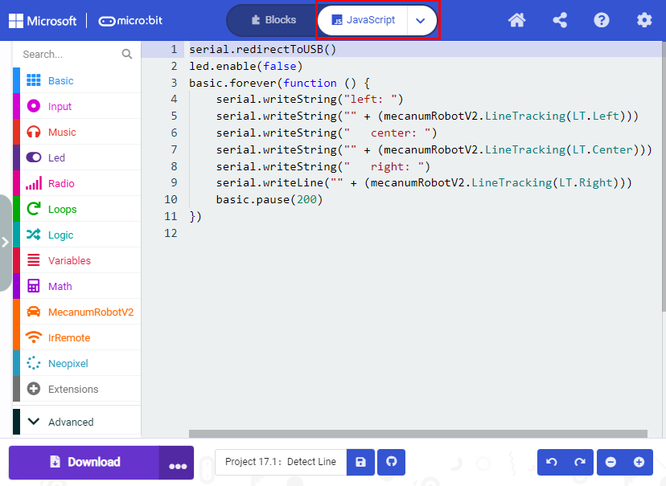

5\.  **テスト結果**

コードを micro:bit にダウンロードし、POWER スイッチを ON にします。 

CoolTerm を開き、Options をクリックして SerialPort を選択します。COM ポートとボーレートを 115200 に設定します。“OK” と “Connect” をクリックします。

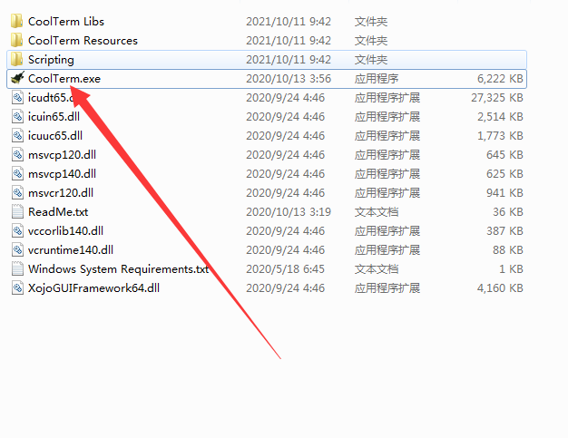

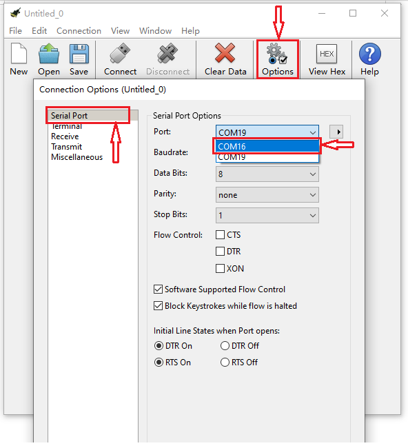

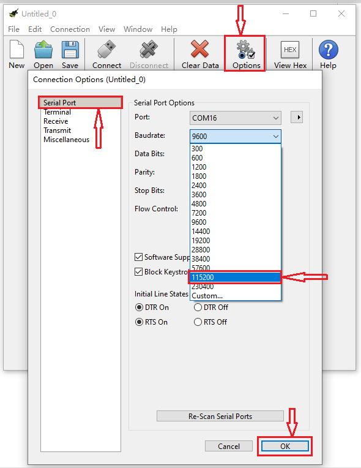

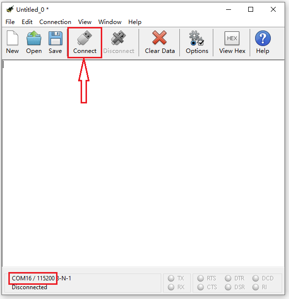

CoolTerm のシリアルモニタには、ライン追跡センサーが読み取ったデジタル信号が表示されます。

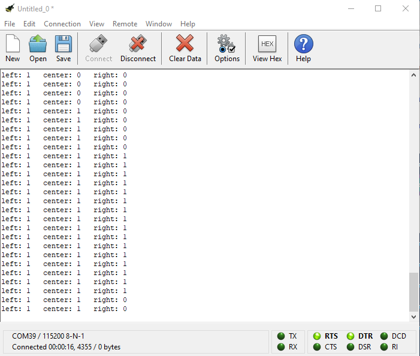

### プロジェクト 17.2：Tracking Smart Car

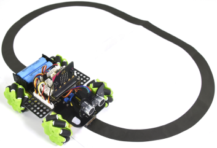

1\. **説明**

このレッスンでは、ライン追跡センサーとモーターを組み合わせてライン追跡スマートカーを作ります。

micro:bit ボードが信号を解析し、スマートカーを制御してライン追跡機能を実現します。

2\. **動作原理**

スマートカーは、3チャンネルライン追跡センサーから受け取る値に応じて異なる動作を行います。

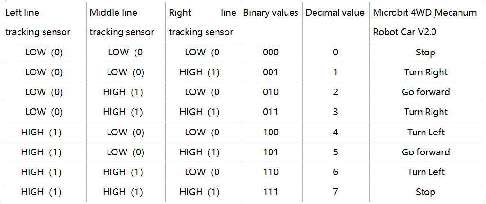

3\. **準備**

- micro:bit ボードを keyestudio 4WD Mecanum Robot Car V2.0 のスロットに差し込む

- 電池を電池ボックスに入れる

- 電源スイッチを ON にする

- USB ケーブルで micro:bit をコンピュータに接続する

- Web版 Makecode を開く

**警告:** 3way トラッキングセンサーは、直射日光などの赤外線干渉がない環境で使用してください。太陽光には赤外線や紫外線などの不可視光が多く含まれています。強い日光下では 3way トラッキングセンサーは正常に動作しない可能性があります。

4\.**フローチャート**

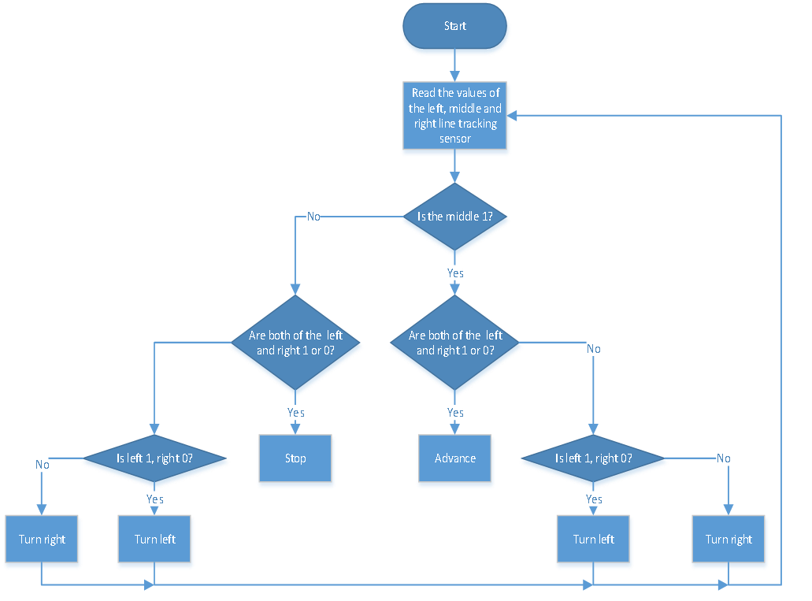

5\.  **テストコード**

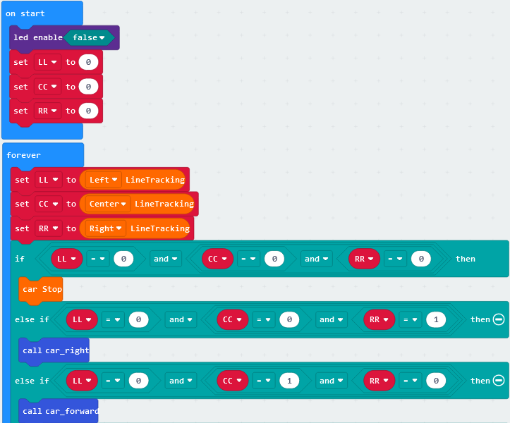

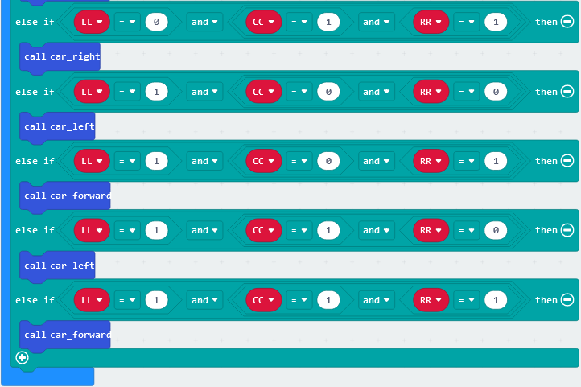

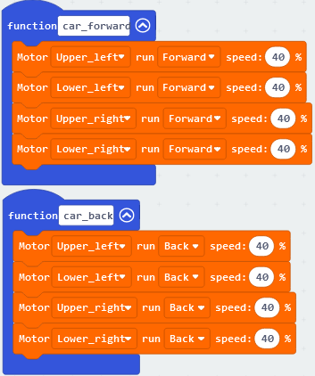

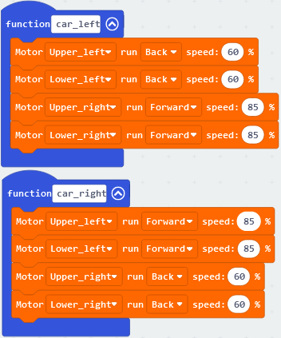

“JavaScript” をクリックして対応する JavaScript コードを表示します:

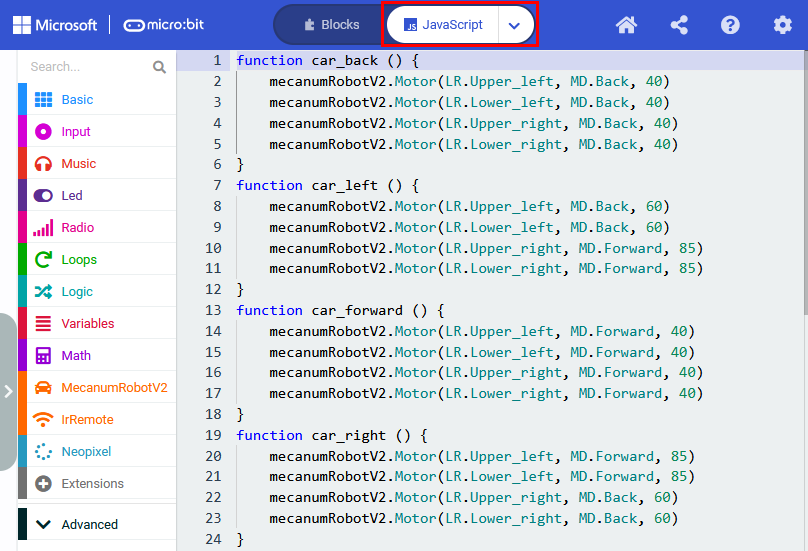

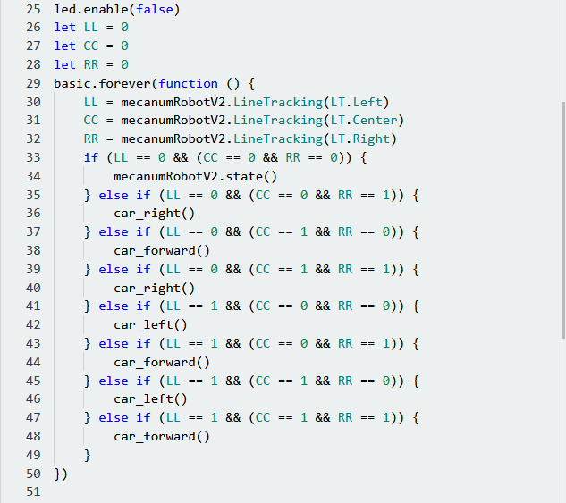

5\. **テスト結果**

コードを micro:bit にダウンロードし、POWER を ON にすると、ライン追跡カーは黒いラインに沿って前進します。

**注意:** micro:bit カーの背面にあるスイッチを入れてください。黒いラインの幅はライン追跡センサーの幅より広くしてください。

強い光の下でスマートカーをテストするのは避けてください。