## Progetto 18：Sensore a ultrasuoni

### Progetto 18.1：Rilevamento della distanza ad ultrasuoni

1\.  **Descrizione**

Il sensore a ultrasuoni utilizza il sonar per determinare la distanza da un oggetto, come fanno i pipistrelli. Offre un’eccellente rilevazione della distanza senza contatto, con alta precisione e letture stabili in una soluzione facile da usare. Include moduli trasmettitore e ricevitore ultrasonici.

Il sensore a ultrasuoni viene impiegato in un’ampia gamma di progetti elettronici per la creazione di applicazioni di rilevamento ostacoli e misura della distanza, oltre a molte altre applicazioni.

Il modulo ultrasonico emetterà onde ultrasoniche dopo il segnale di trigger. Quando le onde ultrasoniche incontrano un oggetto e vengono riflesse, il modulo genera un segnale di eco, permettendo così di determinare la distanza dell’oggetto dal tempo di differenza tra il segnale di trigger (TRIG) e il segnale di eco (ECHO).

Come mostra l’immagine, è come due occhi. Uno è l’estremità trasmittente, l’altro è l’estremità ricevente.

Secondo lo schema di cablaggio soprastante, la porta integrata del modulo sensore ultrasonico è collegata alla porta 5V G P15 P16 sulla piastra base driver del motore micro:bit. Il pin Trig (T) è controllato da P15 del micro:bit e il pin Echo (E) è collegato a P16.

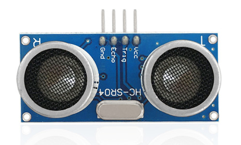

2\. **Principio di funzionamento**

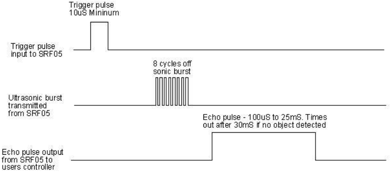

(1) Portare TRIG a livello basso, quindi generare un impulso alto di almeno 10 µs;

(2) Dopo il trigger, il modulo invierà automaticamente otto impulsi ultrasonici a 40 kHz e rileverà se c’è un ritorno del segnale;

(3) Se c’è un ritorno del segnale, quando ECHO (E) emette un livello alto, la durata del livello alto corrisponde al tempo dalla trasmissione alla ricezione delle onde ultrasoniche. Quindi distanza di test = durata del livello alto \*340m/s\*0.5. 

3\. **Parametri**

- Tensione di esercizio: 3-5.5V (DC)

- Corrente di esercizio: 15mA

- Frequenza di lavoro: 40 kHz

- Distanza massima di rilevamento: circa 3 m

- Distanza minima di rilevamento: 2-3 cm

- Precisione: fino a 0,2 cm

- Angolo di rilevamento: inferiore a 15 gradi

- Impulso di trigger in ingresso: 10 µs livello TTL

- Segnale di eco in uscita: segnale di livello TTL (alto), proporzionale alla distanza

4\. **Preparazione**

- Inserire la scheda micro:bit nello slot del keyestudio 4WD Mecanum Robot Car V2.0

- Inserire le batterie nel vano porta batterie

- Portare l’interruttore di alimentazione su ON

- Collegare il micro:bit al computer tramite cavo USB

- Aprire la versione Web di Makecode

5\. **Codice di test**

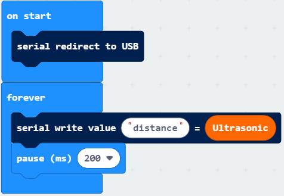

Fare clic su “JavaScript” per visualizzare il corrispondente codice JavaScript:

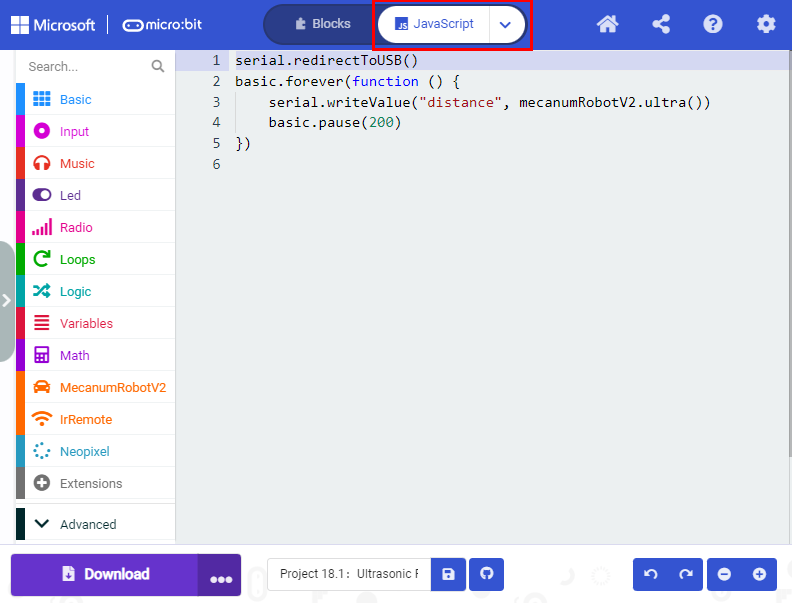

6\.  **Risultato del test**

Scaricare il codice sul micro:bit, mantenere il cavo USB collegato e posizionare l’interruttore POWER su ON. Il valore della distanza verrà visualizzato sul monitor.

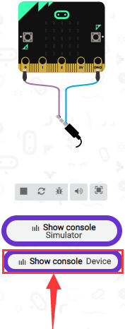

Il monitor mostra la distanza tra l’ostacolo e il sensore a ultrasuoni (come mostrato sotto).

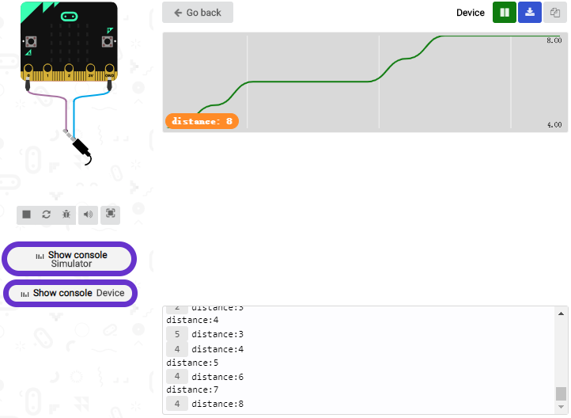

Aprire CoolTerm, cliccare su Options per selezionare SerialPort. Impostare la porta COM e la velocità di trasmissione a 115200 baud (la velocità della comunicazione seriale USB del Micro:bit è 115200 nel test). Cliccare “OK” e “Connect”.

Il monitor seriale di CoolTerm visualizza il valore della distanza come segue:

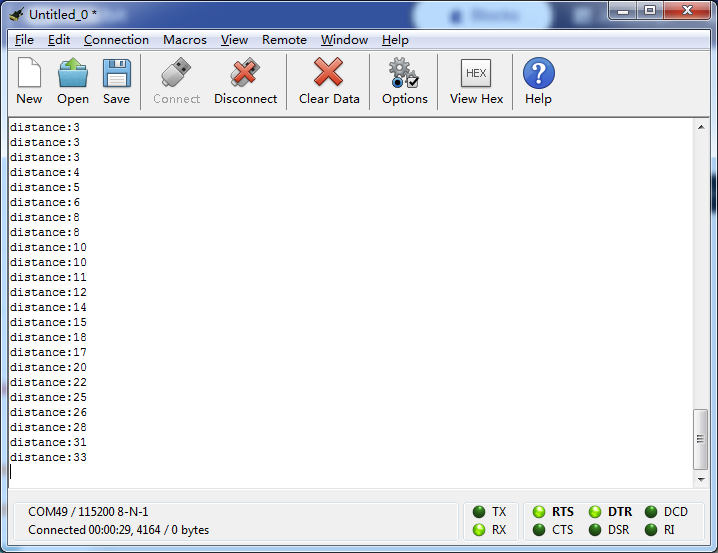

### Progetto 18.2：Evitamento con ultrasuoni

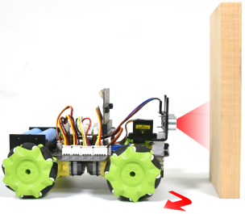

1\. **Descrizione**

In questo progetto integreremo un sensore a ultrasuoni e un’auto per realizzare un’auto con comportamento di evitamento basato su ultrasuoni.

Il principio è rilevare la distanza tra l’auto e l’ostacolo tramite il sensore a ultrasuoni per controllare il movimento dell’auto intelligente.

2\.  **Preparazione**

- Inserire la scheda micro:bit nello slot del keyestudio 4WD Mecanum Robot Car V2.0

- Inserire le batterie nel vano porta batterie

- Portare l’interruttore di alimentazione su ON

- Collegare il micro:bit al computer tramite cavo USB

- Aprire la versione Web di Makecode

3\.  **Diagramma di flusso**

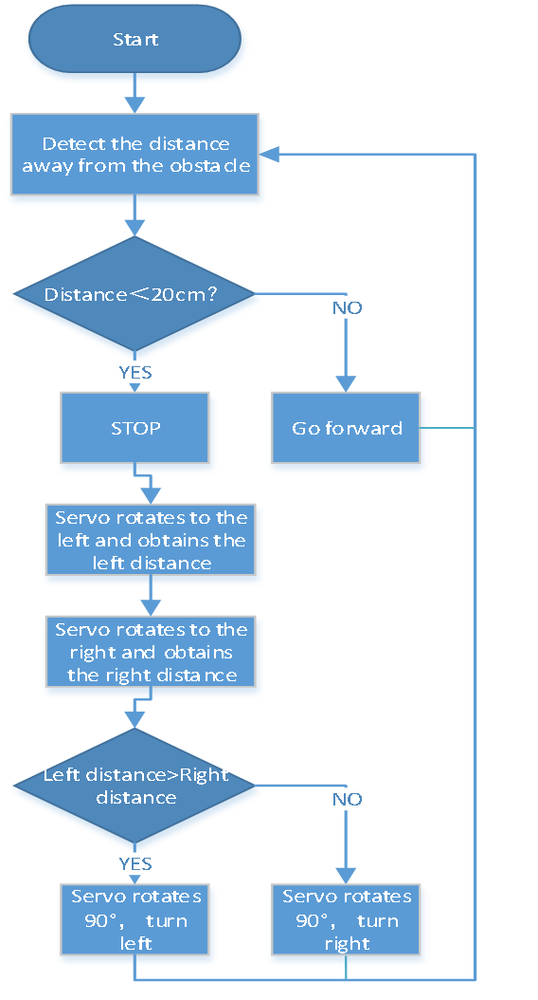

4\.  **Codice di test**

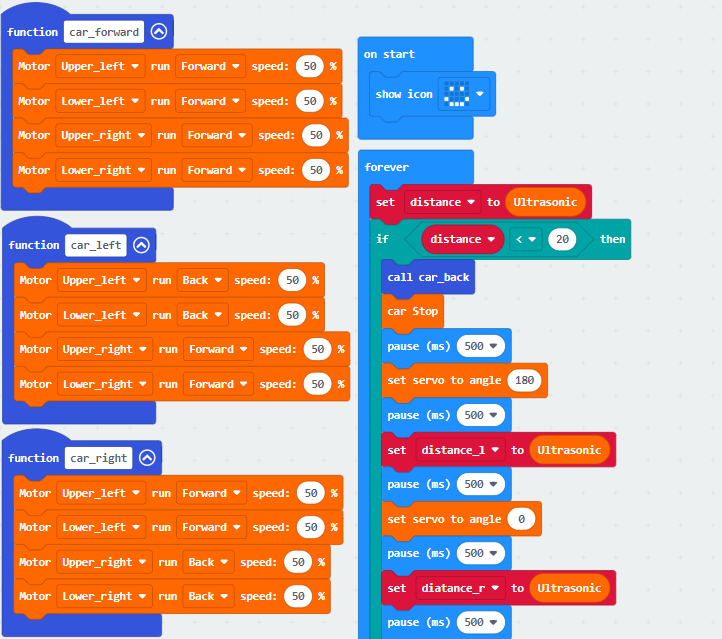

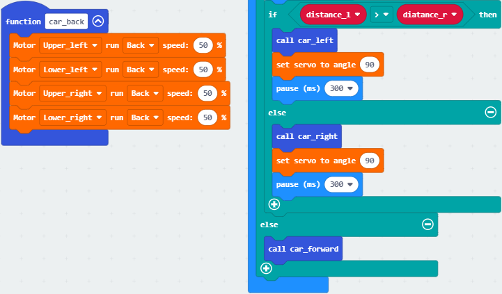

Fare clic su “JavaScript” per visualizzare il corrispondente codice JavaScript:

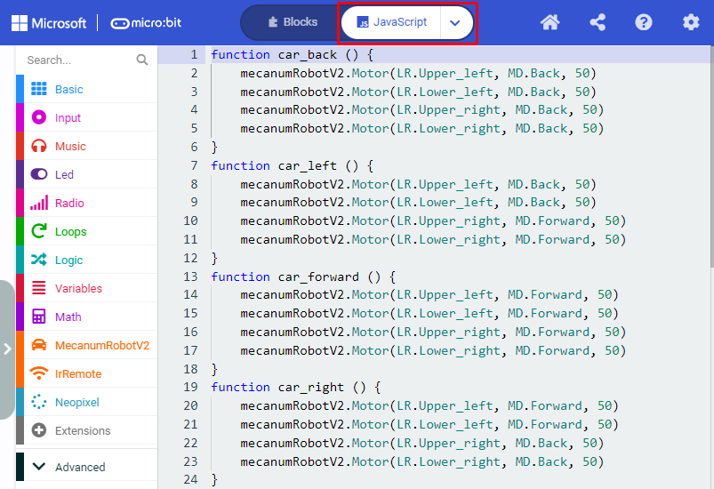

5\.  **Risultato del test**

Scaricare il codice sul micro:bit, accendere il dispositivo e posizionare l’interruttore POWER su ON. Quando la distanza dall’ostacolo è maggiore di 20 cm, l’auto avanza; altrimenti l’auto intelligente svolta a sinistra.

### Progetto 18.3：Seguimento con ultrasuoni

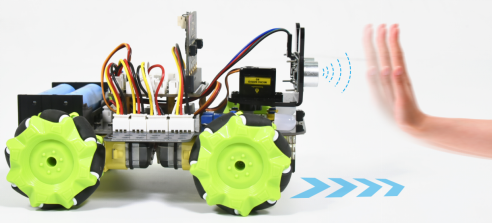

1\. **Descrizione**

Nella lezione precedente abbiamo appreso il principio base del sensore di line tracking. Ora combineremo il sensore a ultrasuoni con l’auto per realizzare un’auto follower a ultrasuoni.

Il sensore a ultrasuoni rileva la distanza dall’ostacolo e controlla lo stato di movimento dell’auto.

2\. **Preparazione**

- Inserire la scheda micro:bit nello slot del keyestudio 4WD Mecanum Robot Car V2.0

- Inserire le batterie nel vano porta batterie

- Portare l’interruttore di alimentazione su ON

- Collegare il micro:bit al computer tramite cavo USB

- Aprire la versione Web di Makecode

3\. **Diagramma di flusso**

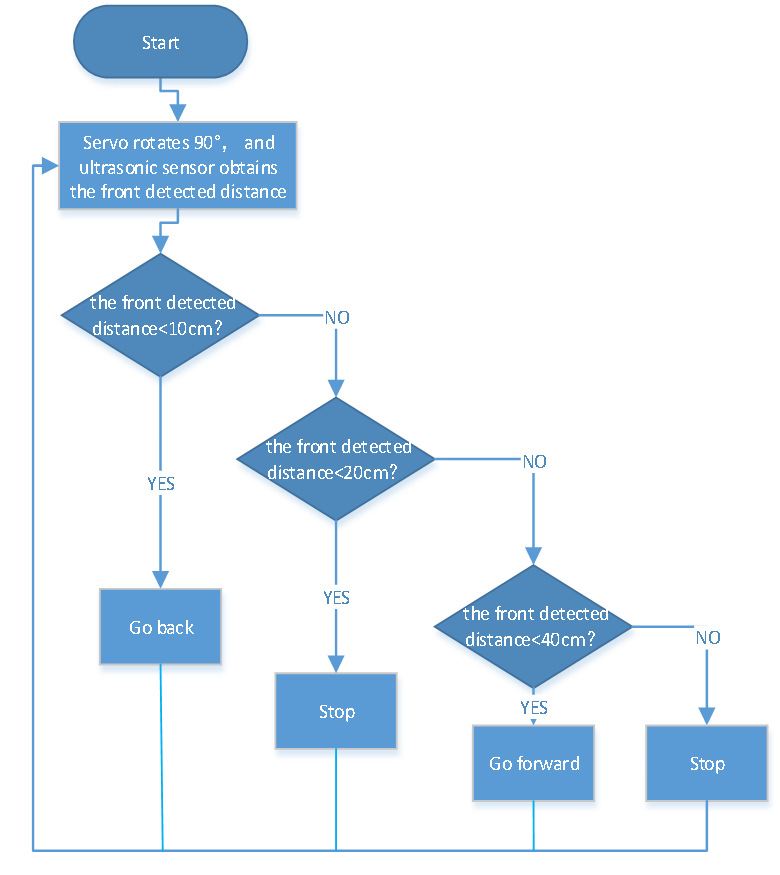

4\. **Codice di test**

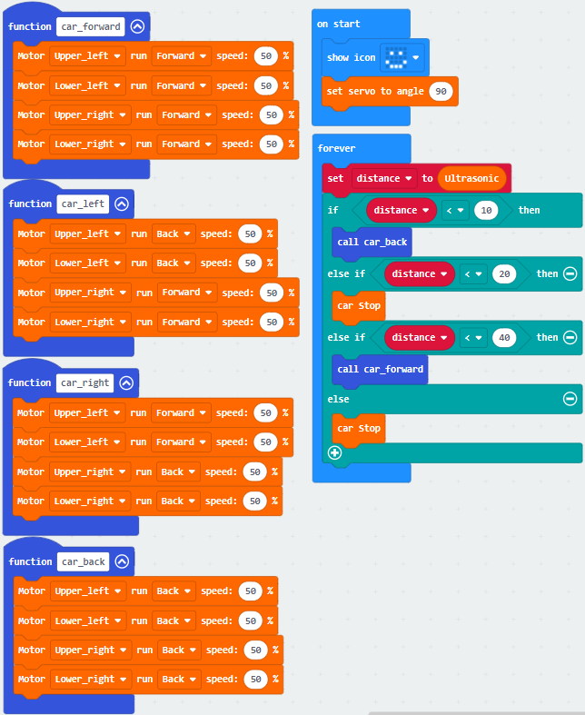

Fare clic su “JavaScript” per visualizzare il corrispondente codice JavaScript:

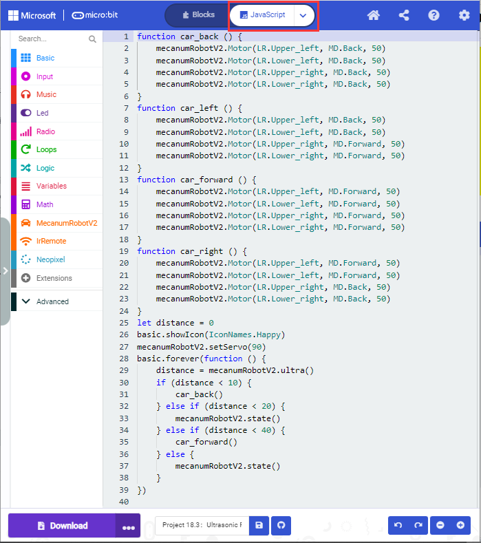

5\. **Risultato del test**

Scaricare il codice sul micro:bit, posizionare l’interruttore POWER su ON sullo shield; l’auto intelligente sarà in grado di seguire l’ostacolo e muoversi.