## Progetto 19：Telecomando IR

### Progetto 19.1：Decodificare il telecomando IR

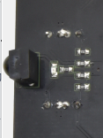

1\. **Descrizione**

Non c'è dubbio che il telecomando a infrarossi sia onnipresente nella vita quotidiana. Viene utilizzato per controllare vari elettrodomestici, come TV, stereo, videoregistratori e ricevitori satellitari. Il telecomando IR è composto da un sistema di trasmissione a infrarossi e un sistema di ricezione a infrarossi, cioè un telecomando, un modulo ricevitore IR e un microcontrollore in grado di decodificare.

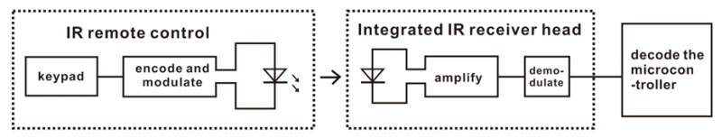

Il segnale portante infrarosso a 38K emesso dal telecomando è codificato dal chip di codifica presente nel telecomando. È composto da una sezione di codice pilota, codice utente, codice utente inverso, codice dati e codice dati inverso. L'intervallo di tempo dell'impulso viene utilizzato per distinguere se si tratta di un segnale 0 o 1 e la codifica è costituita da questi segnali 0 e 1.

Il codice utente della stessa telecomando rimane invariato. Il codice dati può distinguere il tasto premuto.

Quando viene premuto il pulsante del telecomando, il telecomando invia un segnale portante a infrarossi. Quando il ricevitore IR riceve il segnale, il programma decodifica il segnale portante e determina quale tasto è stato premuto. La MCU decodifica il segnale 01 ricevuto, stabilendo così quale tasto è stato premuto sul telecomando.

Il ricevitore infrarosso che utilizziamo è un modulo ricevitore a infrarossi. Composto principalmente dalla testa ricevente a infrarossi, è un dispositivo che integra ricezione, amplificazione e demodulazione. Il suo IC interno ha già eseguito la demodulazione e può svolgere l'intera operazione dalla ricezione infrarossa all'uscita, essendo compatibile con segnali TTL. Inoltre è adatto per telecomandi IR e trasmissione dati IR. Il modulo ricevitore IR prodotto dal ricevitore ha solo tre pin: linea di segnale, VCC e GND.

Secondo l'immagine sopra, la porta integrata del ricevitore IR è collegata alla porta P9 5V G sulla scheda driver del motore ed è controllata dal P9 del micro:bit.

2\. **Parametri:**

- Tensione di funzionamento: 3.3-5V（DC）

- Interfaccia: 3PIN

- Segnale di uscita: segnale digitale

- Angolo di ricezione: 90 gradi

- Frequenza: 38khz

- Distanza di ricezione: circa 5m

3\. **Preparazione**

- Inserire la scheda micro:bit nello slot del keyestudio   4WD Mecanum Robot Car V2.0

- Inserire le batterie nel vano batteria

- Ruotare l'interruttore di alimentazione su ON

- Collegare il micro:bit al computer tramite un cavo USB

- Aprire la versione Web di Makecode

4\. **Codice di test**

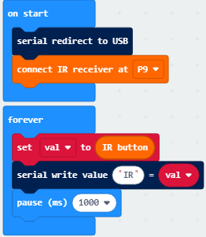

Fare clic su “JavaScript" per passare al corrispondente codice JavaScript:

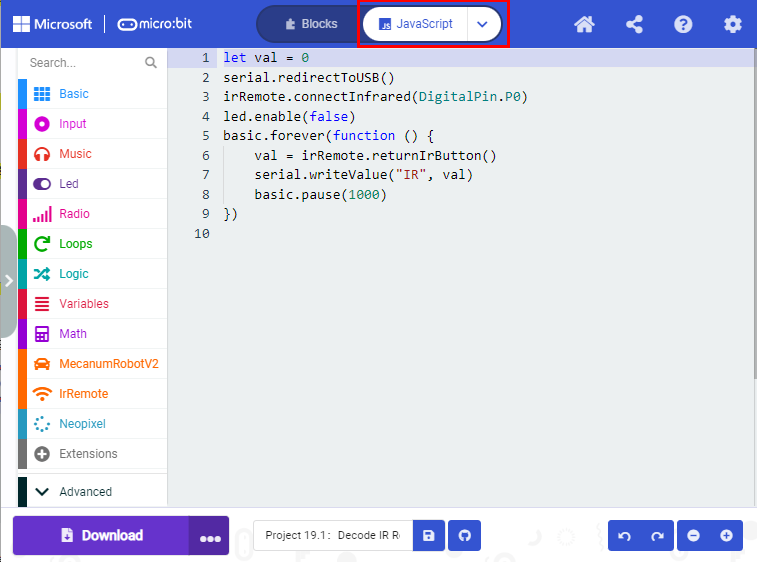

**Spiegazione del codice:** Se i pulsanti non vengono premuti, il monitor seriale mostra costantemente 0; quando vengono premuti, vengono visualizzati i valori dei tasti corrispondenti.

**Note：**

Il telecomando in questo kit non include le batterie. Si consiglia di acquistarle online. (tipo di batteria: CR2025).

Assicurarsi che il telecomando IR funzioni prima del test. Un suggerimento per verificarlo:

Aprire la fotocamera del cellulare, puntare il telecomando IR verso la fotocamera e premere un pulsante. Se nella fotocamera si vede una luce viola lampeggiante, il telecomando è funzionante.

5\. **Risultato del test**

Scaricare il codice sulla scheda micro:bit e non staccare il cavo USB. Fare clic

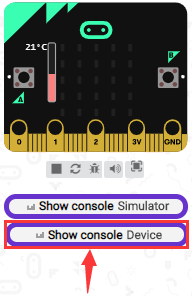

Puntare il telecomando IR verso il ricevitore IR e premere un pulsante; il monitor seriale mostrerà i valori dei tasti corrispondenti, come mostrato di seguito:

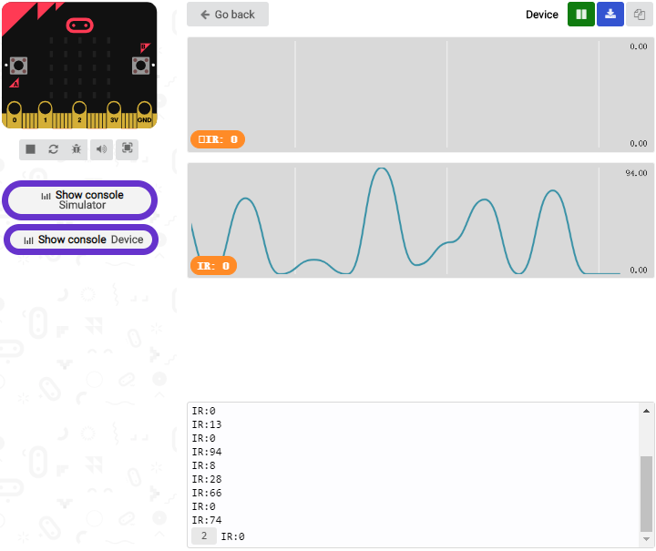

Aprire CoolTerm, fare clic su Options per selezionare SerialPort. Impostare la porta COM e la velocità di trasmissione a 115200 baud. Fare clic su “OK” e “Connect”.

Il monitor seriale di CoolTerm mostra il valore del tasto come segue:

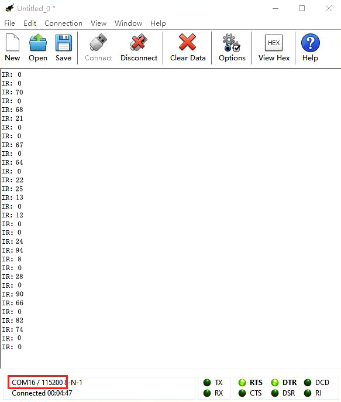

Il valore del tasto viene visualizzato come riferimento:

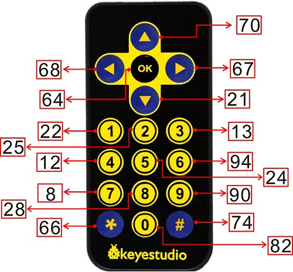

### Progetto 19.2：Telecomando IR

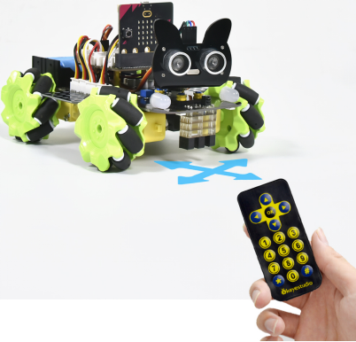

1\. **Descrizione**

In questo progetto combiniamo il telecomando IR con il car shield per realizzare un'auto smart controllata via IR. Il principio è controllare il movimento dell'auto inviando segnali di tasto dal telecomando IR al modulo ricevente IR del car shield.

2\. **Preparazione**

- Inserire la scheda micro:bit nello slot del keyestudio   4WD Mecanum Robot Car V2.0

- Inserire le batterie nel vano batteria

- Ruotare l'interruttore di alimentazione su ON

- Collegare il micro:bit al computer tramite un cavo USB

- Aprire la versione Web di Makecode

**Nota:** Il sensore a infrarossi e il telecomando infrarossi non devono essere utilizzati in ambienti con interferenze infrarosse come la luce solare, poiché contiene molte luci invisibili, come infrarossi e ultravioletti. In un ambiente con forte luce solare non possono funzionare normalmente.

3\. **Diagramma di flusso**

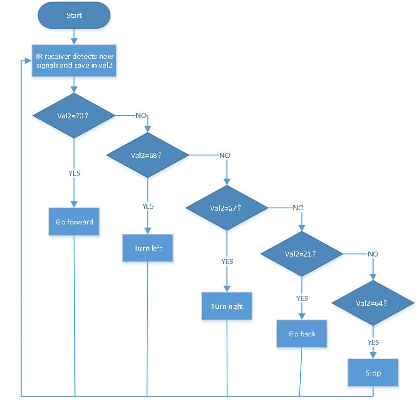

4\. **Codice di test**

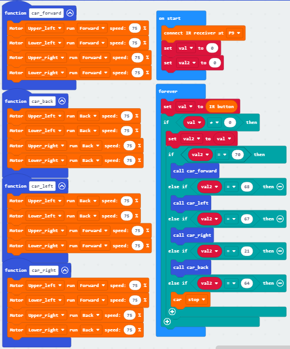

Fare clic su “JavaScript" per passare al corrispondente codice JavaScript:

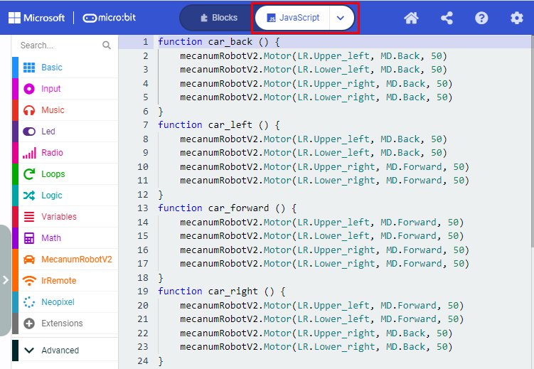

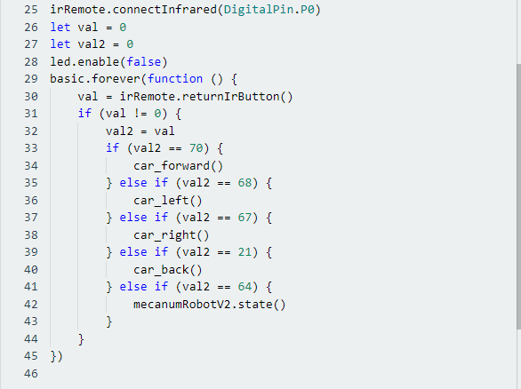

5\. **Risultato del test**

Scaricare il codice sulla scheda micro:bit e posizionare l'interruttore POWER su ON.

Puntare il telecomando IR verso il micro:bit e premere il pulsante per far muovere l'auto intelligente.

 il pulsante fa muovere l'auto in avanti， indica svolta a sinistra， implica svolta a destra， indica marcia indietro， ferma l'auto.

**Nota:** La distanza tra il telecomando IR e il ricevitore IR dell'auto intelligente dovrebbe essere inferiore a 5 m durante il test.

---