## Project 20：Bluetooth Multi-purpose Smart Car

### Project 20.1：Read Bluetooth Data

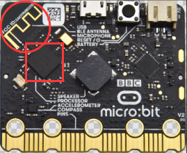

1\. **Description**

Micro:bit main board comes with a built-in Bluetooth which can be used to communicate with it. And the Micro:bit can also be controlled by Bluetooth or transmit signals back to smartphone or computer via it. This Bluetooth can communicate with the Bluetooth equipped in other devices or with Bluetooth App to control other equipment.

It is compatible with both Android system ans IOS system. And we have designed two Bluetooth Apps for both systems.

The connection of the Bluetooth on the board with these two Apps is similar. In this lesson, we will introduce the functions of all keys and patterns on the Apps and control the smart car via Bluetooth App.

2\. **Preparation**

- Insert the micro:bit board into the slot of keyestudio   4WD Mecanum Robot Car V2.0

- Place batteries into battery holder

- Dial power switch to ON end

- Connect the micro:bit to your computer via an USB cable

- Open the Web version of Makecode

**If you choose to drag the code manually, you need to add the Bluetooth extension library first. Click the gear icon (Settings) in the upper right corner, then click on Extensions to go to the library file selection screen, and then click on the "Bluetooth" extension library (if it doesn't exist, search Bluetooth to find it), as shown below:** 

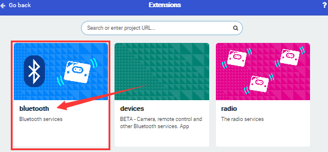

As the Bluetooth and extension radio can’t work together, therefore, their extension libraries are not compatible.

Therefore, remove extension(s) and add Bluetooth please if you see the following prompt box pop up.

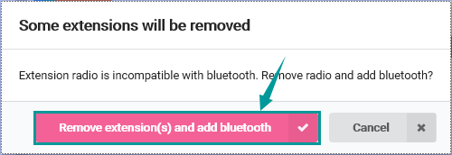

3\. **Test Code**

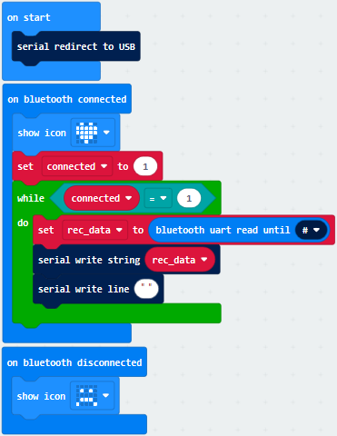

Click“JavaScript”to view the corresponding JavaScript code:

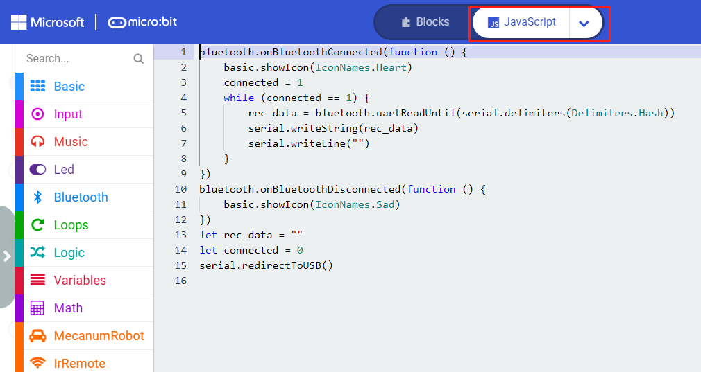

4\. **Test Result**

If you drag blocks step by step, you need to set as follows after finishing test code.

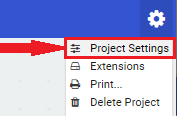

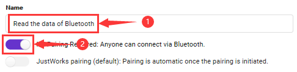

However, you could skip this step if you directly import test code.

After setting, download code to micro:bit board, don’t plug off the USB cable.Next to download App.

**For IOS System:**

a\. Open App Store;

b\. Search **mecanum_robot** and click“”to download the Bluetooth App of mecanum_robot;

c\. After downloading the APP, click "OPEN" or click the application mecanum_robot on the phone/iPad desktop to open the APP. A dialog box appears on the APP interface, and click "OK" in the dialog box.

d\. First turn on the Bluetooth of the mobile phone/iPad, and then click the connect button (control) in the upper left corner of the APP interface to perform a Bluetooth search. In the search results, click "BCC micro:bit". After a few seconds, the Bluetooth is connected.

**For Android System:**

a\. Use the scanning function in the browser to scan and identify the QR code 

or enter the link：[http://8.210.52.206/mecanum_robot.apk](http://8.210.52.206/mecanum_robot.apk) to download. After the identification is successful, click "go to website" to enter the download mecanum_robot.apk page , click "Download" to download the mecanum_robot application.

b\. Click“Allow allow”to enter Installation Diagram; click“install”to install the App.

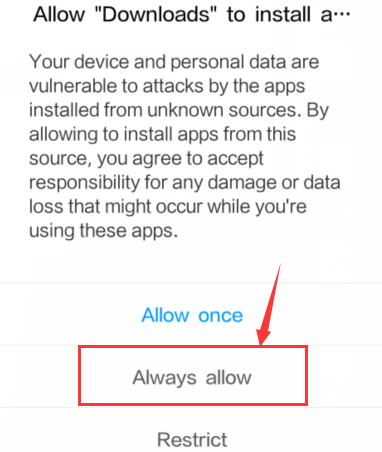

c\. Click "Open" or click the application mecanum_robot on the mobile phone desktop to open the APP, and a dialog box appears. In the dialog box, click "Allow" to turn on the Bluetooth of the mobile phone. You can also turn on the phone's Bluetooth before opening the APP.

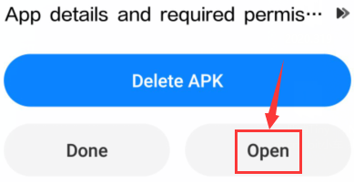

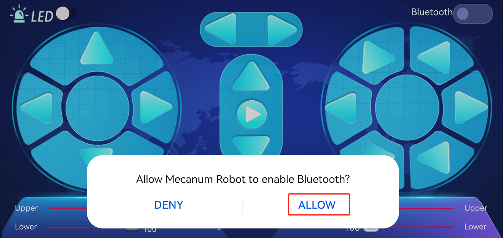

d\. Click  on the upper right corner to search for Bluetooth and click“connect”; a few seconds later, the Bluetooth is paired.

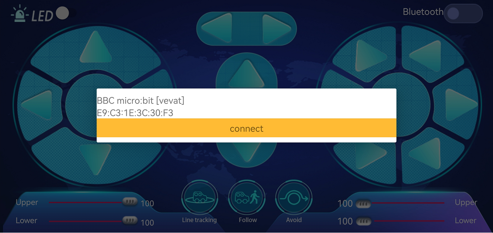

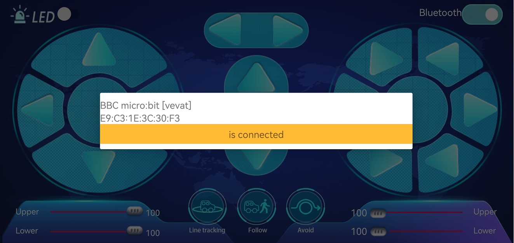

Open CoolTerm, click Options to select SerialPort. Set COM port and 115200 baud rate. Click“OK”and“Connect”.

Point at micro:bit board and press the icons on APP, the corresponding characters are shown on CoolTerm monitor.

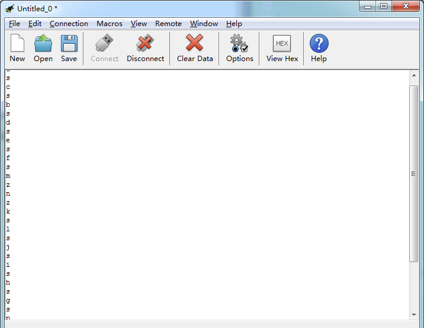

Through the test, we get the functions of every icon, as shown below:

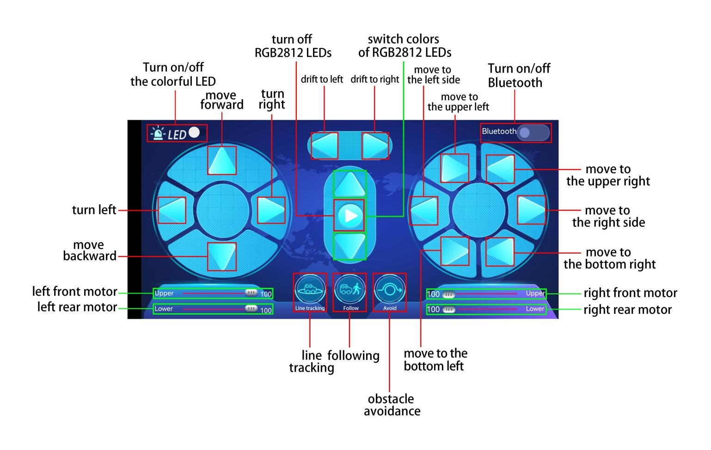

### Project 20.2：Multi-purpose Smart Car

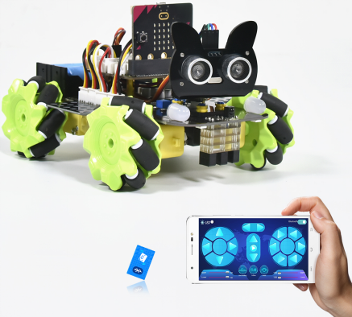

1\. **Description**

In this lesson, we will control the smart car to perform multipurpose functions.

2\. **Preparation**

- Insert the micro:bit board into the slot of keyestudio 4WD Mecanum Robot Car V2.0

- Place batteries into battery holder

- Dial power switch to ON end

- Connect the micro:bit to your computer via an USB cable

- Open the Web version of Makecode

**Steps：** Click the gear icon (Settings) in the upper right corner, then click on Extensions to go to the library file selection screen, and then click on the "Bluetooth" extension library (if it doesn't exist, search Bluetooth to find it), as shown below: 

As the Bluetooth and extension radio can’t work together, therefore, their extension libraries are not compatible.

Therefore, remove extension(s) and add Bluetooth please if you see the following prompt box pop up.

3\. **Test Code**

Since the code is quite long, it won't be displayed here. You can directly go to the following path to find the corresponding code.

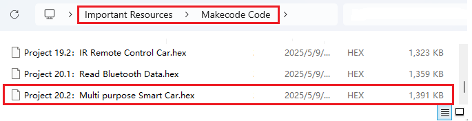

Click“JavaScript" to view the corresponding JavaScript code: ：

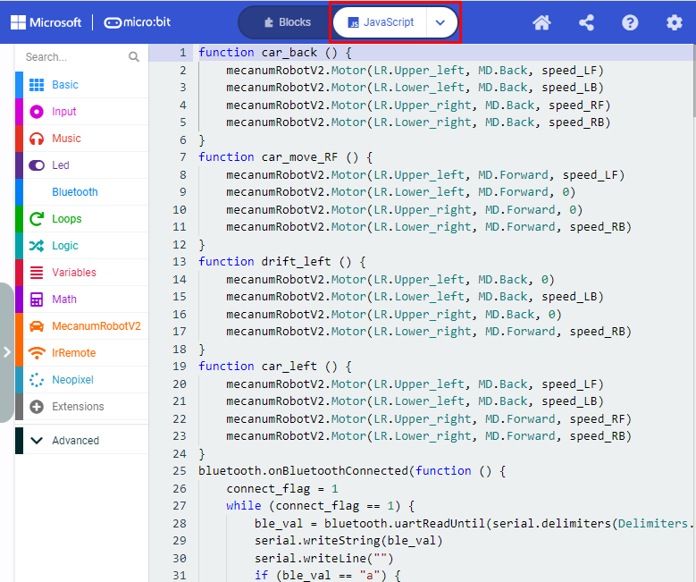

4\. **Test Result**

This experiment combines the previous projects to make the car to perform actions via Bluetooth.

Enter Makecode online editor→Projecting Settings→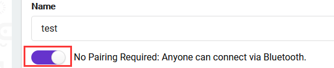, enable “No Pairing....”(you could skip this step if you import test code directly)

Download code to micro:bit board, dial POWER to ON end, and connect the Bluetooth, then you can control the car via the Bluetooth App of mecanum_robot.

**Note:** is used to adjust the speed, and  can only be dragged.
