## Resource Download

To help you quickly obtain related codes, libraries, and other support files for this product, please click the links below to download:

- [Python Code and library downloads](./PythonCode.7z)

## Getting started with Python

This tutorial is written for Python language. If you want to use graphical code programming, please refer to the manual "Makecode Tutorial". In the root directory of the resource you downloaded, there is a folder named "Python tutorial", which stores all the Python code of the Micro:bit 4WD Mecanum Robot Car V2.0. The Python code file is a file ending with ".py".

### What is MicroPython?

Python is a text-based language, which is widely used in education and is also used by professional programmers in fields such as data science and machine learning. 

Micro: bit can be programmed in Python, which is a microcontroller, and the hardware differences prevent micro: bit from fully supporting Python. The MicroPython is dedicated to micro：bit，which is an efficient implementation of the Python3 programming language. It contains a small portion of the Python standard library and is optimized to run on micro: bit microcontrollers.

The version of Python used by BBC micro: bit is called MicroPython. The MicroPython is perfect for those who want to learn more about programming, which helps you program with a series of code snippets, a variety of pre-made graphics and music.

Link for BBC microbit MicroPyth：[BBC micro:bit MicroPython ](https://microbit-micropython.readthedocs.io/en/latest/tutorials/introduction.html) 

**Python has two types of editors: web version and offline version**

1\.  Web version: [https://python.microbit.org/v/1.1](https://python.microbit.org/v/1.1)

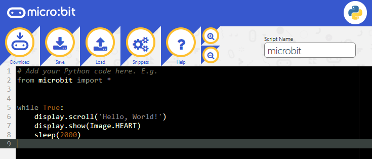

2\.  The other one is the offline compiler too-----Mu 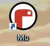

Official Website of Mu：[https://codewith.mu/](https://codewith.mu/)

### Mu 

Mu, a Python code editor, is suitable for starters. It doesn’t support 32-bit Windows. 

1\.  **Download Mu**

Click“This PC”and right- click to select Properties to check the version of your computer.

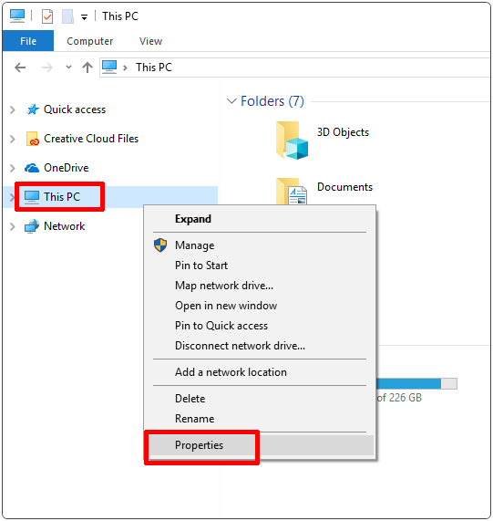

Check the system type of your computer.

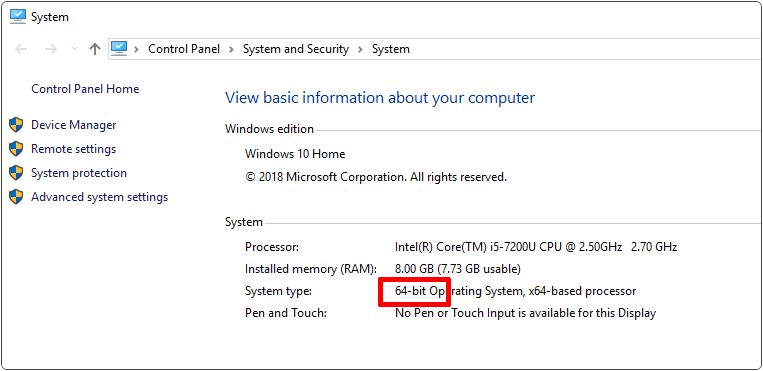

Enter the link of MU: [https://codewith.mu/en/download](https://codewith.mu/en/download) to download the corresponding version of Mu.

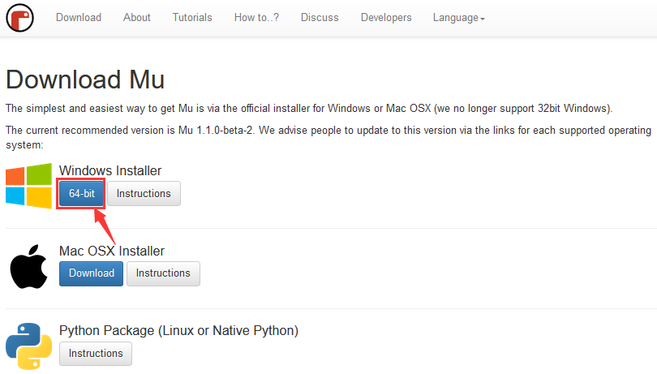

2\.  **Run Setup**

Open the file below

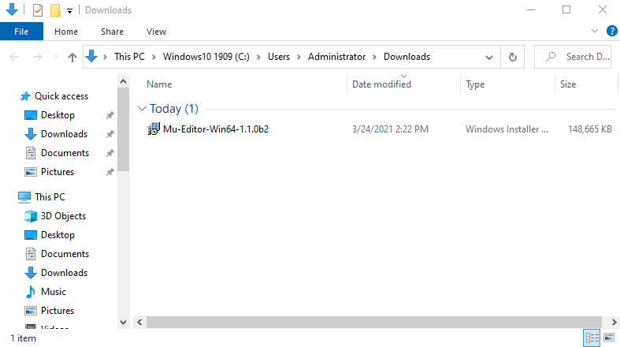

Mac OSX：[https://codewith.mu/en/howto/1.1/install_macos](https://codewith.mu/en/howto/1.1/install_macos).

Linux：[https://codewith.mu/en/howto/1.2/install_linux](https://codewith.mu/en/howto/1.2/install_linux).

**Windows 10**

You will view the page pop-up, then click “More info”.

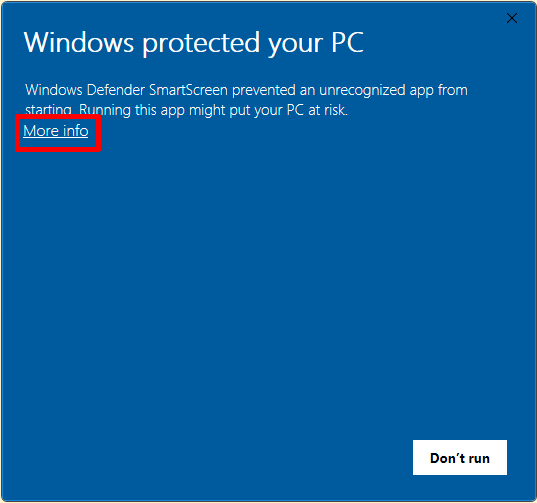

Then click“Run anyway”.

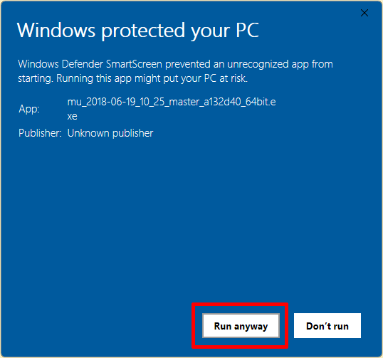

3\. License Agreement

Click “Install”.

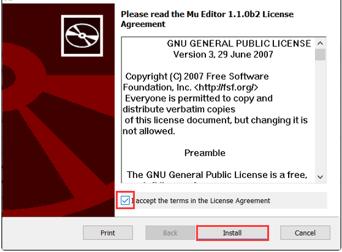

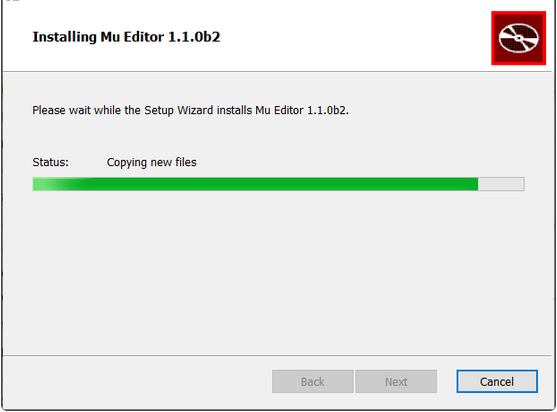

After installed , click “finish”.

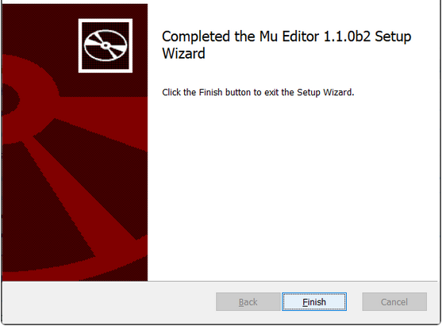

4\. Start Mu

Next, find it according to the following picture

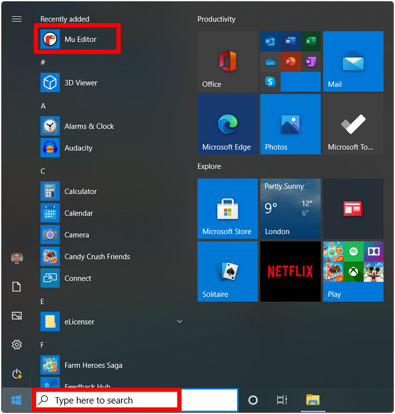

Its main interface is shown as below:

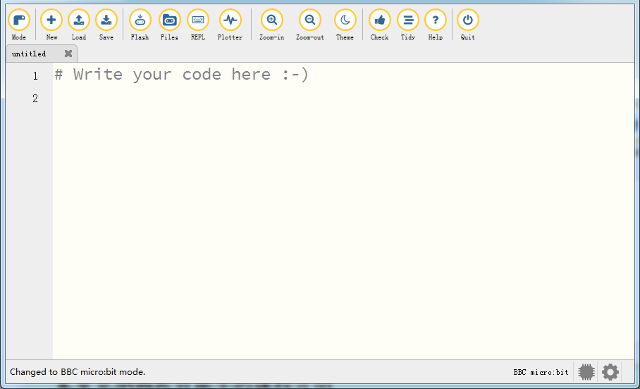

### Using Modes & Menu Bar

Set  “**Mode**” to BBC micro:bit .

On the menu, click “**Mode**” to set it to “**BBC micro：bit**”. The micro:bit mode understands how to interact with and connect to a micro:bit.

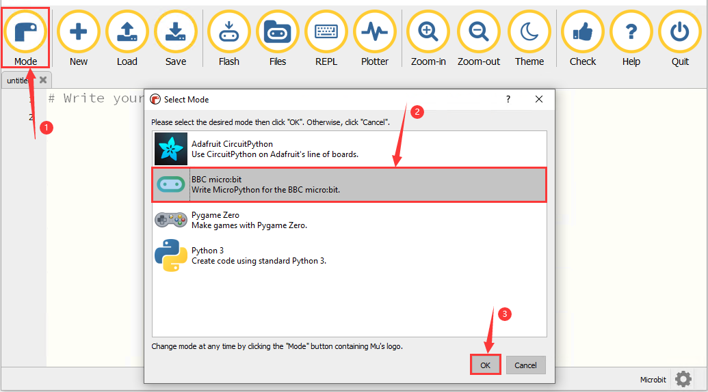

Click to [Start with Mu](https://codewith.mu/en/tutorials/1.1/start). 

### How Mu Import Library to Micro:bit

**Before importing libraries, we need to upload a .py code (empty code is also ok) to the micro:bit board. Here we take an empty code as an example.**

Connect the board to computer via USB cable. Open the Mu and click “Flash” to upload the .py code (empty code) to the board.

In this tutorial, "keyes_mecanum_Car_V2.py" library file are used. Therefore, import the "keyes_mecanum_Car_V2.py" library file into the micro:bit. This file contains the control method of the Micro:bit 4WD Mecanum Robot Car V2.0.

The default directory for Mu to save files is “mu_code”in the root directory of the user’s directory. 

References link: [https://codewith.mu/en/tutorials/1.0/files](https://codewith.mu/en/tutorials/1.0/files)

**the Methods of finding the "mu_code" folder:**

**Method One:**

For example, on the windows system, suppose your system is installed on the C driver of the computer, and the user name is "**Administrator**", then the path of the "**mu_code**" directory is "**C:\Users\Administrator\mu_ code**". On Linux systems, the path of the "**mu_code**" directory is "**~/home/mu_code**".

Open the “**mu_code**”folder.

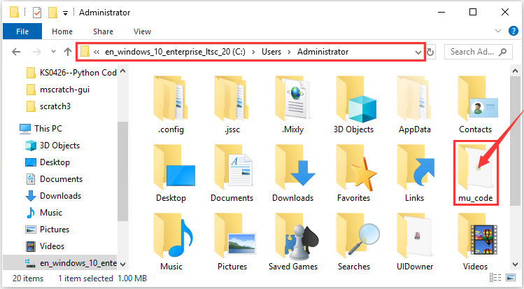

**Method Two:**

Search for the “mu_code” folder on the Disk(C:).

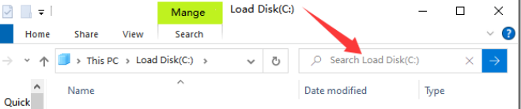

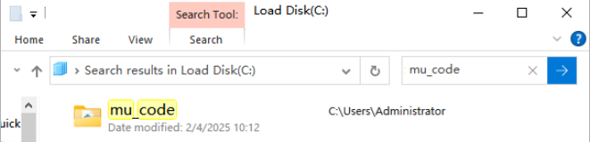

Open “mu_code”.

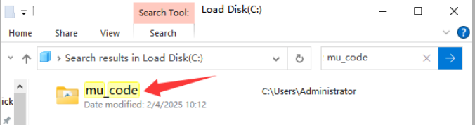

The path of the data folder where the “keyes_mecanum_Car.py”library file we provide are located is as follows:

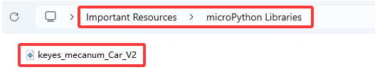

Copy“keyes_mecanum_Car.py”library file to the folder“mu_code”。When the copy is done, as shown below:

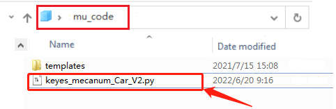

First open the Mu software and connect the micro:bit to your computer then click the "Files" button, and drag the "keyes_mecanum_Car.py" library file to the micro:bit.

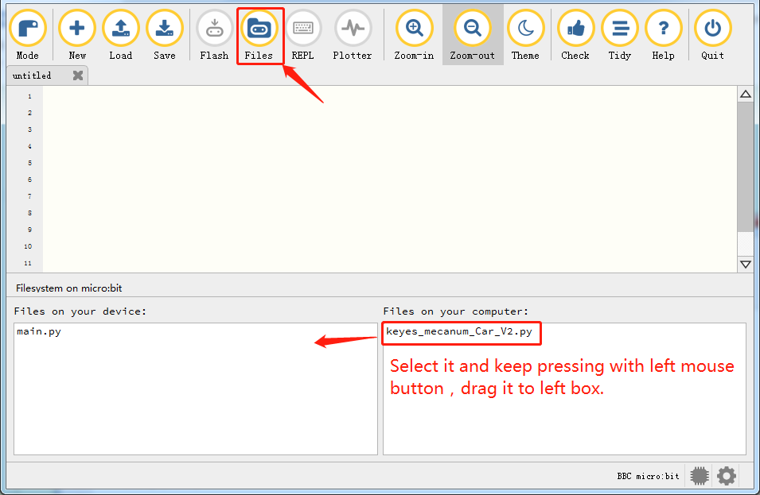

After a few seconds, the import is complete and you can see it in the box on the left.

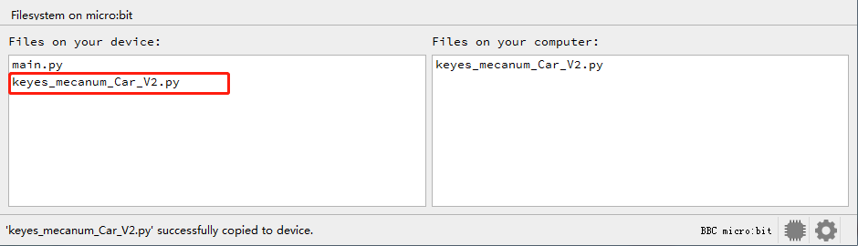

