### プロジェクト 1：Heart Beat


1\.  **説明**

このプロジェクトは micro:bit 本体ボードと micro USB ケーブルだけで簡単に行えます。この実験は micro:bit のプログラミングの魔法の世界に入るための入門として役立ちます。

2\.  **準備**

A. micro:bit 本体ボードを USB ケーブルでコンピュータに接続します。

B. Mu のオフライン版を開きます。

3\.  **テストコード**

Mu ソフトウェアを開き、「Load」をタップして「“microbit-Heartbeat\.py“」ファイルを選択し、「open」をクリックします：

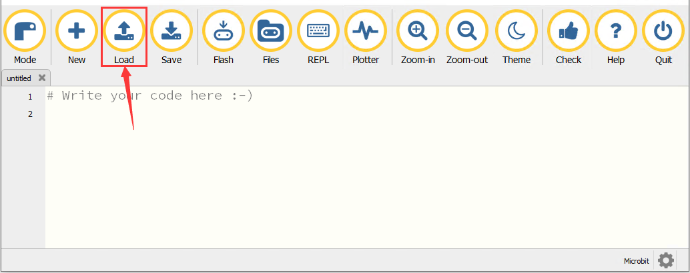

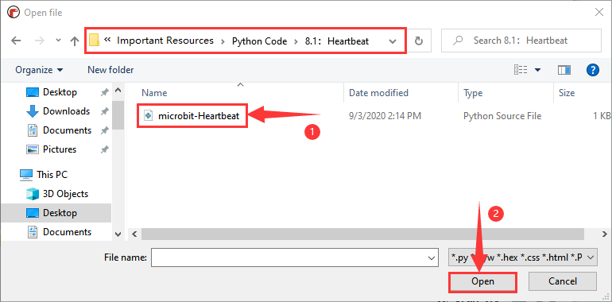

コードを読み込む別の方法もあります。Mu を開き、ファイル「microbit-Heartbeat\.py」をドラッグして取り込みます。

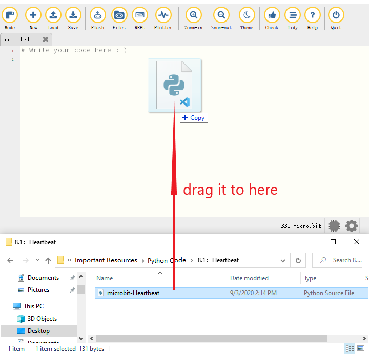

編集ウィンドウに直接コードを入力することもできます。

(**注意: すべての英単語と記号は英語で記述してください。**)

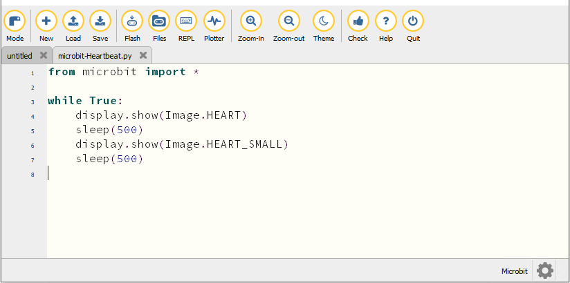

```python
from microbit import *

while True:
    display.show(Image.HEART)
    sleep(500)
    display.show(Image.HEART_SMALL)
    sleep(500)
```
以下は組み込み画像の一覧です:

• Image.HEART

• Image.HEART_SMALL

• Image.HAPPY

• Image.SMILE

• Image.SAD

• Image.CONFUSED

• Image.ANGRY

• Image.ASLEEP

• Image.SURPRISED

• Image.SILLY

• Image.FABULOUS

• Image.MEH

• Image.YES

• Image.NO

• Image.CLOCK12, Image.CLOCK11, Image.CLOCK10, Image.CLOCK9, Image.CLOCK8, Image.CLOCK7, Image.CLOCK6, Image.CLOCK5,

Image.CLOCK4, Image.CLOCK3, Image.CLOCK2, Image.CLOCK1

• Image.ARROW_N, Image.ARROW_NE, Image.ARROW_E, Image.ARROW_SE, Image.ARROW_S, Image.ARROW_SW, Image.ARROW_W, Image.ARROW_NW

• Image.TRIANGLE

• Image.TRIANGLE_LEFT

• Image.CHESSBOARD

• Image.DIAMOND

• Image.DIAMOND_SMALL

• Image.SQUARE

• Image.SQUARE_SMALL

• Image.RABBIT

• Image.COW

• Image.MUSIC_CROTCHET

• Image.MUSIC_QUAVER

• Image.MUSIC_QUAVERS

• Image.PITCHFORK

• Image.PACMAN

• Image.TARGET

• Image.TSHIRT

• Image.ROLLERSKATE

• Image.DUCK

• Image.HOUSE

• Image.TORTOISE

• Image.BUTTERFLY

• Image.STICKFIGURE

• Image.GHOST

• Image.SWORD

• Image.GIRAFFE

• Image.SKULL

• Image.UMBRELLA

• Image.SNAKE，Image.ALL_CLOCKS，Image.ALL_ARROWS

micro:bit ボードを USB ケーブルでコンピュータに接続し、「Flash」をクリックしてコードをボードにダウンロードします。

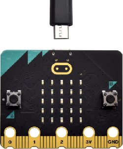


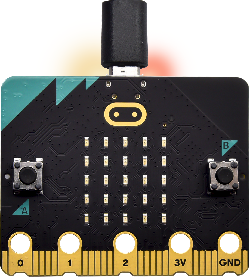


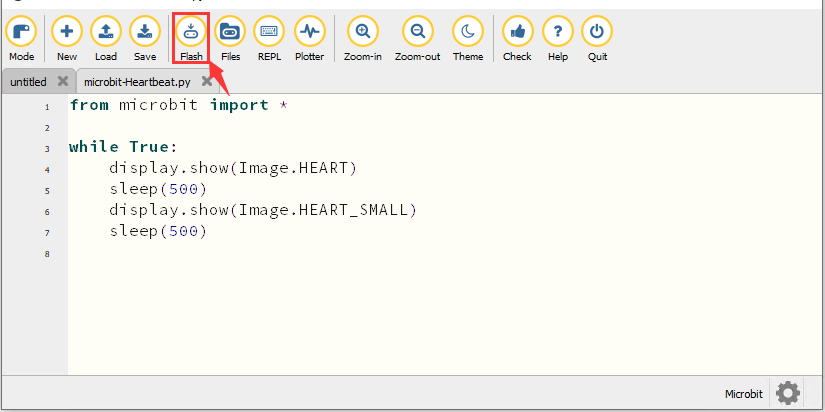

コードは、たとえ誤っていても micro:bit ボードに正常にダウンロードできますが、micro:bit 上では動作しないことがあります。

「Flash」をクリックしてコードを micro:bit にダウンロードします。

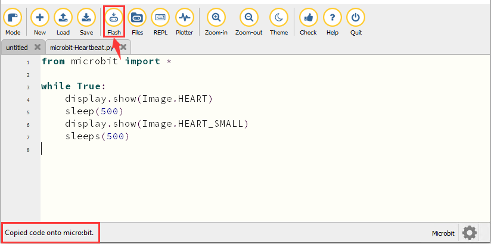

「REPL」をクリックし、micro:bit のリセットボタンを押すと、エラー情報が REPL ウィンドウに表示されます。下図のとおりです：

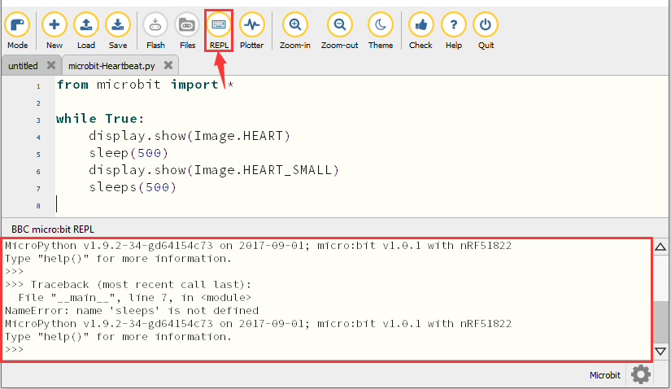

もう一度「REPL」をクリックして REPL モードをオフにすると、新しいコードをリフレッシュできます。

正しいコードか確認するには、「Check」をタップするだけです。エラーがウィンドウに表示されます。

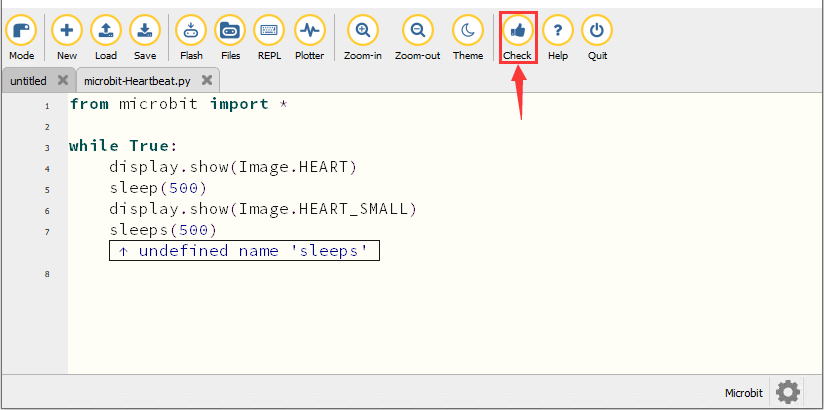

プロンプトに従ってコードを修正し、「Check」をクリックします。

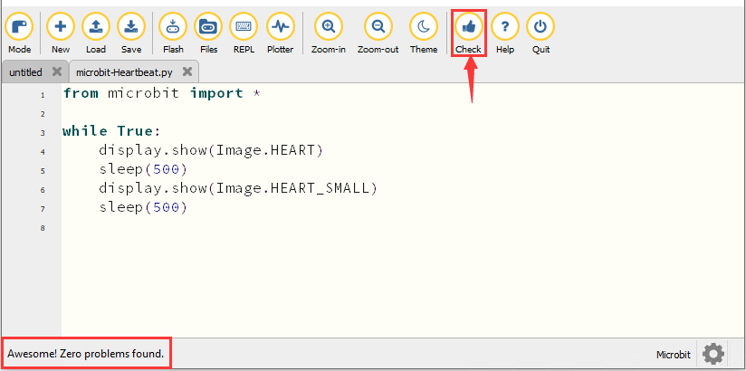

 より多くのチュートリアルはウェブサイトをご覧ください： [https://codewith.mu/en/tutorials/](https://codewith.mu/en/tutorials/)

4\.  **テスト結果**

“<span style="color: rgb(255, 76, 65);">**Flash**</span>” をクリックしてコードを micro:bit ボードに読み込みます。

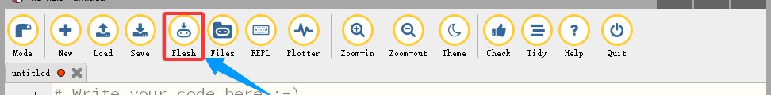

コードをボードに正常にダウンロードした後、**micro USB ケーブルまたは外部電源で電源を入れる（DIP スイッチを ON にする）**、そしてボードのリセットボタンを押します。


LED ドットマトリクスは、パターン「❤」と「」を交互に表示します。

5\.  **コードの説明**

|from microbit import*|micro:bit のライブラリファイルをインポートする|
|-|-|
|while True:|これは常時ループで、micro:bit がこのループ内のコードを永遠に実行し続けます。|
|display.show(Image.HEART)|micro:bit が「❤」を表示する|
|sleep(500)|500ms の遅延|
|display.show(Image.HEART_SMALL)|LED ドットマトリクスが「」を表示する|

---