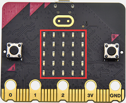
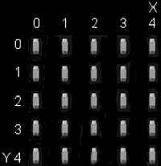
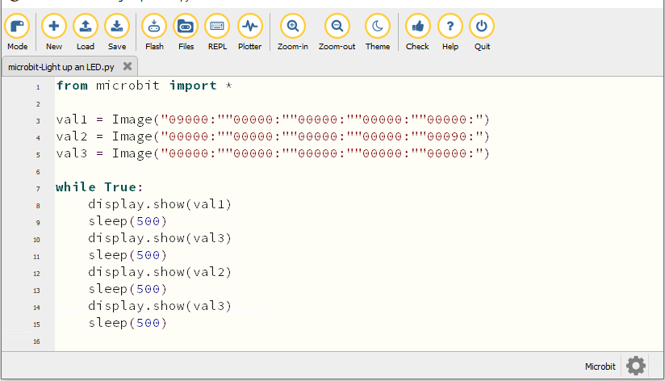
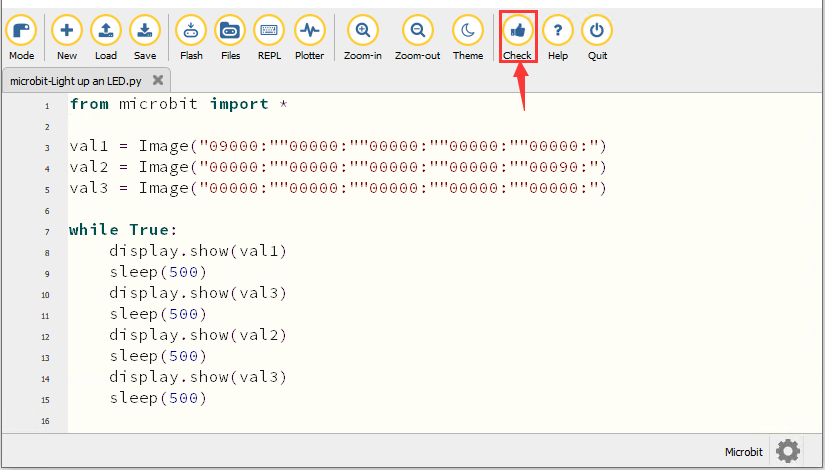
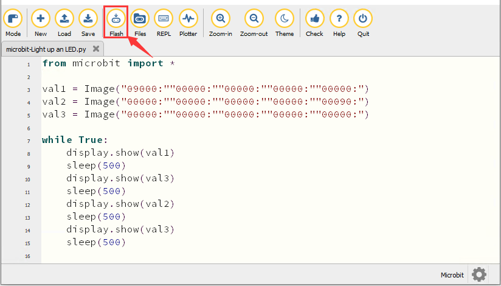
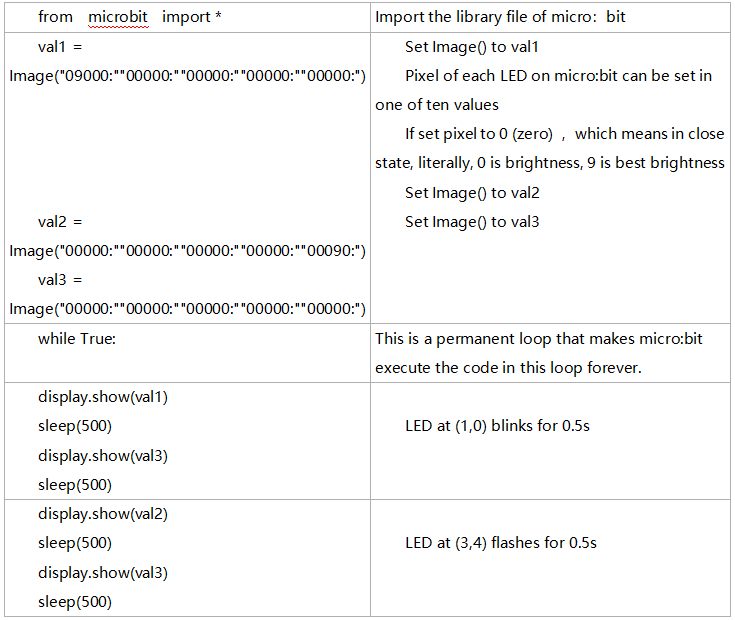

### Progetto 2：Accendere un singolo LED



1\.  **Descrizione**

La matrice di LED è costituita da 25 diodi disposti in un quadrato 5×5 e posizionati all'incrocio delle linee di riga (X) e delle linee di colonna (Y). Possiamo controllare uno dei 25 LED impostando punti di coordinate. Ad esempio, il primo LED nella prima riga è (0,0) e il terzo LED posizionato nella prima riga è (2,0) e così via.



2\.  **Preparazione**

A. Collega la scheda principale micro:bit al tuo computer tramite il cavo USB

B. Apri la versione offline di Mu.

3\.  **Codice di test**

Avvia il software Mu e apri il file “Single LED display\.py.” per importare il codice. Puoi anche inserire il codice nella finestra di modifica autonomamente.

(**Nota: Tutte le parole e i simboli in inglese devono essere scritti in inglese**)



```python
from microbit import *

val1 = Image("09000:""00000:""00000:""00000:""00000:")
val2 = Image("00000:""00000:""00000:""00000:""00090:")
val3 = Image("00000:""00000:""00000:""00000:""00000:")

while True:
    display.show(val1)
    sleep(500)
    display.show(val3)
    sleep(500)
    display.show(val2)
    sleep(500)
    display.show(val3)
    sleep(500)

```

Clicca su “Check” per verificare eventuali errori nel codice. Il programma è errato se vengono mostrati sottolineature e cursori.



Se il codice è corretto, collega il micro:bit al computer e clicca su “Flash” per trasferire il codice sulla scheda micro:bit.



4\.  **Risultato del test**

Dopo aver scaricato correttamente il codice sulla scheda, **alimenta tramite il cavo micro USB o un'alimentazione esterna (sposta l'interruttore DIP su ON)** e premi il pulsante di reset sulla scheda.


Il LED in (1,0) si accenderà e spegnerà per 0,5 s, poi quello in (3,4) si accenderà e spegnerà per 0,5 s e questa sequenza si ripeterà.

5\.  **Spiegazione del codice**



6\.  **Riferimento**

sleep(ms) : tempo di ritardo

Per maggiori dettagli sul ritardo, fare riferimento al link: [https://microbit-micropython.readthedocs.io/en/latest/utime.html](https://microbit-micropython.readthedocs.io/en/latest/utime.html)