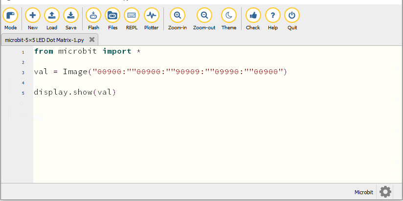
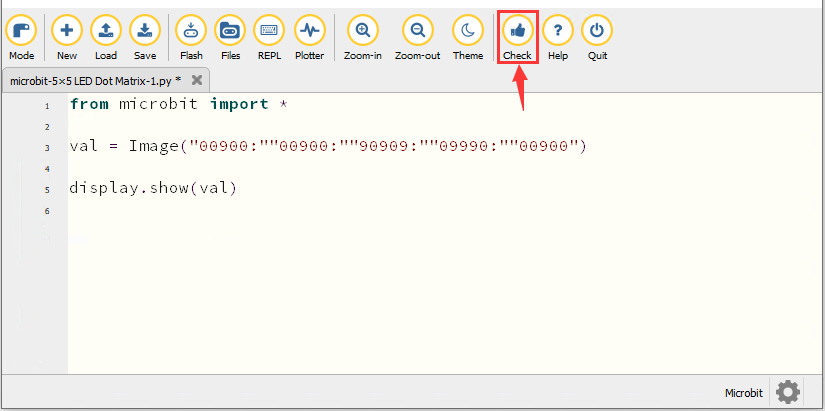
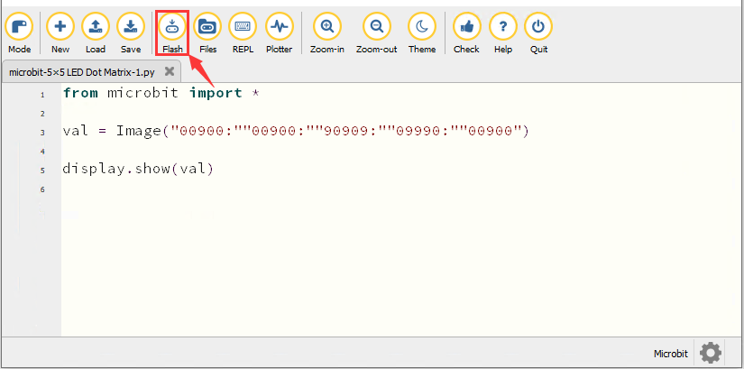
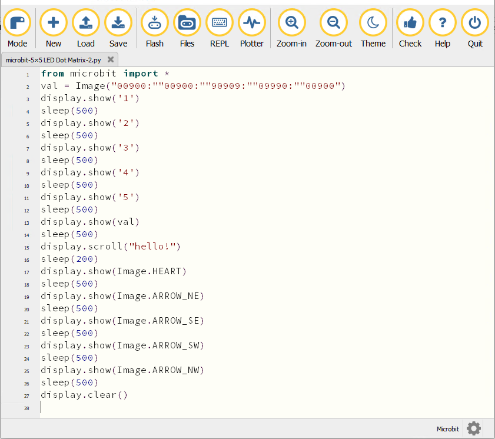
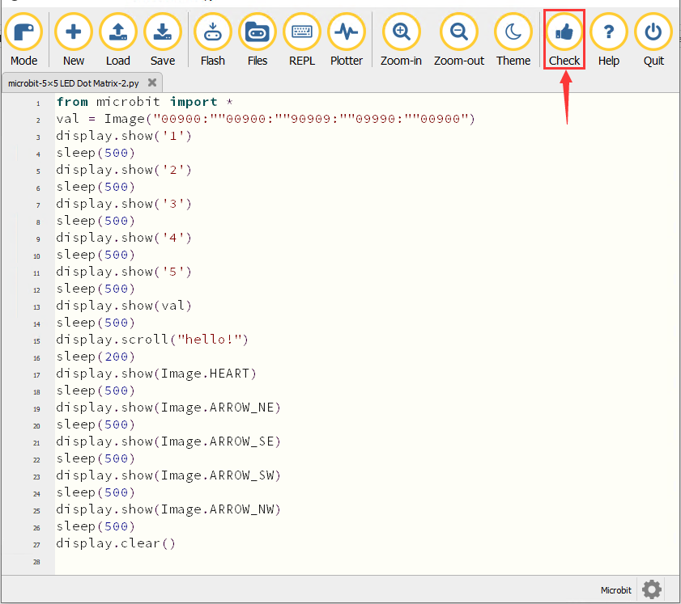
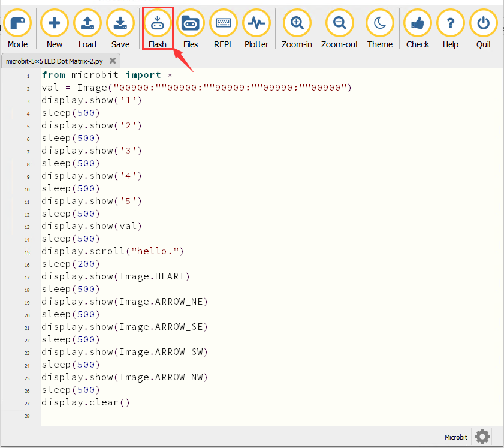
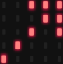
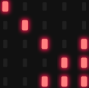
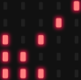
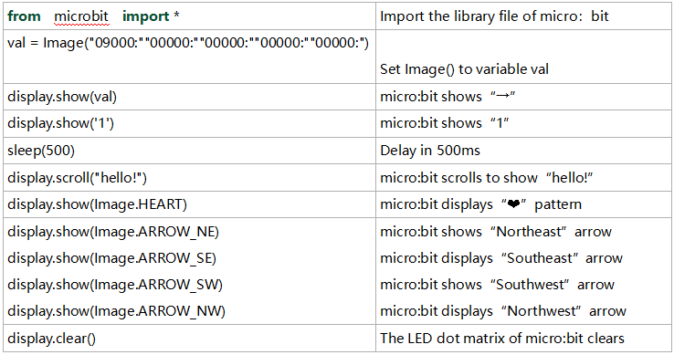

### プロジェクト3：5×5 LED ドットマトリクス


1\.  **説明**

ドットマトリクスは日常生活で非常に一般的で、LED 広告ディスプレイ、エレベーターのフロア表示、バス停の案内などで広く使われています。
Micro: Bit メインボードの LED ドットマトリクスは 25 個のダイオードを含みます。以前に、位置に基づいて特定の LED を制御することに成功しました。同じ理論に基づき、複数の LED を同時に点灯させてパターン、数字、文字を表示できます。

さらに、「show icon」をクリックして表示したいパターンを選ぶこともできます。最後に、自分でパターンを設計することも可能です。

2\.  **準備**

A. USB ケーブルで micro:bit メインボードをコンピュータに接続します

B. オフライン版 Mu を開きます。

3\.  **テストコード1**

「5×5 LED Dot Matrix-1\.py」ファイルを開いてコードをインポートできます。編集ウィンドウに自分でコードを入力することもできます。

(**注意：すべての単語と記号は英語で記述してください。**)



```python
from microbit import *

val = Image("00900:""00900:""90909:""09990:""00900")

display.show(val)
```

「Check」をクリックしてコードのエラーを確認します。下線やカーソルが表示されている場合、プログラムは誤りと判断されます。 



コードが正しければ、micro:bit をコンピュータに接続し「Flash」をクリックしてコードを micro:bit ボードに書き込みます。



4\.  **テスト結果1**

コードをボードに正常にダウンロードしたら、**micro USB ケーブルまたは外部電源で給電してください（DIP スイッチを ON にする）**。その後、ボード上のリセットボタンを押します。


5×5 のドットマトリクスに下向きの矢印が表示されることが確認できます 。

5\.  **テストコード2**

「5×5 LED Dot Matrix-2\.py」ファイルを開いてコードをインポートできます。編集ウィンドウに自分でコードを入力することもできます。

(**注意：すべての単語と記号は英語で記述してください。**)



```python
from microbit import *
val = Image("00900:""00900:""90909:""09990:""00900")
display.show('1')
sleep(500)
display.show('2')
sleep(500)
display.show('3')
sleep(500)
display.show('4')
sleep(500)
display.show('5')
sleep(500)
display.show(val)
sleep(500)
display.scroll("hello!")
sleep(200)
display.show(Image.HEART)
sleep(500)
display.show(Image.ARROW_NE)
sleep(500)
display.show(Image.ARROW_SE)
sleep(500)
display.show(Image.ARROW_SW)
sleep(500)
display.show(Image.ARROW_NW)
sleep(500)
display.clear()
```

「Check」をクリックしてコードのエラーを確認します。下線やカーソルが表示されている場合、プログラムは誤りと判断されます。 



コードが正しければ、micro:bit をコンピュータに接続し「Flash」をクリックしてコードを micro:bit ボードに書き込みます。



6\.  **テスト結果2**

コードをボードに正常にダウンロードしたら、**micro USB ケーブルまたは外部電源で給電してください（DIP スイッチを ON にする）**。その後、ボード上のリセットボタンを押します。


5×5 のドットマトリクスが順に数字 1、2、3、4、5 を表示し、その後下向きの矢印 、"Hello"、ハートのパターン 、北東を指す矢印 、次に南東
、次に南西 、最後に北西  を交互に表示することが確認できます。

7\.  **コードの説明**




6.  **参照**

display.scroll() ：

表示がスクロールして値を表示します。もし値が整数（int）や浮動小数点数（float）の場合は、str() を使って文字列に変換します。

詳しくは次のリンクを参照してください: [https://microbit-micropython.readthedocs.io/en/latest/utime.html](https://microbit-micropython.readthedocs.io/en/latest/utime.html)