### Proyecto 4：Botones programables

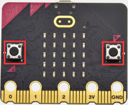

1\.  **Descripción**

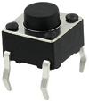

Los botones pueden usarse para controlar circuitos. En un circuito con un pulsador, el circuito se cierra al presionar el botón y se abre de nuevo al soltarlo.

Ambos extremos del botón parecen dos montañas. Hay un río en medio. 
La pieza metálica interna conecta los dos lados para permitir el paso de la corriente, como construir un puente para unir dos montañas.

La estructura interna del botón se muestra a continuación: antes de presionar el botón, 1, 2, 3 y 4 están conectados. Sin embargo, 1 y 3 o 1 y 4 o 2 y 3 o 2 y 4 están desconectados; estas conexiones solo se habilitan cuando se presiona el botón. 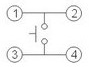

La placa principal micro:bit cuenta con tres pulsadores: dos son botones programables (marcados con A y B) y el situado en el otro lado es un botón de reinicio. Al presionar los dos botones programables se pueden introducir tres señales diferentes. Podemos presionar el botón A o B individualmente o presionarlos juntos y la matriz de puntos LED mostrará respectivamente A, B y AB. Empecemos.

2\.  **Preparación**

A. Conecte la placa principal micro:bit a su ordenador mediante el cable USB.

B. Abra la versión offline de Mu.

3\.  **Test Code1**

Abra el software Mu y abra el archivo “Programmable Buttons-1\.py” para importar el código. También puede introducir el código usted mismo en la ventana de edición.

(**Nota: Todas las palabras y símbolos deben escribirse en inglés.**)

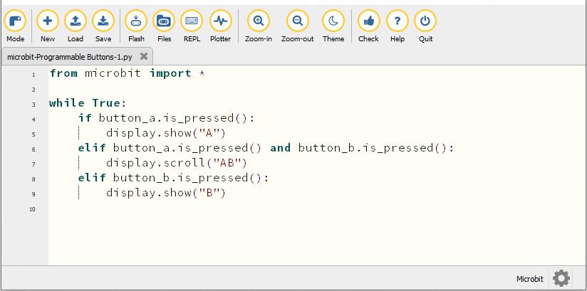

```python
from microbit import *

while True:
    if button_a.is_pressed():
        display.show("A")
    elif button_a.is_pressed() and button_b.is_pressed():
        display.scroll("AB")
    elif button_b.is_pressed():
        display.show("B")
```
Haga clic en “Check” para examinar errores en el código. El programa está mal si aparecen subrayados y cursores.

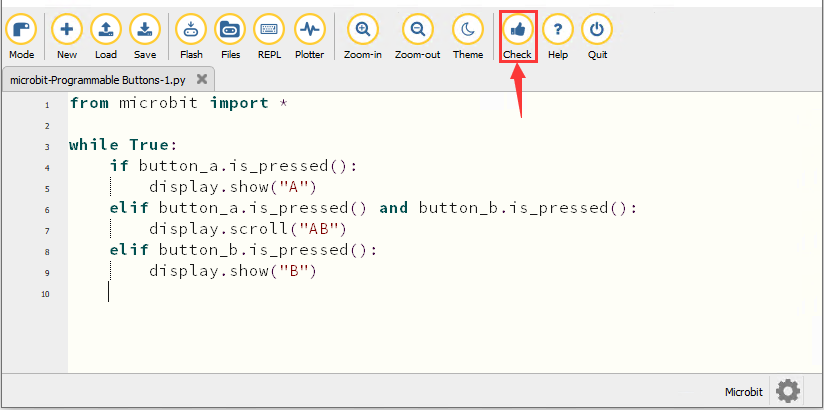

Si el código es correcto, conecte el micro:bit a su ordenador y haga clic en “Flash” para descargar el código a la placa micro:bit.

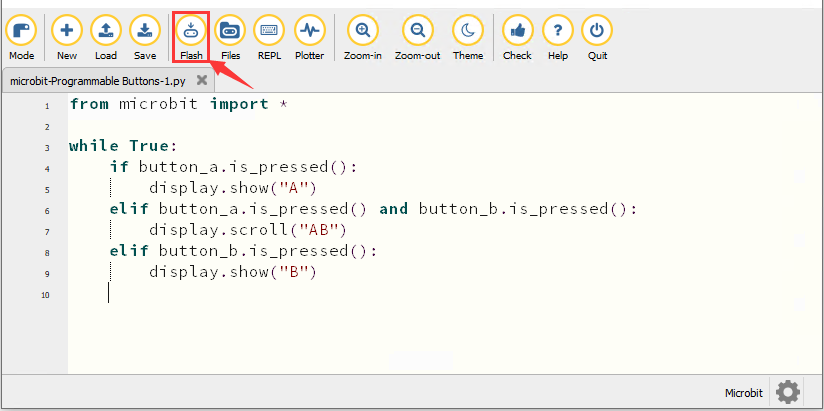

4\.  **Resultado de la prueba 1**

Después de descargar correctamente el código a la placa, **alimente mediante el cable micro USB o una fuente de alimentación externa (coloque el interruptor DIP en ON)** y presione el botón de reinicio en la placa.


La matriz de puntos LED 5*5 muestra “A” si se presiona el botón A, luego “B” si se presiona el botón B, y “AB” si se presionan A y B juntos.

5\.  **Test Code2**

Abra el software Mu y abra el archivo “Programmable Buttons-2\.py” para importar el código. También puede introducir el código usted mismo en la ventana de edición.

(**Nota: Todas las palabras y símbolos deben escribirse en inglés.**)

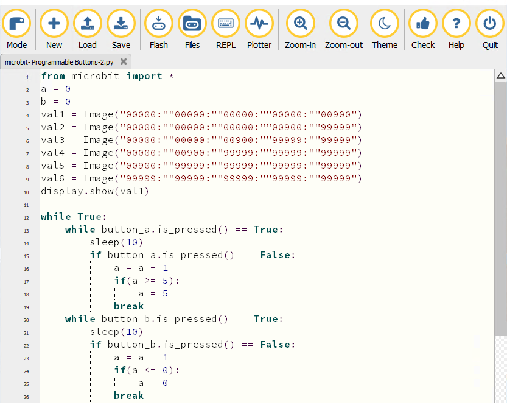

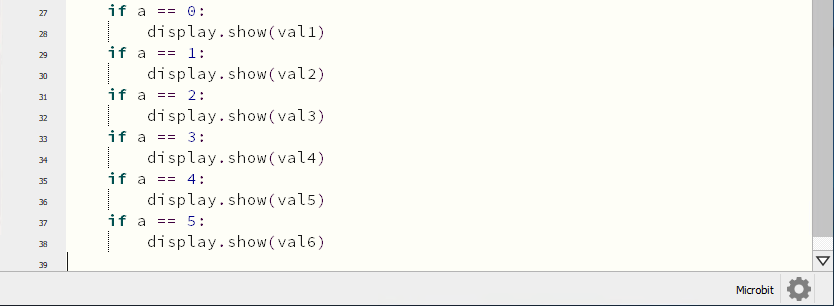

```python
from microbit import *
a = 0
b = 0
val1 = Image("00000:""00000:""00000:""00000:""00900")
val2 = Image("00000:""00000:""00000:""00900:""99999")
val3 = Image("00000:""00000:""00900:""99999:""99999")
val4 = Image("00000:""00900:""99999:""99999:""99999")
val5 = Image("00900:""99999:""99999:""99999:""99999")
val6 = Image("99999:""99999:""99999:""99999:""99999")
display.show(val1)

while True:
    while button_a.is_pressed() == True:
        sleep(10)
        if button_a.is_pressed() == False:
            a = a + 1
            if(a >= 5):
                a = 5
            break
    while button_b.is_pressed() == True:
        sleep(10)
        if button_b.is_pressed() == False:
            a = a - 1
            if(a <= 0):
                a = 0
            break
    if a == 0:
        display.show(val1)
    if a == 1:
        display.show(val2)
    if a == 2:
        display.show(val3)
    if a == 3:
        display.show(val4)
    if a == 4:
        display.show(val5)
    if a == 5:
        display.show(val6)
```
Haga clic en “Check” para examinar errores en el código. El programa está mal si aparecen subrayados y cursores.

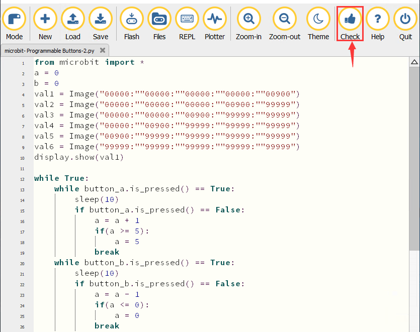

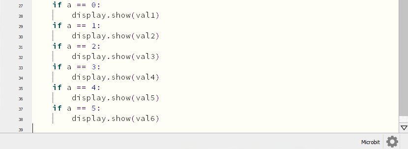

Si el código es correcto, conecte el micro:bit a su ordenador y haga clic en “Flash” para descargar el código a la placa micro:bit.

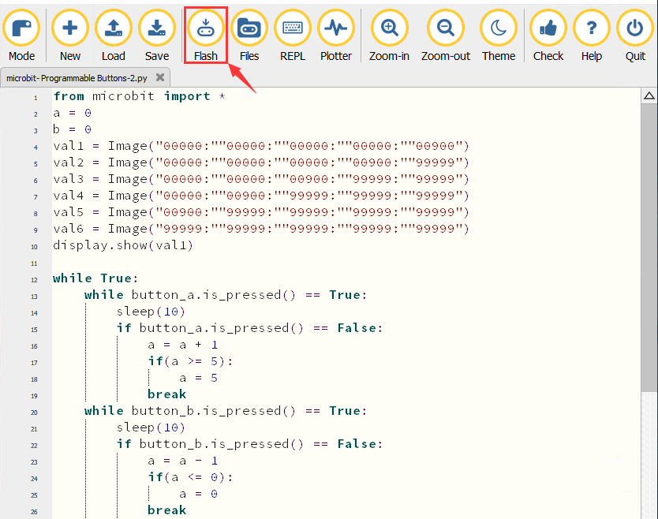


6\.  **Resultado de la prueba 2**

Después de descargar correctamente el código a la placa, **alimente mediante el cable micro USB o una fuente de alimentación externa (coloque el interruptor DIP en ON)** y presione el botón de reinicio en la placa.


Si se presiona el botón A, aumentan los LED que se iluminan en rojo; si se presiona el botón B, disminuyen los LED que se iluminan en rojo.

7\.  **Explicación del código**

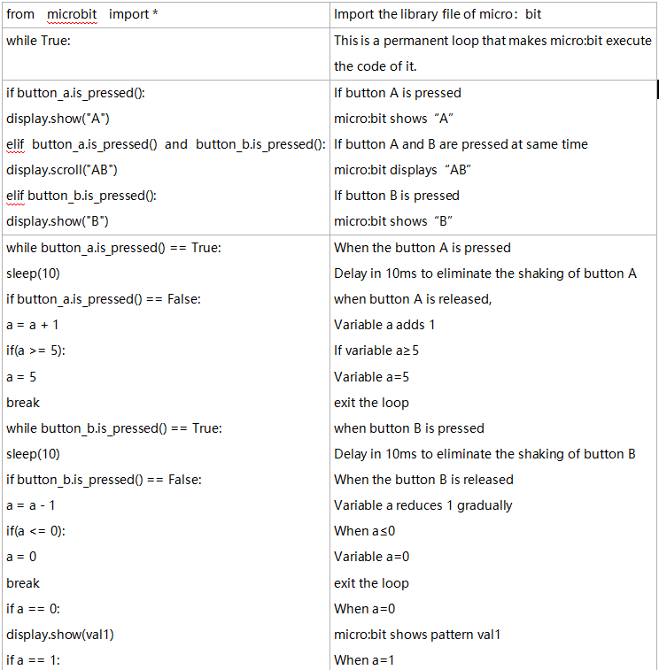

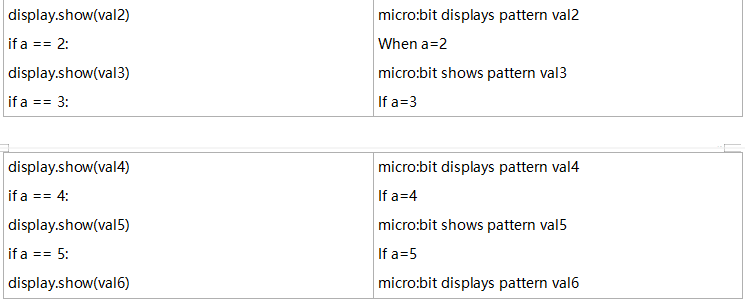

---