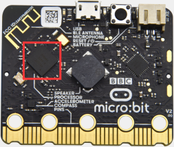
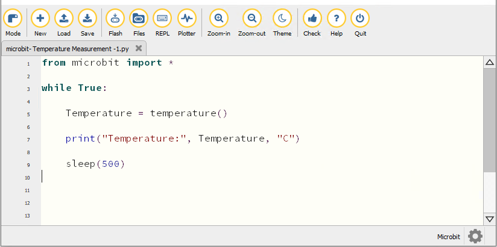
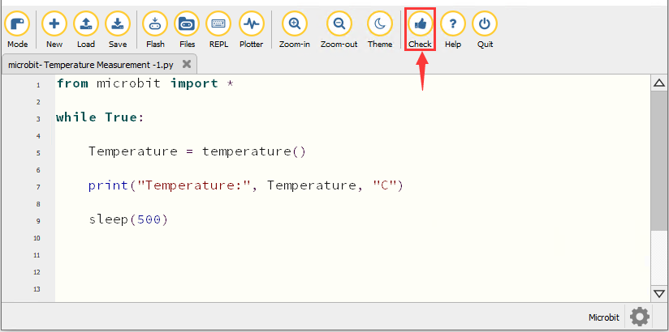
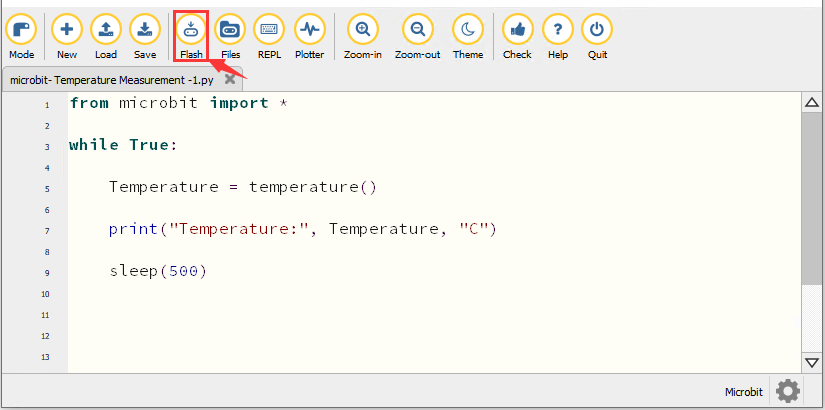
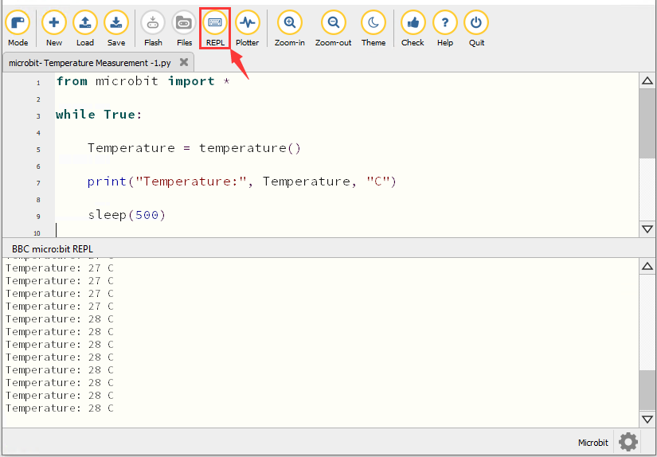
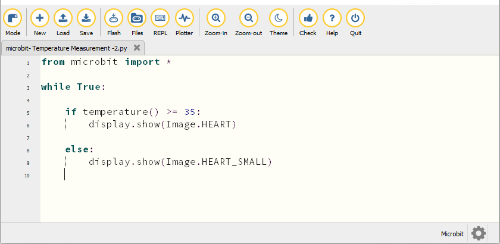
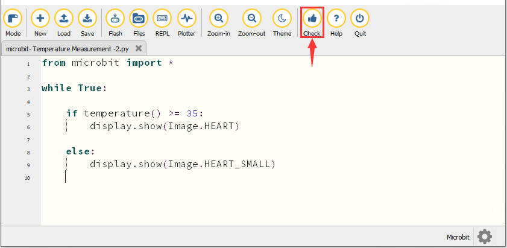
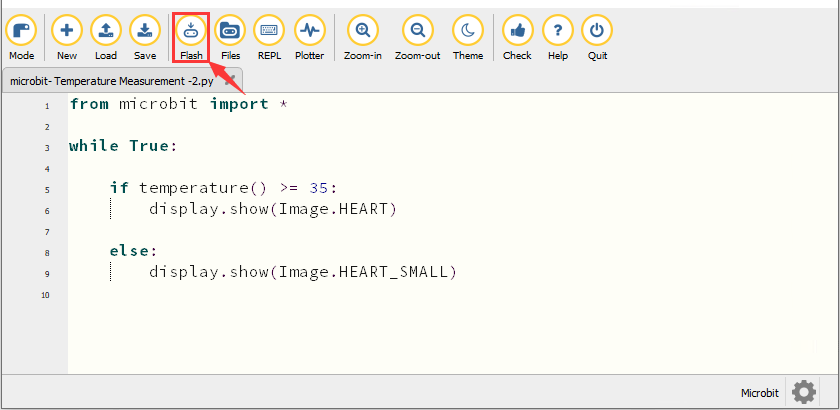
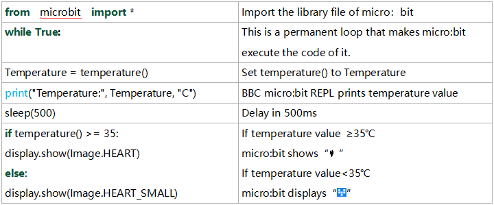

### Project 5：Temperatuurbewaking

1\.  **Beschrijving**

De Micro:bit-hoofdkaart is niet uitgerust met een aparte temperatuursensor, maar gebruikt de ingebouwde temperatuursensor in de NFR52833-chip voor temperatuurdetectie. Daarom is de gemeten temperatuur dichter bij de temperatuur van de chip en kan deze afwijken van de omgevingstemperatuur.

In dit project gebruiken we de sensor om de temperatuur in de huidige omgeving te meten en de testresultaten op het displayapparaat weer te geven. Vervolgens regelen we de LED-dotmatrix om verschillende patronen te tonen door het door de sensor gedetecteerde temperatuurbereik in te stellen.

**Opmerking: de temperatuursensor van de Micro:bit-hoofdkaart wordt hieronder weergegeven:**



2\.  **Voorbereiding**

A. Sluit de micro:bit-hoofdkaart via de USB-kabel aan op uw computer

B. Open de offlineversie van Mu.

3\.  **Testcode1**

Start de Mu-software en open het bestand “Temperature Measurement -1\.py “ om de code te importeren. U kunt de code ook zelf in het bewerkingsvenster invoeren.

(**Opmerking: Alle woorden en symbolen moeten in het Engels worden geschreven.**)



```python
from microbit import *

while True:

    Temperature = temperature()

    print("Temperature:", Temperature, "C")

    sleep(500)
```

Klik op “Check” om te controleren op fouten in de code. Het programma is fout als onderstrepingen en cursors worden weergegeven. 



Als de code correct is, verbind dan de micro:bit met de computer en klik op “Flash” om de code naar het micro:bit-bord te downloaden.



4\.  **Testresultaat1**

Nadat de code succesvol naar het bord is gedownload, **schakel de voeding in via de micro USB-kabel of een externe voeding (zet de DIP-schakelaar op ON)**. Klik op “REPL” en druk op de resetknop van de micro:bit.


Het REPL-venster toont vervolgens de waarde van de omgevingstemperatuur, zoals hieronder weergegeven: (C staat voor de temperatuur-eenheid)



5\.  **Testcode2**

Start de Mu-software en open het bestand “Temperature Measurement -2\.py “ om de code te importeren. U kunt de code ook zelf in het bewerkingsvenster invoeren.

(**Opmerking: Alle woorden en symbolen moeten in het Engels worden geschreven.**)

De temperatuurwaarde kan worden ingesteld in overeenstemming met de werkelijke temperatuur.



```python
from microbit import *

while True:

    if temperature() >= 35:
        display.show(Image.HEART)

    else:
        display.show(Image.HEART_SMALL)
```

Klik op “Check” om te controleren op fouten in de code. Het programma is fout als onderstrepingen en cursors worden weergegeven. 



Als de code correct is, verbind dan de micro:bit met de computer en klik op “Flash” om de code naar het micro:bit-bord te downloaden.



6\.  **Testresultaat2**

Nadat de code succesvol naar het bord is gedownload, **schakel de voeding in via de micro USB-kabel of een externe voeding (zet de DIP-schakelaar op ON)** en druk op de resetknop van de micro:bit.


 Wanneer de omgevingstemperatuur lager is dan 35℃, toont de 5×5 LED-dotmatrix . Wanneer de temperatuur gelijk aan of hoger dan 35℃ is, verschijnt het patroon .

7\.  **Code-uitleg**



---