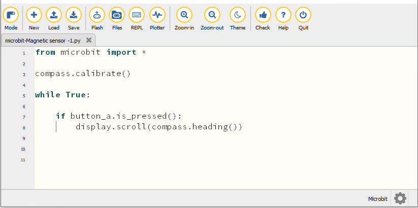
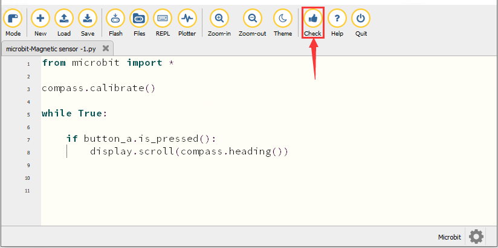
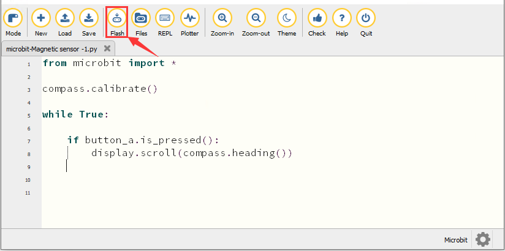
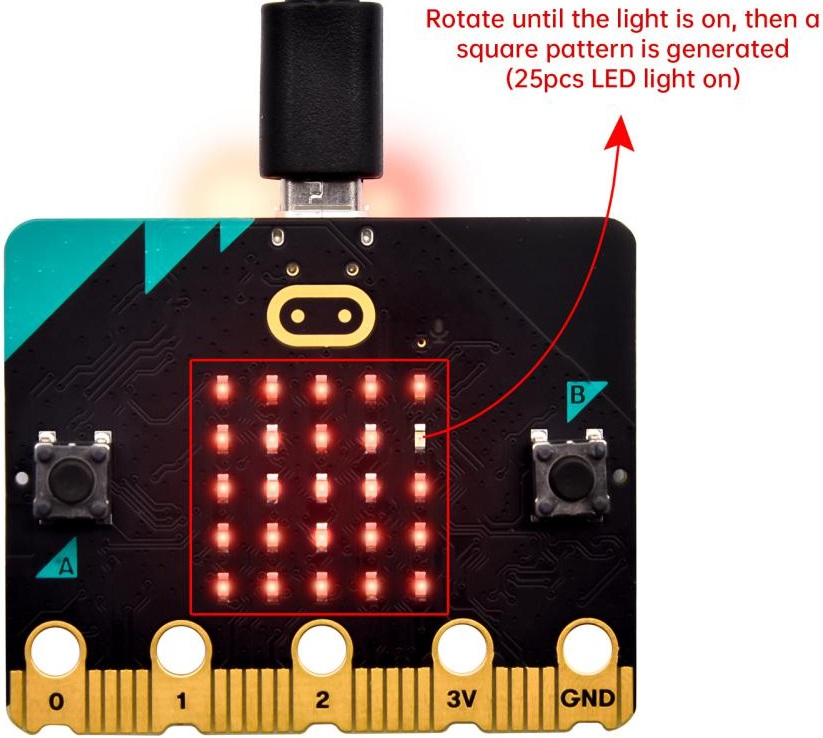
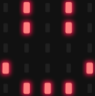
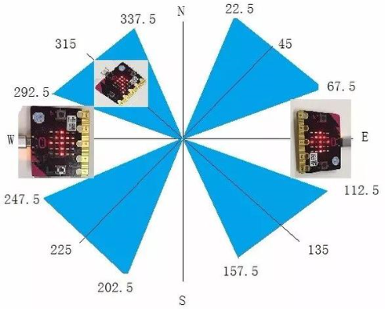
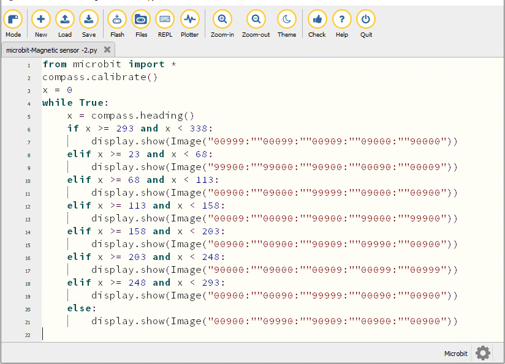
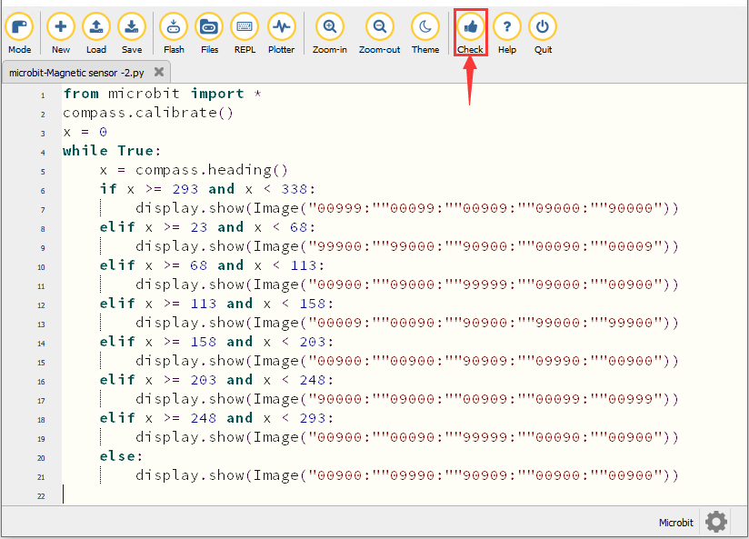
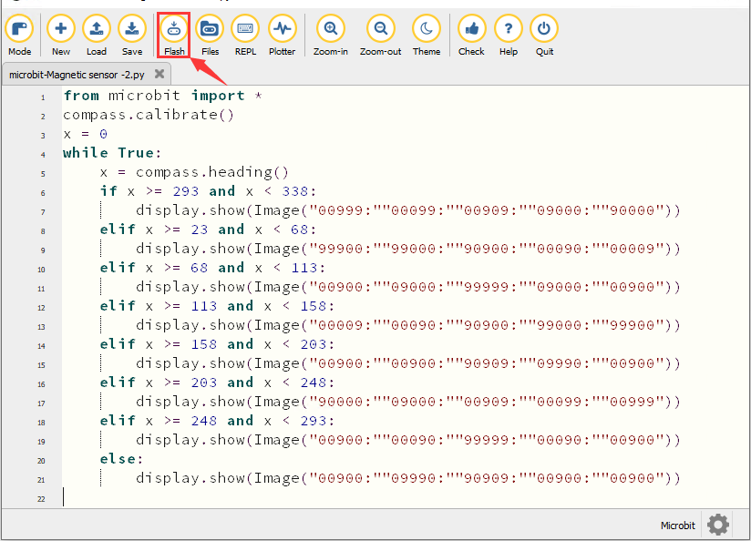
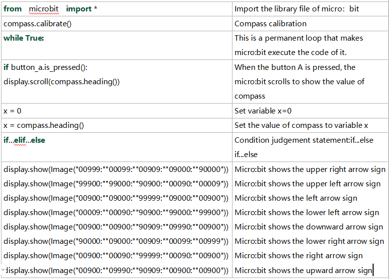

### Proyecto 6：Geomagnetic Sensor


1\.  **Descripción**

Este proyecto presenta principalmente el uso del sensor geomagnético del micro:bit. Además de detectar la intensidad del campo magnético, también puede usarse para determinar la dirección, lo que es una parte importante del sistema de referencia de rumbo y actitud (AHRS).

Utiliza el magnetómetro triaxial FreescaleMAG3110. Su interfaz I2C se comunica con el exterior, y el rango es ±1000µT, con una tasa máxima de actualización de datos de 80Hz. Combinado con un acelerómetro, puede calcular la posición. Además, se aplica a la detección magnética y a bloques de brújula.

Luego podemos leer el valor detectado para determinar la orientación. Es necesario calibrar la placa micro:bit cuando funciona el sensor magnético. El método correcto de calibración es girar la placa micro:bit.

Además, los objetos cercanos pueden afectar la precisión de las lecturas y la calibración.

2\.  **Preparación**

A. Conecte la placa principal micro:bit a su ordenador mediante el cable USB

B. Abra la versión offline de Mu.

3\.  **Test Code1**

Abra el software Mu y abra el archivo “Magnetic sensor -1\.py” para importar el código. También puede introducir el código en la ventana de edición usted mismo.

(**Nota: Todas las palabras y símbolos deben escribirse en inglés**.)



```python
from microbit import *

compass.calibrate()

while True:

    if button_a.is_pressed():
        display.scroll(compass.heading())
```
Haga clic en “Check” para comprobar errores en el código. El programa es erróneo si aparecen subrayados y cursores. 



Si el código es correcto, conecte el micro:bit al ordenador y haga clic en “Flash” para descargar el código en la placa micro:bit.



4\.  **Resultado de la prueba1**

Después de descargar el código en la placa con éxito, **encienda mediante el cable micro USB o una fuente de alimentación externa (ponga el interruptor DIP en ON)** y pulse el botón de reinicio en el micro:bit.


 La matriz de puntos LED muestra “TILT TO FILL SCREEN”. Al presionar el botón A, la placa nos pide calibrar la brújula. A continuación se accede a la página de calibración. Gire la placa hasta que los 25 LED rojos estén encendidos, como se muestra a continuación.



Después de eso, aparece un patrón de sonrisa , lo que implica que la calibración ha finalizado. Cuando el proceso de calibración se haya completado, al pulsar el botón A la lectura del magnetómetro se mostrará directamente en la pantalla. Y las direcciones norte, este, sur y oeste corresponden a 0°, 90°, 180° y 270° respectivamente.

5\.  **Test Code2**

Para la imagen de abajo, la flecha apuntará hacia la parte superior derecha cuando el valor esté en el rango de 292,5 a 337,5. Dado que 0,5 no puede introducirse en el código, los valores que usamos son 293 y 338.

A continuación, añada otras instrucciones para completar el código.



Abra el software Mu y abra el archivo “Magnetic sensor -2\.py” para importar el código. También puede introducir el código en la ventana de edición usted mismo.

(**Nota: Todas las palabras y símbolos deben escribirse en inglés.**)



```python
from microbit import *
compass.calibrate()
x = 0
while True:
    x = compass.heading()
    if x >= 293 and x < 338:
        display.show(Image("00999:""00099:""00909:""09000:""90000"))
    elif x >= 23 and x < 68:
        display.show(Image("99900:""99000:""90900:""00090:""00009"))
    elif x >= 68 and x < 113:
        display.show(Image("00900:""09000:""99999:""09000:""00900"))
    elif x >= 113 and x < 158:
        display.show(Image("00009:""00090:""90900:""99000:""99900"))
    elif x >= 158 and x < 203:
        display.show(Image("00900:""00900:""90909:""09990:""00900"))
    elif x >= 203 and x < 248:
        display.show(Image("90000:""09000:""00909:""00099:""00999"))
    elif x >= 248 and x < 293:
        display.show(Image("00900:""00090:""99999:""00090:""00900"))
    else:
        display.show(Image("00900:""09990:""90909:""00900:""00900"))

```

Haga clic en “Check” para comprobar errores en el código. El programa es erróneo si aparecen subrayados y cursores. 



Si el código es correcto, conecte el micro:bit a su ordenador y haga clic en “Flash” para descargar el código en la placa micro:bit.



6\.  **Resultado de la prueba**

Después de descargar el código en la placa con éxito, **encienda mediante el cable micro USB o una fuente de alimentación externa (ponga el interruptor DIP en ON)** y pulse el botón de reinicio en el micro:bit.


Después de la calibración, gire la placa micro:bit, entonces la matriz de puntos LED muestra los símbolos de dirección. 

7\.  **Explicación del código**



---