### Proyecto 7：Accelerometer

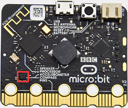

1\.  **Descripción**

La placa principal micro: bit main board V2 tiene integrado un sensor de aceleración gravitacional LSM303AGR, también conocido como acelerómetro, con una resolución de 8/10/12 bits. En la sección de código se establece el rango en 1g, 2g, 4g y 8g.

A menudo usamos un acelerómetro para detectar el estado de las máquinas.

En este proyecto, explicaremos cómo medir la posición de la placa con el acelerómetro. A continuación, examinaremos los datos originales de tres ejes que produce el acelerómetro.

2\.  **Preparación**

A. Conecte la placa micro:bit main board a su ordenador mediante el cable USB.

B. Abra la versión fuera de línea de Mu.

3\.  **Código de prueba1**

Abra el software Mu y abra el archivo “Three-axis acceleration sensor -1\.py“ para importar el código. También puede introducir el código usted mismo en la ventana de edición.

(**Nota: Todas las palabras y símbolos deben escribirse en inglés.**)

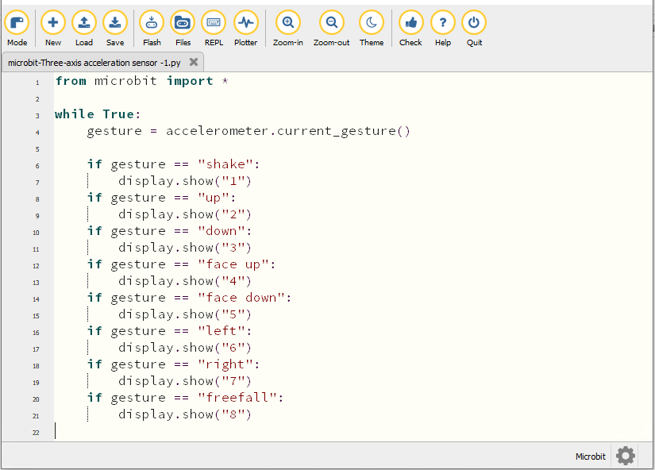

```python
from microbit import *

while True:
    gesture = accelerometer.current_gesture()

    if gesture == "shake":
        display.show("1")
    if gesture == "up":
        display.show("2")
    if gesture == "down":
        display.show("3")
    if gesture == "face up":
        display.show("4")
    if gesture == "face down":
        display.show("5")
    if gesture == "left":
        display.show("6")
    if gesture == "right":
        display.show("7")
    if gesture == "freefall":
        display.show("8")
```

Haga clic en “Check” para examinar errores en el código. El programa está mal si aparecen subrayados y cursores. 

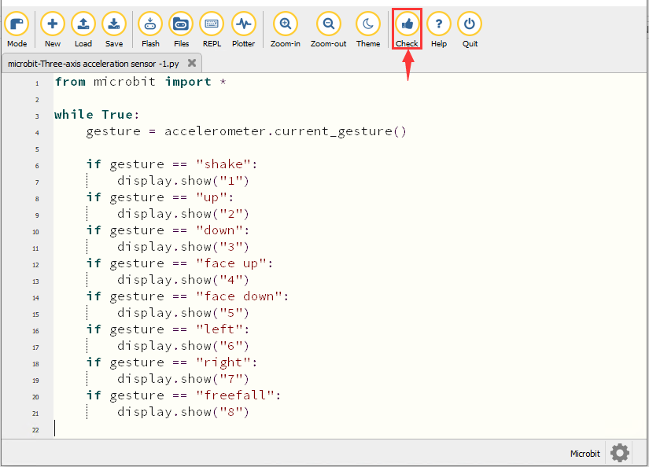

Si el código es correcto, conecte el micro:bit a su ordenador y haga clic en “Flash” para descargar el código a la placa micro:bit.

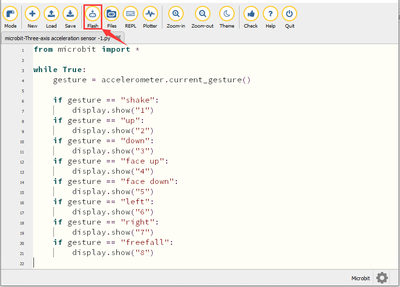

4\.  **Resultado de la prueba1**

Después de descargar el código en la placa con éxito, **alimente mediante el cable micro USB o una fuente de alimentación externa (ponga el interruptor DIP en ON)** y pulse el botón de reinicio en el micro:bit.


Cuando agitamos la micro: bit main board, sin importar la dirección, la matriz de LED muestra el dígito “1”.

Cuando se mantiene en posición vertical (coloque su logotipo por encima de la matriz LED), aparece el número 2.

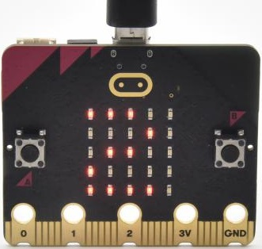

Cuando se mantiene boca abajo (coloque su logotipo debajo de la matriz LED), se muestra como a continuación.

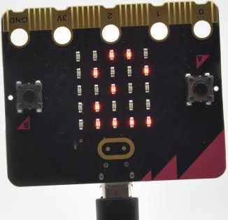

Cuando se coloca quieta sobre el escritorio, mostrando su lado frontal, aparece el número 4.

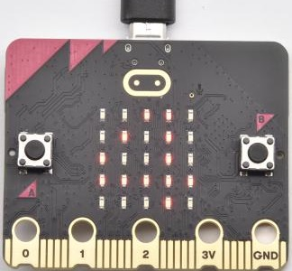

Cuando se coloca quieta sobre el escritorio, mostrando su lado posterior, aparece el número 5.

Cuando la placa se inclina hacia la izquierda, la matriz de LED muestra el número 6, como se muestra a continuación:

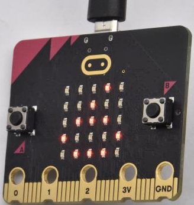

Cuando la placa se inclina hacia la derecha, la matriz de LED muestra el número 7, como se muestra a continuación：

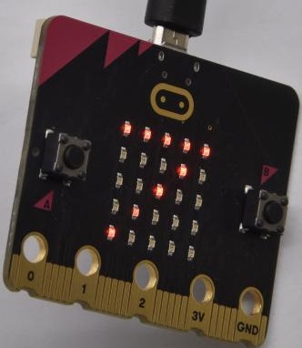

Cuando la placa es golpeada contra el suelo, este proceso puede considerarse una caída libre y la matriz de LED muestra el número 8. (Tenga en cuenta que no se recomienda realizar esta prueba ya que puede dañar la placa principal.)

**Atención: Si desea probar esta función, también puede establecer la aceleración en 3g, 6g u 8g.**

5\.  **Código de prueba2**

Abra el software Mu y abra el archivo “Three-axis acceleration sensor -2\.py“ para importar el código. También puede introducir el código usted mismo en la ventana de edición.

(**Nota: Todas las palabras y símbolos deben escribirse en inglés.**)

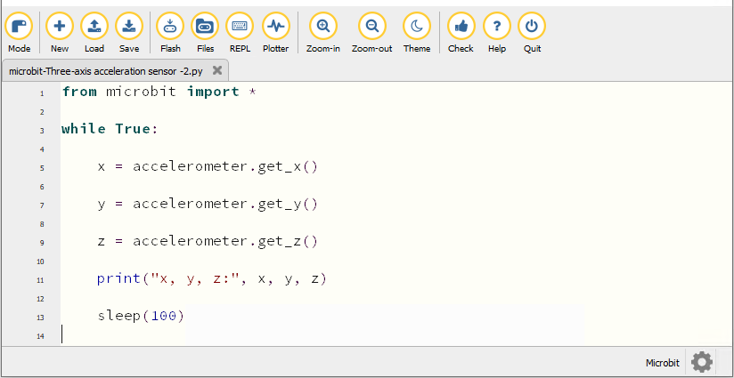

```python
from microbit import *

while True:

    x = accelerometer.get_x()

    y = accelerometer.get_y()

    z = accelerometer.get_z()

    print("x, y, z:", x, y, z)

    sleep(100)
```
Haga clic en “Check” para examinar errores en el código. El programa está mal si aparecen subrayados y cursores. 

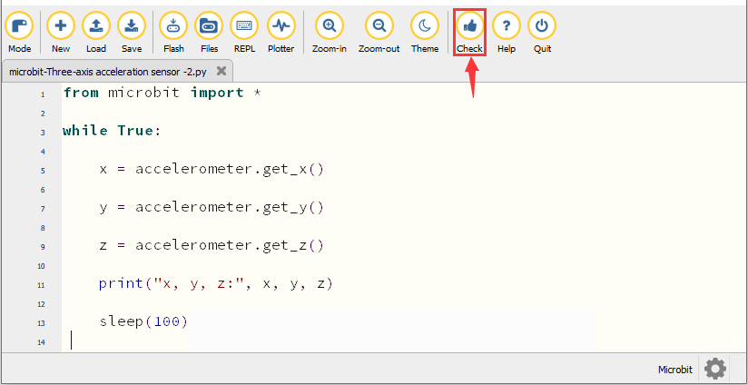

Si el código es correcto, conecte el micro:bit a su ordenador y haga clic en “Flash” para descargar el código a la placa micro:bit.

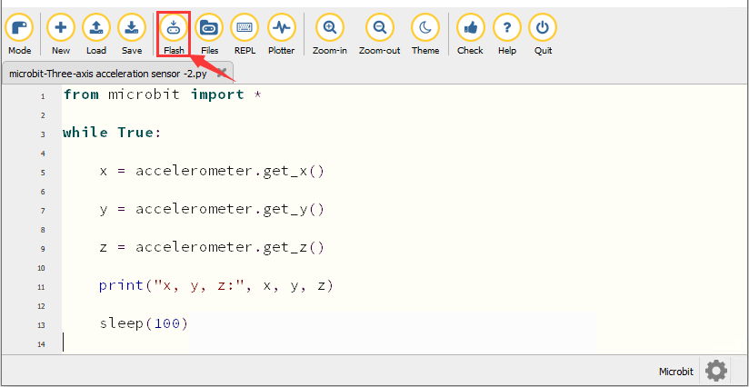

6\.  **Resultado de la prueba2**

Después de descargar el código en la placa con éxito, **alimente mediante el cable micro USB o una fuente de alimentación externa (ponga el interruptor DIP en ON)**. Haga clic en “REPL” y pulse el botón de reinicio en el micro:bit.


Entonces la ventana REPL mostrará los valores de la aceleración en el eje X, eje Y y eje Z que se muestran a continuación:

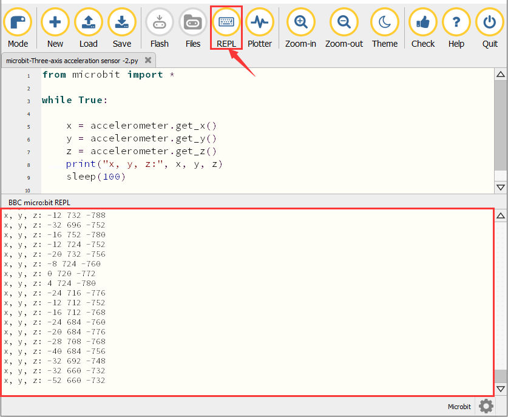

Tras consultar el manual de datos del MMA8653FC y el diagrama esquemático de hardware del micro: bit main board, las coordenadas del acelerómetro del micro: bit se muestran en la figura siguiente:

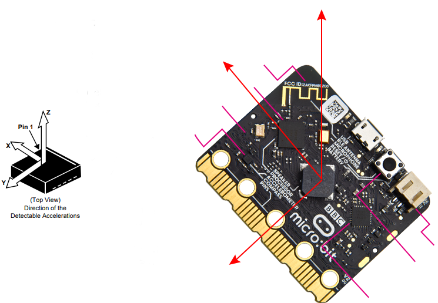

7\.  **Explicación del código**

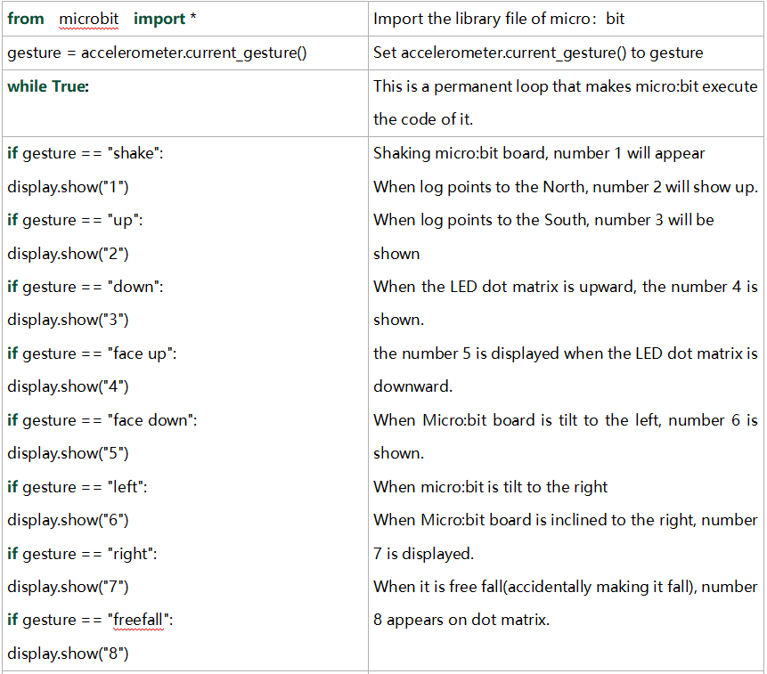

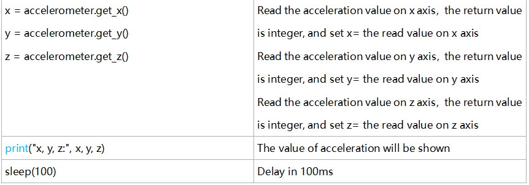

---