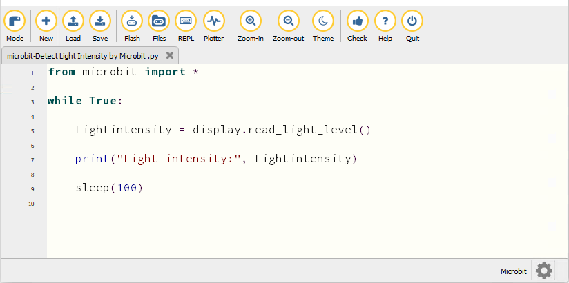
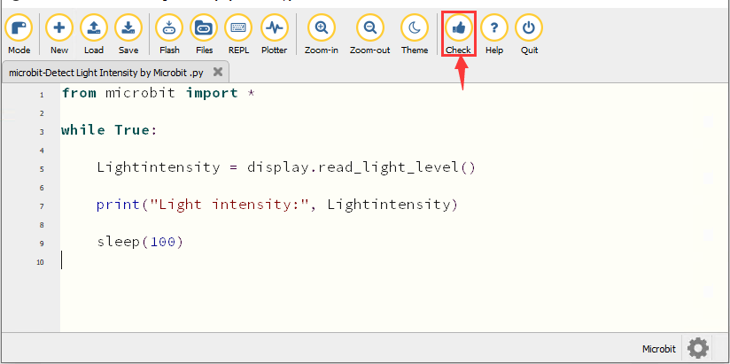
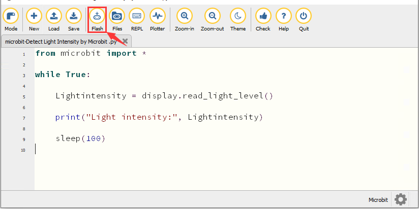
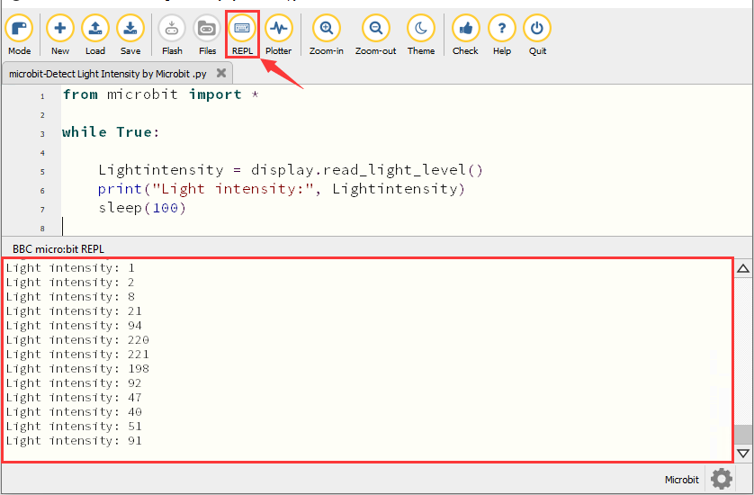
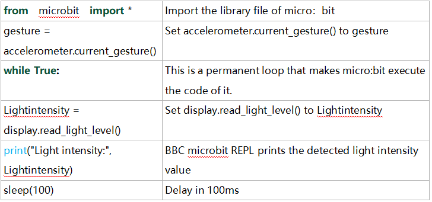

### Proyecto 8：Detección de luz


1\.  **Descripción**

En este proyecto nos centraremos en la función de detección de luz de la placa principal Micro: Bit. Se logra mediante la LED dot matrix ya que la placa principal no está equipada con una fotorresistencia.

2\.  **Preparación**

A. Conecte el micro:bit main board a su ordenador mediante el cable USB

B. Abra la versión fuera de línea de Mu.

3\.  **Código de prueba**

Abra el software Mu y abra el archivo “Detect Light Intensity by Microbit\.py” para importar el código. También puede introducir el código usted mismo en la ventana de edición.

(**Nota: Todas las palabras y símbolos en inglés deben escribirse en inglés.**)



```python
from microbit import *

while True:

    Lightintensity = display.read_light_level()

    print("Light intensity:", Lightintensity)

    sleep(100)
```
Haga clic en “Check” para examinar errores en el código. El programa se considera incorrecto si se muestran subrayados y cursores.



Si el código es correcto, conecte el micro:bit a su ordenador y haga clic en “Flash” para descargar el código en la placa micro:bit.



4\.  **Resultado de la prueba**

Después de descargar el código en la placa con éxito, **encienda la alimentación mediante el cable micro USB o una fuente de alimentación externa (turn the DIP switch to ON)**. Haga clic en “REPL” y pulse el botón de reinicio en el micro:bit.


A continuación, la ventana REPL mostrará el valor de la intensidad luminosa, como se muestra a continuación.

Cuando la LED dot matrix está cubierta con la mano, la intensidad luminosa mostrada es aproximadamente 0; cuando la LED dot matrix está expuesta a la luz, la intensidad luminosa mostrada aumenta con la luz.



5\.  **Explicación del código**



---