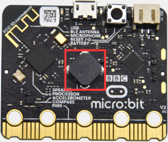
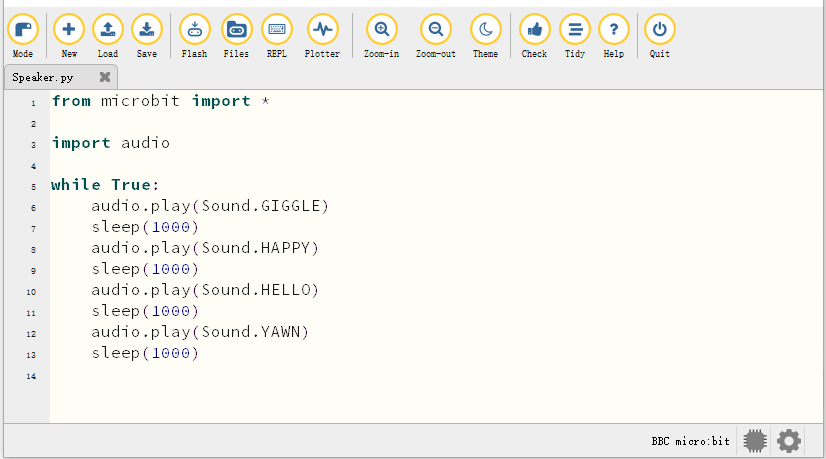
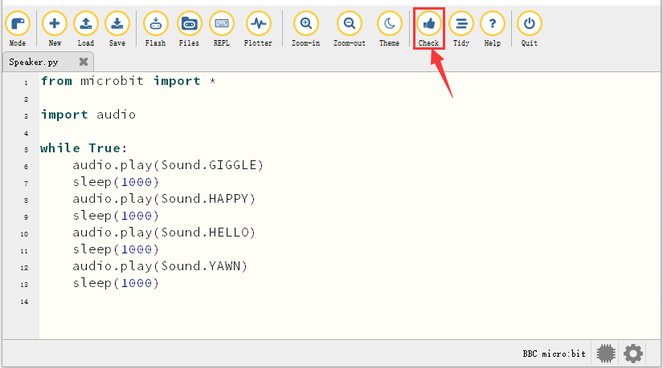
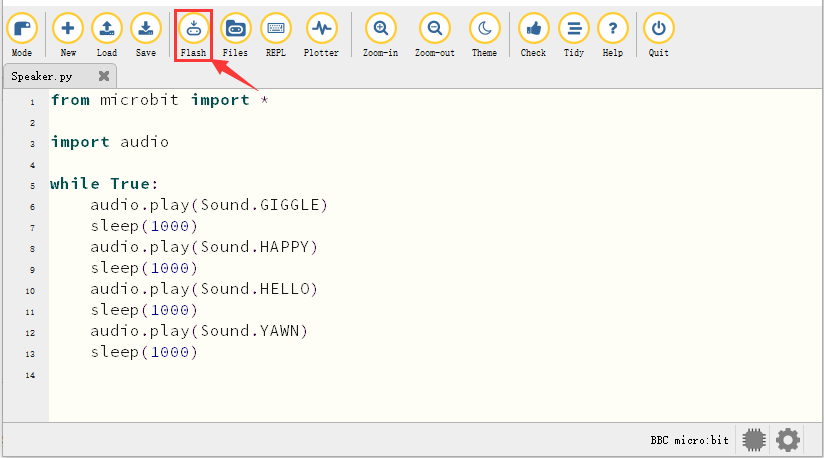
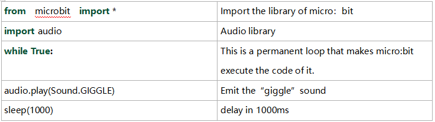

### Progetto 9: Altoparlante



1\.  **Descrizione**

La scheda principale micro:bit dispone di un altoparlante integrato, il che rende più semplice aggiungere suoni ai programmi. Può anche essere programmata per produrre ogni tipo di tono, ad esempio suonare il brano *Ode to Joy*.

2\.  **Preparazione**

A. Collegare la scheda principale micro:bit al computer tramite il cavo USB

B. Aprire la versione offline di Mu.

3\.  **Codice di test**

Aprire il software Mu e aprire il file “Speaker\.py” per importare il codice. È inoltre possibile inserire il codice direttamente nella finestra di modifica.

(**Nota: Tutte le parole e i simboli devono essere scritti in inglese**.)



```python
from microbit import *

import audio

display.show(Image.MUSIC_QUAVER)

while True:
    audio.play(Sound.GIGGLE)
    sleep(1000)
    audio.play(Sound.HAPPY)
    sleep(1000)
    audio.play(Sound.HELLO)
    sleep(1000)
    audio.play(Sound.YAWN)
    sleep(1000)
```

Fare clic su “Check” per esaminare gli errori nel codice. Il programma è considerato errato se vengono mostrati sottolineature e cursori.



Se il codice è corretto, collegare il micro:bit al computer e fare clic su “Flash” per scaricare il codice sulla scheda micro:bit.



4\.  **Risultato del test**

Dopo aver scaricato correttamente il codice sulla scheda, **alimentare tramite cavo micro USB o alimentazione esterna (portare l'interruttore DIP su ON)** e premere il pulsante di reset sul micro:bit.


 L'altoparlante emette un suono e la matrice a punti LED mostra il simbolo della musica.

5\.  **Spiegazione del codice**



---