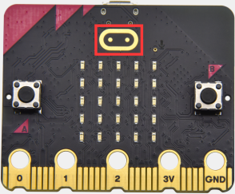
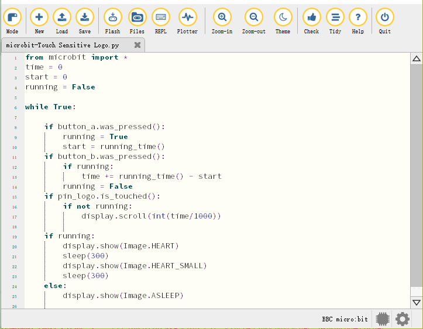
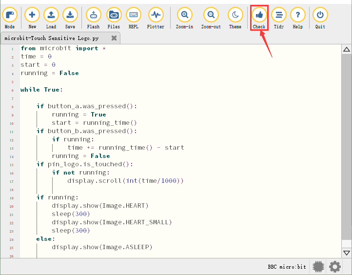
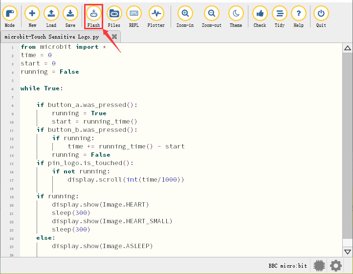

### Projekt 10: Berührungsempfindliches Logo



1\.  **Beschreibung**

Das micro:bit Hauptboard V2 ist mit einem goldenen, berührungsempfindlichen Logo ausgestattet, das als Eingangsbauteil wie ein Knopf fungieren kann.

Es enthält einen kapazitiven Berührungssensor, der beim Drücken (oder Berühren) kleine Änderungen im elektrischen Feld wahrnimmt, genau wie bei Ihrem Telefon- oder Tablet-Bildschirm. Wenn Sie es drücken, kann das Programm aktiviert werden.

2\.  **Vorbereitung**

A. Verbinden Sie das micro:bit Hauptboard über das USB-Kabel mit Ihrem Computer.

B. Öffnen Sie die Offline-Version von Mu.

3\.  **Testcode**

Starten Sie die Mu-Software und öffnen Sie die Datei “Touch-sensitive Logo\.py”, um den Code zu importieren. Sie können den Code auch selbst in das Bearbeitungsfenster eingeben.

(**Hinweis: Alle englischen Wörter und Symbole müssen in Englisch geschrieben sein**.)



```python
from microbit import *
time = 0
start = 0
running = False

while True:

    if button_a.was_pressed():
        running = True
        start = running_time()
    if button_b.was_pressed():
        if running:
            time += running_time() - start
        running = False
    if pin_logo.is_touched():
        if not running:
            display.scroll(int(time/1000))

    if running:
        display.show(Image.HEART)
        sleep(300)
        display.show(Image.HEART_SMALL)
        sleep(300)
    else:
        display.show(Image.ASLEEP)
```

**Wie funktioniert der Micro:bit?**

A\. Die Laufzeit wird in Millisekunden (ms) aufgezeichnet.

B\. Wenn Sie Taste A drücken, wird eine Variable namens start auf die aktuelle Laufzeit gesetzt.

C\. Wenn Sie Taste B drücken, wird die Startzeit von der neuen Laufzeit subtrahiert, um die seit dem Start der Stoppuhr verstrichene Zeit zu berechnen. Diese Differenz wird zur Gesamtzeit addiert, die in einer Variable namens time gespeichert ist.

D\. Wenn Sie das goldene Logo drücken, zeigt das Programm die insgesamt verstrichene Zeit auf der LED-Anzeige an. Es wandelt die Zeit von Millisekunden (Tausendstelsekunden) in Sekunden um, indem es durch 1000 teilt. Es verwendet den Ganzzahl-Operator, um ein ganzzahliges Ergebnis zu liefern.

E\. Das Programm wird außerdem durch eine boolesche Variable namens running gesteuert. Eine boolesche Variable hat nur zwei Werte: true oder false. Wenn "running" "true" ist, bedeutet das, dass die Stoppuhr gestartet wurde. Wenn "running" false ist, bedeutet das, dass die Stoppuhr nicht gestartet wurde oder gestoppt ist.

F\. Wenn "running" true ist, wird auf der LED-Matrix das Herzschlag-Muster angezeigt.

G\. (7) Wenn die Stoppuhr gestoppt ist und "running" false ist, zeigt das Drücken des goldenen Logos nur die Zeit an.

H\. Wenn die Stoppuhr gestartet wurde und "running" true ist, muss nur sichergestellt werden, dass sich die Variable time ändert, wenn Taste B gedrückt wird, und der Code kann auch Fehleingaben verhindern.

Klicken Sie auf “Check”, um Fehler im Code zu prüfen. Das Programm ist fehlerhaft, wenn Unterstreichungen und Cursor angezeigt werden.



Wenn der Code korrekt ist, verbinden Sie den micro:bit mit Ihrem Computer und klicken Sie auf “Flash”, um den Code auf das micro:bit-Board zu übertragen.



4\.  **Testergebnis**

Nachdem der Code erfolgreich auf das Board geladen wurde, **schalten Sie die Stromversorgung über das Micro-USB-Kabel oder eine externe Stromquelle ein (DIP-Schalter auf ON stellen)** und drücken Sie die Reset-Taste am micro:bit.


Drücken Sie Taste A, um die Stoppuhr zu starten. Während des Timings wird das Herzschlag-Muster auf der LED-Matrix angezeigt. Drücken Sie Taste B, um sie zu stoppen; Sie können sie jederzeit starten und stoppen.

Sie protokolliert die Zeit weiter, genau wie eine echte Stoppuhr. Drücken Sie das goldene Logo an der Vorderseite des micro:bit, um die gemessene Zeit in Sekunden anzuzeigen. Die Zeit kann durch Drücken der Reset-Taste auf der Rückseite auf Null zurückgesetzt werden.

---