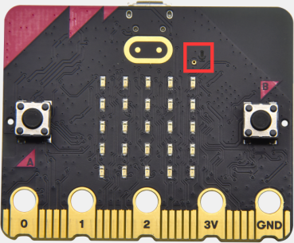
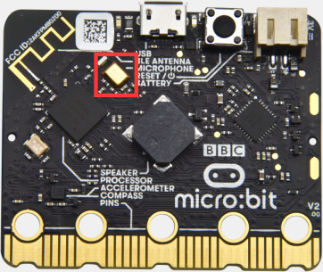
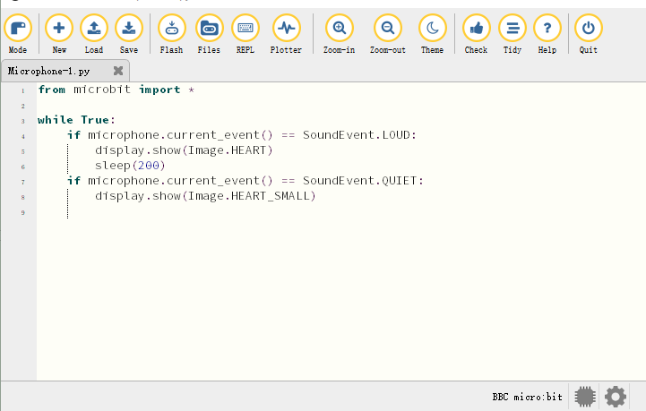
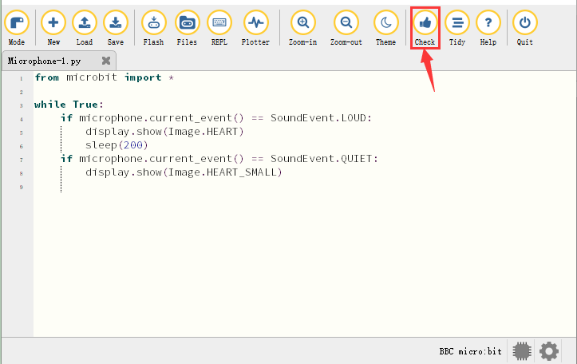
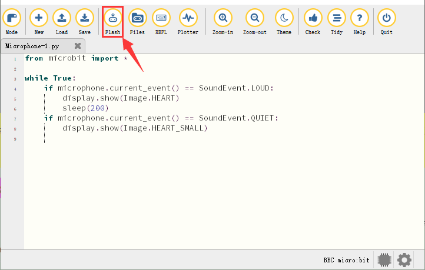
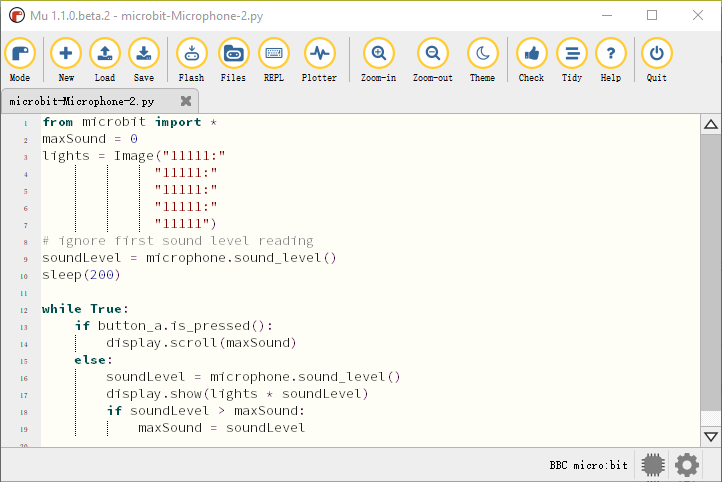
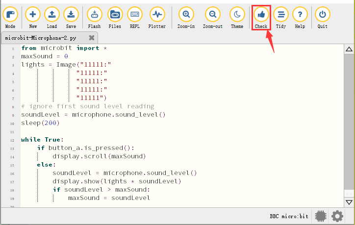
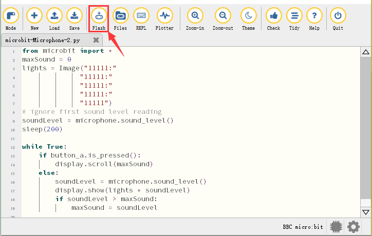
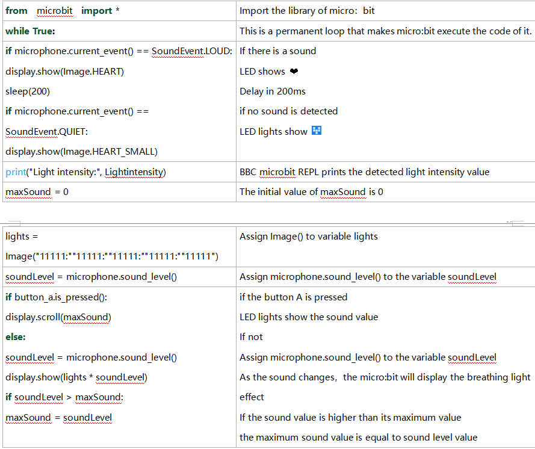

### プロジェクト11: マイク





1\.  **説明**

Micro: Bit メインボードにはマイクが内蔵されており、周囲の音量を測定できます。手を叩くとマイクのLEDインジケーターが点灯します。さらに、音の強さを測定できるため、騒音レベルの表示や音楽に合わせて変化するディスコ風の照明を作ることができます。

マイクはマイクのLEDインジケーターとは反対側に配置され、音が通るための穴の近くにあります。ボードが音を検出すると、LEDインジケーターが点灯します。

2\.  **準備**

A. USBケーブルで micro:bit メインボードをコンピュータに接続します

B. オフライン版の Mu を開きます。

3\.  **テストコード1**

Mu ソフトウェアを起動し、ファイル “Microphone-1\.py” を開いてコードを読み込みます。編集ウィンドウに自分でコードを入力することもできます。

(**注意: すべての単語と記号は英語で記述してください**.)



```python
from microbit import *

while True:
    if microphone.current_event() == SoundEvent.LOUD:
        display.show(Image.HEART)
        sleep(200)
    if microphone.current_event() == SoundEvent.QUIET:
        display.show(Image.HEART_SMALL)
```

“Check” をクリックしてコードのエラーを確認します。下線やカーソルが表示されている場合、プログラムに誤りがあります。 



コードが正しければ、micro:bit をコンピュータに接続し “Flash” をクリックしてコードを micro:bit ボードに書き込みます。



4\.  **テスト結果1**

コードをボードに正常にダウンロードしたら、**micro USB ケーブルまたは外部電源で電源を入れる（DIPスイッチを ON にする）**、その後 micro:bit のリセットボタンを押します。


周囲で手を叩くと LED ドットマトリクスは “❤” のパターンを表示し、静かなときはパターン  を表示します。

5\.  **テストコード2**

Mu ソフトウェアを起動し、ファイル “Microphone-2\.py” を開いてコードを読み込みます。編集ウィンドウに自分でコードを入力することもできます。

(**注意: すべての単語と記号は英語で記述してください。**)



```python
from microbit import *
maxSound = 0
lights = Image("11111:"
              "11111:"
              "11111:"
              "11111:"
              "11111")
# ignore first sound level reading
soundLevel = microphone.sound_level()
sleep(200)

while True:
    if button_a.is_pressed():
        display.scroll(maxSound)
    else:
        soundLevel = microphone.sound_level()
        display.show(lights * soundLevel)
        if soundLevel > maxSound:
            maxSound = soundLevel
```

“Check” をクリックしてコードのエラーを確認します。下線やカーソルが表示されている場合、プログラムに誤りがあります。 



コードが正しければ、micro:bit をコンピュータに接続し “Flash” をクリックしてコードを micro:bit ボードに書き込みます。



6\.  **テスト結果2**

コードをボードに正常にダウンロードしたら、**micro USB ケーブルまたは外部電源で電源を入れる（DIPスイッチを ON にする）**、その後 micro:bit のリセットボタンを押します。


ボタン A を押すと、LED ドットマトリクスに最大音量の値が表示されます（ **最大音量はボードの反対側にあるリセットボタンでリセットできることに注意してください**）。手を叩くと、測定された音が大きいほど、LED ドットマトリクス上の 25 個の LED がより明るく点灯します。

7\.  **コードの説明**

