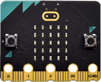
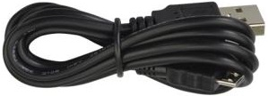
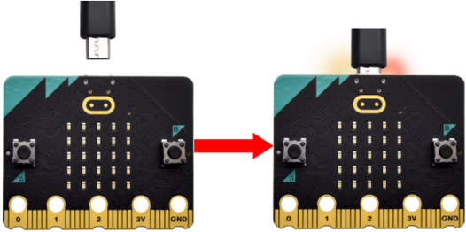
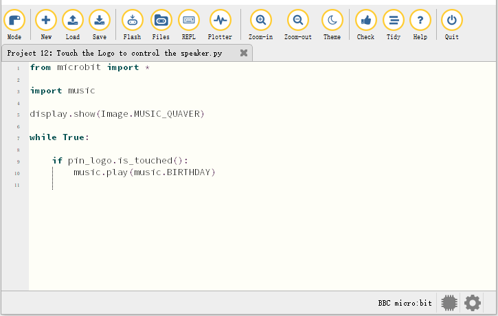
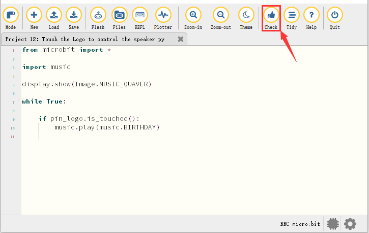
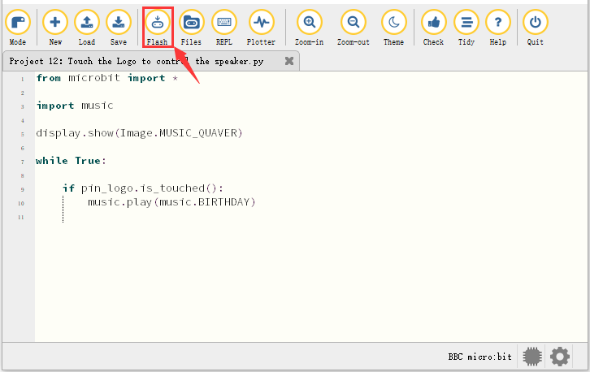
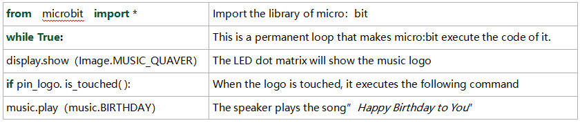

### Projet 12 : Contrôle du haut-parleur

1\.  **Description**

Dans les projets précédents, nous avons respectivement étudié le logo tactile et le haut-parleur. Dans ce projet, nous allons combiner ces deux composants pour jouer de la musique.

2\.  **Composants nécessaires**

|||
|-|-|
|Micro:bit main board \*1|USB cable\*1|


3\.  **Schéma de câblage**

Connectez le Micro:bit main board à votre ordinateur via le câble USB.



4\.  **Code de test**

Ouvrez le logiciel Mu et la fichier “Touch the Logo to control the speaker\.py” pour importer le code. Vous pouvez également saisir le code directement dans la fenêtre d’édition.

(**Remarque : Tous les mots et symboles doivent être écrits en anglais**.)



```python
from microbit import *

import music

display.show(Image.MUSIC_QUAVER)

while True:

    if pin_logo.is_touched():
        music.play(music.BIRTHDAY)
```

Cliquez sur “Check” pour vérifier les erreurs dans le code. Le programme est considéré incorrect si des soulignements et des curseurs apparaissent.



Si le code est correct, connectez le micro:bit à votre ordinateur et cliquez sur “Flash” pour télécharger le code sur la carte micro:bit.



5\.  **Résultat du test**

Après avoir téléchargé le code sur la carte avec succès, **alimentez via le câble micro USB ou une alimentation externe (placez l’interrupteur DIP sur ON)**, puis appuyez sur le bouton de réinitialisation du micro:bit.


Le haut-parleur joue la chanson « *Happy Birthday to You* » lorsque le logo est touché.

6\.  **Explication du code**



**Communication sans fil Bluetooth**

Le micro:bit possède un module Bluetooth basse consommation pour la communication, mais dispose de 16 Ko de RAM. Cependant, le tas/stack BLE occupe 12 Ko de RAM, il n’y a donc pas assez d’espace pour exécuter microPython.

Actuellement, microPython ne prend pas en charge le service Bluetooth.

[https://microbit-micropython.readthedocs.io/en/latest/ble.html](https://microbit-micropython.readthedocs.io/en/latest/ble.html)

Les projets précédents sont une introduction aux capteurs et aux modules. Les leçons suivantes sont plus difficiles pour les débutants.

(**Remarque : Afin d’éviter que la carte micro:bit ne soit endommagée, débranchez le câble micro USB et coupez l’alimentation de la micro:bit motor driver base plate avant de l’installer sur la carte d’extension voiture, et positionnez l’interrupteur POWER sur OFF. De même, avant de retirer la carte principale de la carte d’extension voiture, débranchez le câble micro USB et coupez l’alimentation de la micro:bit motor driver base plate.**)