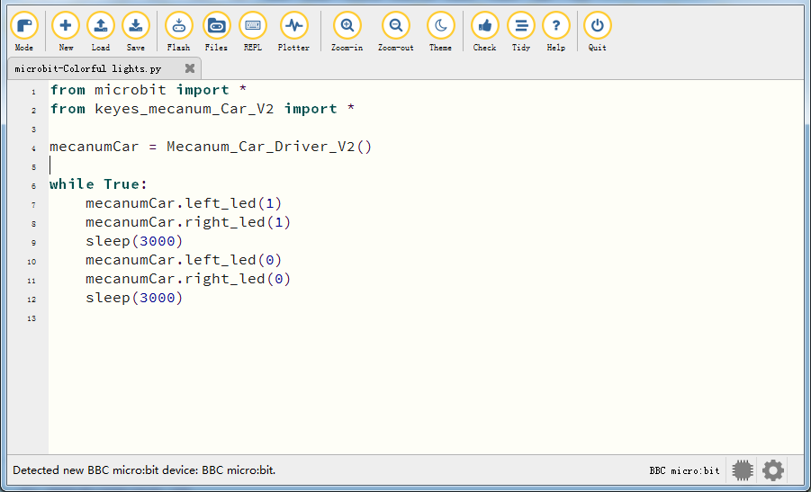
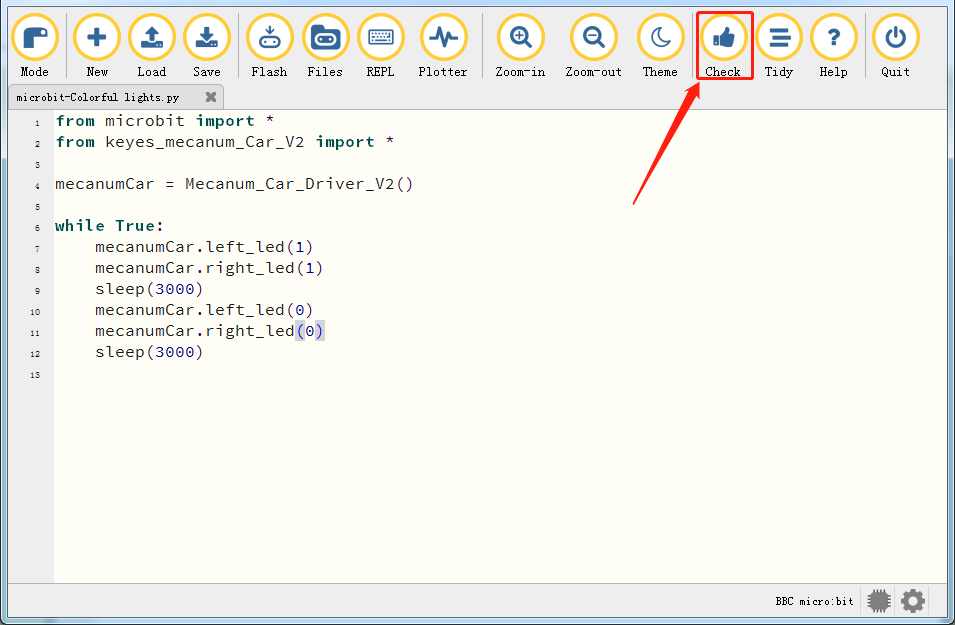
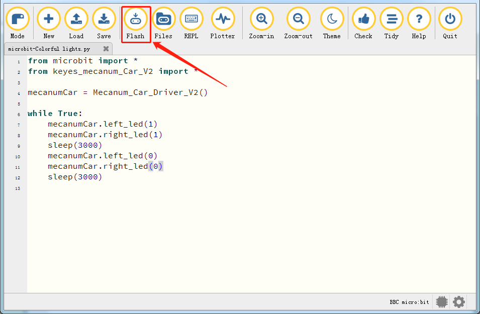
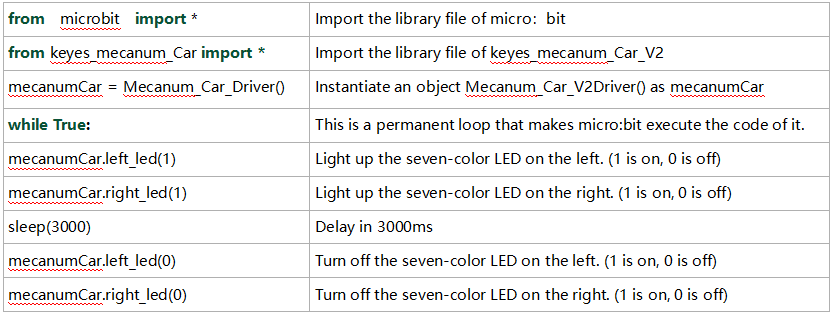

### Project 13: Seven-Color LED


1\.  **Description**

This module consists of a commonly used LED with 7colors but in whit ppearance. It can automatically flash different colors to creat antastic light effects when high level is input like a normal LED.

2\.  **Preparation**

- Insert the micro:bit board into the slot of keyestudio 4WD Mecanum Robot Car V2.0

- Place batteries into battery holder

- Dial power switch to ON end

- Connect the micro:bit to your computer via an USB cable

- Open the offline version of Mu.

3\.  **Test Code**

Enter Mu software and open the file“Colorful lights\.py”to import code. You can also input code in the editing window yourself.

(**Note: All words and symbols must be written in English**.)



```python
from microbit import *
from keyes_mecanum_Car_V2 import *

mecanumCar = Mecanum_Car_Driver_V2()

while True:
    mecanumCar.left_led(1)
    mecanumCar.right_led(1)
    sleep(3000)
    mecanumCar.left_led(0)
    mecanumCar.right_led(0)
    sleep(3000)
```

**Important Notice:** If the library file 'keyes_mecanum_Car_V2.py' has not yet been imported to the microbit board, it is essential to first import the library file to the microbit board. The method for importing the library can be found by clicking the link：[How to Import Library to Micro:bit](https://docs.keyestudio.com/projects/KS4034/en/latest/docs/Python/Python.html#how-mu-import-library-to-micro-bit) and following the instructions provided; otherwise, the code will not run.

After the library file is imported successfully, you also need to click the "Check" button to check the code. If a cursor or an underline appears on a certain line, then errors appear in the program.



However, during this process, the following prompt will appear even if there is no error in the code. These prompts are just warnings not the code error prompts. 


If the code is correct, connect the micro:bit to your computer and click“Flash”to download the code to the micro:bit board.



If errors appear after clicking the "Flash" button, please confirm whether you have imported the provided "keyes_mecanum_Car_V2.py" library file.

**Note:** Before programming with Micropython, you need to import the "keyes_mecanum_Car_V2.py" library file to the micro:bit. If you program with different micro:bit, the library file"keyes_mecanum_Car_V2.py" needs to be imported again to a new micro:bit.

4\. **Test Result**

After downloading the code to the board successfully, **external power supply(turn the DIP switch to ON)**,and press the reset button on micro:bit.


The seven-color LED will flash in 3s and then stop in 3s and repeat this pattern.

5\. **Code Explanation**


