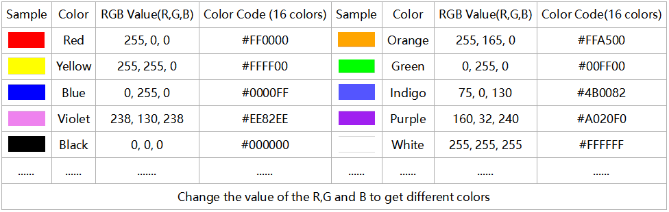
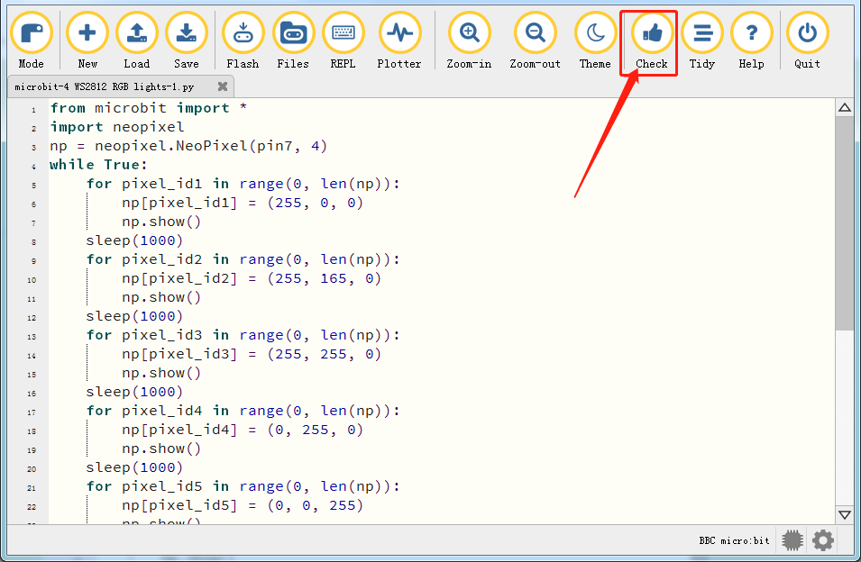
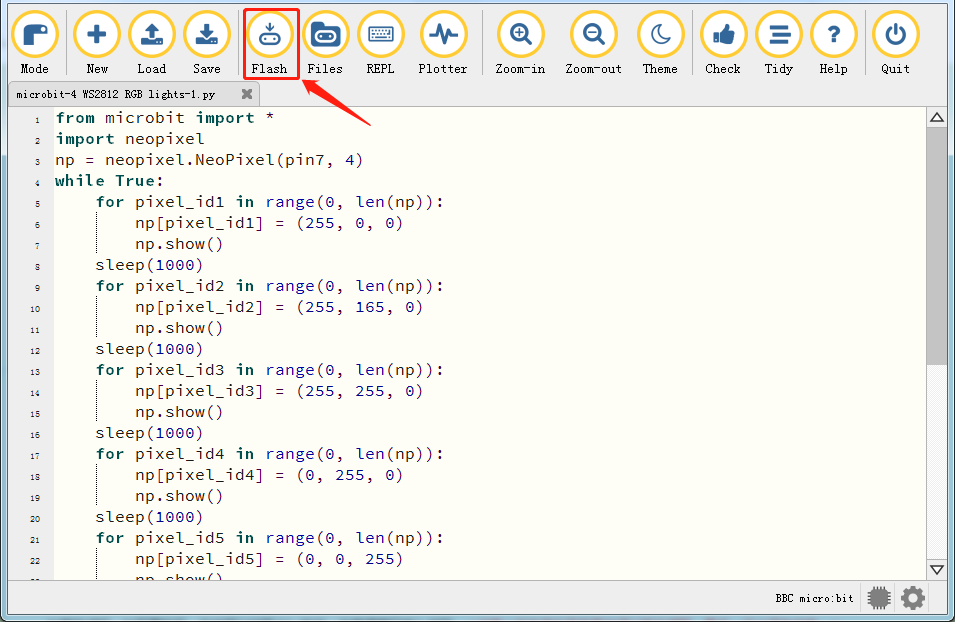
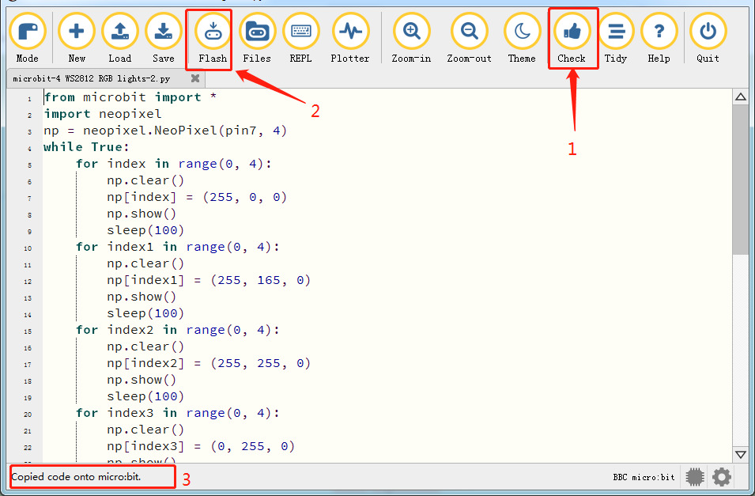
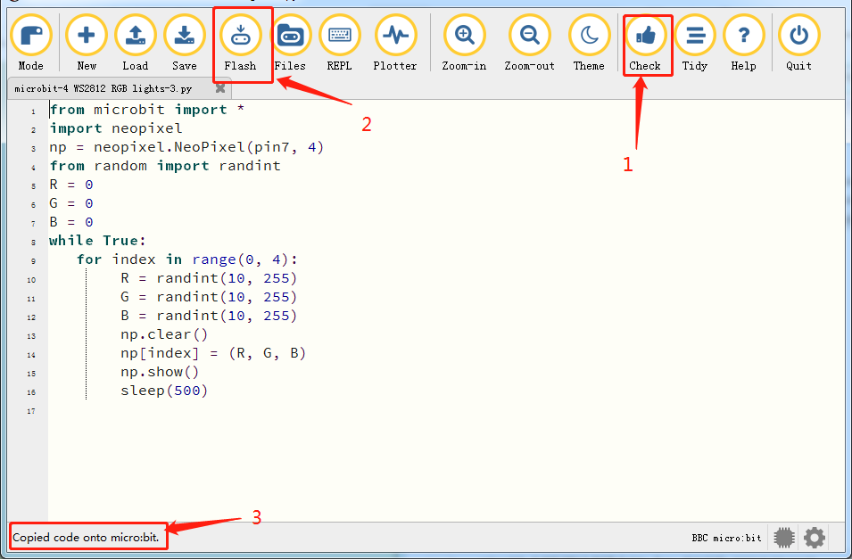
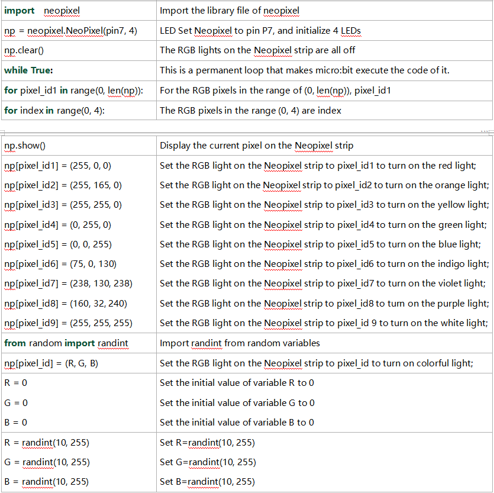

### Project 14: 4 WS2812 RGB LEDs


1\.  **Description**

The driver shield cooperates 4 pcs WS2812 RGB LEDs, compatible with micro:bit board and controlled by P7. In this lesson, we will make the RGB LEDs display different colors by P7. In this lesson, 3 sets of test code are provided to make the 4 WS2812 RGB LEDs display different effects.



2\.  **Preparation**

- Insert micro:bit board into the slot of keyestudio 4WD Mecanum Robot Car V2.0

- Place batteries into battery holder

- Dial power switch to ON end

- Connect the micro:bit to your computer via an USB cable

- Open the offline version of Mu.

3\.  **Test Code1**

Enter Mu software and open the file“4 WS2812 RGB LEDs-1\.py”to import code\ You can also input code in the edit window yourself.

(**Note: All English words and symbols must be written in English.**)

Click“Check”to examine errors in the code. The program proves wrong if underlines and cursors are shown. 



```python
from microbit import *
import neopixel
np = neopixel.NeoPixel(pin7, 4)
while True:
    for pixel_id1 in range(0, len(np)):
        np[pixel_id1] = (255, 0, 0)
        np.show()
    sleep(1000)
    for pixel_id2 in range(0, len(np)):
        np[pixel_id2] = (255, 165, 0)
        np.show()
    sleep(1000)
    for pixel_id3 in range(0, len(np)):
        np[pixel_id3] = (255, 255, 0)
        np.show()
    sleep(1000)
    for pixel_id4 in range(0, len(np)):
        np[pixel_id4] = (0, 255, 0)
        np.show()
    sleep(1000)
    for pixel_id5 in range(0, len(np)):
        np[pixel_id5] = (0, 0, 255)
        np.show()
    sleep(1000)
    for pixel_id6 in range(0, len(np)):
        np[pixel_id6] = (75, 0, 130)
        np.show()
    sleep(1000)
    for pixel_id7 in range(0, len(np)):
        np[pixel_id7] = (238, 130, 238)
        np.show()
    sleep(1000)
    for pixel_id8 in range(0, len(np)):
        np[pixel_id8] = (160, 32, 240)
        np.show()
    sleep(1000)
    for pixel_id9 in range(0, len(np)):
        np[pixel_id9] = (255, 255, 255)
    sleep(1000)
```

If the code is correct, connect the micro:bit to your computer and click“Flash”to download the code to the micro:bit board.



4\.  **Test Result1**

After downloading the code to the board successfully, **external power supply(turn the DIP switch to ON)**,and press the reset button on micro:bit.


The 4 WS2812RGB LEDs light up a different color a time cyclically.

5\.  **Test Code2**

Enter Mu software and open the file“4 WS2812 RGB LEDs-2\.py”to import code. You can also input code in the edit window yourself.

(**Note: All English words and symbols must be written in English**.)

Click“Check”to examine errors in the code. The program proves wrong if underlines and cursors are shown. 

If the code is correct, connect the micro:bit to your computer and click“Flash”to download the code to the micro:bit board.



```python
from microbit import *
import neopixel
np = neopixel.NeoPixel(pin7, 4)
while True:
    for index in range(0, 4):
        np.clear()
        np[index] = (255, 0, 0)
        np.show()
        sleep(100)
    for index1 in range(0, 4):
        np.clear()
        np[index1] = (255, 165, 0)
        np.show()
        sleep(100)
    for index2 in range(0, 4):
        np.clear()
        np[index2] = (255, 255, 0)
        np.show()
        sleep(100)
    for index3 in range(0, 4):
        np.clear()
        np[index3] = (0, 255, 0)
        np.show()
        sleep(100)
    for index4 in range(0, 4):
        np.clear()
        np[index4] = (0, 0, 255)
        np.show()
        sleep(100)
    for index5 in range(0, 4):
        np.clear()
        np[index5] = (75, 0, 130)
        np.show()
        sleep(100)
    for index6 in range(0, 4):
        np.clear()
        np[index6] = (238, 130, 238)
        np.show()
        sleep(100)
    for index7 in range(0, 4):
        np.clear()
        np[index7] = (160, 32, 240)
        np.show()
        sleep(100)
    for index8 in range(0, 4):
        np.clear()
        np[index8] = (255, 255, 255)
        np.show()
        sleep(100)
```

6\.  **Test Result2**

After downloading the code to the board successfully, **external power supply(turn the DIP switch to ON)**,and press the reset button on micro:bit.


The WS2812RGB LEDs display like a flow light.

7\.  **Test Code3**

Enter Mu software and open the file“4 WS2812 RGB LEDs-3\.py”to import code. You can also input code in the edit window yourself.

(**Note: All English words and symbols must be written in English.**)

Click“Check”to examine errors in the code. The program proves wrong if underlines and cursors are shown. 

If the code is correct, connect the micro:bit to your computer and click“Flash”to download the code to the micro:bit board.



```python
from microbit import *
import neopixel
np = neopixel.NeoPixel(pin7, 4)
from random import randint
R = 0
G = 0
B = 0
while True:
   for index in range(0, 4):
        R = randint(10, 255)
        G = randint(10, 255)
        B = randint(10, 255)
        np.clear()
        np[index] = (R, G, B)
        np.show()
        sleep(500)
```

8\.  **Test Result3**

After downloading the code to the board successfully, **external power supply(turn the DIP switch to ON)**,and press the reset button on micro:bit.


Every WS2812RGB light shows random color one by one.

5\.  **Code Explanation**


