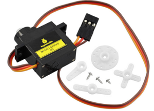
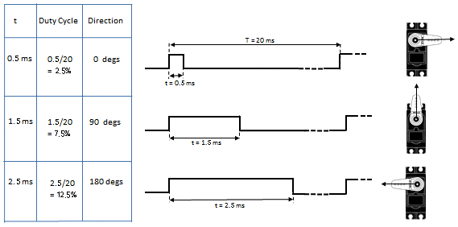
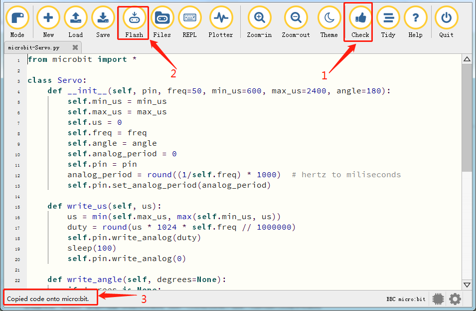

### Project 15：Servo



1\.  **Beschrijving**

DIY slimme auto's bevatten meestal een functie voor automatisch obstakels vermijden. Tijdens het zelf bouwen hebben we een servo nodig om de ultrasone module links en rechts te laten draaien en vervolgens de afstand tussen de auto en het obstakel te detecteren, zodat de auto het obstakel kan vermijden.

Als andere microcontrollers worden gebruikt om de servo te sturen, moeten bepaalde frequentie en pulsbreedte worden ingesteld om de servohoek te regelen. Als het micro:bit-hoofdboard wordt gebruikt om de servohoek te regelen, hoeft u alleen de stuurrichting/hoek in de ontwikkelomgeving in te stellen; het corresponderende puls signaal wordt dan automatisch gegenereerd om de servo te besturen. In dit project leert u hoe u de servo heen en weer laat draaien tussen 0° en 90°.

Een servomotor is een positionele roterende actuator, die voornamelijk bestaat uit behuizing, printplaat, coreless motor, tandwiel en positietransducer. Het werkingsprincipe is dat de servo het door de MCU of ontvanger verzonden signaal ontvangt, een referentiesignaal met een periode van 20 ms en een breedte van 1,5 ms genereert, en vervolgens de verkregen DC-voorspanning vergelijkt met de spanning van de potentiometer en het spanningsverschil als uitgang levert.

Voor de in dit project gebruikte servo is de bruine draad aarde (GND), de rode draad is de positieve voeding en de oranje draad is de signaaldraad.


2\.  **Informatie over de Servo**

De rotatiehoek van een servomotor wordt geregeld door het duty-cycle van een PWM (Pulse-Width Modulation) signaal te reguleren. De standaardcyclus van het PWM-signaal is 20 ms (50 Hz). Theoretisch ligt de pulsbreedte tussen 1 ms en 2 ms, maar in de praktijk is het tussen 0,5 ms en 2,5 ms. De breedte komt overeen met de rotatiehoek van 0° tot 180°. Houd er rekening mee dat hetzelfde signaal bij verschillende merken motoren tot andere rotatiehoeken kan leiden.



Na meting ligt het pulsbereik van de servo tussen 0,65 ms en 2,5 ms. Voor een 180 graden servo is de corresponderende besturingsrelatie als volgt:


|Time on High Level|Angle of the Servo|Reference Signal Cycle Time（20ms）|
|-|-|-|
|0.65ms|0 degree|0.65ms high level+19.35ms low level|
|1.5ms|90 degrees|1.5ms high level+18.5ms low level|
|2.5ms|180degrees|2.5ms high level+17.5ms low level|


3\.  **Parameters**

- Werks spanning: DC 4.8V ~ 6V

- Werkhoek bereik: ongeveer 180 ° (bij 500 → 2500 μsec)

- Afmeting: 22.9\*12.2\*30mm

- Pulsbreedte bereik: 500 → 2500 μsec

- Onbelast snelheid: 0.12 ± 0.01 sec / 60 (DC 4.8V), 0.1 ± 0.01 sec / 60 (DC 6V)

- Onbelast stroom: 200 ± 20mA (DC 4.8V), 220 ± 20mA (DC 6V)

- Houdmoment: 1.3 ± 0.01kg · cm (DC 4.8V), 1.5 ± 0.1kg · cm (DC 6V)

- Stopstroom: ≦ 850mA (DC 4.8V) ≦ 1000mA (DC 6V)

- Standby-stroom: 3 ± 1mA (DC 4.8V), 4 ± 1mA (DC 6V)

- Gewicht: 9±1g (zonder servohorn)

- Werkingstemperatuur: -30℃~60℃

**Let op: gebruik geen computer als voeding, want als de stroomvraag groter is dan 500 mA kan de servo doorbranden. Het wordt aanbevolen een externe batterij te gebruiken voor voeding.**

4\.  **Voorbereiding**

- Plaats de micro:bit-board in de sleuf van de keyestudio 4WD Mecanum Robot Car V2.0

- Plaats batterijen in de batterijhouder

- Zet de voeding schakelaar op ON

- Verbind micro:bit met de computer via een USB-kabel

- Open de offline versie van Mu.

5\.  **Testcode**

Open de Mu-software en open het bestand “Servo\.py” om de code te laden. U kunt de code ook zelf in het bewerkingsvenster invoeren.

(**Opmerking: alle Engelse woorden en symbolen moeten in het Engels worden geschreven**.)

Klik op “Check” om fouten in de code te controleren. Het programma is fout als er onderstrepingen en cursors worden weergegeven.

Als de code correct is, sluit u de micro:bit op uw computer aan en klikt u op “Flash” om de code naar de micro:bit-board te downloaden.



```python
from microbit import *

class Servo:
    def __init__(self, pin, freq=50, min_us=600, max_us=2400, angle=180):
        self.min_us = min_us
        self.max_us = max_us
        self.us = 0
        self.freq = freq
        self.angle = angle
        self.analog_period = 0
        self.pin = pin
        analog_period = round((1/self.freq) * 1000)  # hertz to miliseconds
        self.pin.set_analog_period(analog_period)

    def write_us(self, us):
        us = min(self.max_us, max(self.min_us, us))
        duty = round(us * 1024 * self.freq // 1000000)
        self.pin.write_analog(duty)
        sleep(100)
        self.pin.write_analog(0)

    def write_angle(self, degrees=None):
        if degrees is None:
            degrees = math.degrees(radians)
        degrees = degrees % 360
        total_range = self.max_us - self.min_us
        us = self.min_us + total_range * degrees // self.angle
        self.write_us(us)

Servo(pin14).write_angle(0)
display.show(Image.HAPPY)

while True:
        Servo(pin14).write_angle(0)
        sleep(1000)
        Servo(pin14).write_angle(45)
        sleep(1000)
        Servo(pin14).write_angle(90)
        sleep(1000)
        Servo(pin14).write_angle(135)
        sleep(1000)
        Servo(pin14).write_angle(180)
        sleep(1000)

```

4\.  **Testresultaat**

Nadat de code met succes naar de board is gedownload, **externe voeding inschakelen (zet de DIP-schakelaar op ON)** en druk op de resetknop van de micro:bit.


De LED-dotmatrix toont een glimlachend patroon en de servo draait volgens het patroon 0°~45°~90°~135°~180°~0°.

---