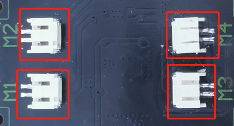
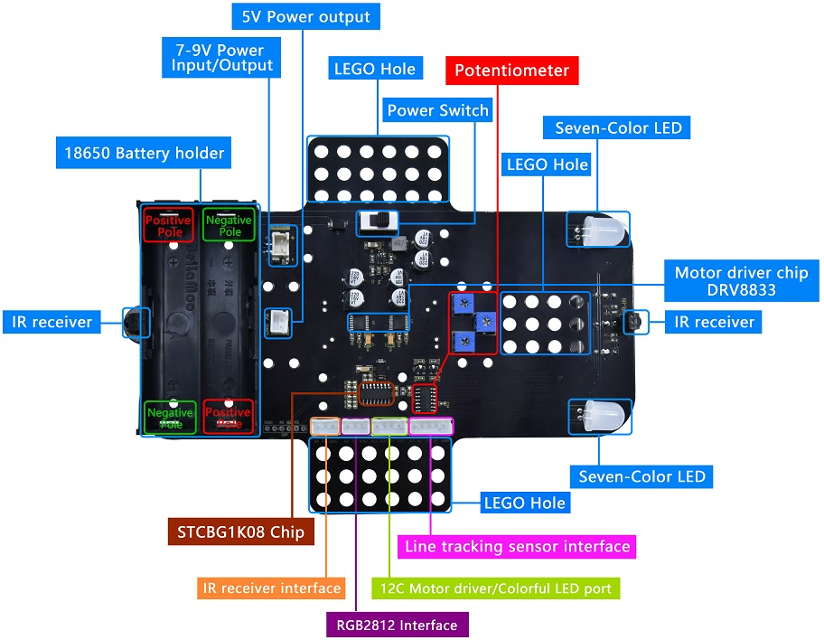
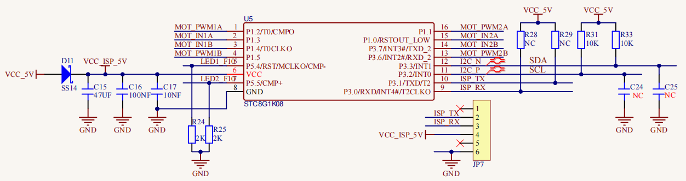
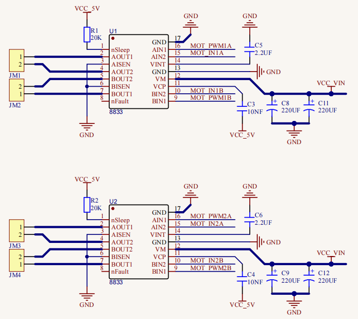
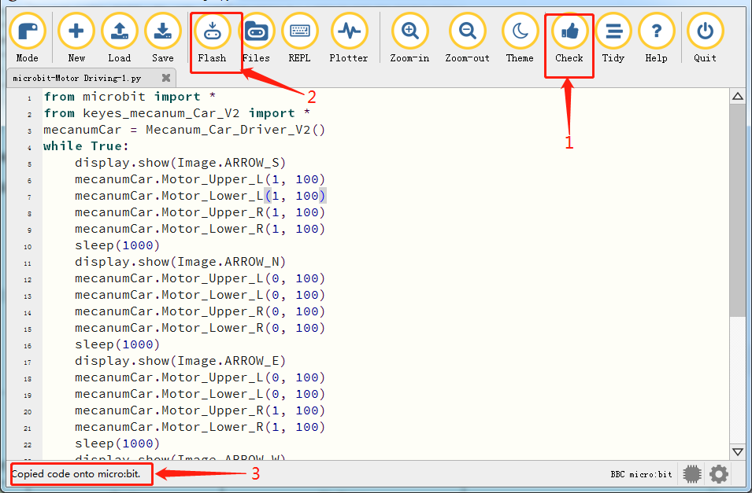
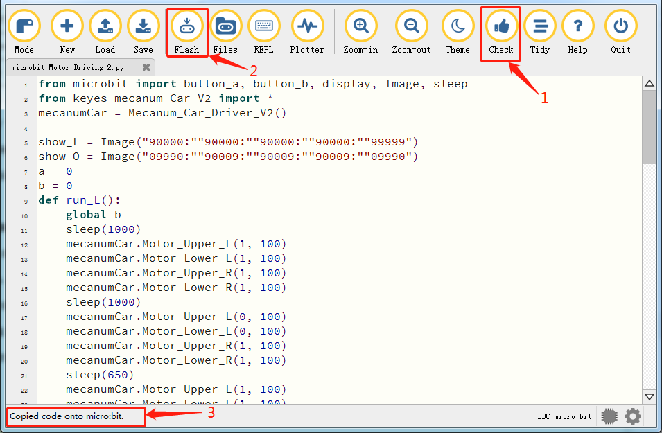
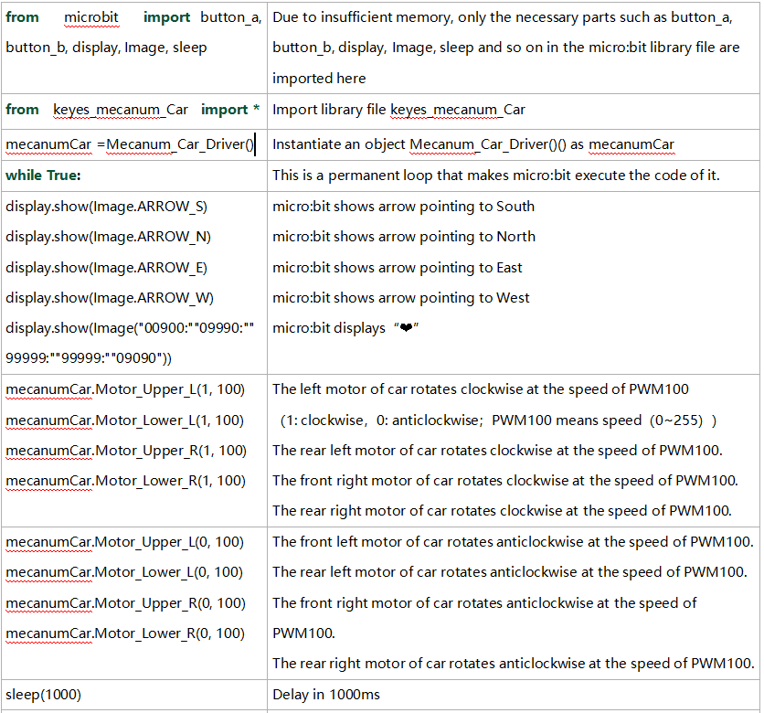
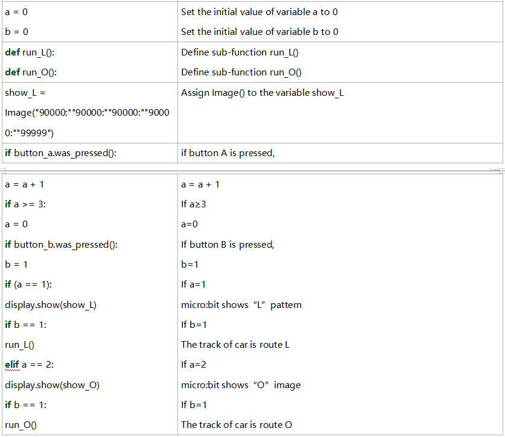

### Project 16：Motor



1\.  **Beschrijving**

De Keyestudio 4WD Mecanum Robot Car is uitgerust met 4 DC-reductiemotoren, ook wel tandwielreductiemotoren genoemd, die zijn ontwikkeld op basis van gewone DC-motoren. Ze hebben een bijpassende tandwielreductiekast die zorgt voor een lagere snelheid maar een groter koppel. Bovendien kunnen verschillende reductieverhoudingen van de kast verschillende snelheden en koppels leveren.

Tandwielmotor is de integratie van tandwielkast en motor, en wordt veel toegepast in staal- en machine-industrie.

De micro:bit motor driver shield is uitgerust met een STC8G- en HR8833-chip. Om de IO-poortbronnen te besparen, regelen we de draairichting en snelheid van 4 DC tandwielmotoren met de HR8833-chip.

**Details over de chips:**



Voorkant


Achterkant



STC8G1K08 chip schakeling



HR8833 motorstuur-schakeling

2\. **Voorbereiding**

- Steek de micro:bit board in de sleuf van de keyestudio 4WD Mecanum Robot Car V2.0

- Plaats batterijen in de batterijhouder

- Zet de stroomschakelaar in de ON-stand

- Verbind de micro:bit met de computer via een USB-kabel

- Open de offline versie van Mu.

3\. **Testcode 1**

Open de Mu-software en open het bestand “microbit-Motor Driving-1.py” om de code te importeren. Je kunt de code ook zelf in het bewerkingsvenster invoeren.

(**Opmerking: Alle Engelse woorden en symbolen moeten in het Engels worden geschreven**.)

Klik op “Files” om het bibliotheekbestand “keyes_mecanum_Car.py” naar de micro:bit te importeren.

Klik op “Check” om fouten in de code te controleren. Het programma bevat fouten als onderstrepingen en cursors worden weergegeven.

Als de code correct is, verbind de micro:bit met je computer en klik op “Flash” om de code naar de micro:bit te downloaden.



```python
from microbit import *
from keyes_mecanum_Car_V2 import *
mecanumCar = Mecanum_Car_Driver_V2()
while True:
    display.show(Image.ARROW_S)
    mecanumCar.Motor_Upper_L(1, 100)
    mecanumCar.Motor_Lower_L(1, 100)
    mecanumCar.Motor_Upper_R(1, 100)
    mecanumCar.Motor_Lower_R(1, 100)
    sleep(1000)
    display.show(Image.ARROW_N)
    mecanumCar.Motor_Upper_L(0, 100)
    mecanumCar.Motor_Lower_L(0, 100)
    mecanumCar.Motor_Upper_R(0, 100)
    mecanumCar.Motor_Lower_R(0, 100)
    sleep(1000)
    display.show(Image.ARROW_E)
    mecanumCar.Motor_Upper_L(0, 100)
    mecanumCar.Motor_Lower_L(0, 100)
    mecanumCar.Motor_Upper_R(1, 100)
    mecanumCar.Motor_Lower_R(1, 100)
    sleep(1000)
    display.show(Image.ARROW_W)
    mecanumCar.Motor_Upper_L(1, 100)
    mecanumCar.Motor_Lower_L(1, 100)
    mecanumCar.Motor_Upper_R(0, 100)
    mecanumCar.Motor_Lower_R(0, 100)
    sleep(1000)
    display.show(Image("00900:""09990:""99999:""99999:""09090"))
    mecanumCar.Motor_Upper_L(0, 0)
    mecanumCar.Motor_Lower_L(0, 0)
    mecanumCar.Motor_Upper_R(0, 0)
    mecanumCar.Motor_Lower_R(0, 0)
    sleep(1000)
```

4\. **Testresultaat 1**

Na het succesvol downloaden van de code naar de board, **schakel de externe voeding in (zet de DIP-schakelaar op ON)** en druk op de resetknop van de micro:bit.


De auto rijdt vervolgens 1 s vooruit, 1 s achteruit, 1 s naar links, 1 s naar rechts, 1 s tegen de klok in, 1 s met de klok mee en stopt 1 s. De LED-matrix toont ook de patronen.

5\. **Testcode 2**

Open de Mu-software en open het bestand “microbit-Motor Driving-2.py” om de code te importeren. Je kunt de code ook zelf in het bewerkingsvenster invoeren.

(**Opmerking: Alle Engelse woorden en symbolen moeten in het Engels worden geschreven**.)

Klik op “Files” om het bibliotheekbestand “keyes_mecanum_Car.py” naar de micro:bit te importeren.

Klik op “Check” om fouten in de code te controleren. Het programma bevat fouten als onderstrepingen en cursors worden weergegeven.

Als de code correct is, verbind de micro:bit met je computer en klik op “Flash” om de code naar de micro:bit te downloaden.



```python
from microbit import button_a, button_b, display, Image, sleep
from keyes_mecanum_Car_V2 import *
mecanumCar = Mecanum_Car_Driver_V2()

show_L = Image("90000:""90000:""90000:""90000:""99999")
show_O = Image("09990:""90009:""90009:""90009:""09990")
a = 0
b = 0
def run_L():
    global b
    sleep(1000)
    mecanumCar.Motor_Upper_L(1, 100)
    mecanumCar.Motor_Lower_L(1, 100)
    mecanumCar.Motor_Upper_R(1, 100)
    mecanumCar.Motor_Lower_R(1, 100)
    sleep(1000)
    mecanumCar.Motor_Upper_L(0, 100)
    mecanumCar.Motor_Lower_L(0, 100)
    mecanumCar.Motor_Upper_R(1, 100)
    mecanumCar.Motor_Lower_R(1, 100)
    sleep(650)
    mecanumCar.Motor_Upper_L(1, 100)
    mecanumCar.Motor_Lower_L(1, 100)
    mecanumCar.Motor_Upper_R(1, 100)
    mecanumCar.Motor_Lower_R(1, 100)
    sleep(1000)
    mecanumCar.Motor_Upper_L(0, 0)
    mecanumCar.Motor_Lower_L(0, 0)
    mecanumCar.Motor_Upper_R(0, 0)
    mecanumCar.Motor_Lower_R(0, 0)
    b = 0
def run_O():
    global b
    sleep(1000)
    mecanumCar.Motor_Upper_L(1, 100)
    mecanumCar.Motor_Lower_L(1, 100)
    mecanumCar.Motor_Upper_R(1, 100)
    mecanumCar.Motor_Lower_R(1, 100)
    sleep(1000)
    mecanumCar.Motor_Upper_L(0, 100)
    mecanumCar.Motor_Lower_L(0, 100)
    mecanumCar.Motor_Upper_R(1, 100)
    mecanumCar.Motor_Lower_R(1, 100)
    sleep(620)
    mecanumCar.Motor_Upper_L(1, 100)
    mecanumCar.Motor_Lower_L(1, 100)
    mecanumCar.Motor_Upper_R(1, 100)
    mecanumCar.Motor_Lower_R(1, 100)
    sleep(1000)
    mecanumCar.Motor_Upper_L(0, 100)
    mecanumCar.Motor_Lower_L(0, 100)
    mecanumCar.Motor_Upper_R(1, 100)
    mecanumCar.Motor_Lower_R(1, 100)
    sleep(620)
    mecanumCar.Motor_Upper_L(1, 100)
    mecanumCar.Motor_Lower_L(1, 100)
    mecanumCar.Motor_Upper_R(1, 100)
    mecanumCar.Motor_Lower_R(1, 100)
    sleep(1000)
    mecanumCar.Motor_Upper_L(0, 0)
    mecanumCar.Motor_Lower_L(0, 0)
    mecanumCar.Motor_Upper_R(0, 0)
    mecanumCar.Motor_Lower_R(0, 0)
    b = 0
while True:
    if button_a.was_pressed():
        a = a + 1
        if a >= 3:
            a = 0
    if button_b.was_pressed():
        b = 1
    if (a == 1):
        display.show(show_L)
        if b == 1:
            run_L()
    elif a == 2:
        display.show(show_O)
        if b == 1:
            run_O()
```

6\. **Testresultaat 2**

Na het succesvol downloaden van de code naar de board, **schakel de externe voeding in (zet de DIP-schakelaar op ON)** en druk op de resetknop van de micro:bit.


Wanneer knop A en B voor de eerste keer worden ingedrukt, toont de micro:bit “L” en is de route van de auto “L”. Wanneer ze opnieuw worden ingedrukt, verschijnt “口” op de micro:bit en is de route van de auto “口”. De auto herhaalt dit patroon.

7\.  **Code-uitleg**



