### Projet 17：Capteur de suivi de ligne

#### Projet 17.1：Détecter le capteur de suivi de ligne

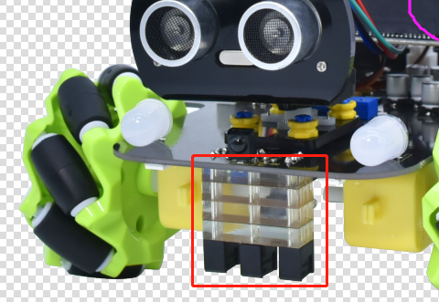

1\. **Description**

La carte driver de moteurs du Keyestudio 4WD Mecanum Robot Car est fournie avec un capteur de suivi de ligne 3 canaux, qui utilise des tubes IR TCRT5000 et 3 potentiomètres.

Le tube IR TCRT5000 contient un émetteur IR et un récepteur IR. Lorsque les signaux infrarouges de l’émetteur sont reçus par le récepteur via réflexion, la résistance du récepteur change, ce qui se traduit généralement par une variation de tension sur le circuit.

La résistance varie en fonction de l’intensité des signaux infrarouges reçus par le récepteur, ce qui dépend souvent de la couleur de la surface réfléchissante et de la distance entre la surface réfléchissante et le récepteur. Lors de la détection, le noir correspond à actif niveau haut et le blanc à actif niveau bas.

2\. **Principe de fonctionnement**

Lorsque la voiture roule sur une route blanche, le tube émetteur IR installé sous la voiture émet des signaux infrarouges pour détecter la route et le récepteur recevra les signaux renvoyés. Ensuite la sortie fournit un niveau bas (0) ; lorsqu’il détecte une ligne noire, il fournit un niveau haut (1).

Le port intégré du capteur de suivi 3 canaux sur le 4WD Mecanum Robot Car est connecté au port de collecte G, 5V, P10, P4 et P3 sur la carte d’extension micro:bit, et est contrôlé par P10, P4 et P3 du micro:bit. La paire infrarouge TCRT5000 gauche sur le capteur est contrôlée par P3, la centrale par P4 et la droite par P10.

Après avoir placé un papier blanc sous le 4WD Mecanum Robot Car, nous ferons tourner les potentiomètres sur le capteur de suivi 3 voies. Lorsque la LED témoin sur le module capteur est allumée, soulevez la voiture pour séparer les deux roues du 4WD Mecanum Robot Car. La hauteur du papier blanc est d’environ 1,5 cm ; quand la LED témoin sur le module capteur est éteinte, ajustez alors la sensibilité.

**Remarque que puisque la matrice de points 5*5 utilise les broches P3 P4 P6 P7 P10, nous devons désactiver la fonction de la matrice de points lorsque nous utilisons le capteur de suivi de ligne.**

3\. **Préparation**

- Insérer la carte micro:bit dans l’emplacement du keyestudio 4WD Mecanum Robot Car V2.0

- Placer des piles dans le porte-piles

- Mettre l’interrupteur d’alimentation sur ON

- Connecter le micro:bit à l’ordinateur via un câble USB

- Ouvrir la version hors-ligne de Mu.

4\. **Code de test**

Entrez dans le logiciel Mu et ouvrez le fichier “Line tracking detection\.py” pour importer le code. Vous pouvez aussi saisir le code vous-même dans la fenêtre d’édition.

(**Remarque : Tous les mots et symboles anglais doivent être écrits en anglais**.)

Cliquez sur “Check” pour vérifier les erreurs dans le code. Le programme est incorrect si des soulignements et des curseurs sont affichés.

Si le code est correct, connectez le micro:bit à votre ordinateur et cliquez sur “Flash” pour télécharger le code sur la carte micro:bit.

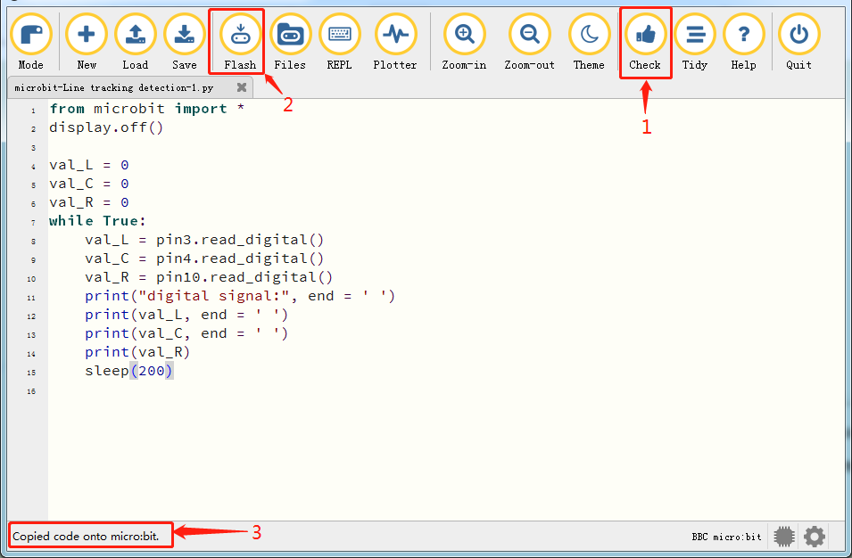

```python
from microbit import *
display.off()

val_L = 0
val_C = 0
val_R = 0
while True:
    val_L = pin3.read_digital()
    val_C = pin4.read_digital()
    val_R = pin10.read_digital()
    print("digital signal:", end = ' ')
    print(val_L, end = ' ')
    print(val_C, end = ' ')
    print(val_R)
    sleep(200)
```

5\. **Résultat du test**

Après avoir téléchargé le code sur la carte avec succès et sans débrancher le câble USB, cliquez sur “REPL” puis appuyez sur le bouton reset.

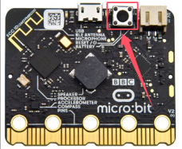

Les relevés détectés par le tube IR TCRT5000 gauche s’afficheront sur le moniteur.

Quand le tube IR TCRT5000 gauche détecte un objet blanc, 0 s’affiche et le témoin gauche est allumé ; lorsqu’il ne détecte qu’un objet noir, 1 s’affiche et le témoin est éteint, comme montré ci-dessous :

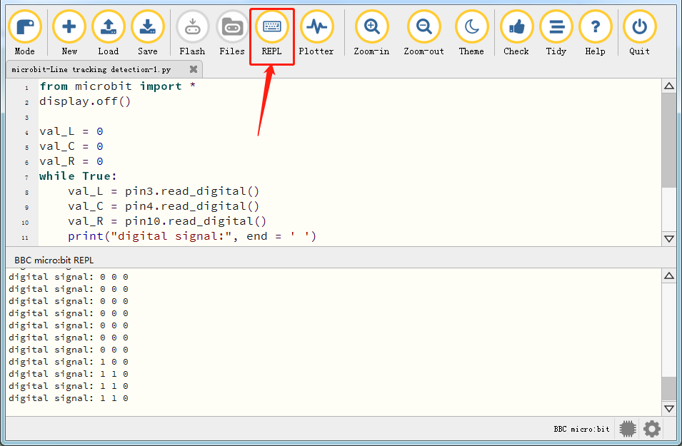

6\. **Explication du code**

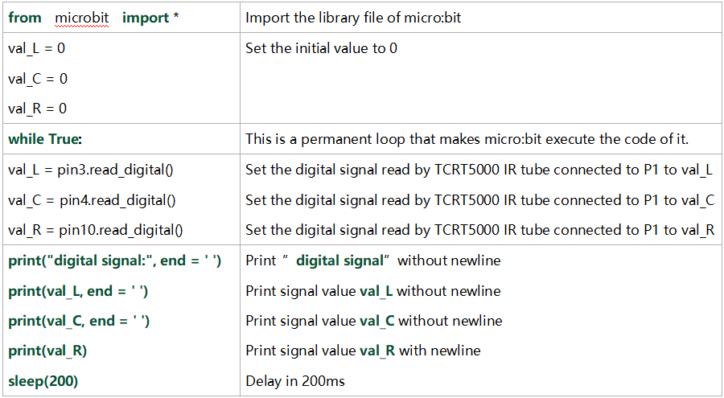


#### Projet 17.2：Voiture intelligente suiveuse

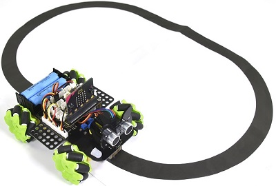

1\. Description

Dans cette leçon nous allons combiner un capteur de suivi de ligne avec un moteur pour fabriquer une voiture intelligente suiveuse de ligne.

La carte micro:bit analysera les signaux et contrôlera la voiture intelligente pour réaliser la fonction de suivi de ligne.

2\. **Principe de fonctionnement**

La voiture intelligente effectuera des mouvements différents selon les valeurs reçues par le capteur de suivi de ligne 3 canaux.

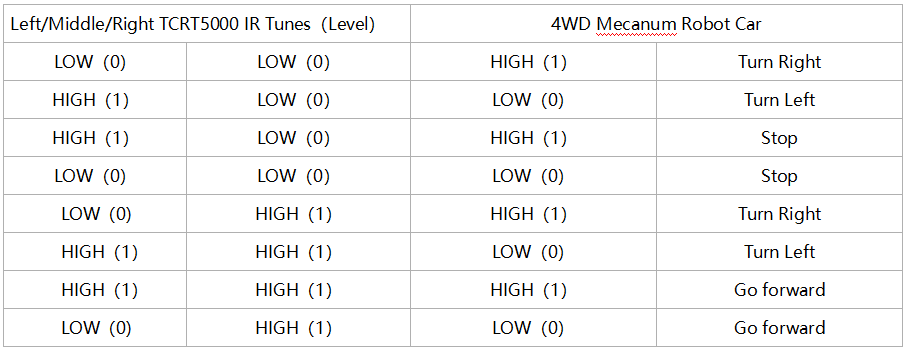

3\. **Préparation**

- Insérer la carte micro:bit dans l’emplacement du keyestudio 4WD Mecanum Robot Car V2.0

- Placer des piles dans le porte-piles

- Mettre l’interrupteur d’alimentation sur ON

- Connecter le micro:bit à l’ordinateur via un câble USB

- Ouvrir la version hors-ligne de Mu.

**Attention :** Le capteur de suivi 3 voies doit être utilisé dans un environnement sans interférences infrarouges telles que la lumière du soleil. La lumière du soleil contient beaucoup de lumière invisible, comme l’infrarouge et l’ultraviolet. Dans un environnement fortement ensoleillé, le capteur 3 voies ne peut pas fonctionner correctement.

4\. **Diagramme de flux**

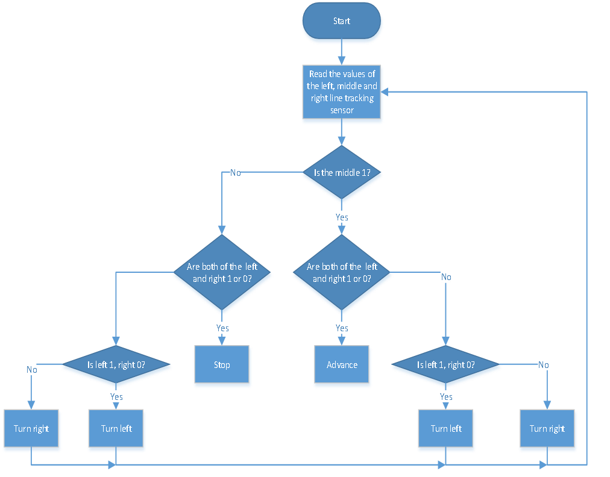

5\. **Code de test**

Entrez dans le logiciel Mu et ouvrez le fichier “Line tracking car\.py” pour importer le code. Vous pouvez aussi saisir le code vous-même dans la fenêtre d’édition.

(**Remarque : Tous les mots et symboles anglais doivent être écrits en anglais**.)

Cliquez sur “Files” pour importer le fichier de bibliothèque “keyes_mecanum_Car.py” dans le micro:bit.

Cliquez sur “Check” pour vérifier les erreurs dans le code. Le programme est incorrect si des soulignements et des curseurs sont affichés.

Si le code est correct, connectez le micro:bit à votre ordinateur et cliquez sur “Flash” pour télécharger le code sur la carte micro:bit.

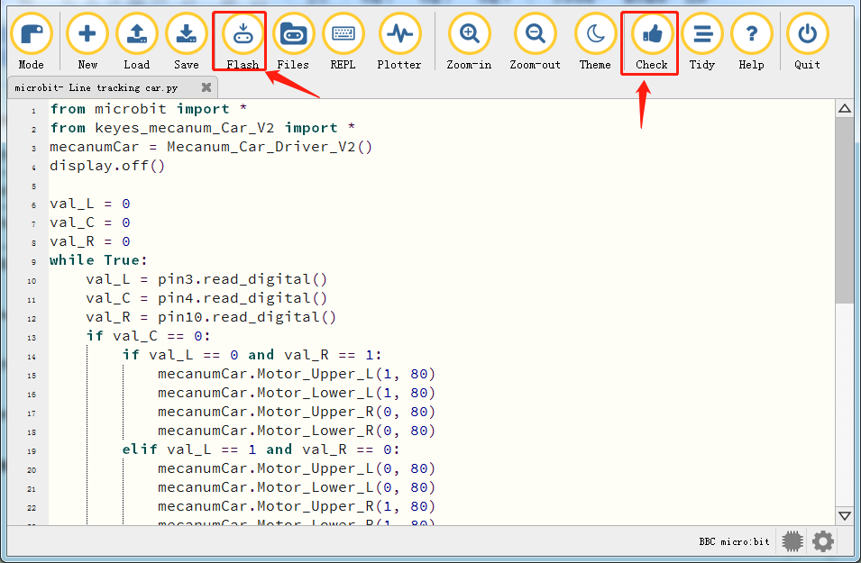

```python
from microbit import *
from keyes_mecanum_Car_V2 import *
mecanumCar = Mecanum_Car_Driver_V2()
display.off()

val_L = 0
val_C = 0
val_R = 0
while True:
    val_L = pin3.read_digital()
    val_C = pin4.read_digital()
    val_R = pin10.read_digital()
    if val_C == 0:
        if val_L == 0 and val_R == 1:
            mecanumCar.Motor_Upper_L(1, 80)
            mecanumCar.Motor_Lower_L(1, 80)
            mecanumCar.Motor_Upper_R(0, 80)
            mecanumCar.Motor_Lower_R(0, 80)
        elif val_L == 1 and val_R == 0:
            mecanumCar.Motor_Upper_L(0, 80)
            mecanumCar.Motor_Lower_L(0, 80)
            mecanumCar.Motor_Upper_R(1, 80)
            mecanumCar.Motor_Lower_R(1, 80)
        else:
            mecanumCar.Motor_Upper_L(0, 0)
            mecanumCar.Motor_Lower_L(0, 0)
            mecanumCar.Motor_Upper_R(0, 0)
            mecanumCar.Motor_Lower_R(0, 0)
    else :
        if val_L == 0 and val_R == 1:
            mecanumCar.Motor_Upper_L(1, 80)
            mecanumCar.Motor_Lower_L(1, 80)
            mecanumCar.Motor_Upper_R(0, 80)
            mecanumCar.Motor_Lower_R(0, 80)
        elif val_L == 1 and val_R == 0:
            mecanumCar.Motor_Upper_L(0, 80)
            mecanumCar.Motor_Lower_L(0, 80)
            mecanumCar.Motor_Upper_R(1, 80)
            mecanumCar.Motor_Lower_R(1, 80)
        else:
            mecanumCar.Motor_Upper_L(1, 80)
            mecanumCar.Motor_Lower_L(1, 80)
            mecanumCar.Motor_Upper_R(1, 80)
            mecanumCar.Motor_Lower_R(1, 80)
```
6\. **Résultat du test**

Après avoir téléchargé le code sur la carte avec succès, **alimentation externe (mettre l’interrupteur DIP sur ON)**, et appuyez sur le bouton reset du micro:bit.


La voiture suiveuse suit la ligne noire vers l’avant.

**Remarque :** (1) La largeur de la ligne noire devrait être égale ou supérieure à la largeur du capteur de suivi de ligne lors du suivi.

(2) Évitez de tester la voiture intelligente sous une forte luminosité.

7\. **Explication du code**

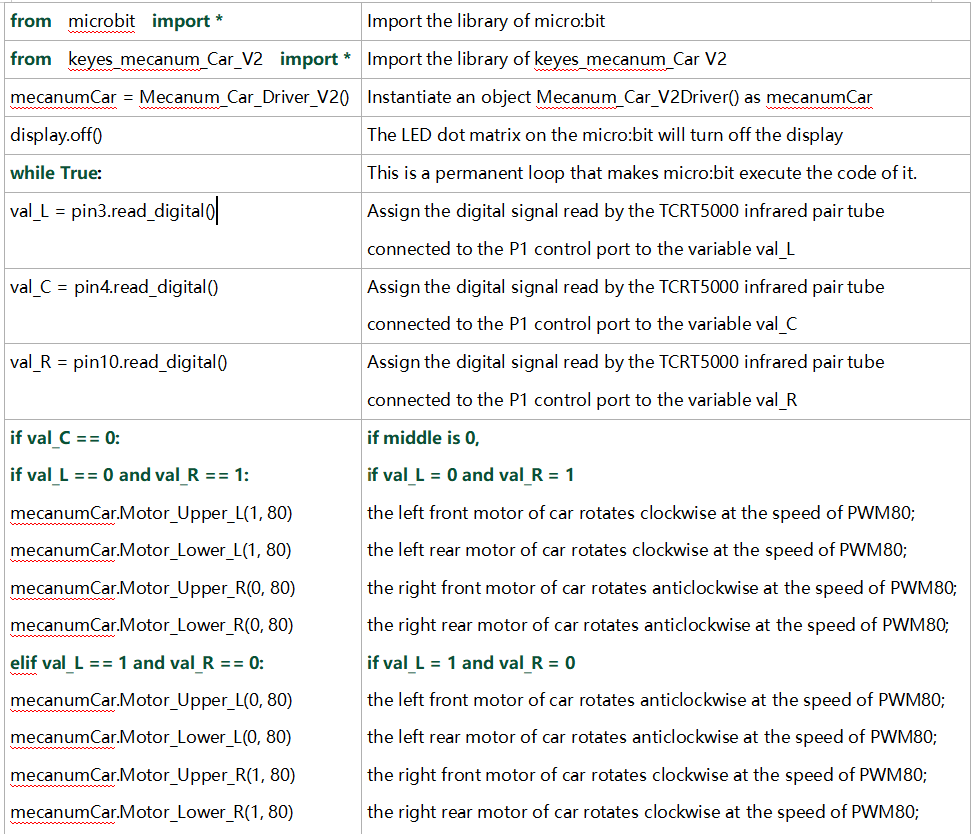

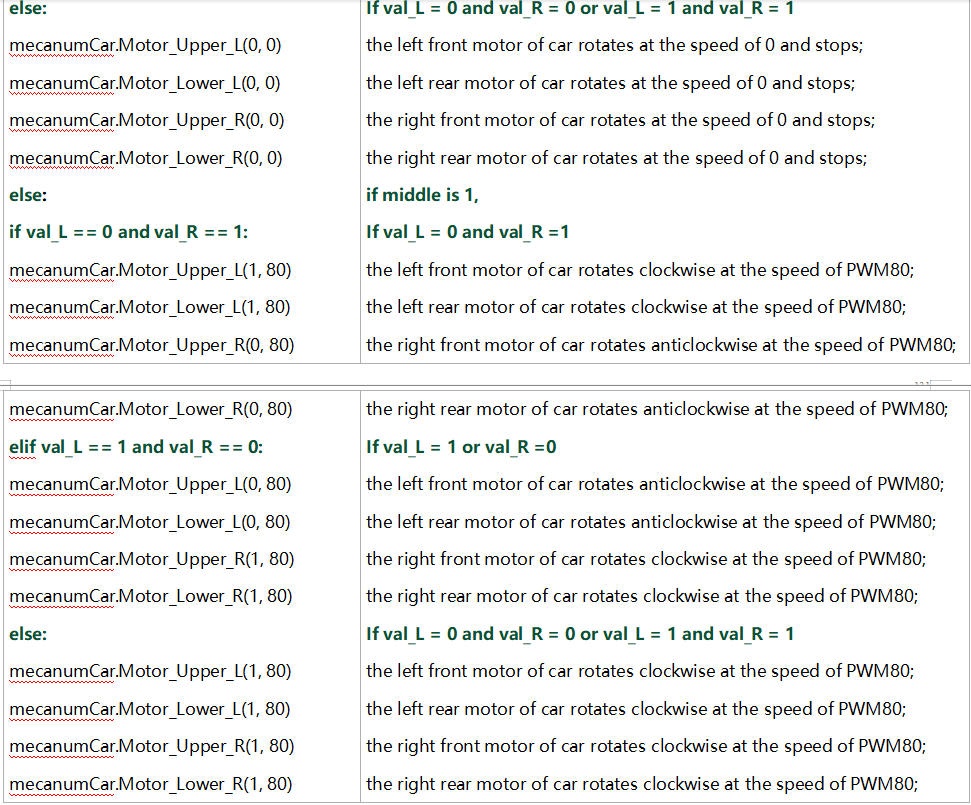