### プロジェクト 18：超音波センサー

#### プロジェクト 18.1：超音波距離測定

1\. **説明**

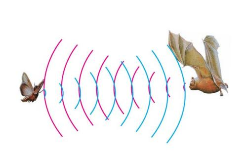

超音波センサーはコウモリのようにソナーを使って物体までの距離を測定します。高精度で安定した非接触距離検出を、使いやすいパッケージで提供します。送信モジュールと受信モジュールがセットになっています。

超音波センサーは障害物検知や距離測定アプリケーションをはじめ、さまざまな電子工作プロジェクトで広く使われています。


超音波モジュールはトリガー信号を受けると超音波を発信します。超音波が物体にぶつかって反射して戻ってくると、モジュールはエコー信号を出力するため、トリガー信号（TRIG）とエコー信号（ECHO）の時間差から物体までの距離を求めることができます。

図のように、左右に二つの目のようになっており、一方が送信側、もう一方が受信側です。

上記の配線図に従い、超音波センサーモジュールの統合ポートはmicro:bit用モータードライバベースプレートの5V G P15 P16ポートに接続します。Trig（T）ピンはmicro:bitのP15で制御し、Echo（E）ピンはP16に接続します。

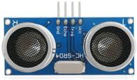

2\. **動作原理**


(1) TRIGをプルダウンした後、少なくとも10μsの高レベル信号でトリガーする；

(2) トリガー後、モジュールは自動的に40kHzの超音波パルスを8回送信し、信号が返ってくるかを検知する；

(3) 信号が返ってきた場合、ECHO（E）が高レベルを出力している時間が送信から受信までの時間になる。距離 = 高レベル継続時間 * 340 m/s * 0.5。

3\.  **仕様**

- 動作電圧: 3-5.5V (DC)

- 動作電流: 15mA

- 動作周波数: 40kHz

- 最大検出距離: 約3m

- 最小検出距離: 2-3cm

- 精度: 最大0.2cm

- 検出角度: 15度未満

- 入力トリガーパルス: 10μs TTLレベル

- 出力エコー信号: TTLレベル信号（高レベル）、距離に比例

4\.  **準備**

- micro:bitボードをkeyestudio 4WD Mecanum Robot Car V2.0のスロットに差し込む

- 電池を電池ホルダーに入れる

- 電源スイッチをONにする

- USBケーブルでmicro:bitをコンピュータに接続する

- Muのオフライン版を起動する

5\.  **テストコード**

Muソフトを開き、ファイル“Ultrasonic Ranging\.py”を開いてコードを読み込みます。編集ウィンドウに自分でコードを入力しても構いません。

(**Note: All English words and symbols must be written in English**.)

「Files」をクリックして“keyes_mecanum_Car_V2.py”ライブラリファイルをmicro:bitにインポートします。

「Check」をクリックしてコードのエラーを確認します。下線やカーソル表示がある場合はプログラムに誤りがあります。

コードが正しければ、micro:bitをコンピュータに接続した状態で「Flash」をクリックしてコードをmicro:bitボードに書き込みます。

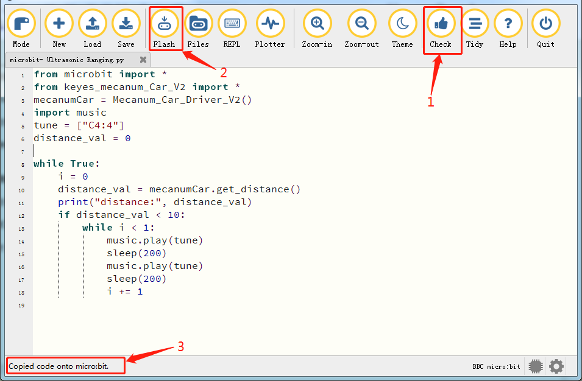

```python
from microbit import *
from keyes_mecanum_Car_V2 import *
mecanumCar = Mecanum_Car_Driver_V2()
import music
tune = ["C4:4"]
distance_val = 0

while True:
    i = 0
    distance_val = mecanumCar.get_distance()
    print("distance:", distance_val)
    if distance_val < 10:
        while i < 1:
            music.play(tune)
            sleep(200)
            music.play(tune)
            sleep(200)
            i += 1

```

6\.  **テスト結果**

コードをボードに正常にダウンロードしたら、USBケーブルを抜かないでください。「REPL」をクリックしてからリセットボタンを押します。


障害物までの距離値が表示されます。下図のように表示されます。

距離が10cm未満になると、スマートカーのパッシブブザーが鳴ります。

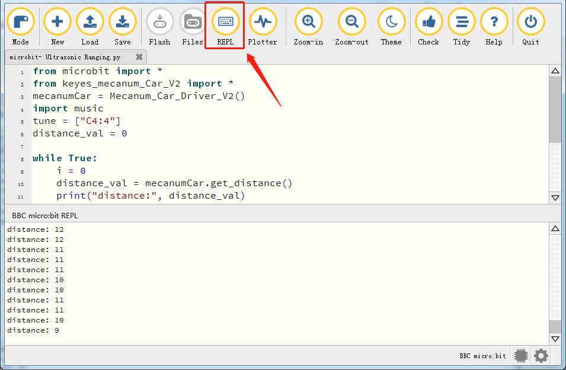

7\.  **コード説明**

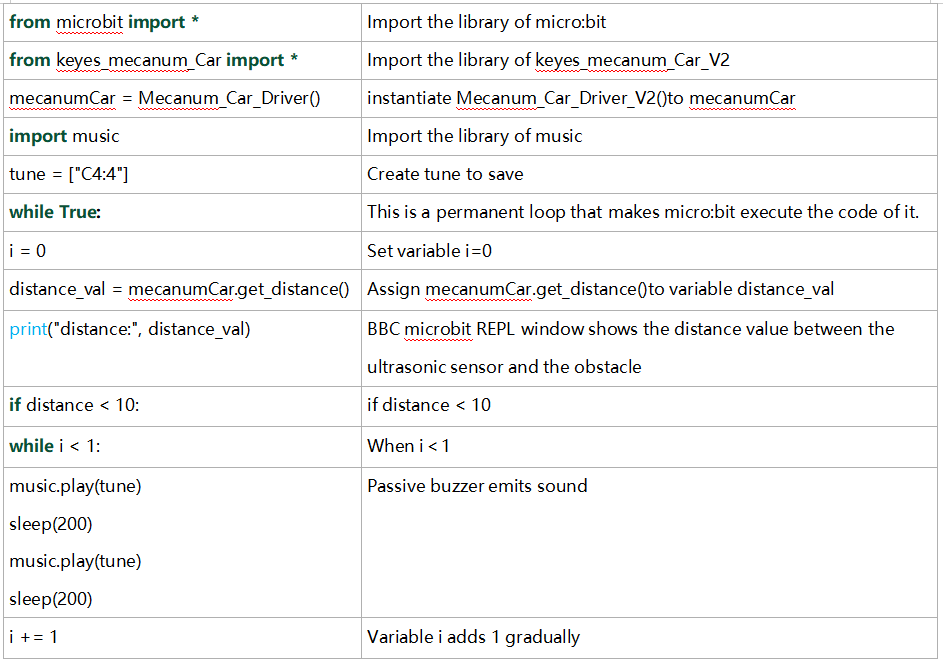

#### プロジェクト 18.2：超音波回避

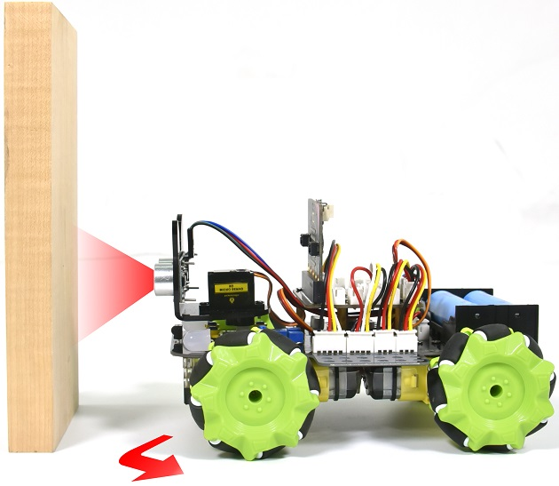

1\. **説明**

このプロジェクトでは、超音波センサーを車体に組み込み、超音波回避（障害物回避）車を作成します。

原理は、超音波センサーで車と障害物との距離を検出し、その距離に応じてスマートカーの動作を制御することです。

2\. **準備**

- micro:bitボードをkeyestudio 4WD Mecanum Robot Car V2.0のスロットに差し込む

- 電池を電池ホルダーに入れる

- 電源スイッチをONにする

- USBケーブルでmicro:bitをコンピュータに接続する

- Muのオフライン版を起動する

3\.  **フローチャート**

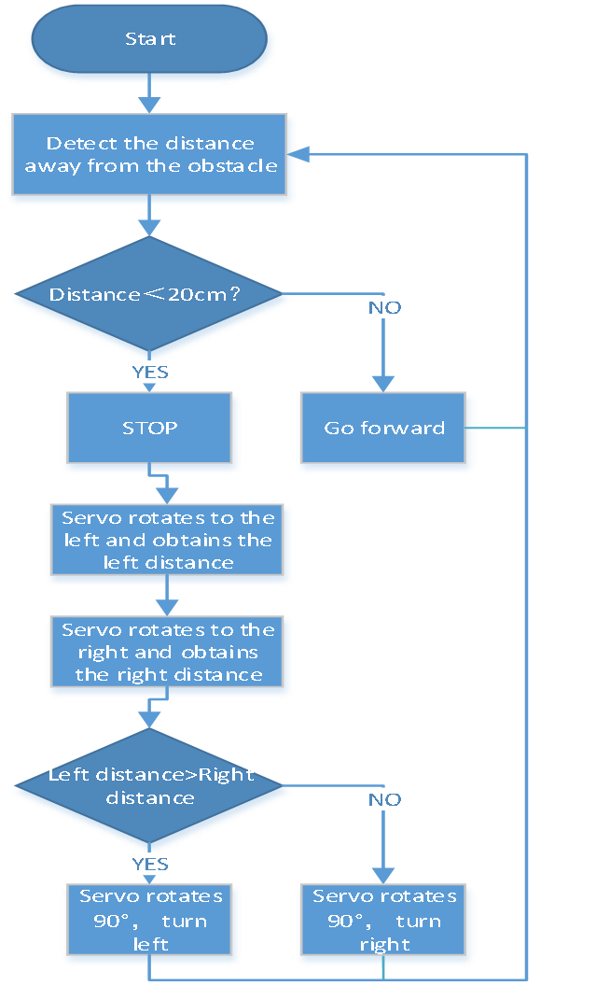

4\.  **テストコード**

Muソフトを開き、ファイル“Ultrasonic Avoid Smart Car\.py”を開いてコードを読み込みます。編集ウィンドウに自分でコードを入力しても構いません。

(**Note: All English words and symbols must be written in English**.)

「Files」をクリックして“keyes_mecanum_Car_V2.py”ライブラリファイルをmicro:bitにインポートします。

「Check」をクリックしてコードのエラーを確認します。下線やカーソル表示がある場合はプログラムに誤りがあります。

コードが正しければ、micro:bitをコンピュータに接続した状態で「Flash」をクリックしてコードをmicro:bitボードに書き込みます。

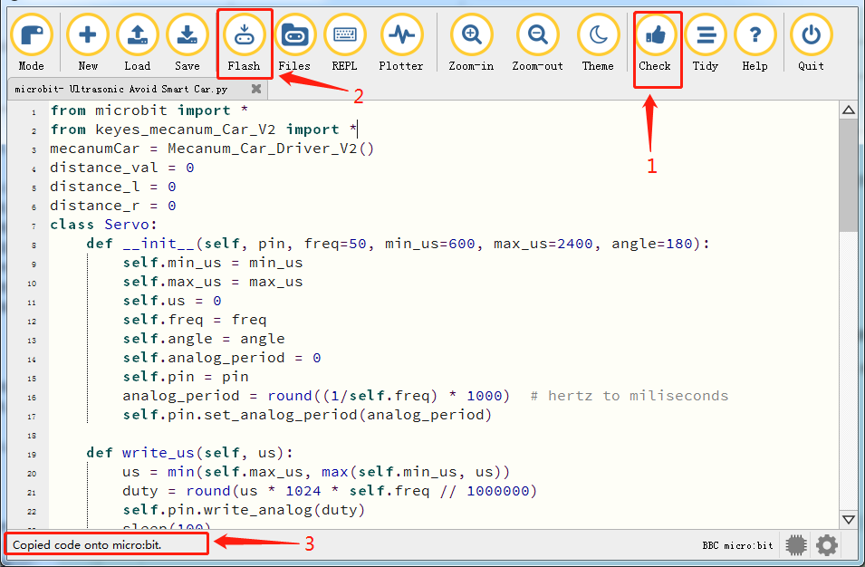

```python
from microbit import *
from keyes_mecanum_Car_V2 import *
mecanumCar = Mecanum_Car_Driver_V2()
distance_val = 0
distance_l = 0
distance_r = 0
class Servo:
    def __init__(self, pin, freq=50, min_us=600, max_us=2400, angle=180):
        self.min_us = min_us
        self.max_us = max_us
        self.us = 0
        self.freq = freq
        self.angle = angle
        self.analog_period = 0
        self.pin = pin
        analog_period = round((1/self.freq) * 1000)  # hertz to miliseconds
        self.pin.set_analog_period(analog_period)

    def write_us(self, us):
        us = min(self.max_us, max(self.min_us, us))
        duty = round(us * 1024 * self.freq // 1000000)
        self.pin.write_analog(duty)
        sleep(100)
        self.pin.write_analog(0)

    def write_angle(self, degrees=None):
        if degrees is None:
            degrees = math.degrees(radians)
        degrees = degrees % 360
        total_range = self.max_us - self.min_us
        us = self.min_us + total_range * degrees // self.angle
        self.write_us(us)

Servo(pin14).write_angle(90)

while True:

    distance_val = mecanumCar.get_distance()

    if distance_val < 20:
        mecanumCar.Motor_Upper_L(0, 0)
        mecanumCar.Motor_Lower_L(0, 0)
        mecanumCar.Motor_Upper_R(0, 0)
        mecanumCar.Motor_Lower_R(0, 0)
        sleep(500)
        Servo(pin14).write_angle(180)
        sleep(500)
        distance_l = mecanumCar.get_distance()
        sleep(500)

        Servo(pin14).write_angle(0)
        sleep(500)
        distance_r = mecanumCar.get_distance()
        sleep(500)

        if distance_l > distance_r:
            mecanumCar.Motor_Upper_L(0, 100)
            mecanumCar.Motor_Lower_L(0, 100)
            mecanumCar.Motor_Upper_R(1, 100)
            mecanumCar.Motor_Lower_R(1, 100)
            Servo(pin14).write_angle(90)
            sleep(300)
        else:
            mecanumCar.Motor_Upper_L(1, 100)
            mecanumCar.Motor_Lower_L(1, 100)
            mecanumCar.Motor_Upper_R(0, 100)
            mecanumCar.Motor_Lower_R(0, 100)
            Servo(pin14).write_angle(90)
            sleep(300)

    else:
        mecanumCar.Motor_Upper_L(1, 100)
        mecanumCar.Motor_Lower_L(1, 100)
        mecanumCar.Motor_Upper_R(1, 100)
        mecanumCar.Motor_Lower_R(1, 100)
```

5\.  **テスト結果**

コードをボードに正常にダウンロードしたら、**外部電源を接続する（DIPスイッチをONにする）**、その後micro:bitのリセットボタンを押します。


障害物までの距離が20cmより大きいときは車が前進します；反対に（20cm未満のとき）はスマートカーが左へ曲がります。

6\.  **コード説明**

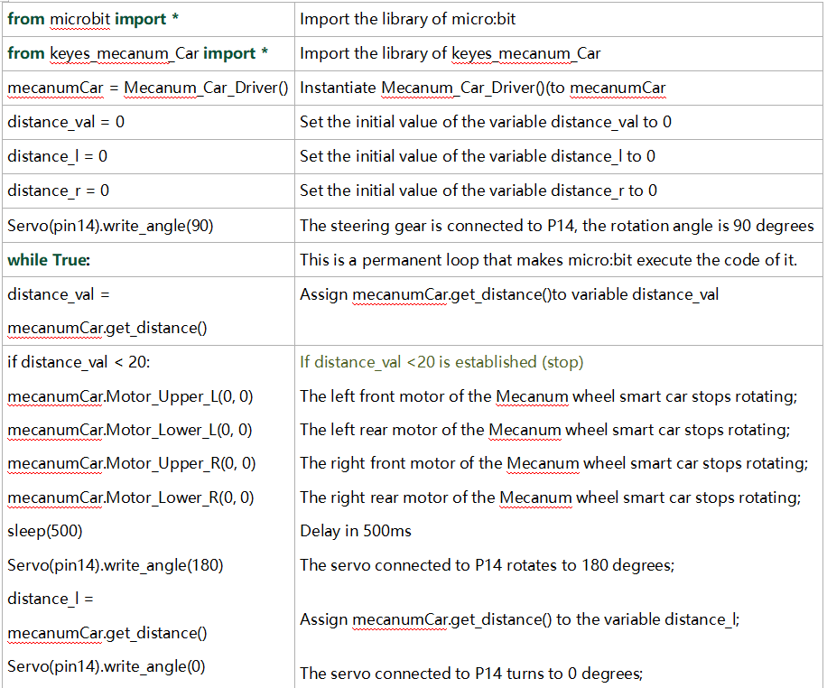

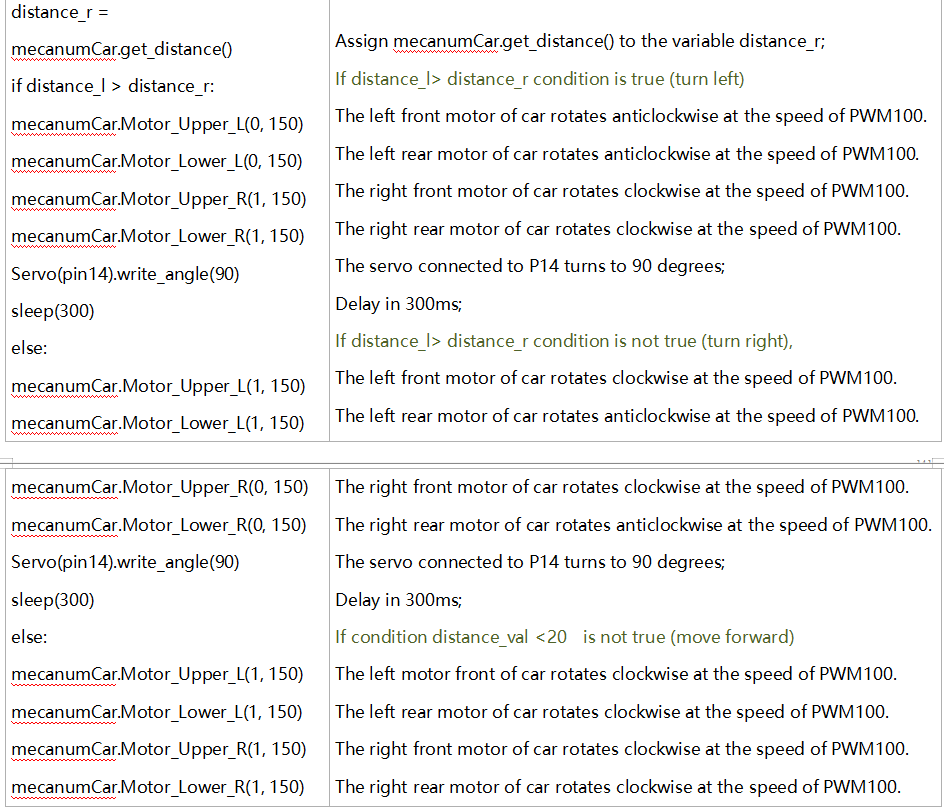

#### プロジェクト 18.3：超音波追従

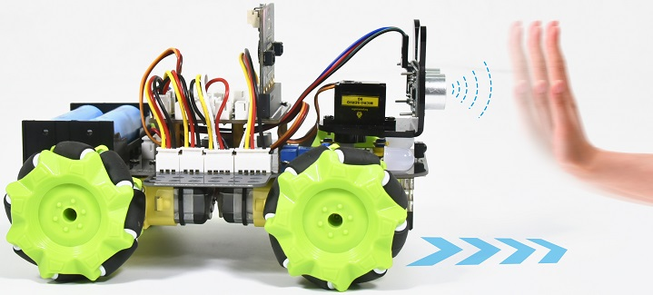

1\. **説明**

前のレッスンでライン追跡センサーの基本原理を学びました。次に、超音波センサーを車と組み合わせて超音波追従車を作成します。

超音波センサーが障害物との距離を検知し、その距離に応じて車の動作状態を制御します。

2\. **準備**

- micro:bitボードをkeyestudio 4WD Mecanum Robot Car V2.0のスロットに差し込む

- 電池を電池ホルダーに入れる

- 電源スイッチをONにする

- USBケーブルでmicro:bitをコンピュータに接続する

- Muのオフライン版を起動する

2\.  **フローチャート**

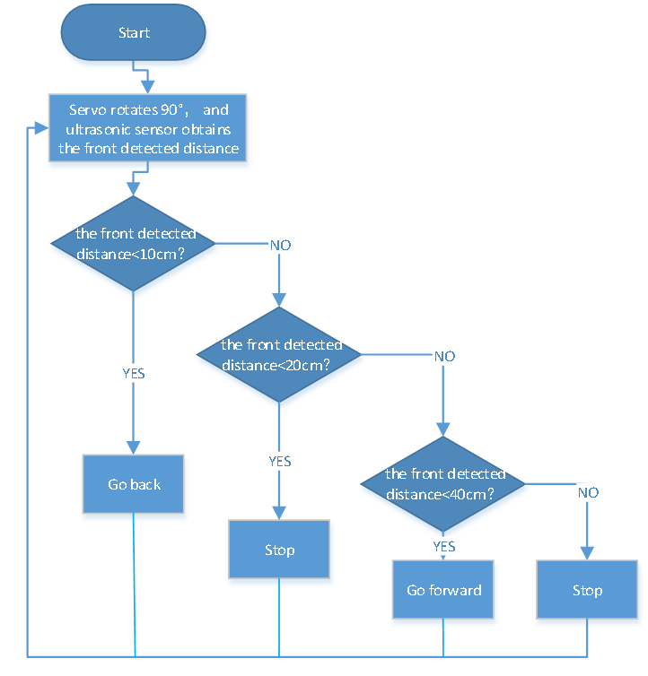

3\.  **テストコード**

Muソフトを開き、ファイル“Ultrasonic Follow Smart Car\.py”を開いてコードを読み込みます。編集ウィンドウに自分でコードを入力しても構いません。

(**Note: All English words and symbols must be written in English**.)

「Files」をクリックして“keyes_mecanum_Car_V2.py”ライブラリファイルをmicro:bitにインポートします。

「Check」をクリックしてコードのエラーを確認します。下線やカーソル表示がある場合はプログラムに誤りがあります。

コードが正しければ、micro:bitをコンピュータに接続した状態で「Flash」をクリックしてコードをmicro:bitボードに書き込みます。

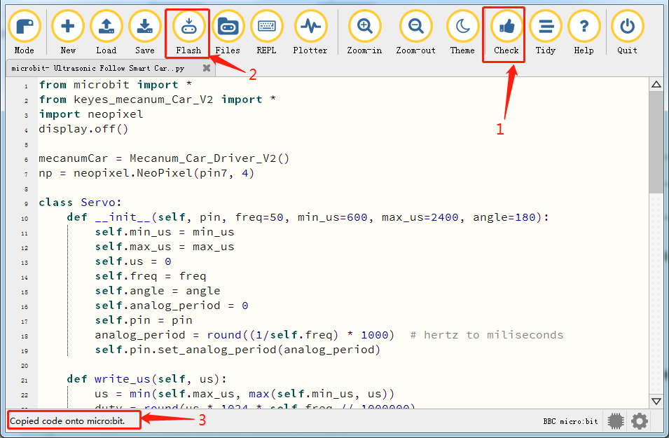

```python
from microbit import *
from keyes_mecanum_Car_V2 import *
import neopixel
display.off()

mecanumCar = Mecanum_Car_Driver_V2()
np = neopixel.NeoPixel(pin7, 4)

class Servo:
    def __init__(self, pin, freq=50, min_us=600, max_us=2400, angle=180):
        self.min_us = min_us
        self.max_us = max_us
        self.us = 0
        self.freq = freq
        self.angle = angle
        self.analog_period = 0
        self.pin = pin
        analog_period = round((1/self.freq) * 1000)  # hertz to miliseconds
        self.pin.set_analog_period(analog_period)

    def write_us(self, us):
        us = min(self.max_us, max(self.min_us, us))
        duty = round(us * 1024 * self.freq // 1000000)
        self.pin.write_analog(duty)
        sleep(100)
        self.pin.write_analog(0)

    def write_angle(self, degrees=None):
        if degrees is None:
            degrees = math.degrees(radians)
        degrees = degrees % 360
        total_range = self.max_us - self.min_us
        us = self.min_us + total_range * degrees // self.angle
        self.write_us(us)

Servo(pin14).write_angle(90)

while True:
    distance_val = 0
    distance_val = mecanumCar.get_distance()
    if distance_val >= 20 and distance_val <= 40:
        mecanumCar.Motor_Upper_L(1, 80)
        mecanumCar.Motor_Lower_L(1, 80)
        mecanumCar.Motor_Upper_R(1, 80)
        mecanumCar.Motor_Lower_R(1, 80)
        for pixel_id1 in range(0, len(np)):
            np[pixel_id1] = (255, 0, 0)
            np.show()
    if distance_val <= 10:
        mecanumCar.Motor_Upper_L(0, 80)
        mecanumCar.Motor_Lower_L(0, 80)
        mecanumCar.Motor_Upper_R(0, 80)
        mecanumCar.Motor_Lower_R(0, 80)
        for pixel_id1 in range(0, len(np)):
            np[pixel_id1] = (255, 255, 0)
            np.show()
    if distance_val > 10 and distance_val < 20 or distance_val > 40:
        mecanumCar.Motor_Upper_L(0, 0)
        mecanumCar.Motor_Lower_L(0, 0)
        mecanumCar.Motor_Upper_R(0, 0)
        mecanumCar.Motor_Lower_R(0, 0)
        for pixel_id1 in range(0, len(np)):
            np[pixel_id1] = (255, 255, 255)
            np.show()
```

4\.  **テスト結果**

コードをボードに正常にダウンロードしたら、**外部電源を接続する（DIPスイッチをONにする）**、その後micro:bitのリセットボタンを押します。


スマートカーは障害物に追従して移動し、4つのWS2812 RGBライトが異なる色を表示します。

**注意:** 障害物はスマートカーの前方でのみ移動させてください。

5\.  **コード説明**

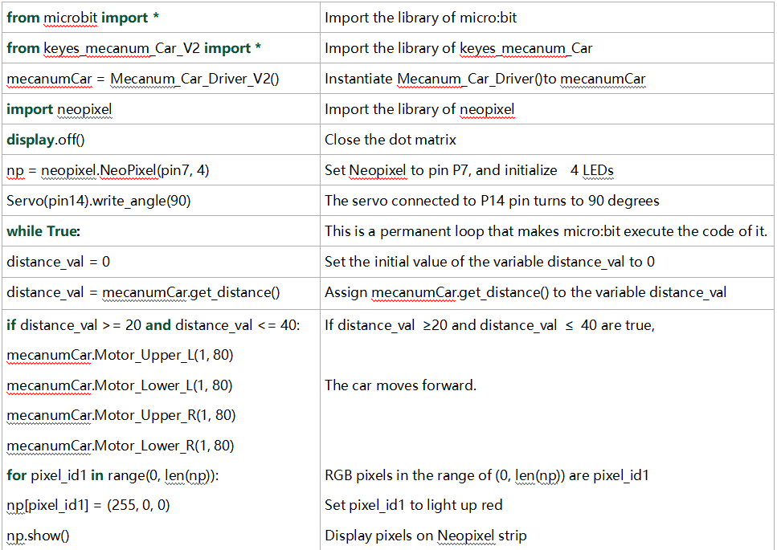

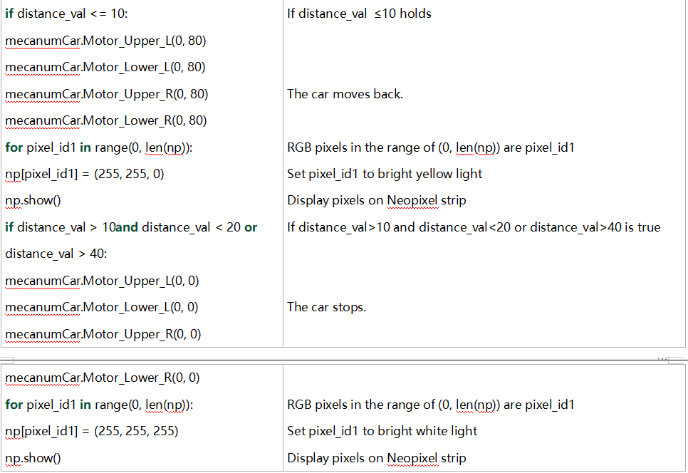

---