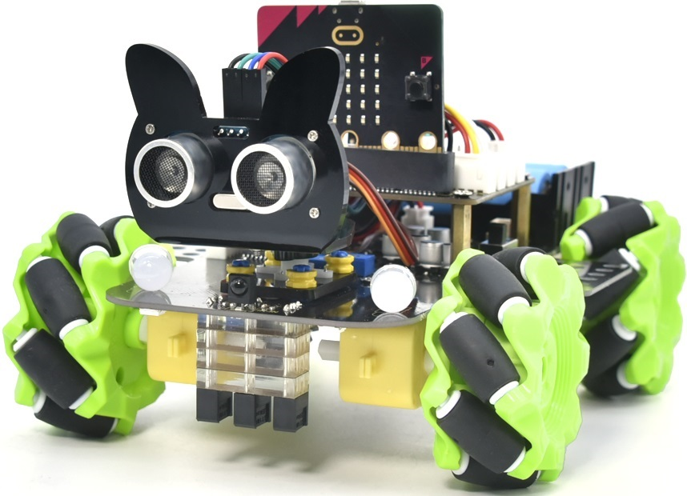

================
4. Python
================

.. toctree::
   :maxdepth: 1

|image1|

.. toctree::
   :maxdepth: 1

   00_Getting_Started
   Project_01_Project_1_Heartbeat
   Project_02_Project_2_Light_A_Single_LED
   Project_03_Project_3_55_LED_Dot_Matrix
   Project_04_Project_4_Programmable_Buttons
   Project_05_Project_5_Temperature_Detection
   Project_06_Project_6_Geomagnetic_Sensor
   Project_07_Project_7_Accelerometer
   Project_08_Project_8_Light_Detection
   Project_09_Project_9_Speaker
   Project_10_Project_10_Touch-sensitive_Logo
   Project_11_Project_11_Microphone
   Project_12_Project_12_Control_Speaker
   Project_13_Project_13_Seven-Color_LED
   Project_14_Project_14_4_WS2812_RGB_LEDs
   Project_15_Project_15Servo
   Project_16_Project_16Motor
   Project_17_Project_17Line_Tracking_Sensor
   Project_18_Project_18Ultrasonic_Sensor
   99_Resources_and_FAQ

