# Makecode Tutorial

## Get Started with makecode

The following instructions are applied for Windows system but can als erve as a reference if you are using a different system.

7.1 Write code and program

This chapter describes how to write program and load it to the Micro:
Bit main board V2.

Please browse the link for more details:

<https://microbit.org/guide/quick/>

Step 1: Connect the Micro: Bit

Firstly, link the Micro: Bit main board with your computer via the US able. Macs, PCs, Chromebooks and Linux（including Raspberry Pi）system re all compatible with the Micro: Bit main board.

Note that if you are about to pair the board wit our phone or tablet, please refer to this link:

[https:/microbit.org/get-started/user-guide/mobile/](https://microbit.org/get-started/user-guide/mobile/)

Secondly, if the red LED on the back of the board is on, that means the board is powered.
When your computer communicates with the main board via the USB cable, the yellow LED on it will flashes.
For example, it will flicker when you burn a "hex" file.

Then Micro: bit main board will display a driver named “MICROBIT(E:)”o our computer. Please note that it is not an ordinary USB disk, as show elow.

Step 2: Write programs

Access the link：<https://makecode.microbit.org/>，then click “Ne roject”, when the dialog box‘Create a Project’ appears nput‘heartbeat’in it and click ‘Create √’to edit.

(If you are running Windows 10 system, it is also viable to edit on th indows 10 APP, which is exactly like editing in the website.

Link of the APP :
<https://www.microsoft.com/zh-cn/p/makecode-for-micro-bit/9pjc7sv48lcx?ocid=badgep&rtc=1&activetab=pivot:overviewtab>

Write a set of micro:bit code. You can drag some
heartbeat’ program .

Here's a demo video(path): .../2. Makecod utorial\Makecode Code\Project 1：Heart beat\heartbeat.mp4

Click“ JS JavaScript”，then we enable to find
the corresponding program in JavaScript language, a hown below:

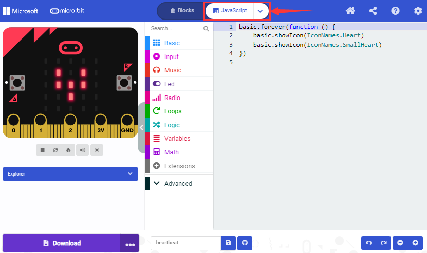

You also can click the“JS JavaScript”and slide th utton to choose“Python”and you will find the corresponding
a hown below:

Step 3: Download Code

If your computer is Windows 10, you solel eed to click the ‘Download’ button to download the program to you icro: bit main board.

If you are writing program through the website, following these steps:

Click the ‘Download’ button in the editor to download a "hex" file hich can be read by the Micro: Bit main board. Once the hexadecima ile is downloaded, copy it to your board just like the process that yo opy the file to the USB driver. If you are running Windows system, yo an also right-click and select ‘Send to → MICROBIT(E:) ‘to copy the he ile to the Micro: Bit main board.

You can also directly drag the "hex" file onto the MICROBIT (E:) disk.

During the process of copying the downloaded hex file to the Micro: bi ain board, the yellow signal light on the back side of the boar lashes. When the copy is completed, the yellow signal light will sto lashing and remain on.

Step 4: Run the program

After the program is uploaded to the Micro: bit main board, you coul till power it via an USB cable or an external power. The 5 x 5 LED do atrix on the board displays the heartbeat pattern.

Power via USB cable Power via external power（3V）

Caution:

When programming, the MICROBIT
driver will automatically eject and return and you exadecimal files will disappear. And the board can only have access t exadecimal files (hex) and won’t save other files.

**Step5：Other programming languages  
**Go to the link: ：<https://microbit.org/code/> for differen rogramming languages or ：<https://microbit.org/projects/> to lear hat you are interested.

7.2.Makecode

Access the link：<https://makecode.microbit.org/>，and enter the onlin ditor of makecode or open the APP makecode for micro:bit Windows 10.

Click“New Project”, and input“heartbeat”in the dialog box, then click
“create √”to enter Makecode editor, as shown below:

There are blocks“on start”and“forever”in the code editing area.

When the power is plugged or reset,“on start”means that
the code in the block only executes once hile“forever”implies that the code runs cyclically.

7.3.Quick Download

As mentioned before, if your computer is Windows 1 nd you have downloaded the MakeCode APP for micro:bit, then the cod an be quickly downloaded to the Micro: Bit main board b licking‘Download’button.

While it is a little more trickier if you are using a browser to ente akecode. However, if you use Google Chrome fo ndroid，ChromeOS，Linux，macOS and Windows 10, the process can b uicker too.

We use the webUSB function of Chrome to access the micro USB hardwar evice.

You could refer to the following steps to connect and pair devices.

Device pairing:

Connect micro:bit to your computer by USB cable.

Click“...”beside to“Download”and tap“Connect device”;

Click“Next”;

Click“Next”again

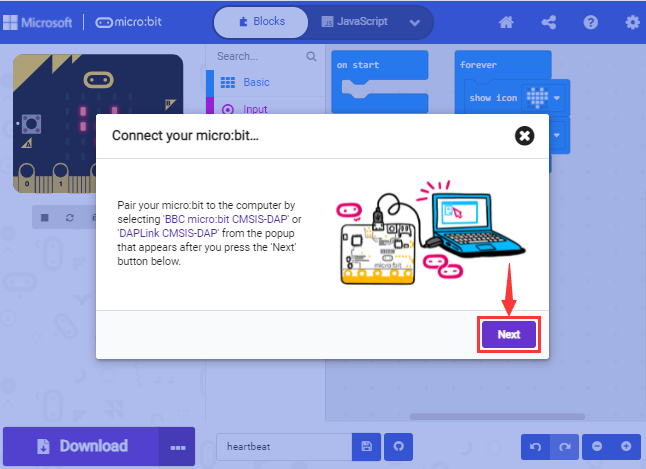

Then select the corresponding device and click“Connect”. If no devic hows up for selection, please refer to the link:
<https://makecode.microbit.org/device/usb/webusb/troubleshoot>

And for updating the firmware of the Micro:bit:
<https://microbit.org/guide/firmware/> .

If the links are too troublesome for you , then you can also turn to our
‘Troubleshooting Downloads with WebUSB.pdf”

Click“Done”to finish the pairing.

Download Program

After pairing, click “download”to directly download the program to th oard. If it is successfully downloaded, the icon

will shift to
.

7.4.Makecode Extension Libraries

We have made a makecode extension library for this Mecanum robot ca 2.0

Add an extension library of the Mecanum robot car V2.0

Please follow the following steps to add extension files:

Open Makecode to enter a certain project→click the gear-shaped icon(fo etting) in the upper right corner→choose“Extensions”;

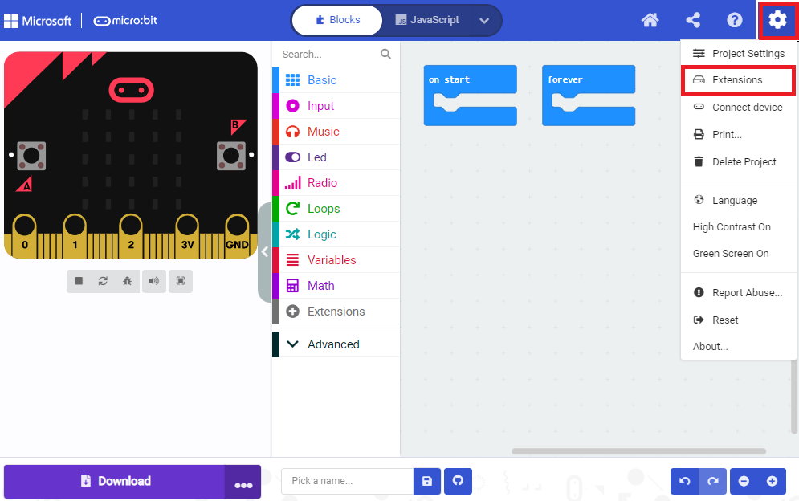

Or click“Extensions”, as shown below:

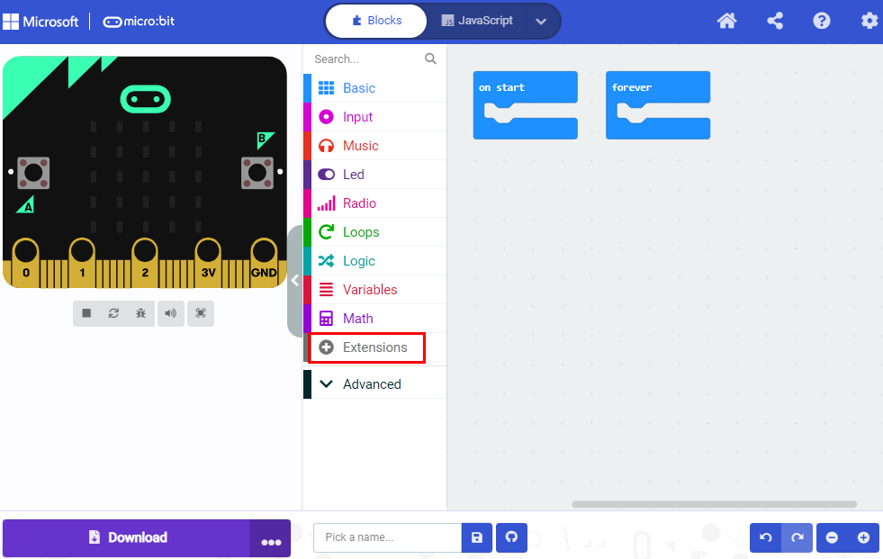

Input the link <u><https://github.com/keyestudio2019/mecanum_robot>
\_v2.git</u> to search;

Tap the searching result“MecanumRobotV2”to download and install it, Thi rocess may take a few seconds.

After the installation, you can find the extension files **Mecanu obotV2** and **IrRemote** on the left side.

And extension file Neopixel is also installed.

Note: The extension files added are only available for this project herefore, when you create a new MecanumRobotV2 project, you wil eed to add these extension files again.

Update or delete the MecanumRobotV2 extension files:

Please follow the following steps to update or delete extension files:

Click "Js JavaScript" to change to textual version:

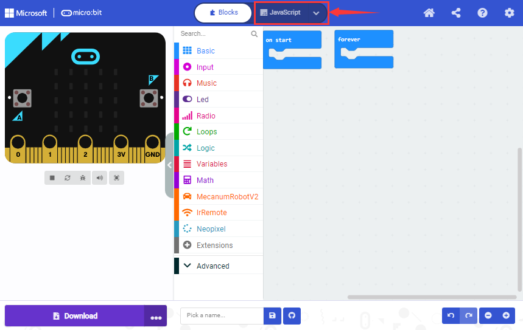

Click the“Explorer”on the left side:

You can find these added files in the list;

Click the dustbin icon beside the file to delete the MecanumRobotV2 fil nd tap the refresh icon to update it.

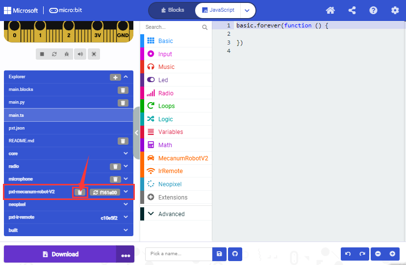

7.5.Resources and Test Code

Download link：<https://fs.keyestudio.com/KS4034-4035>

Once downloaded and unzipped, a file named KS4034(KS4035) Keyestudi icro bit 4WD Mecanum Robot Car Kit V2.0 will lie in sight.

Open it , as shown in the figure below:

7.6.Import test code

We provide hexadecimal code files (project files) for each project. Th ile contains all the contents of the project and can be importe irectly, and you can manually drag the code blocks to complete th rogram.

For simple projects, dragging a block of code to complete the program i ecommended. For complex projects, it is recommended to conduct th rogram by importing the provided hexadecimal code file.

Let's take the "Heatbeat" project as an example to show how to load th ode.

Open the Web version of Makecode or the Windows 10 App version o akecode then click “Import”.

Click“Import File”;

Select“..\2. Makecode Tutorial\Makecode Code\Projec ：Heartbeat\Project 1: Heart beat.hex”, then click“Go ahead”.

In addition to importing the provided test code file into the Makecod ompiler above, you can also drag them to the code editing area of th akecode compiler, as shown in the figure below:

After a few seconds, it has done.

Note: If your computer system is’t Windows 10, the pairing cannot b one via Google Chrome. Therefore, digital or analog signals of sensor nd modules cannot be read. However, we can use the CoolTerm software t ead the serial port data. Next chapter is about how to install th oolTerm.

7.7.Install CoolTerm 

CoolTerm program is used to read the data on serial port.

Download CoolTerm program: <https://freeware.the-meiers.org/>

After downloading, we need to install CoolTerm program file, and we tak C Window system as an example.

1)  Choose“win”to download the zip file of CoolTerm

2)  Unzip the file and open it. (also suitable for Mac and Linux system)

\(3\ ouble-click.（Pleas ake sure that the driver of Micro:bit is installed and the main boar s connected to the computer.)

The functions of each button on the Toolbar are listed below:

|                                                                      |                                                  |
|----------------------------------------------------------------------|--------------------------------------------------|
|   | Opens up a new Terminal                          |
|   | Opens a saved Connection                         |
|  | Saves the current Connection to disk             |
|                                                       | Opens the Serial Connection                      |
|                                                       | Closes the Serial Connection                     |
|                                                       | Clears the Received Data                         |
|                                                       | Opens the Connection Options Dialog              |
|                                                       | Displays the Terminal Data in Hexadecimal Format |
|  | Displays the Help Window                         |

## Projects

(Note: project 8.1 to 8.12 are basic courses conducted with the built-i ensors and LED dot matrix of the Micro:bit main board V2, while projec .13 to 8.20 are extended courses)

### Project 1：Heart beat

1.  **Description**

This project is easy to conduct solely with a micro:bit main board,  icro USB cable and a computer. The micro:bit will display a “flickerin eart” pattern. This experiment serves as a starter for your to entry t he magical world of the micro:bit.

2.  **Preparation**

A. Attach the micro:bit main board to your computer via the USB cable

B. Open the Web version of Makecode.

Import Hex profile [(How to import?)](\l)

Click“New Project”to drag blocks step by step

3.  **Test Code**

Route to get test code（[How to load?](\l)）

|           |                                                            |                          |
|-----------|------------------------------------------------------------|--------------------------|
| File Type | Path                                                       | File Name                |
| Hex file  | ..\2. Makecode Tutorial\Makecode Code\Project 1：Heartbeat | Project 1：Heartbeat.hex |

Or you could edit code in the editing area.

Go to“Basic”→“show icon”.

Copy it again and place it into“forever”block.

Click“❤”t elect“”.

Complete Program：

|                                                                                                                                     |
|-------------------------------------------------------------------------------------------------------------------------------------|
|  |

Click“JavaScript" to view the corresponding JavaScript code:

4.  **Test Result**

Download code to micro:bit and keep the USB cable connected. The LED do atrix will display ❤ and

ceaselessly.

([How to download?](\l) [How to quick download?](\l))

If the download is not success, try to disconnect the micro:bit fro our computer and then reconnect them and reopen Makecode to try again.

### Project 2：Light A Single LED

1.  **Description**

The LED dot matrix consists of 25 diodes arranged in a 5 by 5 square an laced at the intersection of row lines (X) and column lines (Y). We ca ontrol one of the 25 LEDs by setting coordinate points. For example he first LED sits in the first line is (0,0）and the third LE ositioned in the first line is (2,0）and others likewise.

2.  **Preparation**

A. Attach the micro:bit main board to your computer via the USB cable

B. Open the Web version of Makecode.

Import Hex profile [(How to import?)](\l)

Click“New Project”to drag blocks step by step

3.  **Test Code**

Route to get test code（[How to load?](\l)）

|           |                                       |                                   |
|-----------|---------------------------------------|-----------------------------------|
| File Type | Path                                  | File Name                         |
| Hex file  | ..\2. Makecode Tutorial\Makecode Code | Project 2：Light A Single LED.hex |

Or you could edit code in the editing area.

A. Click“Led”→“more”→“led enable false”

B. Put it into the“on start”block, and click the drop-down triangl utton t elect“true”.

C. Enter“Led”→“toggle x 0 y 0”block, and drag it into“forever”，the lter“x 0”into“x 1”.

4.  Enter“Basic”→“pause (ms) 100”from“ , then move it t    theblock    and set to dela    500ms.

5.  Duplicate cod    stringonc    and place i    into“forever”block.

6.  Enter“Led”, and drag“plot x 0 y 0”into“forever”block，then alter“x     y 0”into“x 3 y 4”.

7.  Replicate“pause (ms) 500”once and place it into“forever”block.

8.  Click“Led”→“unplot x 0 y 0”and set to“unplot x3 y 4”then copy“paus    (ms) 500”block once, and place it into“forever”block.

Complete Program：

Click“JavaScript”to switch into corresponding JavaScript code:

4.  **Test Result**

0.5s and the one in (3,4) shines fo .5s and repeat this sequence.

([How to download?](\l) [How to quick download?](\l))

### Project 3：5 x 5 LED Dot Matrix

1.  **Description**

Dot matrix is very commonplace in daily life, which has found wid pplications in LED advertisement screens, elevator floor display, bu top announcement and so on.

The LED dot matrix of Micro: Bit main board contains 25 Diodes reviously, we have succeeded in controlling a certain LED via it osition point. Supported by the same theory, we can turn on many LED t the same time to showcase patterns, digits and characters.

What’s more, we can also click”show icon“ to choose the pattern we lik o display. Last but not the least, we can design patterns by ourselve s well.

2.  **Preparation**

A. Attach the micro:bit main board to your computer via the USB cable

B. Open the Web version of Makecode.

3.  **Test Code**

Test Code1：

The route to get test code（[How to load?](\l)）

|           |                                       |                                 |
|-----------|---------------------------------------|---------------------------------|
| File Type | Path                                  | File Name                       |
| Hex file  | ..\2. Makecode Tutorial\Makecode Code | Project 3：LED Dot Matrix-1.hex |

Or you could edit code step by step in the editing area.

Enter“Led”→“more”→“led enable false”n and place it into “on start” block

Click the drop-down triangle button to select“true”

Click“Led”, and move“plot x 0 y 0”into“forever”，then replicate“plot x   0”for 8 times, respectively set to“x 2”y 0”,“x 2”y 1”,“x 2”y 2”,“x 2” ”,“x 2”y 4”,“x 1”y 3”“x 0”y 2”,“x 3”y 3”,“x 4”y 2”.

Complete Program：

|                                                                      |
|----------------------------------------------------------------------|
|  |

Select“JavaScript" and“Python”to switch into JavaScript and Pytho anguage code:

Code 2：

The route to get test code（[How to load?](\l)）

|           |                                       |                                 |
|-----------|---------------------------------------|---------------------------------|
| File Type | Path                                  | File Name                       |
| Hex file  | ..\2. Makecode Tutorial\Makecode Code | Project 3：LED Dot Matrix-2.hex |

Or you could edit code step by step in the editing area.

Enter“Basic”→“show number 0”block,

Duplicate it for 4 times, then separately set to“show number 1”,“sho umber 2”,“show number 3”,“show number 4”,“show number 5”.

Click“Basic”→“show leds”, then put it into“forever”block，tick blu oxes to light LED and generate“↓”pattern.

Move out the block“show string” from“Basic”block, and leave it beneat he“show leds” block

Choose“show icon”from“Basic”block, and leave it in the “forever “block

Enter“Basic”→“show arrow North”and leave it into“forever”block，the eplicate“show arrow North”for 3 times，respectively set to“Nort ast”,“South East”, “South West”,“North West”.

Click“Basic”and drag the block“clear screen”into “forever”

Drag“pause (ms) 100”block from“Basic”block and set the delay to 500ms hen place it in “forever”below“ block.

Complete Program:

|                                                                      |
|----------------------------------------------------------------------|
|  |

Select“JavaScript" and“Python”to switch into JavaScript and Pytho anguage code:

4.  **Test Result**

Upload code 1 and power the board , we will see th con

Upload code 2 and plug micro:bit in power, Micro: bit starts showin umber 1, 2, 3, 4, and 5, then cyclicall isplay,“Hello!”,
,
,
,
 and
patterns.

([How to download?](\l) [How to quick download?](\l))

### Project 4：Programmable Buttons

1.  **Description**

Button an be used to control circuits. In an integrated circuit with a pus utton, the circuit is connected when pressing the button and but afte elease, it will break again. 

Both ends of the button like two mountains. There is a river in between.

The internal metal piece connect the two sides to let the current pass ust like building a bridge to connect two mountains.

The internal structure of the button is shown as follows: befor ressing the button, 1 ,2 , 3 and 4 are turned on. However, 1, 3 or 1,  r 2, 3 or 2 and 4 are disconnected, which is only enabled when th utton i ressed. 

Micro: Bit main board boasts three push buttons, two are programmabl uttons(marked with A and B), and the one on the other side is a rese utton. By pressing the two programmable buttons can input thre ifferent signals. We can press button A or B alone or press the ogether and the LED dot matrix shows A,B and AB respectively. Let’s ge tarted.

2.  **Preparation**

A. Attach the micro:bit main board to your computer via the USB cable

B. Open the Web version of Makecode.

3.  **Test Code**

Test Code 1：

Press buttons on micro:bit, micro:bit will display character strings.

The route to get test code（[How to load?](\l)）

|           |                                       |                                       |
|-----------|---------------------------------------|---------------------------------------|
| File Type | Path                                  | File Name                             |
| Hex file  | ..\2. Makecode Tutorial\Makecode Code | Project 4：Programmable Buttons-1.hex |

Or you could edit code step by step in the editing area.

Delete“on start”and“forever”firstly，then click“Input”→“on button  ressed”

A. Click“Basic”→“show string”;

B. Then place it into“on button A pressed”block, change
“Hello!”into“A”.

Copy cod tringonce ap the drop-down button“A”to select“B”and modif haracter“A”into“B”.

Copyonce，an ull down the triangle button to select“A+B”and“show string “AB”

Complete Code:

|                                                                     |
|---------------------------------------------------------------------|
|  |

Select“JavaScript" and“Python”to switch into JavaScript and Pytho anguage code:

Code 2：

The route to get test code（[How to load?](\l)）

|           |                                       |                                       |
|-----------|---------------------------------------|---------------------------------------|
| File Type | Path                                  | File Name                             |
| Hex file  | ..\2. Makecode Tutorial\Makecode Code | Project 4：Programmable Buttons-2.hex |

Or you could edit code step by step in the editing area.

A. Click“Led”→“more”→“led enable false”,

B. Put it into the block“on start”，click drop-down triangle button t elect“true”
.

\*\*\*\*\*\*\*\*\*\*\*\*\*\*\*\*\*\*\*\*\*\*\*\*\*\*\*\*\*\*\*\*\*\*\*\*\*\*\*\*\*\*\*\*\*\*\*\*\*\*\*\*\*\*\*\*\*\*\*\*\*\*\*\*\*\*\*\*\*\*\*\*\*

A. Tap“Variables”→“Make a Variable...”→“New variable name：”

B. Enter“item”in the dialog box and click“OK”，then variable“item”i roduced. And move“set item to 0”into“on start”block.

\*\*\*\*\*\*\*\*\*\*\*\*\*\*\*\*\*\*\*\*\*\*\*\*\*\*\*\*\*\*\*\*\*\*\*\*\*\*\*\*\*\*\*\*\*\*\*\*\*\*\*\*\*\*\*\*\*\*\*\*\*\*\*\*\*\*\*\*\*\*\*\*\*

A. Click“Input”→“on button A pressed”.

B. Go to“Variables”→“ change item by 1 ”

C. Place it into“on button A pressed”and 1 is modified int .

\*\*\*\*\*\*\*\*\*\*\*\*\*\*\*\*\*\*\*\*\*\*\*\*\*\*\*\*\*\*\*\*\*\*\*\*\*\*\*\*\*\*\*\*\*\*\*\*\*\*\*\*\*\*\*\*\*\*\*\*\*\*\*\*\*\*\*\*\*\*\*\*\*

Duplicatecod tring once，click the drop-down button to select“B”，then set 5 to
-5.

\*\*\*\*\*\*\*\*\*\*\*\*\*\*\*\*\*\*\*\*\*\*\*\*\*\*\*\*\*\*\*\*\*\*\*\*\*\*\*\*\*\*\*\*\*\*\*\*\*\*\*\*\*\*\*\*\*\*\*\*\*\*\*\*\*\*\*\*\*\*\*\*\*\*\*\*\*\*

A. Enter“Led”→“plot bar graph of 0 up to 0”

B. Keep it into“forever”block

C. Go to“Variables”to move“item”into 0 box，change 0 into 25.

\*\*\*\*\*\*\*\*\*\*\*\*\*\*\*\*\*\*\*\*\*\*\*\*\*\*\*\*\*\*\*\*\*\*\*\*\*\*\*\*\*\*\*\*\*\*\*\*\*\*\*\*\*\*\*\*\*\*\*\*\*\*\*\*\*\*\*\*\*\*\*\*\*\*\*\*\*

A. Go to“Logic”to move out “if...true...then...”and “=”blocks，

B. Keep“=”into“true”box and set to “\>”

C. Select“item”in the“Variables”and lay it down at left box of
“\>”，change 0 into 25；

D. Enter“Variables”to drag“set item to 0”block into“if...true..then...” lter 0 into 25.

\*\*\*\*\*\*\*\*\*\*\*\*\*\*\*\*\*\*\*\*\*\*\*\*\*\*\*\*\*\*\*\*\*\*\*\*\*\*\*\*\*\*\*\*\*\*\*\*\*\*\*\*\*\*\*\*\*\*\*\*\*\*\*\*\*\*\*\*\*\*\*\*\*\*\*\*\*\*

\(7\) A. Replicate cod tringonce

B.“\>”is modified into“\<”and 25 is changed into 0,

C. Leave it beneath
cod tring.

Complete Program：

|                                                                      |
|----------------------------------------------------------------------|
|  |

Click“JavaScript" to switch into JavaScript code:

4.  **Test Result**

After uploading test code 1 to micro:bit mai oard V2 and powering the board via the USB cable, the 5\*5 LED do atrix shows A if button A is pressed, B if button B pressed, and AB i utton A and B are pressed together.

After uploading test code 2 to micro:bit mai oard V2 and powering the board via the USB cable, when pressing th utton A , the LEDs turning red increase by 5 while when pressing th utton B the LEDs turning red reduce.

([How to download?](\l) [How to quick download?](\l))

### Project 5：Temperature Measurement

1.  **Description**

The Micro:bit main board is not equipped with a temperature sensor, bu ses the built-in temperature sensor in NFR52833 chip for temperatur etection. Therefore, the detected temperature is more closer to th emperature of the chip, and there maybe deviation from the ambien emperature.

In this project, we will seek to use the sensor to test the temperatur n the current environment, and display the test results in the displa ata (device). And then control the LED dot matrix to display differen atterns by setting the temperature range detected by the sensor.

Note: the temperature sensor of Micro:bit main board is shown below:

2.  **Preparation**

A. Attach the micro:bit main board to your computer via the USB cable

B. Open the Web version of Makecode.

3.  **Test Code**

Test Code 1：

Micro:bit detects temperature

The route to get test code（[How to load?](\l)）

|           |                                       |                                          |
|-----------|---------------------------------------|------------------------------------------|
| File Type | Path                                  | File Name                                |
| Hex file  | ..\2. Makecode Tutorial\Makecode Code | Project 5：Temperature Measurement-1.hex |

Or you could edit code step by step in the editing area.

Go to“Advanced” →“Serial” →“serial redirect to USB”

Place it into “on start”

Click“Serial”to drag out“serial write value x=0”

Move it into“forever”block

Go to“Input” →“temperature(℃)”

Place it into 0 box

Change x into Temperature

Move“pause (ms) 100”from“Basic”block and place it in the“forever”block nd set the delay to 500ms.

Complete Program：

|                                                                      |
|----------------------------------------------------------------------|
|  |

Click“JavaScript" to view the corresponding JavaScript code:

Download code 1 to micro:bit board and keep USB cable connected, the ap the button
:

( [How to quick download?](\l))

Temperature data is shown below:

Through the test, the room temperature is 35℃when touching the NFR5182 hip of micro:bit; however, the temperature rises to 37℃ when it touche ater cup.

Open CoolTerm, click Options to select SerialPort. Set COM port an 15200 baud rate(the baud rate of USB serial communication of Micro:bi s 115200 through the test). Click“OK”and“Connect”.

The serial monitor shows the current ambient temperature value, as show elow:

<

Code 2：

Micro:bit display different pictures by temperature(the temperatur alue in the code could be adjusted).

The route to get test code（[How to load?](\l)）

|           |                                       |                                          |
|-----------|---------------------------------------|------------------------------------------|
| File Type | Path                                  | File Name                                |
| Hex file  | ..\2. Makecode Tutorial\Makecode Code | Project 5：Temperature Measurement-2.hex |

Or you could edit code step by step in the editing area.

You could set temperature based on real situation.

Click“Led”→“more”→“led enable false”into“on start”，click drop-dow riangle button to select“true”

\*\*\*\*\*\*\*\*\*\*\*\*\*\*\*\*\*\*\*\*\*\*\*\*\*\*\*\*\*\*\*\*\*\*\*\*\*\*\*\*\*\*\*\*\*\*\*\*\*\*\*\*\*\*\*\*\*\*\*\*\*\*\*\*\*

A. Go to“Logic”→“if..true...then...else”and “=” block;

B. Move“if..true...then...else” into“forever”block，the lace“=”into“true”box.

\*\*\*\*\*\*\*\*\*\*\*\*\*\*\*\*\*\*\*\*\*\*\*\*\*\*\*\*\*\*\*\*\*\*\*\*\*\*\*\*\*\*\*\*\*\*\*\*\*\*\*\*\*\*\*\*\*\*\*\*\*\*\*\*\*\*\*\*\*\*\*\*\*\*\*\*\*\*

A. Change“=”into“≥”

B. Go to“Input”→“temperature(℃)”

C. Change 0 into 35.

\*\*\*\*\*\*\*\*\*\*\*\*\*\*\*\*\*\*\*\*\*\*\*\*\*\*\*\*\*\*\*\*\*\*\*\*\*\*\*\*\*\*\*\*\*\*\*\*\*\*\*\*\*\*\*\*\*\*\*\*\*\*\*\*\*

Tap“Basic”→“show icon”，copy it once and lay down them under the“i ..then” and else blocks, then click the drop-down triangle button t elect“”.

Complete Program：

|                                                                                                                                                                                                              |
|--------------------------------------------------------------------------------------------------------------------------------------------------------------------------------------------------------------|
|  |

Click“JavaScript", the corresponding JavaScript code is shown below:

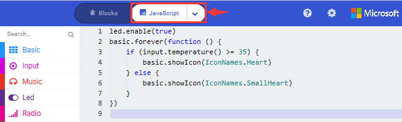

4.  **Test Result**

Upload the Code 1 and plug in power. And the 5\*5 LED displays th mbient temperature. When pressing the temperature sensor, th emperature will grow on dot matrix. When the ambient temperature i ess than 35℃, the 5\*5LED wil how hen the temperature is equivalent to or greater than 35℃, th attern
will appear.

([How to download?](\l) [How to quick download?](\l))

### Project 6：Geomagnetic Sensor

1.  **Description**

This project mainly introduces the use of the micro:bit’ eomagnetic sensor. In addition to detecting the strength of th agnetic field, it can also be used to determine the direction, which i n important part of the heading and attitude reference system (AHRS) a ell.

It uses FreescaleMAG3110 three-axis magnetometer. Its I2C interfac ommunicates with the outside, and the range is ±1000µT, the maximu ata update rate is 80Hz. Combined with an accelerometer, it ca alculate the position. Additionally, it is applied to magneti etection and compass blocks.

Then we could read the value detected by it to determine the location e need to calibrate the micro:bit board when the magnetic sensor works he correct calibration method is to rotate the micro:bit board.

In addition, the objects nearby may affect the accuracy of readings an alibration.

2.  **Preparation**

A. Attach the micro:bit main board to your computer via the USB cable

B. Open the Web version of Makecode.

3.  **Test Code**

Test Code 1：

Press A on micro:bit, the value of compass is shown.

The route to get test code（[How to load?](\l)）

|           |                                       |                                     |
|-----------|---------------------------------------|-------------------------------------|
| File Type | Path                                  | File Name                           |
| Hex file  | ..\2. Makecode Tutorial\Makecode Code | Project 6：Geomagnetic Sensor-1.hex |

Or you could edit code step by step in the editing area.

A. Click“Input”→“more”→“calibrate compass”

B. Lay down it into block“on start”.

A. Go to“Input”→“on button A pressed”.

B. Enter“Basic”→“show number”, put it into“on button A pressed”block;

C. Tap“Input”→“compass heading(℃)”， and place it into“show number”

\*\*\*\*\*\*\*\*\*\*\*\*\*\*\*\*\*\*\*\*\*\*\*\*\*\*\*\*\*\*\*\*\*\*\*\*\*\*\*\*\*\*\*\*\*\*\*\*\*\*\*\*\*\*\*\*\*\*\*\*\*\*\*\*\*

Complet rogram：

|                                                                   |
|-------------------------------------------------------------------|
|                                                      |

Select“JavaScript" and“Python”to switch into JavaScript and Pytho anguage code:

Code Description：

Upload the code 1, plug in micro:bit via an USB cable.

As the button A is pressed, LED dot matrix indicates the“TILT TO FIL CREEN”then enter the calibration interface. The calibration method:
rotate the micro:bit to make the LED dot matrix draw a square (25 LED re on), as shown in the following figure:

([How to download?](\l) [How to quick download?](\l))

The calibration will be finished until you view the smil atternappear.

The serial monitor will show 0°, 90°, 180° and 270° when pressing A.

Code 2：

Make micro: bit board point to the north, south, east and wes orizontally , LED dot matrix displays the corresponding directio atterns

The route to get test code（[How to load?](\l)）

|           |                                       |                                     |
|-----------|---------------------------------------|-------------------------------------|
| File Type | Path                                  | File Name                           |
| Hex file  | ..\2. Makecode Tutorial\Makecode Code | Project 6：Geomagnetic Sensor-2.hex |

This module can keep reading data to determine direction, and let arro oint to the current magnetic North Pole.

For the above picture, the arrow will point to the upper right when th alue ranges from 292.5 to 337.5. Because 0.5 can’t be input in th ode, the values we get are 293 and 338.

Link computer with micro:bit board by a micro USB cable, and program i akeCode editor:

Enter“Input”→ “more”→“calibrate compass”

Move“calibrate compass”into“on start”

\*\*\*\*\*\*\*\*\*\*\*\*\*\*\*\*\*\*\*\*\*\*\*\*\*\*\*\*\*\*\*\*\*\*\*\*\*\*\*\*\*\*\*\*\*\*\*\*\*\*\*\*\*\*\*\*\*\*\*\*\*\*\*\*\*

A. Click“Variables”→“Make a Variable...”→“New variable name：”

B. Input“x”in the blank box and click“OK”, and the variable “x” i enerated.

C. Drag out“set x to”into“forever”block

A. Go to“Input”→“compass heading(℃)”, and keep it into“0”box

Tap“Logic”→“if...then...else”, and place it into “forever”block, the lickico or 6 times.

\*\*\*\*\*\*\*\*\*\*\*\*\*\*\*\*\*\*\*\*\*\*\*\*\*\*\*\*\*\*\*\*\*\*\*\*\*\*\*\*\*\*\*\*\*\*\*\*\*\*\*\*\*\*\*\*\*\*\*\*\*\*\*\*\*

A. Place“and”into“true”block

B. Then move“=”block to the left box of “and”

C. Click“Variables”to drag“x”to the left “0”box, change 0 into 293 an et to “≥”;

D. Then copy“x≥293”once and leave it to the right “0”box and se o“x\<338”

A. Go to“Basic”→“show leds”

B. Lay it down beneath
block hen click“show leds”and the pattern
appears.

A. Duplicate
fo  times.

B. Separately leave them into the blank boxes behind “else if”.

C. Set to“x≥23 and x\<68”,“x≥68 and x\<113 ”,“x≥113 and x\<158 ”,“x≥15 nd x\<203 ”,“x≥203 and x\<248 ”,“x≥248 and x\<293 ”respectively.

D. Then copy “show leds”for 7 times and keep them below the “els f.......then” block respectively.

E. Click the blue boxes to form th attern“”,
“”,
“”,
“”,
“”,
“”and
“”.

\*\*\*\*\*\*\*\*\*\*\*\*\*\*\*\*\*\*\*\*\*\*\*\*\*\*\*\*\*\*\*\*\*\*\*\*\*\*\*\*\*\*\*\*\*\*\*\*\*\*\*\*\*\*\*\*\*\*\*\*\*\*\*\*\*\*\*\*\*\*\*\*\*\*\*\*\*

Complete Program：

|                                                                                                                                                                                                                                                                                                                                                                                                                       |     |
|-----------------------------------------------------------------------------------------------------------------------------------------------------------------------------------------------------------------------------------------------------------------------------------------------------------------------------------------------------------------------------------------------------------------------|-----|
| 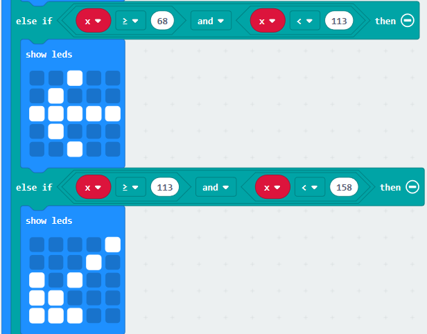 |     |
|                                                                     |     |

Select“JavaScript" and“Python”to switch into JavaScript and Pytho anguage code:

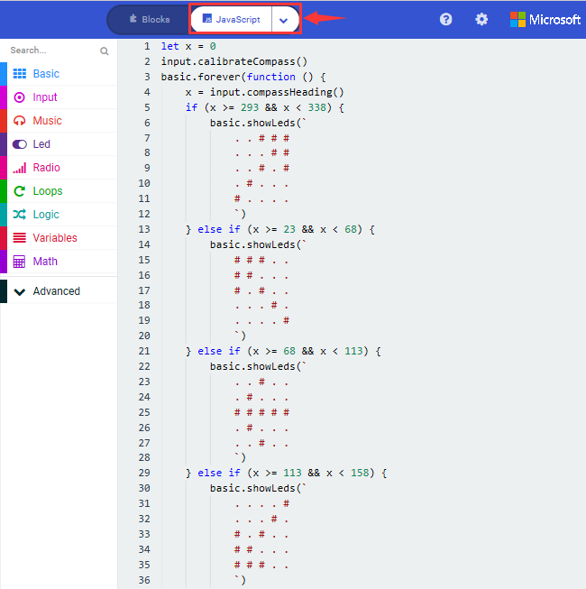

4.  **Test Result**

Upload code 2 and plug micro:bit into power. After calibration, tilt th icro:bit board, and the LED dot matrix displays the direction signs.

([How to download?](\l) [How to quick download?](\l))

### Project 7：Accelerometer 

1.  **Description**

The micro:bit board has a built-in Freescale MMA8653FC three-axi cceleration sensor (accelerometer). Its I2C interface works on externa ommunication, the range can be set to ±2g, ±4g, and ±8g, and th aximum data update rate can reach 800Hz.

When the Micro:bit is stationary or moving at a constant speed, th ccelerometer only detects the gravitational acceleration; when th icro:bit is slightly shaken, the acceleration detected is much smalle han the gravitational acceleration and can be ignored. Therefore, i he process of using Micro:bit, the main purpose is to detect th hanges of the gravitational acceleration on the x, y, and z axes whe he attitude changes.

For this project, we will introduce the detection of several specia ostures by the accelerometer.

2.  **Preparation**

A. Attach the micro:bit main board to your computer via the USB cable

B. Open the Web version of Makecode.

3.  **Test Code**

Test Code 1：

The route to get test code（[How to load?](\l)）

|           |                                       |                                |
|-----------|---------------------------------------|--------------------------------|
| File Type | Path                                  | File Name                      |
| Hex file  | ..\2. Makecode Tutorial\Makecode Code | Project 7：Accelerometer-1.hex |

Or you could edit code step by step in the editing area.

\(1\) A. Enter“Input”→“on shake”，

B. Click“Basic”→“show number”, place it into“on shake”block, then chang  int .

\(2\) A. Copy code string
for  imes, and separately click the triangle button to select“logo up”,“log own”,“screen up”,“screen down”,“tilt left”,“tilt right”and“free fall” hen respectively change 1 into 2, 3, 4, 5, 6, 7, 8.

Complete Program：

|                                                                      |     |
|----------------------------------------------------------------------|-----|
|                                                       |     |
|  |     |

Click“JavaScript", you will view the corresponding JavaScript code:

Code 2：

Detect the value of acceleration speed at x, y and z axis

The route to get test code（[How to load?](\l)）

|           |                                       |                                |
|-----------|---------------------------------------|--------------------------------|
| File Type | Path                                  | File Name                      |
| Hex file  | ..\2. Makecode Tutorial\Makecode Code | Project 7：Accelerometer-2.hex |

Or you could edit code step by step in the editing area.

A. Go to“Advanced”→“Serial”→“serial redirect to USB”

B. Drag it into“on start”

\*\*\*\*\*\*\*\*\*\*\*\*\*\*\*\*\*\*\*\*\*\*\*\*\*\*\*\*\*\*\*\*\*\*\*\*\*\*\*\*\*\*\*\*\*\*\*\*\*\*\*\*\*\*\*\*\*\*\*\*\*\*\*\*\*\*\*\*\*\*\*\*\*\*\*\*\*\*

A. Enter“Serial”→“serial write value x =0”

B. Leave it into“forever”block

A. Click“Input”→“acceleration(mg) x”；

B. Keep it into“0”box and capitalize the“x”

\*\*\*\*\*\*\*\*\*\*\*\*\*\*\*\*\*\*\*\*\*\*\*\*\*\*\*\*\*\*\*\*\*\*\*\*\*\*\*\*\*\*\*\*\*\*\*\*\*\*\*\*\*\*\*\*\*\*\*\*\*\*\*\*\*\*\*\*\*\*\*\*\*\*\*\*\*

Go to“Basic”and place“pause (ms) 100”into “forever”, then set the dela o 100ms.

\*\*\*\*\*\*\*\*\*\*\*\*\*\*\*\*\*\*\*\*\*\*\*\*\*\*\*\*\*\*\*\*\*\*\*\*\*\*\*\*\*\*\*\*\*\*\*\*\*\*\*\*\*\*\*\*\*\*\*\*\*\*\*\*\*\*\*\*\*\*\*\*\*\*\*\*\*

Replicate cod tring

for 2 times and keep them into“forever”block，separately set the whol ode string as follows:

Complete Program：

Click“JavaScript" to view the corresponding JavaScript code:

Download code 1 to micro:bit board, keep USB cable connected an lick

([How to quick download?](\l))

After referring to the MMA8653FC data manual and the hardware schemati iagram of the Micro: Bit main board V2, the accelerometer coordinate o he Micro: Bit V2 motherboard are shown in the figure below:

The following interface shows the decomposition value of acceleration i  axis, Y axis and Z axis respectively, as well as acceleratio ynthesis (acceleration synthesis of gravity and other external forces).

If you're running Windows 7 or 8 instead of Windows 10, it won't be abl o match devices via Google Chrome. You'll need to use the CoolTer erial monitor software to read data.

You could open CoolTerm software, click Options, select SerialPort, se OM port and put baud rate to 115200 (after testing, the baud rate o SB SerialPort communication on Micro: Bit main board V2 is 115200) lick OK, and Connect. The CoolTerm serial monitor shows the data of  xis, Y axis and Z axis , as shown in the figures below :

4.  **Test Result**

After uploading the test code 1 to micro:bi ain board V2 and powering the board via the USB cable, if we shake th icro: Bit main board V2, no matter at any direction, the LED dot matri isplays the digit “1”.

([How to download?](\l) [How to quick download?](\l))

When it is kept upright （make its logo above the LED dot matrix）, th umber 2 shows.

When it is kept upside down( make its logo below the LED dot matrix)  t shows as below.

When it is placed still on the desk, showing its front side, the numbe  appears.

When it is placed still on the desk, showing its back side, the number  xhibits.

When the board is tilted to the left , the LED dot matrix shows th umber 6, as shown below.

When the board is tilted to the right , the LED dot matrix displays th umber 7, as shown below:

When the board is knocked to the floor, this process can be considere s a free fall and the LED dot matrix shows the number 8. (Please not hat this test is not recommended for it may damage the main board.)

Attention: if you’d like to try this function, you can also set th cceleration to 3g, 6g or 8g.

### Project 8：Light Detection

1.  **Description**

In this project, we focus on the light detection function of the Micro:
Bit main board V2. It is achieved by the LED dot matrix since the mai oard is not equipped with a photoresistor.

When the light irradiates the LED matrix, the voltage change will b roduced. Therefore, we could determine the light intensity by voltag hange.

2.  **Preparation**

A. Attach the micro:bit main board to your computer via the USB cable

B. Open the Web version of Makecode.

Import Hex profile [(How to import?)](\l)

Or click“New Project”and drag blocks step by step

3.  **Test Code**

The route to get test code（[How to load?](\l)）

|           |                                       |                                |
|-----------|---------------------------------------|--------------------------------|
| File Type | Path                                  | File Name                      |
| Hex file  | ..\2. Makecode Tutorial\Makecode Code | Project 8：Light Detection.hex |

Or you could edit code step by step in the editing area.

(1)A. Enter“Advanced”→“Serial”→“serial redirect to USB”;

B. Drag it into“o tart”block.

\*\*\*\*\*\*\*\*\*\*\*\*\*\*\*\*\*\*\*\*\*\*\*\*\*\*\*\*\*\*\*\*\*\*\*\*\*\*\*\*\*\*\*\*\*\*\*\*\*\*\*\*\*\*\*\*\*\*\*\*\*\*\*\*\*\*\*\*\*\*\*\*\*\*\*

\(2\) A. Go to“Serial”→“serial write value x =0”;

B. Move i nto“forever”

A. Click“Input”→“acceleration(mg) x”

B. Put“acceleration(mg) x”in the“0”box and change “x”into“Ligh ntensity”.

\*\*\*\*\*\*\*\*\*\*\*\*\*\*\*\*\*\*\*\*\*\*\*\*\*\*\*\*\*\*\*\*\*\*\*\*\*\*\*\*\*\*\*\*\*\*\*\*\*\*\*\*\*\*\*\*\*\*\*\*\*\*\*\*\*\*\*\*\*\*\*\*\*\*\*

A. Click“Basic”→“pause (ms) 100”;

B. Lay it down into“forever”and set the delay to 100ms.

Complete Program：

|                                                                      |
|----------------------------------------------------------------------|
|  |

Click“JavaScript" to switch into the corresponding JavaScript code:

4.  **Test Result**

Download code to micro:bit board don’t plug off the USB cable an lick

([How to quick download?](\l))

The intensity value is 0 when covering the LED dot matrix. And the valu aries with the light intensity. When placing micro:bit under th unlight, the stronger the light is, the larger the intensity value wil e. As shown below:

Open“CoolTerm”, click“Options”to select “SerialPort”, and set “COM” por nd 115200 baud rate(the baud rate of USB serial communication o icro:bit is 115200 through the test).

Then click“OK”and“Connect”.

The light intensity value is shown below:

### Project 9：Speaker

1.  **Description**

Micro: Bit main board has an built-in speaker, which makes adding soun o the programs easier. It can also be programmed to produce all kind f tones, like playing the song *Ode to Joy.*

2.  **Preparation**

A. Attach the micro:bit main board to your computer via the USB cable

B. Open the Web version of Makecode.

Import Hex profile [(How to import?)](\l)

Or click“New Project”and drag blocks step by step

3.  **Test Code**

The route to get test code（[How to load?](\l)）

|           |                                       |                        |
|-----------|---------------------------------------|------------------------|
| File Type | Path                                  | File Name              |
| Hex file  | ..\2. Makecode Tutorial\Makecode Code | Project 9：Speaker.hex |

Or you could edit code step by step in the editing area.

Enter“Basic”module to find “show icon”and drag it into“on start”block;

Click the little triangle to find
“”

\*\*\*\*\*\*\*\*\*\*\*\*\*\*\*\*\*\*\*\*\*\*\*\*\*\*\*\*\*\*\*\*\*\*\*\*\*\*\*\*\*\*\*\*\*\*\*\*\*\*\*\*\*\*\*\*\*\*\*\*\*\*\*\*\*\*\*\*\*\*\*\*\*\*\*\*\*\*

\(2\) Enter“Music”module to find and drug“play sound giggle until done”
into “forever”block;

Enter“Basic”module to find and drug“pause(ms) 100” into “forever” block
;

Change 100 into 1000;

( 3 ) Copy

three times and place it into “forever” block ;

Click the little triangle to select “happy”,”hello”,”yawn”;

<

Complete Program：

Select “JavaScript" and “Python” to switch into JavaScript and Pytho anguage code:

4.  **Test Result**

After uploading the test code to micro:bi ain board V2 and powering the board via the USB cable, the speake tters sound and the LED dot matrix shows the logo of music.

([How to download?](\l) [How to quick download?](\l))

([How to download?](\l) [How to quick download?](\l))

### Project 10：Touch-sensitive Logo

1.  **Description**

The Micro: Bit main board V2 is equipped with a golden touch-sensitiv ogo, which can act as an input component like an button.

It contains a capacitive touch sensor that senses small changes in th lectric field when pressed (or touched), just like your phone or table creen. When you press it , the program can be activated.

2.  **Preparation**

A. Attach the micro:bit main board to your computer via the USB cable

B. Open the Web version of Makecode.

Import Hex profile [(How to import?)](\l)

Or click“New Project”and drag blocks step by step

3.  **Test Code**

The route to get test code（[How to load?](\l)）

|           |                                       |                                      |
|-----------|---------------------------------------|--------------------------------------|
| File Type | Path                                  | File Name                            |
| Hex file  | ..\2. Makecode Tutorial\Makecode Code | Project 10：Touch-sensitive Logo.hex |

Or you could edit code step by step in the editing area.

( 1 ) Delete block“on start”and“forever”;

( 2 )Enter“Input”module to find and drag“on logo pressed” ;

Click the little triangle to find“touched”;

( 3 ) Enter module“Variables”→choose“Make  ariable”→input“start”→click“OK”

The variable“start”is established;

Enter“Variables”module to find and drag “set start to 0” into “on log ouched”block;

( 4 )Enter“Input”module →click “more”→ find and drag“runnin ime(ms)”into the“0”of“set start to 0”block;

( 5 )Enter“Basic”module to find and drag“sho con❤”into “on logo touched”block;

( 6 )Enter“Input”module to find and drag“on logo pressed”→choose
“released”→ establish variable “time”;

Enter“Variables”module to find and drag “set time to 0”into “on log ressed”block;

Enter“Math”module to find and drag “0-0”into the “0”of“set start t ”block;

( 7 )Enter“Input”module→ “more” → find and drag “running time(ms)” into
“0”on the left side of “0-0”;

Enter“Variables”module to find and drag“start” into “0”on the right sid f “0-0”;

( 8 )Enter“Basic”module to find and drag“show number” into “on log eleased”block;

Enter“Math”module to find and drag“square root 0” into“0”; Click th ittle triangle to find”integer÷”;

( 9 ) Enter“Variables”module to find and drag“time”into“0”on the lef ide of“0-0”and change the“0”on the right side to”1000”;

Complete Program：

Select“JavaScript" and“Python”to switch into JavaScript and Pytho anguage code:

4.  **Test Result**

via the US able, the LED dot matrix exhibits the“❤” pattern when th ouch-sensitive logo is pressed or touched and displays digit when th ogo is released.

([How to download?](\l) [How to quick download?](\l))

### Project 11：Microphone

1.  **Description**

The Micro: Bit main board has a built-in microphone, which can test th olume of ambient environment. When you clap, the microphone LE ndicator turns on. Furthermore, it can measure the intensity of sound hereby you can make a noise scale or disco lighting changing wit usic.

The microphone is placed on the opposite side of the microphone LE ndicator and in proximity with holes that lets sound pass. When th oard detects the sound, the LED indicator lights up.

2.  **Preparation**

A. Attach the micro:bit main board to your computer via the USB cable

B. Open the Web version of Makecode.

Import Hex profile [(How to import?)](\l)

Or click“New Project”and drag blocks step by step

3.  **Test Code**

The route to get test code（[How to load?](\l)）

|           |                                       |                              |
|-----------|---------------------------------------|------------------------------|
| File Type | Path                                  | File Name                    |
| Hex file  | ..\2. Makecode Tutorial\Makecode Code | Project 11：Microphone-1.hex |

Or you could edit code step by step in the editing area.

(1 ) Delete block“on start”and“forever”;

( 2 ) Enter“Input”module to find and drag“on loud sound”;

Enter“Basic”module to find and drag “show number”into “on lou ound”block ;

( 3 )Copy

once;

Click the little triangle of “lond” to choose”quiet”;

Click the little triangle of “❤” t hoose””;

Complete Program：

Select“JavaScript" and“Python”to switch into JavaScript and Pytho anguage code:

4.  **Test Results 1**

“❤””when you claps an attern

when it is quiet around.

([How to download?](\l) [How to quick download?](\l))

Code 2:

The route to get test code（[How to load?](\l)）

|           |                                       |                              |
|-----------|---------------------------------------|------------------------------|
| File Type | Path                                  | File Name                    |
| Hex file  | ..\2. Makecode Tutorial\Makecode Code | Project 11：Microphone-2.hex |

Or you could edit code step by step in the editin rea.

Enter“Advanced”module→ choose“Serial”to find an rag“serial redirect to USB”into “on start”block ;

Enter“Variables”module to find and drag“set maxSoun o 0”into “on start”block ;

Enter“Logic”module to find and drag“if tru hen...else”into “forever” block ;

Enter“Input”module to find and drag “button A i ressed”into “then” ;

<

Establish variable“soundLevel”;

Enter“Variables”module to find and drag“se oundLevel to 0”into “else”;

Enter“Led”module to find and drag“plot bar graph of  p to 0”into “else”;

Enter“Variables”module to find an rag“soundLevel”into the“0”behind “of”;

Change the “0”behind “up” to “255”;

<

Enter“Variables”module to find an rag“soundLevel”into “0”on the left side of “0-0” ;

<

Enter“Variables”module to find and drag“set maxSoun o 0”into the second “then” ;

Enter“Variables”module to find an rag“soundLevel”into the “0” ;

Complete Program：

Select“JavaScript" and“Python”to switch int avaScript and Python language code:

5.  **Test Results 2**

Upload test code 2 to micro:bit main board V2 ower the board via the USB cable and click “Show console Device”a hown below.

( [How to quick download?](\l))

When the sound is louder around, the sound value shows in the seria ort is bigger as shown below.

What’s more, when pressing the button A, the LED dot matrix displays th alue of the biggest volume( please note that the biggest volume can b eset via the Reset button on the other side of the board ) while whe lapping, the LED dot matrix shows the pattern of the sound.

### Project 12：Bluetooth Wireless Communication

1.  **Description**

The Micro: Bit main board V2 comes with a nRF5283 rocessor (with a built-in BLE(Bluetooth Low Energy evice Bluetooth 5.1 ) and a 2.4GHz antenna for Bluetooth wireles ommunication and 2.4GHz wireless communication. With the help o hem, the board is able to communicate with a variety of Bluetoot evices, including smart phones and tablets.

In this project, we mainly concentrate on the Bluetooth wireles ommunication functions of this main board. Linked with Bluetooth, i an transmit code or signals. To this end, we should connect an Appl evice (a phone or an iPad) to the board.

Since setting up Android phones to achieve wireless transmission i imilar to that of Apple devices, so we don’t need to illustrate again.

2.  **Preparation**

A. Attach the micro:bit main board to your computer via the USB cable

B. IPhone device (phone /iPad) or Androi hone.

3.  **Procedures**

For Apple devices, enter this link:
<https://www.microbit.org/get-started/user-guide/ble-ios/> with you omputer first, and then click “Download pairing HEX file”to downloa he Micro: Bit firmware to a folder or desk, and
upload the downloaded firmware to the Micro:
Bit main board V2.

<

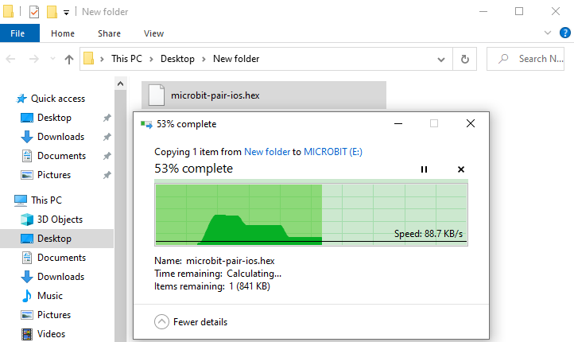

Open
t earch “micro bit”in your App Store to download the APP micro:bi hen click
“

”.

<

Connect your Apple device with Micro: Bit main board V2:

Firstly, turn on the Bluetooth of your Apple device and open the AP icro:bit to select item “Choose micro:bit”to start pairing Bluetooth.

Please make sure that the Micro: Bit main board V2 and your computer ar till linked via the USB cable.

Secondly, click“Pair a new micro:bit”;

Following the instructions to press button A and B at the same time(d ot release them until you are told to) and press Reset & Power butto or a few seconds.

Release the Reset & Power button, you will see a password pattern show n the LED dot matrix. Now , release buttons A and B and click Next.

Set the password pattern on your Apple device as the same pattern showe n the matrix and click Next.

Still click Next and a dialog box props up as shown below. Then clic Pair". A few seconds later, the match is done and the LED dot matri isplays the "√" pattern.

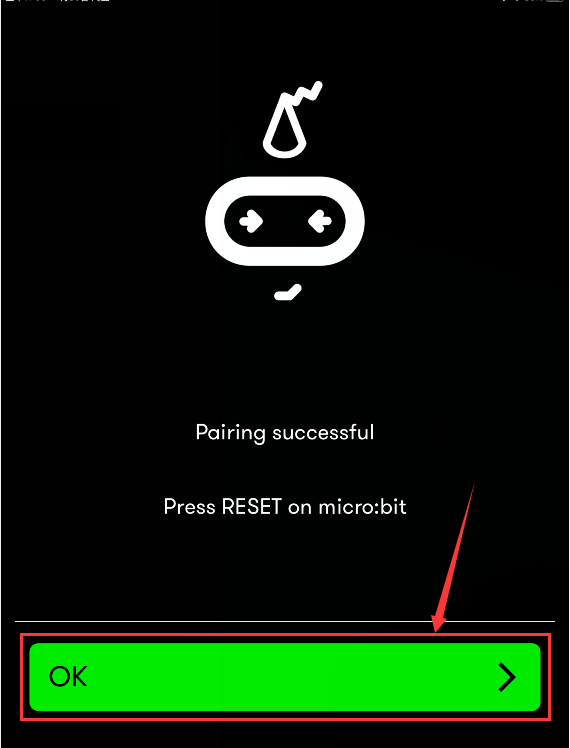

<

After the match with Bluetooth, write and upload code with the App.

Click “Create Code” to enter the programming page and write code.

Click

and the box

appears, and then select “Create √”.

Name the code as “1 “and click
 t ave it.

Click the third item“Flash”to enter the uploading page.  The defaul ode program for uploading is the one saved just now and named "1" an hen click the other "Flash" to upload the code program "1".

If the code is uploaded successfully a few seconds later, the App wil merge as below and the LED dot matrix of the Micro: Bit main board V ill exhibit a heart pattern.

Projects above all conduct with the built-in sensors and the LED do atrix of the main board while the following ones will carry out wit he help of external sensors of this turtle car.（Attention：In orde o avoid burning the the Micro:bit main board V2, please remove the US able and the external power from the board before fix it with th hield of the car; likewise, the USB cable and the external power shoul e cut from the main board before disconnect the shield from th oard.)

### Project 13：Seven-Color LED

1.  **Description**

This module consists of a commonly used LED with 7colors but in whit ppearance. It can automatically flash different colors to creat antastic light effects when high level is input like a normal LED.

2.  **Preparation**

- Insert the micro:bit board into the slot of keyestudi  4WD Mecanum Robot Car V2.0

- Place batteries into battery holder

- Dial power switch to ON end

- Connect the micro:bit to your computer via an USB cable

- Open the Web version of Makecode.

Import Hex profile [(How to import?)](\l) , or click“New Project”an rag blocks step by step(add MecanumRobot extension library first)

[**(How to add Mecanum_Robot extension?)**](\l)

3.  **Test Code**

Code1:

Make the RGB light flash 7 lights alternatively.

Code path:

|           |                                       |                                   |
|-----------|---------------------------------------|-----------------------------------|
| File Type | Path                                  | File Name                         |
| Hex file  | ..\2. Makecode Tutorial\Makecode Code | Project 13：Colorful Lights-1.hex |

Or you could edit code step by step in the editing area.

1)  Click“MecanumRobotV2”→find an    dragto“o    start”;

Copy

once;

Click the little triangle behind “Left”t hoose“Right”：

Compete Program:

Click“JavaScript" to view the corresponding JavaScript code: ：

Code2:

|           |                                       |                                   |
|-----------|---------------------------------------|-----------------------------------|
| File Type | Path                                  | File Name                         |
| Hex file  | ..\2. Makecode Tutorial\Makecode Code | Project 13：Colorful Lights-2.hex |

Or you could edit code step by step in the editing area.

1)  click“MecanumRobotV2” to find an    dragto“forever”;

Copy

once;

Click the little triangle behind “Left”t hoose“Right”：

2)  Click“Basic”to find an    drag
    and tap the little triangle to choose “    second”;

Copy
onc nd choose OFF
an ut them in forever.

Complete Program:

4.  **Test Result**

Download code 1 to micro:bit board and dial POWER switch to ON end,  GB lights of smart car emit red, green, blue, indigo, dark red ellow and white color cyclically.

Download code 2 to micro:bit board, 2 RGB lights will flash for  econd and then stop flashing for 1 second, cyclically.

([How to download?](\l) [How to quick download?](\l))

### Project 14：4 WS2812 RGB LEDs

1.  **Description**

The driver shield cooperates 4 pcs WS2812 RGB LEDs, compatible wit icro:bit board and controlled by P7. In this lesson, we will make th GB LEDs display different colors by P7. In this lesson, 3 sets of tes ode are provided to make the 4 WS2812 RGB LEDs display differen ffects.

2.  **Preparation**

- Insert the micro:bit board into the slot of keyestudi  4WD Mecanum Robot Car V2.0

- Place batteries into battery holder

- Dial power switch to ON end

- Connect the micro:bit to your computer via an USB cable

- Open the Web version of Makecode.

Import Hex profile [(How to import?)](\l) , or click“New Project”an rag blocks step by step(add MecanumRobot extension library first)

[**(How to add Mecanum_Robot extension?)**](\l)

3.  **Test Code**

Code 1：

|           |                                       |                                   |
|-----------|---------------------------------------|-----------------------------------|
| File Type | Path                                  | File Name                         |
| Hex file  | ..\2. Makecode Tutorial\Makecode Code | Project 14：WS2812 RGB LEDs-1.hex |

Or you could edit code step by step in the editing area.

a\. Enter“Neopixel” →“set strip to Neopixel at pin P0 with 24 leds a GB (GRB format)”

b\. Place it into“on start”block，

c\. Signal end P7 of WS2812 RGB is controlled by P7 of micro:bit . So w et to P7.

d\. Smart car has 4 pcs WS2812 RGB lights, so set to 4 leads

Click“Neopixel”to move block“strip clear”into“on start”block.

Click“Led” →“more” →“led enable(false)”and place it into“o tart”block，

Enter“Neopixel”to move block“strip show color red” into “forever” block

Click“Basic”to move“pause (ms) 100”block into“forever”block

Then set the delay to 1000ms

Copy code string
fo ight times, and click red to respectively set to orange, yellow, green lue, indigo, violet, purple and white.

Tap the triangle icon to select orange, yellow, green, blue, indigo iolet, purple and white.

Complete Code:

|                                                                       |
|-----------------------------------------------------------------------|
|  |

Click“JavaScript" to switch into the corresponding JavaScript code:

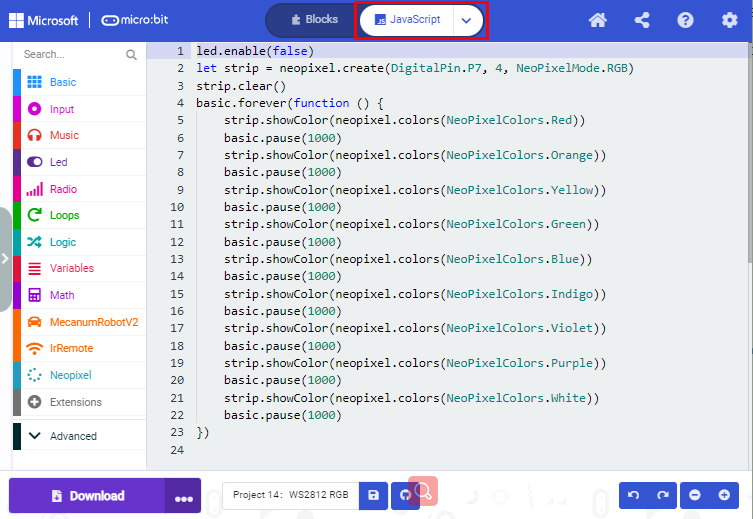

Code 2：

|           |                                       |                                   |
|-----------|---------------------------------------|-----------------------------------|
| File Type | Path                                  | File Name                         |
| Hex file  | ..\2. Makecode Tutorial\Makecode Code | Project 14：WS2812 RGB LEDs-2.hex |

a\. Enter“Neopixel” →“set strip to Neopixel at pin P0 with 24 leds a GB (GRB format)”

b\. Place it into“on start”block，

c\. Signal end P7 of WS2812 RGB is controlled by P7 of micro:bit . So w et to P7.

d\. Smart car has 4 pcs WS2812 RGB lights, so set to 4 leads

Click“Led” →“more” →“led enable(false)”and place it into“o tart”block，

Click“Loops”to drag“for index from 0 to 4...do”into“forever”block

Change 4 into 3

Click“Neopixel”to move block“strip clear”into block“for index from 0 t ...do”

Tap“Neopixel”→“more”→“strip set pixel color at 0 to red”

Place it into“for index from 0 to 3...do”block

Click“Variables”to move“index”into 0 box

Click“Neopixel”to move“strip show”into“for index from 0 to 3...do” block

Tap“Basic”to move “pause (ms) 100”block into“index from 0 to 3...do”an et the delay to 100ms.

Replicate cod tringfo ight times and place them into“forever”block.

Click red to respectively choose orange, yellow, green, blue, indigo iolet, purple and white.

Complete Code：

<table>
<colgroup>
<col style="width: 100%" />
</colgroup>
<tbody>
<tr>
<td>

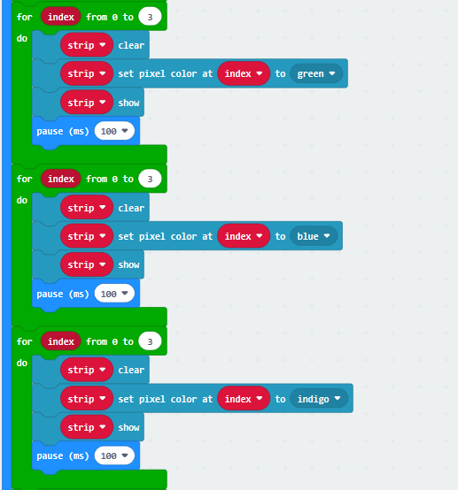

</td>
</tr>
</tbody>
</table>

Click“JavaScript" to switch into the corresponding JavaScript code:

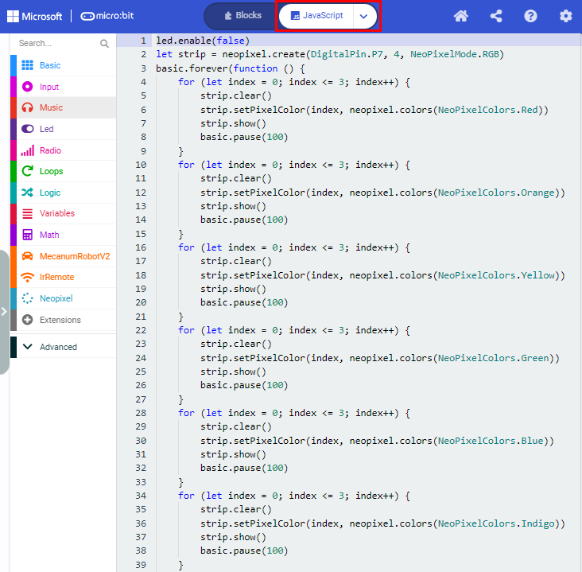

Code 3：

|           |                                       |                                   |
|-----------|---------------------------------------|-----------------------------------|
| File Type | Path                                  | File Name                         |
| Hex file  | ..\2. Makecode Tutorial\Makecode Code | Project 14：WS2812 RGB LEDs-3.hex |

Or you could edit code step by step in the editing area.

a\. Enter“Neopixel” →“set strip to Neopixel at pin P0 with 24 leds a GB (GRB format)”

b\. Place it into“on start”block，

c\. Signal end P7 of WS2812 RGB is controlled by P7 of micro:bit . So w et to P7.

d\. Smart car has 4 pcs WS2812 RGB lights, set to 4 leads

<

Click“Led” →“more” →“led enable(false)”and place it into“o tart”block，

Click“Variables”→“Make a Variable...”

Input R to build up variable R

We create variable“G”and“B”in same way

Drag“set B to 0”into“on start”block

Copy“set B to 0”twice and click triangle button to choose G and B

Click“Loops”to get block“for index from 0 to 4...do”

Leave it into “forever”and change 4 into 3

Move block“set B to 0”into“for index from 0 to 3...do”block,

Click B to choose R

Go to“Math”to drag block“pick random 0 to 10”into 0 box

Change 0 into 10, 10 into 255

Replicate block
twic nd place them into“for index from 0 to 3...do”block.

Click R to select G and B

Tap“Neopixel”and move“strip clear”into“for index from 0 to 3...do”
block.

Go to“Neopixel”→“more”→“strip set pixel color at 0 to red”

Leave it in the block“for index from 0 to 3...do”block

Drag block“red 255 green 255 blue 255”into“red”box

Tap“Variables”to move“index”block into 0 box

Separately drag R , G and B into 255 box, as shown below:

Click“Basic”to drag“pause (ms) 100” under block “strip.....B”

Set the delay to 500ms.

Click“Neopixel”to move“strip show”block under “pause(as) 500”

Complete Code:

|                                                                   |
|-------------------------------------------------------------------|
|  |

Click“JavaScript" to switch into the corresponding JavaScript code:

4.  **Test Result**

Download code 1 to micro：bit, and dial POWER to ON end. All fou S2812RGB LEDs light up a different color a time cyclically.

Download code 2 to micro：bit, WS2812RGB LEDs display like flow light.

Download code 3 to micro：bit, every WS2812RGB light shows random colo ne by one.

([How to download?](\l) [How to quick download?](\l))

### Project 15：Servo

1.  **Description**

For those DIY smart cars, they often have the function of automati bstacle avoidance. In the DIY process, we need to use a servo t ontrol the ultrasonic module to rotate left and right, and then detec he distance between the car and the obstacle, so as to control the ca o avoid the obstacle. If other microcontrollers are used to control th otation of the servo, we need to set a certain frequency and a certai idth of pulse to control the servo angle.

However, if the micro:bit main board is used to control the servo angle e only need to set the control angle in the development environmen here the corresponding pulse will be automatically set to control th ervo rotation. In this project, you will learn how to control the serv o rotate back and forth between 0° and 90°.

2.  **Information of the Servo**

Servo motor is a position control rotary actuator. It mainly consists o ousing, circuit board, core-less motor, gear and position sensor. It orking principle is that the servo receives the signal sent by MCU o eceiver, and produces a reference signal with a period of 20ms an idth of 1.5ms, then compares the acquired DC bias voltage to th oltage of the potentiometer and obtains the voltage difference output.

Fo he servo used in this project, the brown wire is the ground, the re ne is the positive wire, and the orange one is the signal wire.

The rotation angle of servo motor is controlled by regulating the dut ycle of PWM (Pulse-Width Modulation) signal. The standard cycle of PW ignal is 20ms (50Hz). Theoretically, the width is distribute etween 1ms-2ms, but in fact, it's between 0.5ms-2.5ms. The widt orresponds to the rotation angle from 0° to 180°. But note that fo ifferent brand motor, the same signal may have different rotatio ngle. 

More details:

3.  **Parameters**

- Working voltage: DC 4.8V ~ 6V

- Operating angle range: about 180 ° (at 500 → 2500 μsec)

- Pulse width range: 500 → 2500 μsec

- No-load speed: 0.12 ± 0.01 sec / 60 (DC 4.8V) 0.1 ± 0.01 sec / 60 (D  6V)

- No-load current: 200 ± 20mA (DC 4.8V) 220 ± 20mA (DC 6V)

- Stopping torque: 1.3 ± 0.01kg · cm (DC 4.8V) 1.5 ± 0.1kg · cm (DC 6V)

- Stop current: ≦ 850mA (DC 4.8V) ≦ 1000mA (DC 6V)

- Standby current: 3 ± 1mA (DC 4.8V) 4 ± 1mA (DC 6V)

4.  **　Preparation**

- Insert the micro:bit board into the slot of keyestudi  4WD Mecanum Robot Car V2.0

- Place batteries into battery holder

- Dial power switch to ON end

- Connect the micro:bit to your computer via an USB cable

- Open the Web version of Makecode

Import Hex profile [**(How to import?)**](\l) , or click“New Project”an rag blocks step by step(add MecanumRobot extension library first)

[**(How to add Mecanum_Robot extension?)**](\l)

5.  **Test Code**

|           |                                       |                       |
|-----------|---------------------------------------|-----------------------|
| File Type | Path                                  | File Name             |
| Hex file  | ..\2. Makecode Tutorial\Makecode Code | Project 15：Servo.hex |

Or you could edit code step by step in the editing area.

1)  Click“Variables”; motor“Make a Variable name” create a variabl    named“angle”; set the value t    0：;
    and then put it into“o    start”;

(2)Click“Loops”to find an ragto“forever”an hange the number to“180”; click“MecanumRobotV2”to find an ragan ut variable“angle”into
;
pu nto
and change the digit 0 t 80;

Click
of “Variable” and
 of
“Math”; put variable”angle” on the left and change the umber on th ight t :;pu  nto：;Put
behindan dd delay i 0ms;

Copy
onc nd change the “+”of
 to
“-”：.

Complete Program:

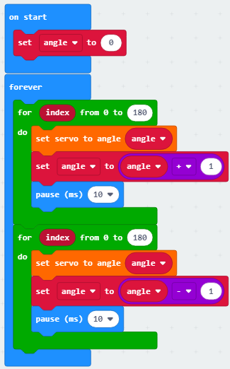

Click“JavaScript" to view the corresponding JavaScript code: ：

6.  **Test Result**

After uploading the test code and dial POWER switch to ON end, the serv otates from 0 degree to 180 degrees.

([How to download?](\l) [How to quick download?](\l))

### Project 16：Motor

1.  **Description**

The Keyestudio 4WD Mecanum Robot Car is equipped with 4 DC reductio otors, also called gear reduction motor, which is developed on th rdinary DC motor. It has a matching gear reduction box which provides  ower speed but a larger torque. Furthermore, different reduction ratio f the box can provide different speeds and torques.

Gear motor is the integration of gearmotor and motor, which is applie idely in steel and machine industry

Micro:bit motor driver shield comes with a DRV8833 chip. In order t ave the IO port resource, we control the rotation direction and spee f 4 DC gear motors with the DRV8833 chip.

Front

Back

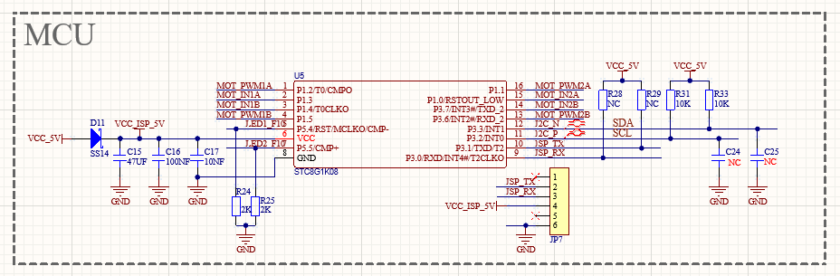

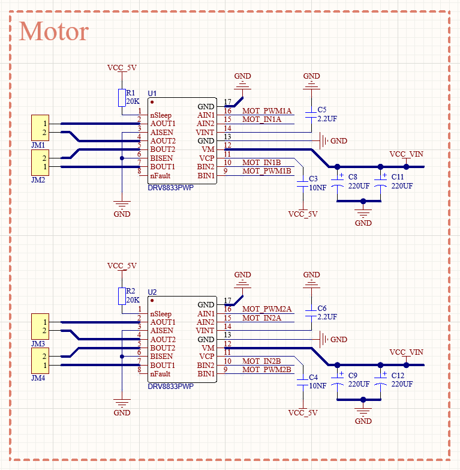

2.  **　Preparation**

- Insert the micro:bit board into the slot of keyestudi  4WD Mecanum Robot Car V2.0

- Place batteries into battery holder

- Dial power switch to ON end

- Connect the micro:bit to your computer via an USB cable

- Open the Web version of Makecode

Import Hex profile [**(How to import?)**](\l) , or click“New Project”an rag blocks step by step(add MecanumRobot extension library first)

[**(How to add Mecanum_Robot extension?)**](\l)

3.  **Test Code**

Code 1：

|             |                                       |                         |
|-------------|---------------------------------------|-------------------------|
| File Type   | Route                                 | File Name               |
| Python file | ..\2. Makecode Tutorial\Makecode Code | Project 16：Motor-1.hex |

Or you could edit code step by step in the editing area.

(1)Click“ MecanumRobotV2”to find an rag
into“forever”;click the number behind speed to choos 5;

(2)Copyfou imes; click the little triangle behind “Motor”to choos ower_left，Upper_right，Lower_right respectively; and put them all i orever;

(3)Click“Basic”to find and drag“pause (ms) 100”to“forever”;set dela  000ms;

(4)Click“MecanumRobot”to find an rag
to
;
copy

once and put i ehind.

Complete Program:

Click“JavaScript" to view the corresponding JavaScript code: ：

Code2：

Code path:

|           |                                       |                         |
|-----------|---------------------------------------|-------------------------|
| File Type | Path                                  | File Name               |
| Hex file  | ..\2. Makecode Tutorial\Makecode Code | Project 16：Motor-2.hex |

Or you could edit code step by step in the editing area.

Drag an opythre imes; click the little triangle behind”run”to choose a hown，
， ，
An hen put they all in forever and add
.

Complete Program:

Click“JavaScript" to view the corresponding JavaScript code: ：

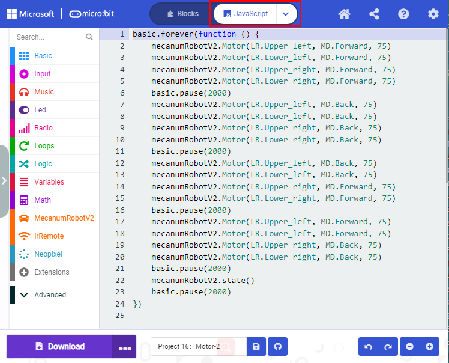

4.  **Test Result**

Download code 1 to micro:bit board, dial POWER switch to ON end. Smar ar goes forward for 2s and stops for 2s.

Download code 2 to micro:bit board, the car goes forward for 2s, turn ack for 2s, turn left for 2s, turn right for 2s and stops for 2s an epeats this pattern.

([How to download?](\l) [How to quick download?](\l))

### Project 17：Line Tracking Sensor

#### Project 17.1：Detect Line Tracking Sensor

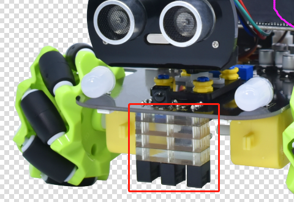

1. Description

The motor driver board of the Keyestudio 4WD Mecanum Robot Car come ith a 3-channel line tracking sensor, which adopts TCRT5000 IR tube nd 3 potentiometers.

The TCRT5000 IR tube contains an IR emitting tube and an IR receivin ube. When the infrared signals of the emitting tube is received by th eceiving tube through reflection, the resistance of the receiving tub ill change, which is generally reflected in the voltage change on th ircuit.  

The resistance varies depending on the intensity of the infrared signal eceived by the receiving tube, which is often in the color of th eflecting surface and the distance of the reflecting surface receivin ube.  At the time of detection, black is high level active and white i ow level active. 

2.  **Working Principle**

When the car runs above a white road, the IR emitting tube installe nder the car emits infrared signals to detect the road and th eceiving tube will receive signals sending back. Then the output en utputs low level(0); when it detects black lines, it outputs hig evel(1).

After putting a white paper on the bottom of the 4WD Mecanum Robot Car e will rotate the potentiometers on the 3-way tracking sensor. When th ndicator light on the sensor module is on, pick up the car to make th wo wheels on the 4WD Mecanum Robot Car separate. The height of th hite paper is about 1.5cm, when the indicator light on the senso odule is off, and then the sensitivity is adjusted.

3.  **　Preparation**

- Insert the micro:bit board into the slot of keyestudi  4WD Mecanum Robot Car V2.0

- Place batteries into battery holder

- Dial power switch to ON end

- Connect the micro:bit to your computer via an USB cable

- Open the Web version of Makecode

Import Hex profile [**(How to import?)**](\l) , or click“New Project”an rag blocks step by step(add MecanumRobot extension library first)

[**(How to add Mecanum_Robot extension?)**](\l)

4.  **Test Code**

Code 1：

|           |                                       |                                                 |
|-----------|---------------------------------------|-------------------------------------------------|
| File Type | Path                                  | File Name                                       |
| Hex file  | ..\2. Makecode Tutorial\Makecode Code | Project 17.1：Detect Line Tracking Sensor-1.hex |

Or you could edit code step by step in the editing area.

Click“Advanced”→“Serial”→“serial redirect to USB”

Place it into“on start”

Click“Led”→“more”→“led enable(false)”and place it into“on start”block.

Enter“Advanced”→“Serial”→

Leave it into“forever”block.

Input “left”and drag out block

Click“MecanumRobotV2”, and drag out block
an lace it behind the
.

Copy

once nd change Left t enter

.

Copy

an hange Left t enter

.

Copy

，an rag ou lock

.

Find and drag out
from“MecanumRobotV2”
and place i nto

，an hen change Left to Right.

<

Click“Basic”to find and drag“pause (ms) 100”to“forever”and set the dela o 200ms

<

Complete Program:

Click“JavaScript" to view the corresponding JavaScript code: ：

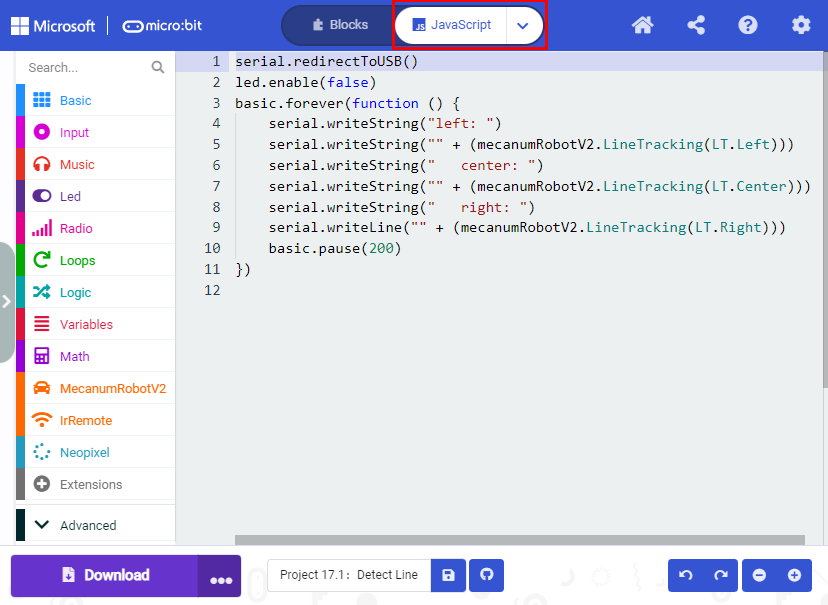

<

Open CoolTerm, click Options to select SerialPort. Set COM port an 15200 baud rate. Click“OK”and“Connect”.

The CoolTerm serial monitor displays the digital signals read by th ine tracking sensors.

#### Project 17.2：Tracking Smart Car

1. Description

In this lesson we will combine a line tracking sensor with a motor t ake a line tracking smart car.

The micro:bit board will analyze the signals and control the smart ca o show the line tracking function.

2. Working Principle

The smart car will make different moves according to the value receive y the 3-channel line tracking sensor.

|                           |                             |                            |               |               |                                           |
|---------------------------|-----------------------------|----------------------------|---------------|---------------|-------------------------------------------|
| Left line tracking sensor | Middle line tracking sensor | Right line tracking sensor | Binary values | Decimal value | Microbit 4WD Mecanum Robot Car V2.0的行动 |
| LOW（0)                   | LOW（0                      | LOW（0                     | 000           | 0             | Stop                                      |
| LOW（0)                   | LOW（0)                     | HIGH（1）                  | 001           | 1             | Turn Right                                |
| LOW（0)                   | HIGH（1）                   | LOW（0                     | 010           | 2             | Go forward                                |
| LOW（0)                   | HIGH（1）                   | HIGH（1）                  | 011           | 3             | Turn Right                                |
| HIGH（1）                 | LOW（0)                     | LOW（0                     | 100           | 4             | Turn Left                                 |
| HIGH（1）                 | LOW（0)                     | HIGH（1）                  | 101           | 5             | Go forward                                |
| HIGH（1）                 | HIGH（1）                   | LOW（0                     | 110           | 6             | Turn Left                                 |
| HIGH（1）                 | HIGH（1）                   | HIGH（1）                  | 111           | 7             | Stop                                      |

3. Preparation

- Insert the micro:bit board into the slot of keyestudi  4WD Mecanum Robot Car V2.0

- Place batteries into battery holder

- Dial power switch to ON end

- Connect the micro:bit to your computer via an USB cable

- Open the Web version of Makecode

Import Hex profile [**(How to import?)**](\l) , or click“New Project”an rag blocks step by step(add MecanumRobot extension library first)

[**(How to add Mecanum_Robot extension?)**](\l)

Warning: The 3-way tracking sensor should be used in environment ithout infrared interference such as sunlight. Sunlight contains a lo f invisible light, such as infrared and ultraviolet. In an environmen ith strong sunlight, the 3-way tracking sensor cannot work properly.

4. Flow Chart

5.  **Test Code**

Code path:

|           |                                       |                                       |
|-----------|---------------------------------------|---------------------------------------|
| File Type | Path                                  | File Name                             |
| Hex file  | ..\2. Makecode Tutorial\Makecode Code | ..\2. Makecode Tutorial\Makecode Code |

Or you could edit code step by step in the editing area.

Click“Variables”→“Make a Variable...”→“New variable name：”.

Input LL →“OK”，then the variable "LL" is established, an ariable“CC”and“RR”are likewise.

Drag out“set RR to 0”and place into“on start”block, copy“set RR to 0” imes and place into“on start”block.

Click the drop-down triangle button after RR to select LL and CC.

Click“le nable(false)”and place into“on start”block.

<

Click“Variables”, find and drag out “set RR t ”into“forever”block.

Click the drop-down triangle button after RR to select LL an lick“MecanumRobotV2”.

Find and dra utan ut it at the number 0 after to.

[Duplicate](C:\\Users\\NINGMEI\\AppData\\Local\\youdao\\dict\\Application\\9.0.1.1\\resultui\\html\\index.html#\\javascript:;)2time nd place into“forever”block.

Change the second LL to CC，”Left”to”Center”and th hird LL to RR，”Left”to ”Right”.

<

Click“Logic”, find and drag out“if tru hen...else”into“forever”block.

Click“

”7time o add else if, then clic lse

onc o cancel else.

Find and drag out 2“and”block into
and block.

<

[Duplicate](C:\\Users\\NINGMEI\\AppData\\Local\\youdao\\dict\\Application\\9.0.1.1\\resultui\\html\\index.html#\\javascript:;)“LL”2time nd place it into and block.

Click the drop-down triangle button after to select CC and
.

<

[Duplicate](C:\\Users\\NINGMEI\\AppData\\Local\\youdao\\dict\\Application\\9.0.1.1\\resultui\\html\\index.html#\\javascript:;) imes，and change o according to the below:

<

Click “Functions”of ”Advance”an lick.

Change“doSomething”to
“car_forward”，“car_back”，“car_left”，“car_right”respectively.

<

Click “Functions”of ”Advance”to find and drag
  imes to the first and third else if.

Click “Functions”of ”Advance”to find and drag
  imes to the the fourth and the sixth else if and find and drag out
  imes and put in the second one .

In the fifth and seventh Els f，click“MecanumRobotV2”,

if an rag
to the first else if, find an ragonce nd place it into the first if.

<

Complete Program:

Click“JavaScript"to view the corresponding JavaScript code:

5. Test Result

Download code to micro:bit and dial POWER to ON end, line tacking ca oes forward along black line .

Note: turn on the switch at the back of micro:bit car.

the width of black line should be larger than the width of line trackin ensor.

Avoid to test smart car under the strong light.

### Project 18：Ultrasonic Sensor

#### Project 18.1：Ultrasonic Ranging

1.  **Description**

The ultrasonic sensor uses sonar to determine distance to an object lik ats do. It offers excellent non-contact range detection with hig ccuracy and stable readings in an easy-to-use package. It come omplete with ultrasonic transmitter and receiver modules.

The ultrasonic sensor is being used in a wide range of electronic rojects for creating obstacle detection and distance measurin pplication as well as various other applications.

The ultrasonic module will emit the ultrasonic waves after trigge ignals. When the ultrasonic waves encounter the object and ar eflected back, the module outputs an echo signal, so it can determin he distance of object from the time difference between trigger signa TRIG)and echo signal(ECHO).

As the picture shows, it is like two eyes. One is transmitting end, th ther is receiving end.

According to the above wiring diagram, the integrated port of th ltrasonic sensor module is connected to the 5V G P15 P16 port on th icro:bit motor driver base plate. The Trig (T) pin is controlled by P1 f the micro:bit and the pin of Echo (E) the P16.

<

2. Working Principle

(1)Pull down TRIG then trigger high level signals with least 10us;

(2)After triggering, the module will automatically send eight 40KH ltrasonic pulses and detect whether there is a signal return;

(3)If there is a signal return, when ECHO (E) outputs a high level, the he duration of the high level is the time from transmission t eception of the ultrasonic waves. Then test distance = high leve uration \*340m/s\*0.5. 

3. Parameters

- Working voltage: 3-5.5V (DC)

- Working current: 15mA

- Working frequency: 40khz

- Maximum detection distance: about 3m

- Minimum detection distance: 2-3cm

- Precision: up to 0.2cm

- Sensing angle: less than 15 degrees

- Input trigger pulse: 10us TTL level

- Output echo signal: output TTL level signal (high), proportional t  range

4. Preparation

- Insert the micro:bit board into the slot of keyestudi  4WD Mecanum Robot Car V2.0

- Place batteries into battery holder

- Dial power switch to ON end

- Connect the micro:bit to your computer via an USB cable

- Open the Web version of Makecode

Import Hex profile [**(How to import?)**](\l) , or click“New Project”an rag blocks step by step(add MecanumRobot extension library first)

[**(How to add Mecanum_Robot extension?)**](\l)

5. Test Code

|           |                                       |                                       |
|-----------|---------------------------------------|---------------------------------------|
| File Type | Path                                  | File Name                             |
| Hex file  | ..\2. Makecode Tutorial\Makecode Code | Project 18.1： Ultrasonic Ranging.hex |

Or you could edit code step by step in the editing area.

(1)Tap“Advanced”→“Serial” →“serial redirect to USB”

Combine it with“on start”block

(2)Click“Advanced”→“Serial” to find and drag“serial write valu =0”into“forever”; Click“MecanumRobot”to find and drag“Ultrasonic”to th  on the right side of“serial write value x=0”and change the x on th eft side of “=”to distance:

\(3\) find an ragof
“Basic”,and change 100 to 200and place i ehind

Complete Program:

Click“JavaScript" to view the corresponding JavaScript code: ：

6.  **Test Result**

Download code to micro:bit, keep USB cable connected, dial POWER switc o ON end. The distance value will be displayed on monitor.

([How to quick download?](\l))

The monitor shows the distance between the obstacle and ultrasoni ensor(as shown below).

Open CoolTerm, click Options to select SerialPort. Set COM port an 15200 baud rate(the baud rate of USB serial communication of Micro:bi s 115200 through the test). Click “OK” and “Connect”.

CoolTerm serial monitor displays the distance value as follows:

#### Project 18.2：Ultrasonic Avoidance

1. Description

In this project, we will integrate an ultrasonic sensor and a car t ake an ultrasonic avoidance car.

Its principle is to detect the distance between the car and obstacle vi he ultrasonic sensor to control the motion of smart car.

2.  **Preparation**

- Insert the micro:bit board into the slot of keyestudi  4WD Mecanum Robot Car V2.0

- Place batteries into battery holder

- Dial power switch to ON end

- Connect the micro:bit to your computer via an USB cable

- Open the Web version of Makecode

Import Hex profile [**(How to import?)**](\l) , or click“New Project”an rag blocks step by step(add MecanumRobot extension library first)

[**(How to add Mecanum_Robot extension?)**](\l)

3.  **Flow Chart**

4.  **Test Code**

Code path:

|           |                                       |                                             |
|-----------|---------------------------------------|---------------------------------------------|
| File Type | Path                                  | File Name                                   |
| Hex file  | ..\2. Makecode Tutorial\Makecode Code | Project 18.2： Ultrasonic Avoidance Car.hex |

Or you could edit code step by step in the editing area.

(1)Enter“Basic” →“show icon ♥”

Place it into“on start”and click the triangle button t elect“”
pattern

Click “Functions”of ”Advance”an lick.

Change“doSomething”to
“car_forward”，“car_back”，“car_left”，“car_right”respectively.

<

Click“Variables” and then click“Make a Variable..., dialog box“Ne ariable name：”pops up;

Fill it with “distance”;

Click“OK”to establish variable“distance;

Set the functions of servo:

Click“Variables”, drag out “set distance to 0”an lace it into“forever”.

Click“MecanumRobotV2”to find and drag“Ultrasonic”to the 0 behin he”to”:

<

Click“Logic”to find and drag“if true then...else”to“forever”;

Find and drag“=”to “true”;

Click“Variables”to find and drag“distance”on the left of“=”;

Click the little triangle behind“=”to choose“\<”;

Change the 0 behind “\>”to 20:

Click Funtionsto of “Advance”to find an rag;

Click“MecanumRobot”to find an rag
to then;

Click“Basic”to find

and change the 100 to 500:

Click“MecanumRobot”to find an rag
and change the 0 to 180;

Copy

once;

Click“Variables”to find and drag“set distance_l to 0”;

Click“MecanumRobotV2”to find and drag“Ultrasonic”to 0 behind
“to”;

Copy
once;

Copy

once;

Change the 180 to 0, distance_l to distance_r and others remai nchanged:

Click“Logic”to find and drag“if true then...else”;

Find and drag“=”to true;

Click“Variables”to find and drag“distance_l to the left of “=”; Clic he little triangle behind“=”to choose“\>”;

Change the 0 behind “\>”to “distance_r”:

Click Funtions of “Advance”to find an rag;

Click“MecanumRobotV2”to find an rag;

Change the 0 to 90;

Click“Basic”to find and drag

and change the 100 to 300:

Change
 to

and place it in the first “else”：

Click “Funtions” of “Advance”to find an rag，an lace it to the second “else”：

Complete Program:

Click“JavaScript" to view the corresponding JavaScript code: ：

<

<

5.  **Test Result**

Download code to micro:bit, dial to ON end, and dial POWER to ON end hen the obstacle distance is greater than 20cm, the car goes forward ;
on the contrary, smart car turns left.

([How to download?](\l) [How to quick download?](\l))

#### Project 18.3：Ultrasonic Following

1. Description

In previous lesson, we’ve learned the basic principle of line trackin ensor. Next, we will combine the ultrasonic sensor with the car to mak n ultrasonic following car.

The ultrasonic sensor detects the obstacle distance and control th otion status of car.

2. Preparation

- Insert the micro:bit board into the slot of keyestudi  4WD Mecanum Robot Car V2.0

- Place batteries into battery holder

- Dial power switch to ON end

- Connect the micro:bit to your computer via an USB cable

- Open the Web version of Makecode

Import Hex profile [**(How to import?)**](\l) , or click“New Project”an rag blocks step by step(add MecanumRobot extension library first)

[**(How to add Mecanum_Robot extension?)**](\l)

3. Flow Chart

4. Test Code

Code path:

|           |                                       |                                               |
|-----------|---------------------------------------|-----------------------------------------------|
| File Type | Path                                  | File Name                                     |
| Hex file  | ..\2. Makecode Tutorial\Makecode Code | Project 18.3：Ultrasonic Follow Smart Car.hex |

Or you could edit code step by step in the editing area.

(1)Enter“Basic” →“show icon ♥”

Place it into“on start”and click the triangle button t elect“”
pattern。

(2)Click“ MecanumRobotV2”to find an ragto“o tart”and change the angle 0 to 90:

Click “Functions”of ”Advance”and click“Make  unction”, then
wil ppear.

Change“doSomething”to
“car_forward”，“car_back”，“car_left”，“car_right”respectively.

<

Click“Variables” and then click“Make a Variable...”, the dialog box“Ne ariable name：”pops up; fill it with “distance”;

Click“OK”to establish variable“distance”;

Drag“set distance to 0” to “forever”;

Click“ MecanumRobotV2”to find an ragt he “0” of“set distance to 0”:

Click“Logic”to find and drag“if true then...else”to“forever”;

Find and drag“=”to true;

Click“Variables”to find and drag“distance”to the left side of “=”;

Click the little triangle behind“=”to choose“\<”;

Change the 0 behind “” to 10:

Click “Functions” of“ Advance”to find an ragto“then”:

Change the 10 to 20, car_back to car stop:

Change the 20 to 40，car stop to car forward; Place car stop to th ast”else”:

Complete Program:

Click“JavaScript" to view the corresponding JavaScript code: ：

5. Test Result

Download code to micro:bit, dial POWER switch to ON end on shield, smar ar could follow the obstacle to move.

([How to download?](\l) [How to quick download?](\l))

### Project 19：IR Remote Control

#### Project 19.1：Decode IR Remote Control

1. Description

There is no doubt that infrared remote control is ubiquitous in dail ife. It is used to control various household appliances, such as TVs tereos, video recorders and satellite signal receivers. Infrared remot ontrol is composed of infrared transmitting and infrared receivin ystems, that is, an infrared remote control, an infrared receivin odule and a single-chip microcomputer capable of decoding.

The 38K infrared carrier signal emitted by remote controller is encode y the encoding chip in the remote controller. It is composed of  ection of pilot code, user code, user inverse code, data code, and dat nverse code. The time interval of the pulse is used to distinguis hether it is a 0 or 1 signal and the encoding is made up of these 0,  ignals.

The user code of the same remote control is unchanged. The data code ca istinguish the key.

When the remote control button is pressed, the remote control sends ou n infrared carrier signal. When the IR receiver receives the signal he program will decode the carrier signal and determines which key i ressed. The MCU decodes the received 01 signal, thereby judging wha ey is pressed by the remote control.

Infrared receiver we use is an infrared receiver module. Mainly compose f an infrared receiver head, it is a device that integrates reception mplification, and demodulation. Its internal IC has complete emodulation, and can achieve from infrared reception to output and b ompatible with TTL signals. Additionally, it is suitable for infrare emote control and infrared data transmission. The infrared receivin odule made by the receiver has only three pins, signal line, VCC an ND.

According to the picture above, the integrated port of the infrare eceiver is connected to the P9 5V G port on the motor driver board an ontrolled by the the P9 of the micro:bit.

2. Parameters:

- Operating Voltage: 3.3-5V（DC）

- Interface: 3PIN

- Output Signal: Digital signal

- Receiving Angle: 90 degrees

- Frequency: 38khz

- Receiving Distance: about 5m

3. Preparation

- Insert the micro:bit board into the slot of keyestudi  4WD Mecanum Robot Car V2.0

- Place batteries into battery holder

- Dial power switch to ON end

- Connect the micro:bit to your computer via an USB cable

- Open the Web version of Makecode

Import Hex profile [**(How to import?)**](\l) , or click“New Project”an rag blocks step by step(add MecanumRobot extension library first)

[**(How to add Mecanum_Robot extension?)**](\l)

4. Test Code

|           |                                       |                                            |
|-----------|---------------------------------------|--------------------------------------------|
| File Type | Path                                  | File Name                                  |
| Hex file  | ..\2. Makecode Tutorial\Makecode Code | Project 19.1：Decode IR Remote Control.hex |

Click“Advanced”→“Serial”→“serial redirect to USB”

Place it into“on start”block.

Enter“IrRemote”→“connect IR receiver at P0”

Put it into“on start”block

IR receiving module is controlled by P0 of micro:bit board

Click“Led”→“more”→“led enable(false)”, and place it into “on start”.

Go to“Variables”→“Make a Variable...”→ “New variable name：” dialo ox，

Enter“val”and click“OK”to create variable“val”

Then drag out“set val to 0”block into“forever”block.

Go to“Ir Remote”→“IR button”

Place it into 0 box

Click“Advanced”→“Serial”→“serial write value“x”=0”

Put it into“forever”block

Change“x”into“IR”

Enter“Variables”to move block“val”into 0 box behind“=”

Drag out block“pause (ms) 100”from“Basic”and delay in 1000ms

Leave it into“forever”block

Complete Program：

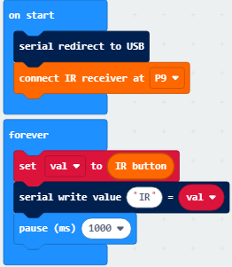

Click“JavaScript" to switch into the corresponding JavaScript code:

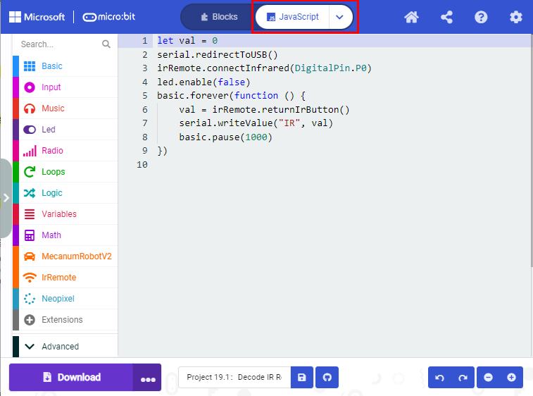

Code explanation: If the buttons are not pressed, the serial monito onstantly shows 0; when pressed, the corresponding key values ar isplayed.

Notes：

The remote control in this kit is not inclusive of batteries. W ecommend you to purchase them online.(battery type:CR2025).

Make sure IR remote is good before test. There is a tip for you to chec t.

Open the cellphone camera , make IR remote control point at camera an ress button. The remote control is good if you see the purple flashin ight in the camera.

Download code to micro: bit board and don’t plug off USB cabl lick

([How to quick download?](\l))

Make IR remote control point at IR receiver and press the button, th erial monitor will display the corresponding key values, as show elow：

Open CoolTerm, click Options to select SerialPort. Set COM port an 15200 baud rate. Click“OK”and“Connect”.

CoolTerm serial monitor shows the key value as follows:

The key value is displayed as for your reference:

#### Project 19.2：IR Remote Control 

1. Description

In this project, we combine IR remote control with car shield to make a R remote smart car. Its principle is to control the motion of car b ending key signals from IR remote control to IR receiving module of ca hield.

2. Preparation

- Insert the micro:bit board into the slot of keyestudi  4WD Mecanum Robot Car V2.0

- Place batteries into battery holder

- Dial power switch to ON end

- Connect the micro:bit to your computer via an USB cable

- Open the Web version of Makecode

Import Hex profile [**(How to import?)**](\l) , or click“New Project”an rag blocks step by step(add MecanumRobot extension library first)

[**(How to add Mecanum_Robot extension?)**](\l)

Note: The infrared sensor and infrared remote control should not b sed in environments with infrared interference such as sunlight for i ontains a lot of invisible lights, such as infrared and ultraviolet. I n environment with strong sunlight, they cannot work normally.

3. Flow Chart

4. Test Code

Code path:

|           |                                       |                                      |
|-----------|---------------------------------------|--------------------------------------|
| File Type | Path                                  | File Name                            |
| Hex file  | ..\2. Makecode Tutorial\Makecode Code | Project 19.2：IR Remote Control .hex |

Or you could edit code step by step in the editing area.

(1)Create four functions to control the car to move forward and back an urn left and right:

<

(2)Click“Ir Remote”to find and drag“connect IR receiver at P0”into“o tart”; Click the little triangle behind P0 to choose P0;

<

(3)Click“Variables”then click“Make a Variable...”, the dialog box“Ne ariable name：”pops up; fill it with“val” and click“OK”to creat ariable“val”;

Create variable“val2”with the same method; find and drag“set val2 t ”to“on start”and copy it once to put into“on start”too;

Click the little triangle behind the first val2 to choose “val”;

（4)Click “Led”→“more”→“led enable(false)”and place it into“on start”.

(5)Click “Variables”, find and drag“set val2 to 0”into“forever”.

Click the little triangle behind the val2 to choose “val”.

Click“IrRemote”→“IR button”and place it into 0 behind the to.

(6)Click“Logic”to find and drag“if true then”into“forever”; find an rag “=”into“true”;

Click“Variables”to find and drag“val”to the left side of “=; the 0 o he right side of “=”remain unchanged; click the little triangl ehind “=”to choose“≠”;

(7)Click“Variables”to find and drag“set val2 to 0”into “then”;find an rag “val”into the o behind “to” of“set val2 to 0”;

(8)Click“Logic”to find and drag“if...then...else”to then;

Click“”of”
if...then...else”four times;

Click“”behind
“else”once to delete else;

Find and drag “=” to “true”;

(9)Click“Variables”to find and drag“val2”to the left side of“=”an hange the 0 on the right of“=”to 70:

(10)Click“Functions” of“Advance”to find an ragt he second “then”:

(11)Copy “val2=70”once and place it behind the first “if”;change th 0 behind “=”to 68.

(12)Click“Functions” of“Advance”to find an rag
to the second “then” .

(13)Copy“val2=68”once and place it behind the second “else if “; chang he 68 behind “=”to 67； place it in the forth “then”;
Click“Functions”of“Advance”to find an ragt he forth “then”:

(14)Copy“val2=67”once and put it behind “=” of the third “else if ;
change the number 67 to 21; click “Functions” of “Advance”to find an rag
to the fifth “then”:

(15)Copy “val2=21”once and place it behind the fourth “else if “; chang he the number 21 behind“=”to 64；Click“MecanumRobotV2”to find and drag
 t he sixth “then”:

Complete Program:

Click“JavaScript" to switch into the corresponding JavaScript code:

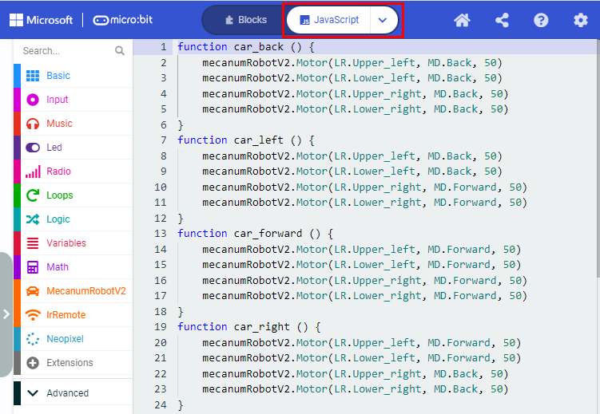

5. Test Result

Download code to micro:bit board, and dial POWER to ON end.

Make IR remote control point at micro:bit and press the button t ontrol smart car to move.

butto akes smart car mov orward，stand or turnin eft，implie ightward turning,
indicate ovin ackward，
stops car.

([How to download?](\l) [How to quick download?](\l))

Note: The distance between IR remote control and IR receiving head o mart car are supposed less than 5m during the test.

### Project 20：Bluetooth Multi-purpose Smart Car

#### Project 20.1：Read Bluetooth Data

1. Description

Micro:bit main board comes with a built-in Bluetooth which can be use o communicate with it. And the Micro:bit can also be controlled b luetooth or transmit signals back to smartphone or computer via it his Bluetooth can communicate with the Bluetooth equipped in othe evices or with Bluetooth App to control other equipment.

It is compatible with both Android system ans IOS system. And we hav esigned two Bluetooth Apps for both systems.

The connection of the Bluetooth on the board with these two Apps i imilar. In this lesson, we will introduce the functions of all keys an atterns on the Apps and control the smart car via Bluetooth App.

2. Preparation

- Insert the micro:bit board into the slot of keyestudi  4WD Mecanum Robot Car V2.0

- Place batteries into battery holder

- Dial power switch to ON end

- Connect the micro:bit to your computer via an USB cable

- Open the Web version of Makecode

Import Hex profile [**(How to import?)**](\l) , or click“New Project”an rag blocks step by step(add MecanumRobot extension library first)

[**(How to add Mecanum_Robot extension?)**](\l)

If you choose to drag the code manually, you need to add the Bluetoot xtension library first. Click the gear icon (Settings) in the uppe ight corner, then click on Extensions to go to the library fil election screen, and then click on the "Bluetooth" extension librar if it doesn't exist, search Bluetooth to find it), as shown below: 

As the Bluetooth and extension radio can’t work together, therefore heir extension libraries are not compatible.

Therefore, remove extension(s) and add Bluetooth please if you see th ollowing prompt box pop up.

3. Test Code

Code Path:

|           |                                       |                                       |
|-----------|---------------------------------------|---------------------------------------|
| File Type | Path                                  | File Name                             |
| Hex file  | ..\2. Makecode Tutorial\Makecode Code | Project 20.1：Read Bluetooth Data.hex |

Or you could edit code step by step in the editing area.

Enter“Advanced” →“Serial” → “serial redirect to USB”

Place it into“on start”

Click“Bluetooth”→“on bluetooth connected”

Go to“Basic”to move“show icon”block into“on bluetooth connected” block.

Click“Variables”→“Make a Variable...”→“New variable name：”dialog box.

Input“connected”and click“OK”to create variable“connected”.

Drag“set connected to 0”under block “show icon” and change 0 into 1.

Go to“Loops”to move block“while true do...”into“on bluetoot onnected”block.

Enter“Logic”to drag out “=”block.

Click“Variables” to drag “connected” into left box of “=” block an hange 0 into 1.

Then we generate variable“rec_data”in same way.

Then drag out“set rec_data to 0”and place it into block“whil onnected=1 do...”block.

Click“Bluetooth”→“more”→“bluetooth uart read until new line( )”

Keep it into 0 box and click triangle button to select \#.

Go to“Advanced”→“Serial”→“serial write string”

Move it below“set rec_data...until#”block

And combine variable“rec_data”with“serial write string”block.

Click“Advanced” →“Serial” →“serial write line” and place it into “whil onnected=1 do...”.

Click“Bluetooth”to drag out“on bluetooth disconnected”.

Click “Basic”, copy“show icon”block and keep it into block“on bluetoot isconnected”

Click triangle button t elect“”pattern.

Complete Program

<table>
<colgroup>
<col style="width: 100%" />
</colgroup>
<tbody>
<tr>
<td>

</td>
</tr>
</tbody>
</table>

Click“JavaScript" to view the corresponding JavaScript code:

4.Test Result

If you drag blocks step by step, you need to set as follows afte inishing test code.

However, you could skip this step if you directly import test code.

After setting, download code to micro:bit board, don’t plug off the US able([How to download?](\l) [How to quick download?](\l))

Next to download App.

For IOS System:

a.Open App Store;

b.Search mecanum_robot an lick“”t ownload the Bluetooth App of mecanum_robot;

c\. After downloading the APP, click "OPEN" or click the applicatio ecanum_robot on the phone/iPad desktop to open the APP. A dialog bo ppears on the APP interface, and click "OK" in the dialog box.

d\. First turn on the Bluetooth of the mobile phone/iPad, and then clic he connect button (control) in the upper left corner of the AP nterface to perform a Bluetooth search. In the search results, clic BCC micro:bit". After a few seconds, the Bluetooth is connected.

For Android System:

a\. Use the scanning function in the browser to scan and identify the Q ode or enter the <http://8.210.52.206/mecanum_robot.apk> to download fter the identification is successful, click "go to website" to ente he download mecanum_robot.apk page , click "Download" to download th ecanum_robot application.

b.Click“Allow allow”to enter Installation Diagram; click“install”t nstall the App.

c.Click "Open" or click the application mecanum_robot on the mobil hone desktop to open the APP, and a dialog box appears. In the dialo ox, click "Allow" to turn on the Bluetooth of the mobile phone. Yo an also turn on the phone's Bluetooth before opening the APP.

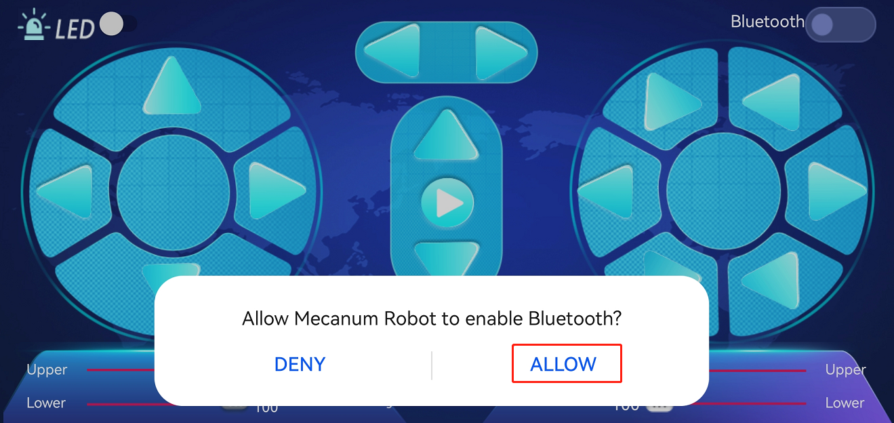

d.Click
 o he upper right corner to search for Bluetooth and click“connect”; a fe econds later, the Bluetooth is paired.

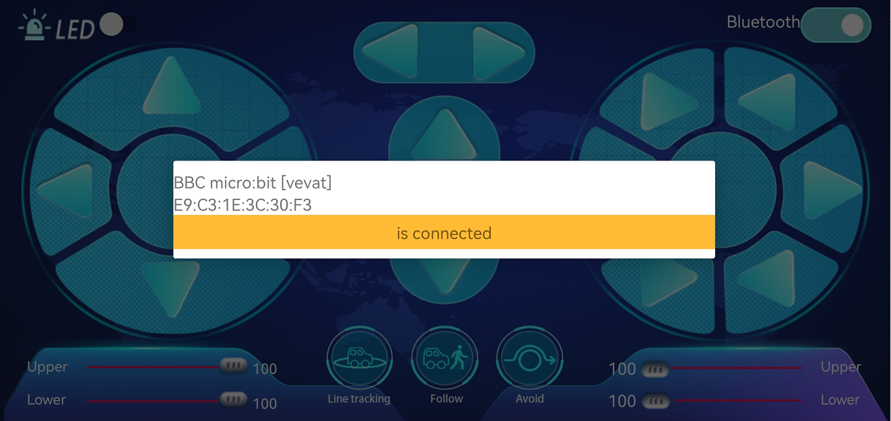

Open CoolTerm, click Options to select SerialPort. Set COM port an 15200 baud rate. Click“OK”and“Connect”.

Point at micro:bit board and press the icons on APP, the correspondin haracters are shown on CoolTerm monitor.

Through the test, we get the functions of every icon, as shown below:

#### Project 20.2：Multi-purpose Smart Car

1. Description

In this lesson, we will control the smart car to perform multipurpos unctions.

2. Preparation

- Insert the micro:bit board into the slot of keyestudi  4WD Mecanum Robot Car V2.0

- Place batteries into battery holder

- Dial power switch to ON end

- Connect the micro:bit to your computer via an USB cable

- Open the Web version of Makecode

Import Hex profile [**(How to import?)**](\l) , or click“New Project”an rag blocks step by step(add MecanumRobot extension library first)

[**(How to add Mecanum_Robot extension?)**](\l)

Steps：Click the gear icon (Settings) in the upper right corner, the lick on Extensions to go to the library file selection screen, and the lick on the "Bluetooth" extension library (if it doesn't exist, searc luetooth to find it), as shown below: 

As the Bluetooth and extension radio can’t work together, therefore heir extension libraries are not compatible.

Therefore, remove extension(s) and add Bluetooth please if you see th ollowing prompt box pop up.

3. Test Code

Code path:

|           |                                       |                                           |
|-----------|---------------------------------------|-------------------------------------------|
| File Type | Path                                  | File Name                                 |
| Hex file  | ..\2. Makecode Tutorial\Makecode Code | Project 20.2：Multi-purpose Smart Car.hex |

Complete Code:

Click“JavaScript" to view the corresponding JavaScript code: ：

4. Test Result

This experiment combines the previous projects to make the car t erform actions via Bluetooth.

Enter Makecode online editor→Projectin ettings→ nable “No Pairing....”(you could skip this step if you import test cod irectly)

Download code to micro:bit board, dial POWER to ON end, and connect th luetooth, then you can control the car via the Bluetooth App o ecanum_robot.

([How to download?](\l) [How to quick download?](\l))

Note:i sed to adjust the speed, and

can only be dragged.

## Common Problems

1.  **The car has no reaction**

Please check whether the batteries are sufficient

Please check whether the wirings are correct

2.  **Computers can't recognize the USB ports**

Please ensure whether the microbit driver is installed

Please check whether the USB wire is in good condition.

3.  **Code fails to burn and dot matrix displays expressions**

Please check whether the Mecanum Robot Car_V2.py library file i mported

## Resources

https://fs.keyestudio.com/KS4034-4035

