Makecode Tutorial
=================

|image1|

Get Started with Makecode
-------------------------

The following instructions are applied for Windows system but can also
serve as a reference if you are using a different system.

Write code and program
~~~~~~~~~~~~~~~~~~~~~~

This chapter describes how to write program and load it to the Micro:
Bit main board V2.

Please browse the link for more details:
https://microbit.org/guide/quick/

**Step 1: Connect the Micro: Bit**

Firstly, link the Micro: Bit main board with your computer via the USB
cable. Macs, PCs, Chromebooks and Linux（including Raspberry Pi）systems
are all compatible with the Micro: Bit main board.

**Note that if you are about to pair the board with your phone or
tablet, please refer to this link:**
`https:/microbit.org/get-started/user-guide/mobile/ <https://microbit.org/get-started/user-guide/mobile/>`__

|image2|

|image3|

Secondly, if the red LED on the back of the board is on, that means the
board is powered. When your computer communicates with the main board
via the USB cable, the yellow LED on it will flashes. For example, it
will flicker when you burn a “.hex”file.

Then Micro: bit main board will display a driver named “MICROBIT(E:)”on
your computer. Please note that it is not an ordinary USB disk, as shown
below.

|image4|

**Step 2: Write programs**

Access the link：\ https://makecode.microbit.org/\ ，then click “\ **New
Project**\ ”, when the dialog box‘\ **Create a Project**\ ’ appears,
input‘\ **heartbeat**\ ’in it and click ‘\ **Create √**\ ’to edit.

(If you are running Windows 10 system, it is also viable to edit on the
Windows 10 APP, which is exactly like editing in the website.Link of the
Windows 10 APP: `Windows 10
APP <https://www.microsoft.com/zh-cn/p/makecode-for-micro-bit/9pjc7sv48lcx?ocid=badgep&rtc=1&activetab=pivot:overviewtab>`__)

|image5|

|image6|

Write a set of micro:bit code. You can drag some blocks from the modules
to the editing area and then run your program in Simulator of MakeCode
editor, as shown in the picture below, which demonstrates how to edit
‘\ **heartbeat**\ ’ program .

Here's a demo video(path):
``...\Important Resources\Makecode Code\Project 1：Heartbeat\heartbeat.mp4``.

|Img|

|image7|

Click “\ **JS JavaScript**\ ”，then we enable to find the corresponding
program in JavaScript language, as shown below:

|image8|

You also can click the“\ **JS JavaScript**\ ”and slide the button to
choose“\ **Python**\ ”and you will find the corresponding as shown
below:

|image9|

**Step 3: Download Code**

If your computer is Windows 10, you solely need to click the
‘\ **Download**\ ’ button to download the program to your micro: bit
main board.

If you are writing program through the website, following these steps:

Click the ‘\ **Download**\ ’ button in the editor to download a
"**.hex**" file, which can be read by the Micro: Bit main board. Once
the hexadecimal file is downloaded, copy it to your board just like the
process that you copy the file to the USB driver. If you are running
Windows system, you can also right-click and select ‘\ **Send to →
MICROBIT(E:)**\ ’ to copy the hex file to the Micro: Bit main board.

|image10|

|image11|

You can also directly drag the "**.hex**" file onto the MICROBIT (E:)
disk.

|image12|

|image13|

During the process of copying the downloaded hex file to the Micro: bit
main board, the yellow signal light on the back side of the board
flashes. When the copy is completed, the yellow signal light will stop
flashing and remain on.

**Step 4: Run the program**

After the program is uploaded to the Micro: bit main board, you could
still power it via an USB cable or an external power. The 5 x 5 LED dot
matrix on the board displays the heartbeat pattern.

|image14|

Power via USB cable

|image15|

Power via external power（3V）

**Caution:**

When programming, the MICROBIT driver will automatically eject and
return and your hexadecimal files will disappear. And the board can only
have access to hexadecimal files (.hex) and won’t save other files.

**Step5：Other programming languages**

Go to the link: ：\ https://microbit.org/code/ for different programming
languages .

Makecode
~~~~~~~~

Access the link：\ https://makecode.microbit.org/\ ，and enter the
online editor of makecode or open the APP makecode for micro:bit Windows
10.

|image16|

Click“\ **New Project**\ ”, and input“\ **heartbeat**\ ”in the dialog
box, then click “\ **create √**\ ”to enter Makecode editor, as shown
below:

|image17|

There are blocks“\ **on start**\ ”and“\ **forever**\ ”in the code
editing area.

When the power is plugged or reset,“\ **on start**\ ”means that the code
in the block only executes once, while“\ **forever**\ ”implies that the
code runs cyclically.

Quick Download
~~~~~~~~~~~~~~

As mentioned before, if your computer is Windows 10 and you have
downloaded the MakeCode APP for micro:bit, then the code can be quickly
downloaded to the Micro: Bit main board by
clicking‘\ **Download**\ ’button.

While it is a little more trickier if you are using a browser to enter
Makecode. However, if you use Google Chrome for
Android，ChromeOS，Linux，macOS and Windows 10, the process can be
quicker too.

We use the webUSB function of Chrome to access the micro USB hardware
device.

You could refer to the following steps to connect and pair devices.

**Device pairing:**

Connect micro:bit to your computer by USB cable.

Click“\ **...**\ ”beside to“\ **Download**\ ”and tap“\ **Connect
device**\ ”;

|image18|

Click“\ **Next**\ ”;

|image19|

Click“\ **Next**\ ”again

|image20|

Then select the corresponding device and click“\ **Connect**\ ”. If no
device shows up for selection, please refer to the link:
https://makecode.microbit.org/device/usb/webusb/troubleshoot

And for updating the firmware of the Micro:bit:
https://microbit.org/guide/firmware/ .

|image21|

Click“\ **Done**\ ”to finish the pairing.

|image22|

|image23|

**Download Program:**

After pairing, click “download”to directly download the program to the
board. If it is successfully downloaded, the icon |image24| will shift
to |image25|.

|image26|

Makecode Extension Libraries
~~~~~~~~~~~~~~~~~~~~~~~~~~~~

We have made a makecode extension library for this Mecanum robot car
V2.0

Add an extension library of the Mecanum robot car V2.0

Please follow the following steps to add extension files:

Open Makecode to enter a certain project → click the gear-shaped
icon(for setting) in the upper right corner →
choose“\ **Extensions**\ ”;

|image27|

Or click“\ **Extensions**\ ”, as shown below:

|image28|

Input the link
``https://github.com/keyestudio2019/mecanum_robot _v2.git`` to search;

Tap the searching result “\ **MecanumRobotV2**\ ” to download and
install it, This process may take a few seconds.

|image29|

After the installation, you can find the extension files **Mecanum
RobotV2** and **IrRemote** on the left side.

And extension file Neopixel is also installed.

|image30|

|image31|

|image32|

**Note:** The extension files added are only available for this project.
Therefore, when you create a new **MecanumRobotV2** project, you will
need to add these extension files again.

**Update or delete the MecanumRobotV2 extension files:**

Please follow the following steps to update or delete extension files:

Click "Js JavaScript" to change to textual version:

|image33|

Click the “\ **Explorer**\ ” on the left side:

|image34|

You can find these added files in the list; Click the dustbin icon
beside the file to delete the MecanumRobotV2 file and tap the refresh
icon to update it.

|image35|

Import test code
~~~~~~~~~~~~~~~~

We provide hexadecimal code files (project files) for each project. The
file contains all the contents of the project and can be imported
directly, and you can manually drag the code blocks to complete the
program.

For simple projects, dragging a block of code to complete the program is
recommended. For complex projects, it is recommended to conduct the
program by importing the provided hexadecimal code file.

Let's take the "**Heatbeat**" project as an example to show how to load
the code.

Open the Web version of Makecode or the Windows 10 App version of
Makecode then click “\ **Import**\ ”.

|image36|

Click“\ **Import File**\ ”;

|image37|

|image38|

Select
``..\Important Resources\Makecode Code\Project 1：Heartbeat\Project 1: Heart beat.hex``
, then click“\ **Go ahead**\ ”.

|image39|

|image40|

In addition to importing the provided test code file into the Makecode
compiler above, you can also drag them to the code editing area of the
Makecode compiler, as shown in the figure below:

|image41|

After a few seconds, it has done.

|image42|

**Note: If your computer system isn’t Windows 10, the pairing cannot be
done via Google Chrome. Therefore, digital or analog signals of sensors
and modules cannot be read. However, we can use the CoolTerm software to
read the serial port data. Next chapter is about how to install the
CoolTerm.**

Install CoolTerm
~~~~~~~~~~~~~~~~

CoolTerm program is used to read the data on serial port.

Download CoolTerm program: https://freeware.the-meiers.org/

After downloading, we need to install CoolTerm program file, and we take
PC Window system as an example.

1. Choose “\ **win**\ ” to download the zip file of CoolTerm.

|image43|

2. Unzip the file and open it. (also suitable for Mac and Linux system)

|image44|

3. Double-click\ |image45|.（Please make sure that the driver of
Micro:bit is installed and the main board is connected to the computer.)

|image46|

The functions of each button on the Toolbar are listed below:

|image47|

========= ================================================
|image48| Opens up a new Terminal
|image49| Opens a saved Connection
|image50| Saves the current Connection to disk
|image51| Opens the Serial Connection
|image52| Closes the Serial Connection
|image53| Clears the Received Data
|image54| Opens the Connection Options Dialog
|image55| Displays the Terminal Data in Hexadecimal Format
|image56| Displays the Help Window
========= ================================================

Projects
--------

(**Note:** project 1 to 12 are basic courses conducted with the built-in
sensors and LED dot matrix of the Micro:bit main board V2, while project
13 to 20 are extended courses)

Project 1：Heart beat
~~~~~~~~~~~~~~~~~~~~~

|image57|

1. **Description**

This project is easy to conduct solely with a micro:bit main board, a
micro USB cable and a computer. The micro:bit will display a “flickering
heart” pattern. This experiment serves as a starter for your to entry to
the magical world of the micro:bit.

2. **Preparation**

A. Attach the micro:bit main board to your computer via the USB cable

B. Open the Web version of Makecode and Click “New Project” into the
code editing interface of Makecode.

|image58|

3. **Test Code**

|image59|

Click“JavaScript" to view the corresponding JavaScript code:

|image60|

4. **Test Result**

Download code to micro:bit and keep the USB cable connected. The LED dot
matrix will display ❤ and |image61| ceaselessly.

If the download is not success, try to disconnect the micro:bit from
your computer and then reconnect them and reopen Makecode to try again.

Project 2：Light A Single LED
~~~~~~~~~~~~~~~~~~~~~~~~~~~~~

|image62|

1. **Description**

The LED dot matrix consists of 25 diodes arranged in a 5 by 5 square and
placed at the intersection of row lines (X) and column lines (Y). We can
control one of the 25 LEDs by setting coordinate points. For example,
the first LED sits in the first line is (0,0）and the third LED
positioned in the first line is (2,0）and others likewise.

|image63|

2. **Preparation**

A. Attach the micro:bit main board to your computer via the USB cable

B. Open the Web version of Makecode and Click “New Project” into the
code editing interface of Makecode.

|image64|

3. **Test Code**

|image65|

Click“JavaScript”to switch into corresponding JavaScript code:

|image66|

4. **Test Result**

After uploading the test code to micro:bit main board V2 and powering it
via the USB cable, the LED in (1,0) lights up for 0.5s and the one in
(3,4) shines for 0.5s and repeat this sequence.

Project 3：5 x 5 LED Dot Matrix
~~~~~~~~~~~~~~~~~~~~~~~~~~~~~~~

|image67|

1. **Description**

Dot matrix is very commonplace in daily life, which has found wide
applications in LED advertisement screens, elevator floor display, bus
stop announcement and so on.

The LED dot matrix of Micro: Bit main board contains 25 Diodes.
Previously, we have succeeded in controlling a certain LED via its
position point. Supported by the same theory, we can turn on many LEDs
at the same time to showcase patterns, digits and characters.

What’s more, we can also click”show icon“ to choose the pattern we like
to display. Last but not the least, we can design patterns by ourselves
as well.

2. **Preparation**

A. Attach the micro:bit main board to your computer via the USB cable

B. Open the Web version of Makecode.

3. **Test Code1**

|image68|

Select“JavaScript”to switch into JavaScript language code:

|image69|

4. **Test Result1**

Upload code 1 and power the board , we will see the icon |image70|

5. **Test Code 2：**

|image71|

Select“JavaScript”to switch into JavaScript language code:

|image72|

6. **Test Result**

Upload code 2 and plug micro:bit in power, Micro: bit starts showing
number 1, 2, 3, 4, and 5, then cyclically display
|image73|,“Hello!”,\ |image74|,\ |image75|,\ |image76|,\ |image77|
and\ |image78|\ patterns.

Project 4：Programmable Buttons
~~~~~~~~~~~~~~~~~~~~~~~~~~~~~~~

|image79|

1. **Description**

|image80|

Buttons can be used to control circuits. In an integrated circuit with a
push button, the circuit is connected when pressing the button and but
after release, it will break again. 

Both ends of the button like two mountains. There is a river in between.

The internal metal piece connect the two sides to let the current pass,
just like building a bridge to connect two mountains.

The internal structure of the button is shown as follows: before
pressing the button, 1 ,2 , 3 and 4 are turned on. However, 1, 3 or 1, 4
or 2, 3 or 2 and 4 are disconnected, which is only enabled when the
button is pressed. |image81|

Micro: Bit main board boasts three push buttons, two are programmable
buttons(marked with A and B), and the one on the other side is a reset
button. By pressing the two programmable buttons can input three
different signals. We can press button A or B alone or press them
together and the LED dot matrix shows A,B and AB respectively. Let’s get
started.

2. **Preparation**

A. Attach the micro:bit main board to your computer via the USB cable

B. Open the Web version of Makecode.

3. **Test Code1**

Press buttons on micro:bit, micro:bit will display character strings.

|image82|

Select“JavaScript”to switch into JavaScript language code:

|image83|

4. **Test Result1**

After uploading test code 1 to micro:bit main board V2 and powering the
board via the USB cable, the 5*5 LED dot matrix shows A if button A is
pressed, B if button B pressed, and AB if button A and B are pressed
together.

5. **Test Code2**

|image84|

Click“JavaScript”to switch into JavaScript code:

|image85|

6. **Test Result2**

After uploading test code 2 to micro:bit main board V2 and powering the
board via the USB cable, when pressing the button A , the LEDs turning
red increase by 5 , while when pressing the button B the LEDs turning
red reduce.

Project 5：Temperature Measurement
~~~~~~~~~~~~~~~~~~~~~~~~~~~~~~~~~~

1. **Description**

The Micro:bit main board is not equipped with a temperature sensor, but
uses the built-in temperature sensor in NFR52833 chip for temperature
detection. Therefore, the detected temperature is more closer to the
temperature of the chip, and there maybe deviation from the ambient
temperature.

In this project, we will seek to use the sensor to test the temperature
in the current environment, and display the test results in the display
data (device). And then control the LED dot matrix to display different
patterns by setting the temperature range detected by the sensor.

**Note:** the temperature sensor of Micro:bit main board is shown below:

|image86|

2. **Preparation**

A. Attach the micro:bit main board to your computer via the USB cable

B. Open the Web version of Makecode.

3. **Test Code1**

Micro:bit detects temperature

|image87|

Click“JavaScript”to view the corresponding JavaScript code:

|image88|

4. **Test Result1**

Download code 1 to micro:bit board and keep USB cable connected, then
tap the button |image89|:

|image90|

Temperature data is shown below:

|image91|

Through the test, the room temperature is 35℃when touching the NFR51822
chip of micro:bit; however, the temperature rises to 37℃ when it touches
water cup.

If you're running Windows 7 or 8 instead of Windows 10, it won't be able
to match devices via Google Chrome. You'll need to use the CoolTerm
serial monitor software to read data.

You could open CoolTerm, click Options to select SerialPort. Set COM
port and 115200 baud rate(the baud rate of USB serial communication of
Micro:bit is 115200 through the test). Click“OK”and“Connect”.

The serial monitor shows the current ambient temperature value, as shown
below:

|image92|

|image93|

|image94|

|image95|

5. **Test Code2**

Micro:bit display different pictures by temperature(the temperature
value in the code could be adjusted).

|image96|

Click“JavaScript”, the corresponding JavaScript code is shown below:

|image97|

6. **Test Result2**

Upload the Code 2 and plug in power. And the 5*5 LED displays the
ambient temperature. When pressing the temperature sensor, the
temperature will grow on dot matrix. When the ambient temperature is
less than 35℃, the 5*5LED will show\ |image98|. When the temperature is
equivalent to or greater than 35℃, the pattern\ |image99| will appear.

Project 6：Geomagnetic Sensor
~~~~~~~~~~~~~~~~~~~~~~~~~~~~~

|image100|

1. **Description**

This project mainly introduces the use of the micro:bit’s
geomagnetic sensor. In addition to detecting the strength of the
magnetic field, it can also be used to determine the direction, which is
an important part of the heading and attitude reference system (AHRS) as
well.

It uses FreescaleMAG3110 three-axis magnetometer. Its I2C interface
communicates with the outside, and the range is ±1000µT, the maximum
data update rate is 80Hz. Combined with an accelerometer, it can
calculate the position. Additionally, it is applied to magnetic
detection and compass blocks.

Then we could read the value detected by it to determine the location.
We need to calibrate the micro:bit board when the magnetic sensor works.
The correct calibration method is to rotate the micro:bit board.

In addition, the objects nearby may affect the accuracy of readings and
calibration.

2. **Preparation**

A. Attach the micro:bit main board to your computer via the USB cable

B. Open the Web version of Makecode.

3. **Test Code1**

Press A on micro:bit, the value of compass is shown.

|image101|

Select“JavaScript”to switch into JavaScript language code:

|image102|

4. **Test Result1**

Upload the code 1, plug in micro:bit via an USB cable.

After uploading the test code1 to the micro:bit main board and powering
the board via an USB cable, and the LED dot matrix shows “TILT TO FILL
SCREEN”. Pressing the button A, the board asks us to calibrate the
compass. Then enter the calibration page. Rotate the board until all 25
red LEDs are on, as shown below.

|image103|

The calibration will be finished until you view the smile
pattern\ |image104|\ appear.

The serial monitor will show 0°, 90°, 180° and 270° when pressing A.

5. **Test Code2**

|image105|

This module can keep reading data to determine direction, and let arrow
point to the current magnetic North Pole.

|image106|

For the above picture, the arrow will point to the upper right when the
value ranges from 292.5 to 337.5. Because 0.5 can’t be input in the
code, the values we get are 293 and 338.

Make micro: bit board point to the north, south, east and west
horizontally , LED dot matrix displays the corresponding direction
patterns

|image107|

|image108|

|image109|

|image110|

Select“JavaScript”to switch into JavaScript language code:

|image111|

|image112|

6. **Test Result2**

Upload code 2 and plug micro:bit into power. After calibration, tilt the
micro:bit board, and the LED dot matrix displays the direction signs.

Project 7：Accelerometer
~~~~~~~~~~~~~~~~~~~~~~~~

|image113|

1. **Description**

The micro:bit board has a built-in Freescale MMA8653FC three-axis
acceleration sensor (accelerometer). Its I2C interface works on external
communication, the range can be set to ±2g, ±4g, and ±8g, and the
maximum data update rate can reach 800Hz.

When the Micro:bit is stationary or moving at a constant speed, the
accelerometer only detects the gravitational acceleration; when the
Micro:bit is slightly shaken, the acceleration detected is much smaller
than the gravitational acceleration and can be ignored. Therefore, in
the process of using Micro:bit, the main purpose is to detect the
changes of the gravitational acceleration on the x, y, and z axes when
the attitude changes.

For this project, we will introduce the detection of several special
postures by the accelerometer.

2. **Preparation**

A. Attach the micro:bit main board to your computer via the USB cable

B. Open the Web version of Makecode.

3. **Test Code1**

|image114|

|image115|

Click“JavaScript", you will view the corresponding JavaScript code:

|image116|

4. **Test Result1**

After uploading the test code 1 to micro:bit main board V2 and powering
the board via the USB cable, if we shake the Micro: Bit main board V2,
no matter at any direction, the LED dot matrix displays the digit “1”.

When it is kept upright （make its logo above the LED dot matrix）, the
number 2 shows.

|image117|

When it is kept upside down( make its logo below the LED dot matrix) ,
it shows as below.

|image118|

When it is placed still on the desk, showing its front side, the number
4 appears.

|image119|

When it is placed still on the desk, showing its back side, the number 5
exhibits.

When the board is tilted to the left , the LED dot matrix shows the
number 6, as shown below.

|image120|

When the board is tilted to the right , the LED dot matrix displays the
number 7, as shown below:

|image121|

When the board is knocked to the floor, this process can be considered
as a free fall and the LED dot matrix shows the number 8. (Please note
that this test is not recommended for it may damage the main board.)

**Attention:** if you’d like to try this function, you can also set the
acceleration to 3g, 6g or 8g.

5. **Test Code2**

Detect the value of acceleration speed at x, y and z axis

|image122|

Click“JavaScript" to view the corresponding JavaScript code:

|image123|

6. **Test Result2**

Download code 2 to micro:bit board, keep USB cable connected and click
|image124|:

|image125|

After referring to the MMA8653FC data manual and the hardware schematic
diagram of the Micro: Bit main board V2, the accelerometer coordinate of
the Micro: Bit V2 motherboard are shown in the figure below:

The following interface shows the decomposition value of acceleration in
X axis, Y axis and Z axis respectively, as well as acceleration
synthesis (acceleration synthesis of gravity and other external forces).

|image126|

|image127|

If you're running Windows 7 or 8 instead of Windows 10, it won't be able
to match devices via Google Chrome. You'll need to use the CoolTerm
serial monitor software to read data.

You could open CoolTerm software, click Options, select SerialPort, set
COM port and put baud rate to 115200 (after testing, the baud rate of
USB SerialPort communication on Micro: Bit main board V2 is 115200),
click OK, and Connect. The CoolTerm serial monitor shows the data of X
axis, Y axis and Z axis , as shown in the figures below :

|image128|

Project 8：Light Detection
~~~~~~~~~~~~~~~~~~~~~~~~~~

|image129|

1. **Description**

In this project, we focus on the light detection function of the
Micro:Bit main board V2. It is achieved by the LED dot matrix since the
main board is not equipped with a photoresistor.

When the light irradiates the LED matrix, the voltage change will be
produced. Therefore, we could determine the light intensity by voltage
change.

2. **Preparation**

A. Attach the micro:bit main board to your computer via the USB cable

B. Open the Web version of Makecode.

3. **Test Code**

|image130|

Click“JavaScript”to switch into the corresponding JavaScript code:

|image131|

4. **Test Result**

Download code to micro:bit board don’t plug off the USB cable and click
|image132|:

|image133|

The intensity value is 0 when covering the LED dot matrix. And the value
varies with the light intensity. When placing micro:bit under the
sunlight, the stronger the light is, the larger the intensity value will
be. As shown below:

|image134|

If you're running Windows 7 or 8 instead of Windows 10, it won't be able
to match devices via Google Chrome. You'll need to use the CoolTerm
serial monitor software to read data.

You could open“CoolTerm”, click“Options”to select “SerialPort”, and set
“COM” port and 115200 baud rate(the baud rate of USB serial
communication of micro:bit is 115200 through the test).

Then click“OK”and“Connect”. The light intensity value is shown below:

|image135|

Project 9：Speaker
~~~~~~~~~~~~~~~~~~

|image136|

1. **Description**

Micro: Bit main board has an built-in speaker, which makes adding sound
to the programs easier. It can also be programmed to produce all kinds
of tones, like playing the song *Ode to Joy*.

2. **Preparation**

A. Attach the micro:bit main board to your computer via the USB cable

B. Open the Web version of Makecode.

3. **Test Code**

|image137|

Select “JavaScript” to switch into JavaScript language code:

|image138|

4. **Test Result**

After uploading the test code to micro:bit main board V2 and powering
the board via the USB cable, the speaker utters sound and the LED dot
matrix shows the logo of music.

Project 10：Touch-sensitive Logo
~~~~~~~~~~~~~~~~~~~~~~~~~~~~~~~~

|image139|

1. **Description**

The Micro: Bit main board V2 is equipped with a golden touch-sensitive
logo, which can act as an input component like an button.

It contains a capacitive touch sensor that senses small changes in the
electric field when pressed (or touched), just like your phone or tablet
screen. When you press it , the program can be activated.

2. **Preparation**

A. Attach the micro:bit main board to your computer via the USB cable

B. Open the Web version of Makecode.

3. **Test Code**

|image140|

Select“JavaScript" and“Python”to switch into JavaScript and Python
language code:

|image141|

|image142|

4. **Test Result**

via the USB cable, the LED dot matrix exhibits the“❤” pattern when the
touch-sensitive logo is pressed or touched and displays digit when the
logo is released.

Project 11：Microphone
~~~~~~~~~~~~~~~~~~~~~~

|image143|

|image144|

1. **Description**

The Micro: Bit main board has a built-in microphone, which can test the
volume of ambient environment. When you clap, the microphone LED
indicator turns on. Furthermore, it can measure the intensity of sound,
thereby you can make a noise scale or disco lighting changing with
music.

The microphone is placed on the opposite side of the microphone LED
indicator and in proximity with holes that lets sound pass. When the
board detects the sound, the LED indicator lights up.

2. **Preparation**

A. Attach the micro:bit main board to your computer via the USB cable

B. Open the Web version of Makecode.

3. **Test Code1**

|image145|

Select“JavaScript”to switch into JavaScript language code:

|image146|

4. **Test Results 1**

After uploading test code1 to micro:bit main board V2 and powering the
board via the USB cable, the LED dot matrix displays pattern“❤””when you
claps and pattern\ |image147|\ when it is quiet around.

5. **Test Code2**

|image148|

Select“JavaScript”to switch into JavaScript language code:

|image149|

6. **Test Results 2**

Upload test code 2 to micro:bit main board V2, power the board via the
USB cable and click “Show console Device”as shown below.

|image150|

When the sound is louder around, the sound value shows in the serial
port is bigger as shown below.

|image151|

What’s more, when pressing the button A, the LED dot matrix displays the
value of the biggest volume( please note that the biggest volume can be
reset via the Reset button on the other side of the board ) while when
clapping, the LED dot matrix shows the pattern of the sound.

Project 12：Bluetooth Wireless Communication
~~~~~~~~~~~~~~~~~~~~~~~~~~~~~~~~~~~~~~~~~~~~

|image152|

1. **Description**

The Micro: Bit main board V2 comes with a nRF52833 processor (with a
built-in BLE(Bluetooth Low Energy) device Bluetooth 5.1 ) and a 2.4GHz
antenna for Bluetooth wireless communication and 2.4GHz wireless
communication. With the help of them, the board is able to communicate
with a variety of Bluetooth devices, including smart phones and tablets.

In this project, we mainly concentrate on the Bluetooth wireless
communication functions of this main board. Linked with Bluetooth, it
can transmit code or signals. To this end, we should connect an Apple
device (a phone or an iPad) to the board.

Since setting up Android phones to achieve wireless transmission is
similar to that of Apple devices, so we don’t need to illustrate again.

2. **Preparation**

A. Attach the micro:bit main board to your computer via the USB cable

B. IPhone device (phone /iPad) or Android phone.

3. **Procedures**

For Apple devices, enter this link:
https://www.microbit.org/get-started/user-guide/ble-ios/ with your
computer first, and then click “Download pairing HEX file”to download
the Micro: Bit firmware to a folder or desk, and upload the downloaded
firmware to the Micro: Bit main board V2.

|image153|

|image154|

|image155|

Open\ |image156|\ to search “micro bit”in your App Store to download the
APP micro:bit then click“\ |image157|\ ”.

|image158|

Connect your Apple device with Micro: Bit main board V2:

Firstly, turn on the Bluetooth of your Apple device and open the APP
micro:bit to select item “Choose micro:bit”to start pairing Bluetooth.

Please make sure that the Micro: Bit main board V2 and your computer are
still linked via the USB cable.

|image159|

Secondly, click“Pair a new micro:bit”;

|image160|

Following the instructions to press button A and B at the same time(do
not release them until you are told to) and press Reset & Power button
for a few seconds.

Release the Reset & Power button, you will see a password pattern shows
on the LED dot matrix. Now , release buttons A and B and click Next.

|image161|

|image162|

Set the password pattern on your Apple device as the same pattern showed
on the matrix and click Next.

|image163|

Still click Next and a dialog box props up as shown below. Then click
"Pair". A few seconds later, the match is done and the LED dot matrix
displays the "√" pattern.

|image164|

|image165|

|image166|

|image167|

After the match with Bluetooth, write and upload code with the App.

Click “Create Code” to enter the programming page and write code.

Click\ |image168|\ and the box\ |image169|\ appears, and then select
“Create √”.

|image170|

|image171|

|image172|

|image173|

Name the code as “1 “and click\ |image174| to save it.

|image175|

Click the third item“Flash”to enter the uploading page.  The default
code program for uploading is the one saved just now and named "1" and
then click the other "Flash" to upload the code program "1".

|image176|

|image177|

|image178|

If the code is uploaded successfully a few seconds later, the App will
emerge as below and the LED dot matrix of the Micro: Bit main board V2
will exhibit a heart pattern.

|image179|

**Projects above all conduct with the built-in sensors and the LED dot
matrix of the main board while the following ones will carry out with
the help of external sensors of this turtle car.（Attention：In order to
avoid burning the the Micro:bit main board V2, please remove the USB
cable and the external power from the board before fix it with the
shield of the car; likewise, the USB cable and the external power should
be cut from the main board before disconnect the shield from the
board.)**

Project 13：Seven-Color LED
~~~~~~~~~~~~~~~~~~~~~~~~~~~

|image180|

1. **Description**

This module consists of a commonly used LED with 7colors but in white
appearance. It can automatically flash different colors to create
fantastic light effects when high level is input like a normal LED.

2. **Preparation**

- Insert the micro:bit board into the slot of keyestudio
  4WD Mecanum Robot Car V2.0

- Place batteries into battery holder

- Dial power switch to ON end

- Connect the micro:bit to your computer via an USB cable

- Open the Web version of Makecode.

3. **Test Code1**

Make the RGB light flash 7 lights alternatively.

|image181|

Click“JavaScript”to view the corresponding JavaScript code:

|image182|

4. **Test Result1**

Download code 1 to micro:bit board and dial POWER switch to ON end, 2
RGB lights of smart car emit red, green, blue, indigo, dark red, yellow
and white color cyclically.

5. **Test Code2**

|image183|

Click“JavaScript”to view the corresponding JavaScript code:

|image184|

6. **Test Result2**

Download code 2 to micro:bit board, 2 RGB lights will flash for 1 second
and then stop flashing for 1 second, cyclically.

Project 14：4 WS2812 RGB LEDs
~~~~~~~~~~~~~~~~~~~~~~~~~~~~~

|image185|

1. **Description**

The driver shield cooperates 4 pcs WS2812 RGB LEDs, compatible with
micro:bit board and controlled by P7. In this lesson, we will make the
RGB LEDs display different colors by P7. In this lesson, 3 sets of test
code are provided to make the 4 WS2812 RGB LEDs display different
effects.

2. **Preparation**

- Insert the micro:bit board into the slot of keyestudio
  4WD Mecanum Robot Car V2.0

- Place batteries into battery holder

- Dial power switch to ON end

- Connect the micro:bit to your computer via an USB cable

- Open the Web version of Makecode.

3. **Test Code1**

|image186|

Click“JavaScript" to switch into the corresponding JavaScript code:

|image187|

4. **Test Result1**

Download code 1 to micro：bit, and dial POWER to ON end. All four
WS2812RGB LEDs light up a different color a time cyclically.

5. **Test Code2**

|image188|

|image189|

|image190|

Click“JavaScript" to switch into the corresponding JavaScript code:

|image191|

|image192|

6. **Test Result2**

Download code 2 to micro：bit, WS2812RGB LEDs display like flow light.

7. **Test Code3**

|image193|

Click“JavaScript”to switch into the corresponding JavaScript code:

|image194|

8. **Test Result3**

Download code 3 to micro：bit, every WS2812RGB light shows random color
one by one.

Project 15：Servo
~~~~~~~~~~~~~~~~~

|image195|

1. **Description**

For those DIY smart cars, they often have the function of automatic
obstacle avoidance. In the DIY process, we need to use a servo to
control the ultrasonic module to rotate left and right, and then detect
the distance between the car and the obstacle, so as to control the car
to avoid the obstacle. If other microcontrollers are used to control the
rotation of the servo, we need to set a certain frequency and a certain
width of pulse to control the servo angle.

However, if the micro:bit main board is used to control the servo angle,
we only need to set the control angle in the development environment
where the corresponding pulse will be automatically set to control the
servo rotation. In this project, you will learn how to control the servo
to rotate back and forth between 0° and 90°.

2. **Information of the Servo**

Servo motor is a position control rotary actuator. It mainly consists of
housing, circuit board, core-less motor, gear and position sensor. Its
working principle is that the servo receives the signal sent by MCU or
receiver, and produces a reference signal with a period of 20ms and
width of 1.5ms, then compares the acquired DC bias voltage to the
voltage of the potentiometer and obtains the voltage difference output.

|image196|

For the servo used in this project, the brown wire is the ground, the
red one is the positive wire, and the orange one is the signal wire.

The rotation angle of servo motor is controlled by regulating the duty
cycle of PWM (Pulse-Width Modulation) signal. The standard cycle of PWM
signal is 20ms (50Hz). Theoretically, the width is distributed
between 1ms-2ms, but in fact, it's between 0.5ms-2.5ms. The width
corresponds to the rotation angle from 0° to 180°. But note that for
different brand motor, the same signal may have different rotation
angle. 

|image197|

More details:

|image198|

3. **Parameters**

- Working voltage: DC 4.8V ~ 6V

- Operating angle range: about 180 ° (at 500 → 2500 μsec)

- Pulse width range: 500 → 2500 μsec

- No-load speed: 0.12 ± 0.01 sec / 60 (DC 4.8V) 0.1 ± 0.01 sec / 60 (DC
  6V)

- No-load current: 200 ± 20mA (DC 4.8V) 220 ± 20mA (DC 6V)

- Stopping torque: 1.3 ± 0.01kg · cm (DC 4.8V) 1.5 ± 0.1kg · cm (DC 6V)

- Stop current: ≦ 850mA (DC 4.8V) ≦ 1000mA (DC 6V)

- Standby current: 3 ± 1mA (DC 4.8V) 4 ± 1mA (DC 6V)

4. **Preparation**

- Insert the micro:bit board into the slot of keyestudio
  4WD Mecanum Robot Car V2.0

- Place batteries into battery holder

- Dial power switch to ON end

- Connect the micro:bit to your computer via an USB cable

- Open the Web version of Makecode

5. **Test Code**

|image199|

Click“JavaScript" to view the corresponding JavaScript code:

|image200|

6. **Test Result**

After uploading the test code and dial POWER switch to ON end, the servo
rotates from 0 degree to 180 degrees.

Project 16：Motor
~~~~~~~~~~~~~~~~~

|image201|

1. **Description**

The Keyestudio 4WD Mecanum Robot Car is equipped with 4 DC reduction
motors, also called gear reduction motor, which is developed on the
ordinary DC motor. It has a matching gear reduction box which provides a
lower speed but a larger torque. Furthermore, different reduction ratios
of the box can provide different speeds and torques.

Gear motor is the integration of gearmotor and motor, which is applied
widely in steel and machine industry

Micro:bit motor driver shield comes with a DRV8833 chip. In order to
save the IO port resource, we control the rotation direction and speed
of 4 DC gear motors with the DRV8833 chip.

|image202|

Front

|image203|

Back

|image204|

STC8G1K08 Chip circuit

|image205|

HR8833 Motor driver circuit

2. **Preparation**

- Insert the micro:bit board into the slot of keyestudio
  4WD Mecanum Robot Car V2.0

- Place batteries into battery holder

- Dial power switch to ON end

- Connect the micro:bit to your computer via an USB cable

- Open the Web version of Makecode

3. **Test Code1**

|image206|

Click“JavaScript" to view the corresponding JavaScript code:

|image207|

4. **Test Result1**

Download code 1 to micro:bit board, dial POWER switch to ON end. Smart
car goes forward for 2s and stops for 2s.

5. **Test Code2**

|image208|

|image209|

Click“JavaScript" to view the corresponding JavaScript code:

|image210|

6. **Test Result2**

Download code 2 to micro:bit board, the car goes forward for 2s, turns
back for 2s, turn left for 2s, turn right for 2s and stops for 2s and
repeats this pattern.

Project 17：Line Tracking Sensor
~~~~~~~~~~~~~~~~~~~~~~~~~~~~~~~~

.. _project-171detect-line-tracking-sensor:

Project 17.1：Detect Line Tracking Sensor
^^^^^^^^^^^^^^^^^^^^^^^^^^^^^^^^^^^^^^^^^

|image211|

1. **Description**

The motor driver board of the Keyestudio 4WD Mecanum Robot Car comes
with a 3-channel line tracking sensor, which adopts TCRT5000 IR tubes
and 3 potentiometers.

The TCRT5000 IR tube contains an IR emitting tube and an IR receiving
tube. When the infrared signals of the emitting tube is received by the
receiving tube through reflection, the resistance of the receiving tube
will change, which is generally reflected in the voltage change on the
circuit.  

The resistance varies depending on the intensity of the infrared signals
received by the receiving tube, which is often in the color of the
reflecting surface and the distance of the reflecting surface receiving
tube.  At the time of detection, black is high level active and white is
low level active. 

2. **Working Principle**

When the car runs above a white road, the IR emitting tube installed
under the car emits infrared signals to detect the road and the
receiving tube will receive signals sending back. Then the output end
outputs low level(0); when it detects black lines, it outputs high
level(1).

After putting a white paper on the bottom of the 4WD Mecanum Robot Car,
we will rotate the potentiometers on the 3-way tracking sensor. When the
indicator light on the sensor module is on, pick up the car to make the
two wheels on the 4WD Mecanum Robot Car separate. The height of the
white paper is about 1.5cm, when the indicator light on the sensor
module is off, and then the sensitivity is adjusted.

3. **Preparation**

- Insert the micro:bit board into the slot of keyestudio
  4WD Mecanum Robot Car V2.0

- Place batteries into battery holder

- Dial power switch to ON end

- Connect the micro:bit to your computer via an USB cable

- Open the Web version of Makecode

4. **Test Code**

|image212|

Click“JavaScript" to view the corresponding JavaScript code:

|image213|

5. **Test Result**

Download code to micro:bit board, dial POWER switch to ON end.

Open CoolTerm, click Options to select SerialPort. Set COM port and
115200 baud rate. Click“OK”and“Connect”.

|image214|

|image215|

|image216|

|image217|

The CoolTerm serial monitor displays the digital signals read by the
line tracking sensors.

|image218|

.. _project-172tracking-smart-car:

Project 17.2：Tracking Smart Car
^^^^^^^^^^^^^^^^^^^^^^^^^^^^^^^^

|image219|

1. **Description**

In this lesson we will combine a line tracking sensor with a motor to
make a line tracking smart car.

The micro:bit board will analyze the signals and control the smart car
to show the line tracking function.

2. **Working Principle**

The smart car will make different moves according to the value received
by the 3-channel line tracking sensor.

|image220|

3. **Preparation**

- Insert the micro:bit board into the slot of keyestudio
  4WD Mecanum Robot Car V2.0

- Place batteries into battery holder

- Dial power switch to ON end

- Connect the micro:bit to your computer via an USB cable

- Open the Web version of Makecode

**Warning:** The 3-way tracking sensor should be used in environments
without infrared interference such as sunlight. Sunlight contains a lot
of invisible light, such as infrared and ultraviolet. In an environment
with strong sunlight, the 3-way tracking sensor cannot work properly.

4.\ **Flow Chart**

|image221|

5. **Test Code**

|image222|

|image223|

|image224|

|image225|

Click“JavaScript”to view the corresponding JavaScript code:

|image226|

|image227|

5. **Test Result**

Download code to micro:bit and dial POWER to ON end, line tacking car
goes forward along black line .

**Note:** turn on the switch at the back of micro:bit car, the width of
black line should be larger than the width of line tracking sensor.

Avoid to test smart car under the strong light.

Project 18：Ultrasonic Sensor
~~~~~~~~~~~~~~~~~~~~~~~~~~~~~

.. _project-181ultrasonic-ranging:

Project 18.1：Ultrasonic Ranging
^^^^^^^^^^^^^^^^^^^^^^^^^^^^^^^^

1. **Description**

The ultrasonic sensor uses sonar to determine distance to an object like
bats do. It offers excellent non-contact range detection with high
accuracy and stable readings in an easy-to-use package. It comes
complete with ultrasonic transmitter and receiver modules.

The ultrasonic sensor is being used in a wide range of electronics
projects for creating obstacle detection and distance measuring
application as well as various other applications.

|image228|

The ultrasonic module will emit the ultrasonic waves after trigger
signals. When the ultrasonic waves encounter the object and are
reflected back, the module outputs an echo signal, so it can determine
the distance of object from the time difference between trigger signal
(TRIG)and echo signal(ECHO).

As the picture shows, it is like two eyes. One is transmitting end, the
other is receiving end.

According to the above wiring diagram, the integrated port of the
ultrasonic sensor module is connected to the 5V G P15 P16 port on the
micro:bit motor driver base plate. The Trig (T) pin is controlled by P15
of the micro:bit and the pin of Echo (E) the P16.

|image229|

2. **Working Principle**

|image230|

(1)Pull down TRIG then trigger high level signals with least 10us;

(2)After triggering, the module will automatically send eight 40KHz
ultrasonic pulses and detect whether there is a signal return;

(3)If there is a signal return, when ECHO (E) outputs a high level, then
the duration of the high level is the time from transmission to
reception of the ultrasonic waves. Then test distance = high level
duration \*340m/s*0.5. 

3. **Parameters**

- Working voltage: 3-5.5V (DC)

- Working current: 15mA

- Working frequency: 40khz

- Maximum detection distance: about 3m

- Minimum detection distance: 2-3cm

- Precision: up to 0.2cm

- Sensing angle: less than 15 degrees

- Input trigger pulse: 10us TTL level

- Output echo signal: output TTL level signal (high), proportional to
  range

4. **Preparation**

- Insert the micro:bit board into the slot of keyestudio
  4WD Mecanum Robot Car V2.0

- Place batteries into battery holder

- Dial power switch to ON end

- Connect the micro:bit to your computer via an USB cable

- Open the Web version of Makecode

5. **Test Code**

|image231|

Click“JavaScriptto view the corresponding JavaScript code:

|image232|

6. **Test Result**

Download code to micro:bit, keep USB cable connected, dial POWER switch
to ON end. The distance value will be displayed on monitor.

|image233|

The monitor shows the distance between the obstacle and ultrasonic
sensor(as shown below).

|image234|

Open CoolTerm, click Options to select SerialPort. Set COM port and
115200 baud rate(the baud rate of USB serial communication of Micro:bit
is 115200 through the test). Click “OK” and “Connect”.

CoolTerm serial monitor displays the distance value as follows:

|image235|

.. _project-182ultrasonic-avoidance:

Project 18.2：Ultrasonic Avoidance
^^^^^^^^^^^^^^^^^^^^^^^^^^^^^^^^^^

|image236|

1. **Description**

In this project, we will integrate an ultrasonic sensor and a car to
make an ultrasonic avoidance car.

Its principle is to detect the distance between the car and obstacle via
the ultrasonic sensor to control the motion of smart car.

2. **Preparation**

- Insert the micro:bit board into the slot of keyestudio
  4WD Mecanum Robot Car V2.0

- Place batteries into battery holder

- Dial power switch to ON end

- Connect the micro:bit to your computer via an USB cable

- Open the Web version of Makecode

3. **Flow Chart**

|image237|

4. **Test Code**

|image238|

|image239|

Click“JavaScript”to view the corresponding JavaScript code:

|image240|

|image241|

5. **Test Result**

Download code to micro:bit, dial to ON end, and dial POWER to ON end.
When the obstacle distance is greater than 20cm, the car goes forward ;
on the contrary, smart car turns left.

.. _project-183ultrasonic-following:

Project 18.3：Ultrasonic Following
^^^^^^^^^^^^^^^^^^^^^^^^^^^^^^^^^^

|image242|

1. **Description**

In previous lesson, we’ve learned the basic principle of line tracking
sensor. Next, we will combine the ultrasonic sensor with the car to make
an ultrasonic following car.

The ultrasonic sensor detects the obstacle distance and control the
motion status of car.

2. **Preparation**

- Insert the micro:bit board into the slot of keyestudio
  4WD Mecanum Robot Car V2.0

- Place batteries into battery holder

- Dial power switch to ON end

- Connect the micro:bit to your computer via an USB cable

- Open the Web version of Makecode

3. **Flow Chart**

|image243|

4. **Test Code**

|image244|

Click“JavaScript”to view the corresponding JavaScript code:

|image245|

5. **Test Result**

Download code to micro:bit, dial POWER switch to ON end on shield, smart
car could follow the obstacle to move.

Project 19：IR Remote Control
~~~~~~~~~~~~~~~~~~~~~~~~~~~~~

.. _project-191decode-ir-remote-control:

Project 19.1：Decode IR Remote Control
^^^^^^^^^^^^^^^^^^^^^^^^^^^^^^^^^^^^^^

|image246|

1. **Description**

There is no doubt that infrared remote control is ubiquitous in daily
life. It is used to control various household appliances, such as TVs,
stereos, video recorders and satellite signal receivers. Infrared remote
control is composed of infrared transmitting and infrared receiving
systems, that is, an infrared remote control, an infrared receiving
module and a single-chip microcomputer capable of decoding.

|image247|

The 38K infrared carrier signal emitted by remote controller is encoded
by the encoding chip in the remote controller. It is composed of a
section of pilot code, user code, user inverse code, data code, and data
inverse code. The time interval of the pulse is used to distinguish
whether it is a 0 or 1 signal and the encoding is made up of these 0, 1
signals.

The user code of the same remote control is unchanged. The data code can
distinguish the key.

When the remote control button is pressed, the remote control sends out
an infrared carrier signal. When the IR receiver receives the signal,
the program will decode the carrier signal and determines which key is
pressed. The MCU decodes the received 01 signal, thereby judging what
key is pressed by the remote control.

Infrared receiver we use is an infrared receiver module. Mainly composed
of an infrared receiver head, it is a device that integrates reception,
amplification, and demodulation. Its internal IC has completed
demodulation, and can achieve from infrared reception to output and be
compatible with TTL signals. Additionally, it is suitable for infrared
remote control and infrared data transmission. The infrared receiving
module made by the receiver has only three pins, signal line, VCC and
GND.

According to the picture above, the integrated port of the infrared
receiver is connected to the P9 5V G port on the motor driver board and
controlled by the the P9 of the micro:bit.

2. **Parameters:**

- Operating Voltage: 3.3-5V（DC）

- Interface: 3PIN

- Output Signal: Digital signal

- Receiving Angle: 90 degrees

- Frequency: 38khz

- Receiving Distance: about 5m

3. **Preparation**

- Insert the micro:bit board into the slot of keyestudio
  4WD Mecanum Robot Car V2.0

- Place batteries into battery holder

- Dial power switch to ON end

- Connect the micro:bit to your computer via an USB cable

- Open the Web version of Makecode

4. **Test Code**

|image248|

Click“JavaScript" to switch into the corresponding JavaScript code:

|image249|

**Code explanation:** If the buttons are not pressed, the serial monitor
constantly shows 0; when pressed, the corresponding key values are
displayed.

**Notes：**

The remote control in this kit is not inclusive of batteries. We
recommend you to purchase them online.(battery type:CR2025).

Make sure IR remote is good before test. There is a tip for you to check
it.

Open the cellphone camera , make IR remote control point at camera and
press button. The remote control is good if you see the purple flashing
light in the camera.

5. **Test Result**

Download code to micro: bit board and don’t plug off USB cable
Click\ |image250|

|image251|

Make IR remote control point at IR receiver and press the button, the
serial monitor will display the corresponding key values, as shown
below：

|image252|

Open CoolTerm, click Options to select SerialPort. Set COM port and
115200 baud rate. Click“OK”and“Connect”.

CoolTerm serial monitor shows the key value as follows:

|image253|

The key value is displayed as for your reference:

|image254|

.. _project-192ir-remote-control:

Project 19.2：IR Remote Control
^^^^^^^^^^^^^^^^^^^^^^^^^^^^^^^

|image255|

1. **Description**

In this project, we combine IR remote control with car shield to make an
IR remote smart car. Its principle is to control the motion of car by
sending key signals from IR remote control to IR receiving module of car
shield.

2. **Preparation**

- Insert the micro:bit board into the slot of keyestudio
  4WD Mecanum Robot Car V2.0

- Place batteries into battery holder

- Dial power switch to ON end

- Connect the micro:bit to your computer via an USB cable

- Open the Web version of Makecode

**Note:** The infrared sensor and infrared remote control should not be
used in environments with infrared interference such as sunlight for it
contains a lot of invisible lights, such as infrared and ultraviolet. In
an environment with strong sunlight, they cannot work normally.

3. **Flow Chart**

|image256|

4. **Test Code**

|image257|

Click“JavaScript" to switch into the corresponding JavaScript code:

|image258|

|image259|

5. **Test Result**

Download code to micro:bit board, and dial POWER to ON end.

Make IR remote control point at micro:bit and press the button to
control smart car to move.

|image260|\ button makes smart car move forward，\ |image261|\ stands
for turning left，\ |image262|\ implies rightward turning,
|image263|\ indicates moving backward，\ |image264| stops car.

**Note:** The distance between IR remote control and IR receiving head
of smart car are supposed less than 5m during the test.

Project 20：Bluetooth Multi-purpose Smart Car
~~~~~~~~~~~~~~~~~~~~~~~~~~~~~~~~~~~~~~~~~~~~~

.. _project-201read-bluetooth-data:

Project 20.1：Read Bluetooth Data
~~~~~~~~~~~~~~~~~~~~~~~~~~~~~~~~~

|image265|

1. **Description**

Micro:bit main board comes with a built-in Bluetooth which can be used
to communicate with it. And the Micro:bit can also be controlled by
Bluetooth or transmit signals back to smartphone or computer via it.
This Bluetooth can communicate with the Bluetooth equipped in other
devices or with Bluetooth App to control other equipment.

It is compatible with both Android system ans IOS system. And we have
designed two Bluetooth Apps for both systems.

The connection of the Bluetooth on the board with these two Apps is
similar. In this lesson, we will introduce the functions of all keys and
patterns on the Apps and control the smart car via Bluetooth App.

2. **Preparation**

- Insert the micro:bit board into the slot of keyestudio
  4WD Mecanum Robot Car V2.0

- Place batteries into battery holder

- Dial power switch to ON end

- Connect the micro:bit to your computer via an USB cable

- Open the Web version of Makecode

**If you choose to drag the code manually, you need to add the Bluetooth
extension library first. Click the gear icon (Settings) in the upper
right corner, then click on Extensions to go to the library file
selection screen, and then click on the "Bluetooth" extension library
(if it doesn't exist, search Bluetooth to find it), as shown below:** 

|image266|

As the Bluetooth and extension radio can’t work together, therefore,
their extension libraries are not compatible.

Therefore, remove extension(s) and add Bluetooth please if you see the
following prompt box pop up.

|image267|

3. **Test Code**

|image268|

Click“JavaScript”to view the corresponding JavaScript code:

|image269|

4. **Test Result**

If you drag blocks step by step, you need to set as follows after
finishing test code.

|image270|

|image271|

|image272|

However, you could skip this step if you directly import test code.

After setting, download code to micro:bit board, don’t plug off the USB
cable.Next to download App.

**For IOS System:**

a. Open App Store;

|image273|

b. Search **mecanum_robot** and click“\ |image274|\ ”to download the
Bluetooth App of mecanum_robot;

c. After downloading the APP, click "OPEN" or click the application
mecanum_robot on the phone/iPad desktop to open the APP. A dialog box
appears on the APP interface, and click "OK" in the dialog box.

d. First turn on the Bluetooth of the mobile phone/iPad, and then click
the connect button (control) in the upper left corner of the APP
interface to perform a Bluetooth search. In the search results, click
"BCC micro:bit". After a few seconds, the Bluetooth is connected.

**For Android System:**

a. Use the scanning function in the browser to scan and identify the QR
code

|image275|

or enter the link：\ http://8.210.52.206/mecanum_robot.apk to download.
After the identification is successful, click "go to website" to enter
the download mecanum_robot.apk page , click "Download" to download the
mecanum_robot application.

b. Click“Allow allow”to enter Installation Diagram; click“install”to
install the App.

|image276|

c. Click "Open" or click the application mecanum_robot on the mobile
phone desktop to open the APP, and a dialog box appears. In the dialog
box, click "Allow" to turn on the Bluetooth of the mobile phone. You can
also turn on the phone's Bluetooth before opening the APP.

|image277|

|image278|

d. Click |image279| on the upper right corner to search for Bluetooth
and click“connect”; a few seconds later, the Bluetooth is paired.

|image280|

|image281|

Open CoolTerm, click Options to select SerialPort. Set COM port and
115200 baud rate. Click“OK”and“Connect”.

Point at micro:bit board and press the icons on APP, the corresponding
characters are shown on CoolTerm monitor.

|image282|

Through the test, we get the functions of every icon, as shown below:

|image283|

.. _project-202multi-purpose-smart-car:

Project 20.2：Multi-purpose Smart Car
~~~~~~~~~~~~~~~~~~~~~~~~~~~~~~~~~~~~~

|image284|

1. **Description**

In this lesson, we will control the smart car to perform multipurpose
functions.

2. **Preparation**

- Insert the micro:bit board into the slot of keyestudio
  4WD Mecanum Robot Car V2.0

- Place batteries into battery holder

- Dial power switch to ON end

- Connect the micro:bit to your computer via an USB cable

- Open the Web version of Makecode

**Steps：** Click the gear icon (Settings) in the upper right corner,
then click on Extensions to go to the library file selection screen, and
then click on the "Bluetooth" extension library (if it doesn't exist,
search Bluetooth to find it), as shown below: 

|image285|

As the Bluetooth and extension radio can’t work together, therefore,
their extension libraries are not compatible.

Therefore, remove extension(s) and add Bluetooth please if you see the
following prompt box pop up.

|image286|

3. **Test Code**

Since the code is quite long, it won't be displayed here. You can
directly go to the following path to find the corresponding code.

|image287|

Click“JavaScript" to view the corresponding JavaScript code: ：

|image288|

4. **Test Result**

This experiment combines the previous projects to make the car to
perform actions via Bluetooth.

Enter Makecode online editor→Projecting Settings→\ |image289|, enable
“No Pairing....”(you could skip this step if you import test code
directly)

Download code to micro:bit board, dial POWER to ON end, and connect the
Bluetooth, then you can control the car via the Bluetooth App of
mecanum_robot.

**Note:** |image290|\ is used to adjust the speed, and |image291| can
only be dragged.

Common Problems
---------------

1. **The car has no reaction**

Please check whether the batteries are sufficient

Please check whether the wirings are correct

2. **Computers can't recognize the USB ports**

Please ensure whether the microbit driver is installed

Please check whether the USB wire is in good condition.

3. **Code fails to burn and dot matrix displays expressions**

Please check whether the Mecanum Robot Car_V2.py library file i mported

.. |image4| image:: ./media/a1.png
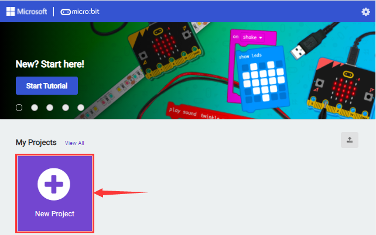
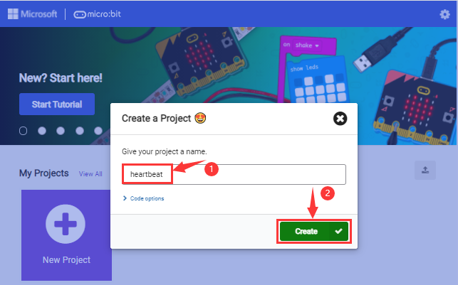

.. |image8| image:: ./media/makecode4.png
.. |image9| image:: ./media/makecode5.png

.. |image11| image:: ./media/makecode7.png
.. |image12| image:: ./media/a3.png
.. |image13| image:: ./media/a4.png

.. |image16| image:: ./media/makecode8.png

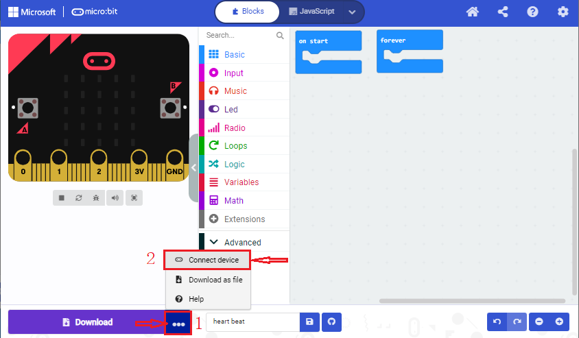

.. |image20| image:: ./media/makecode12.png
.. |image21| image:: ./media/makecode14.png
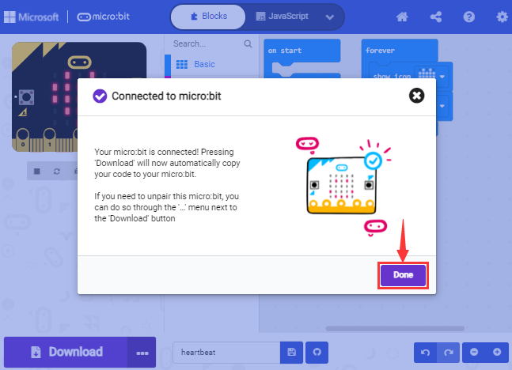
.. |image23| image:: ./media/makecode16.png
.. |image24| image:: ./media/makecode17.png
.. |image25| image:: ./media/makecode18.png
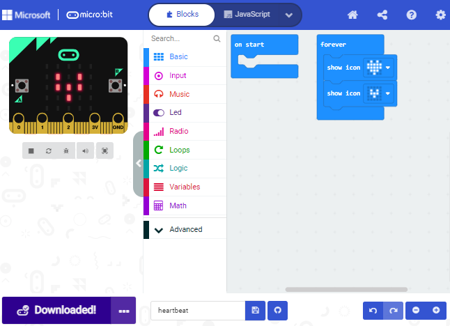
.. |image27| image:: ./media/makecode20.png
.. |image28| image:: ./media/makecode21.png

.. |image31| image:: ./media/makecode25.png

.. |image33| image:: ./media/makecode27.png
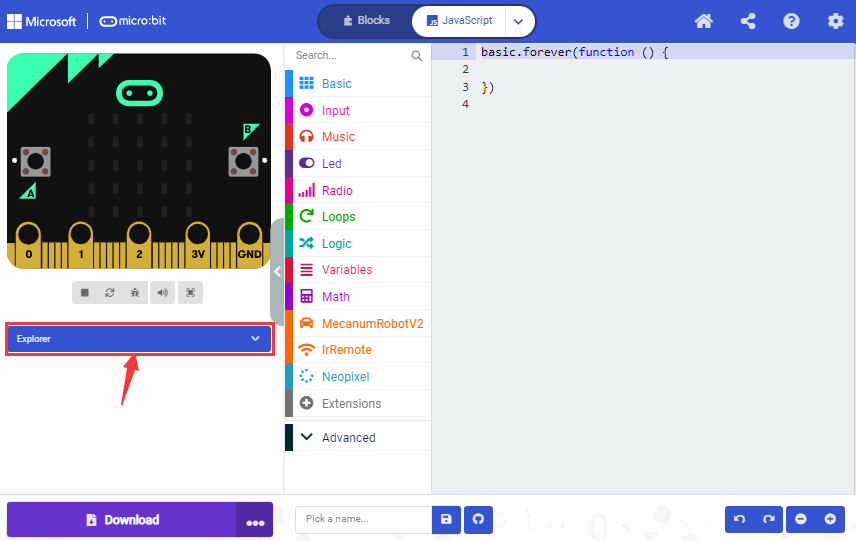
.. |image35| image:: ./media/makecode29.png
.. |image36| image:: ./media/makecode30.png
.. |image37| image:: ./media/makecode31.png
.. |image38| image:: ./media/makecode32.png
.. |image39| image:: ./media/makecode33.png
.. |image40| image:: ./media/makecode34.png
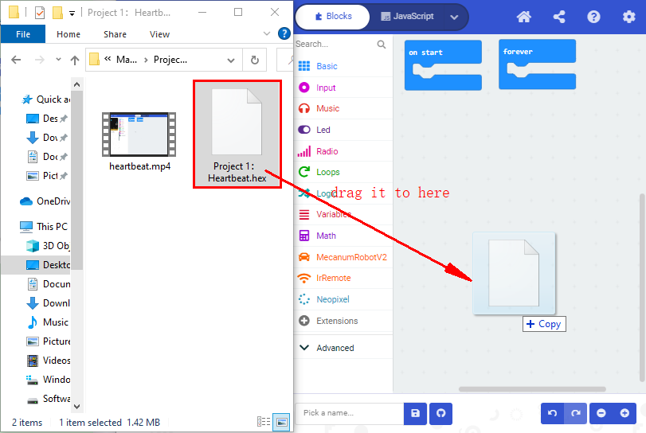
.. |image42| image:: ./media/makecode36.png
.. |image43| image:: ./media/CoolTerm1.png
.. |image44| image:: ./media/CoolTerm2.png
.. |image45| image:: ./media/CoolTerm3.png
.. |image46| image:: ./media/CoolTerm4.png
.. |image47| image:: ./media/CoolTerm5.png
.. |image48| image:: ./media/CoolTerm6.png
.. |image49| image:: ./media/CoolTerm7.png
.. |image50| image:: ./media/CoolTerm8.png
.. |image51| image:: ./media/CoolTerm9.png
.. |image52| image:: ./media/CoolTerm10.png
.. |image53| image:: ./media/CoolTerm11.png
.. |image54| image:: ./media/CoolTerm12.png
.. |image55| image:: ./media/CoolTerm13.png
.. |image56| image:: ./media/CoolTerm14.png

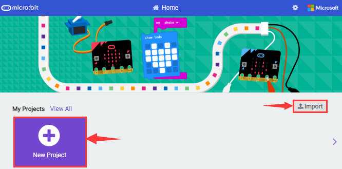

.. |image60| image:: ./media/code1-1.png
.. |image61| image:: ./media/heart1.png

.. |image65| image:: ./media/code2.png

.. |image68| image:: ./media/code3.png
.. |image69| image:: ./media/code3-1.png

.. |image71| image:: ./media/code4.png
.. |image72| image:: ./media/code4-1.png

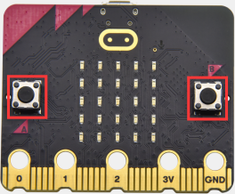

.. |image81| image:: ./media/button1.png
.. |image82| image:: ./media/code5.png
.. |image83| image:: ./media/code5-1.png
.. |image84| image:: ./media/code6.png
.. |image85| image:: ./media/code6-1.png
.. |image86| image:: ./media/microbit7.png
.. |image87| image:: ./media/code7.png
.. |image88| image:: ./media/code7-1.png
.. |image89| image:: ./media/c0.png
.. |image90| image:: ./media/c1.png
.. |image91| image:: ./media/c2.png
.. |image92| image:: ./media/d1.png
.. |image93| image:: ./media/d2.png
.. |image94| image:: ./media/d3.png
.. |image95| image:: ./media/d4.png
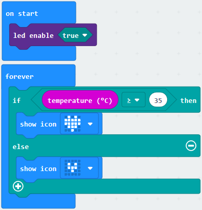
.. |image97| image:: ./media/code8-1.png
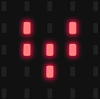

.. |image101| image:: ./media/code9.png
.. |image102| image:: ./media/code9-1.png

.. |image107| image:: ./media/code11-1.png
.. |image108| image:: ./media/code11-2.png
.. |image109| image:: ./media/code11-3.png
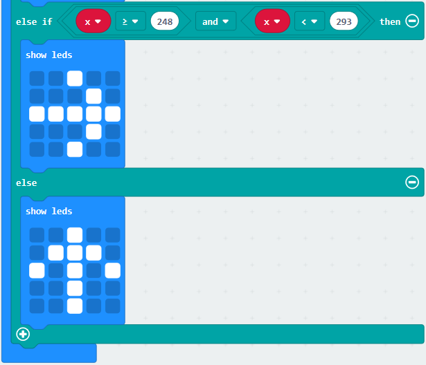
.. |image111| image:: ./media/code11-5.png
.. |image112| image:: ./media/code11-6.png

.. |image114| image:: ./media/code12.png
.. |image115| image:: ./media/code12-1.png
.. |image116| image:: ./media/code12-3.png

.. |image119| image:: ./media/ab3.jpg

.. |image121| image:: ./media/ab5.jpg
.. |image122| image:: ./media/code13.png

.. |image124| image:: ./media/c0.png
.. |image125| image:: ./media/c1.png
.. |image126| image:: ./media/microbit9.png
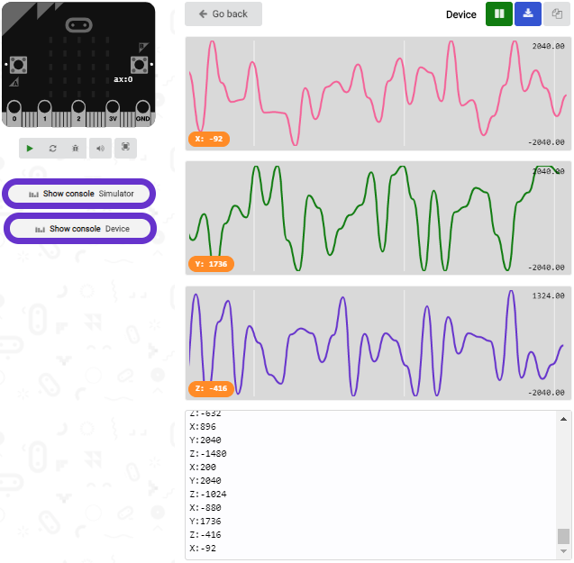
.. |image128| image:: ./media/d5.png

.. |image130| image:: ./media/code14.png

.. |image132| image:: ./media/c0.png
.. |image133| image:: ./media/c1.png
.. |image134| image:: ./media/c4.png
.. |image135| image:: ./media/d6.png
.. |image136| image:: ./media/microbit10.png
.. |image137| image:: ./media/code15.png
.. |image138| image:: ./media/code15-1.png
.. |image139| image:: ./media/microbit11.png
.. |image140| image:: ./media/code16.png
.. |image141| image:: ./media/code16-1.png
.. |image142| image:: ./media/code16-2.png
.. |image143| image:: ./media/microbit12.png
.. |image144| image:: ./media/microbit12-1.png
.. |image145| image:: ./media/code17.png
.. |image146| image:: ./media/code17-1.png

.. |image148| image:: ./media/code18.png
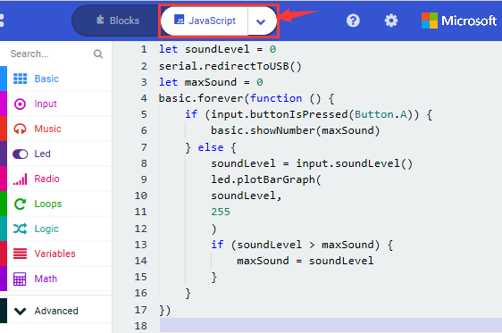
.. |image150| image:: ./media/c6.png
.. |image151| image:: ./media/c7.png
.. |image152| image:: ./media/microbit13.png
.. |image153| image:: ./media/e1.png

.. |image155| image:: ./media/e3.png
.. |image156| image:: ./media/e4.png
.. |image157| image:: ./media/e5.png
.. |image158| image:: ./media/e6.png
.. |image159| image:: ./media/e7.png
.. |image160| image:: ./media/e8.png
.. |image161| image:: ./media/e9.png
.. |image162| image:: ./media/e10.png
.. |image163| image:: ./media/e11.png
.. |image164| image:: ./media/e12.png
.. |image165| image:: ./media/e13.png
.. |image166| image:: ./media/e14.png
.. |image167| image:: ./media/e15.png
.. |image168| image:: ./media/e16.png
.. |image169| image:: ./media/e17.png
.. |image170| image:: ./media/e18.png
.. |image171| image:: ./media/e19.png
.. |image172| image:: ./media/e20.png
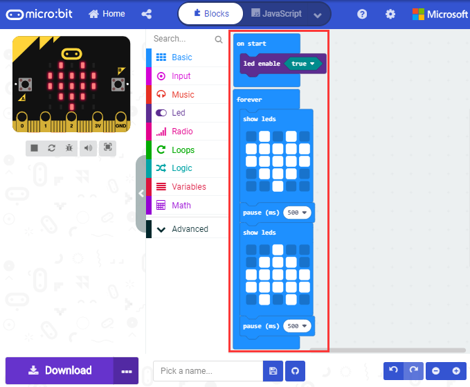
.. |image174| image:: ./media/e22.png
.. |image175| image:: ./media/e23.png
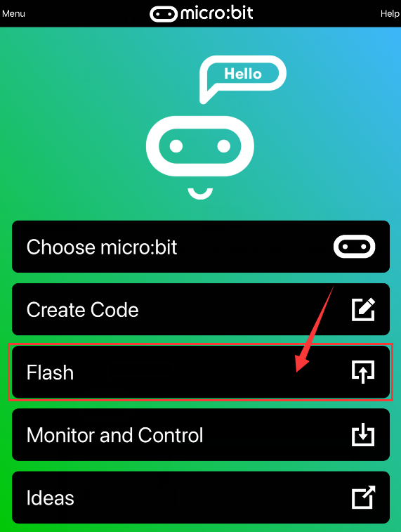
.. |image177| image:: ./media/e25.png
.. |image178| image:: ./media/e26.png
.. |image179| image:: ./media/e27.png
.. |image180| image:: ./media/e28.png

.. |image183| image:: ./media/ode21.png
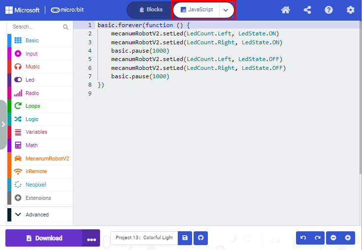
.. |image185| image:: ./media/e29.png

.. |image187| image:: ./media/code22-1.png

.. |image189| image:: ./media/ode23-1.png

.. |image191| image:: ./media/code23-3.png
.. |image192| image:: ./media/code23-4.png

.. |image194| image:: ./media/code24-1.png

.. |image197| image:: ./media/servo-2.png

.. |image199| image:: ./media/code25.png
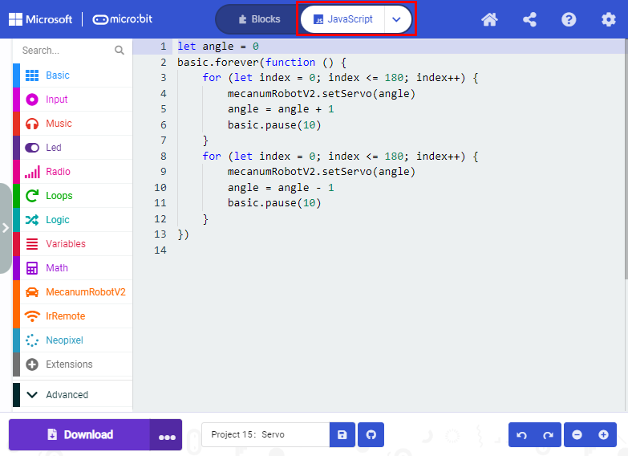

.. |image203| image:: ./media/motor2.png
.. |image204| image:: ./media/motor3.png
.. |image205| image:: ./media/motor4.png
.. |image206| image:: ./media/code26.png

.. |image208| image:: ./media/code27.png

.. |image210| image:: ./media/code27-2.png
.. |image211| image:: ./media/Line-Tracking.png
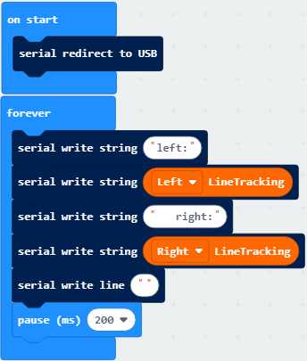
.. |image213| image:: ./media/code28-1.png
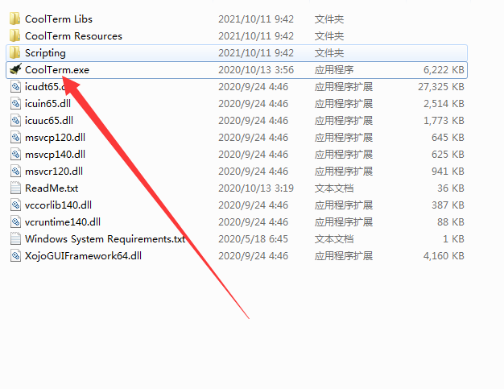
.. |image215| image:: ./media/d1.png
.. |image216| image:: ./media/d2.png
.. |image217| image:: ./media/d3.png
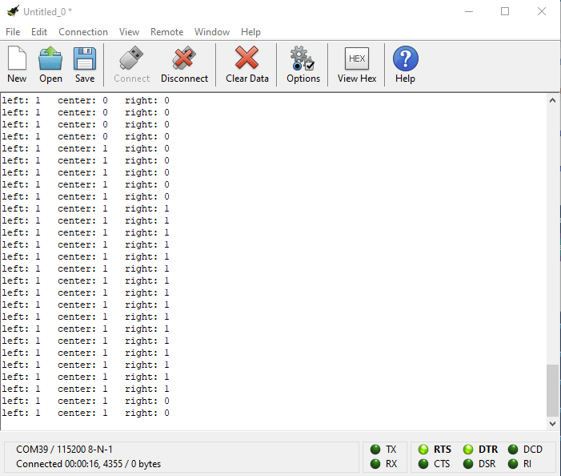

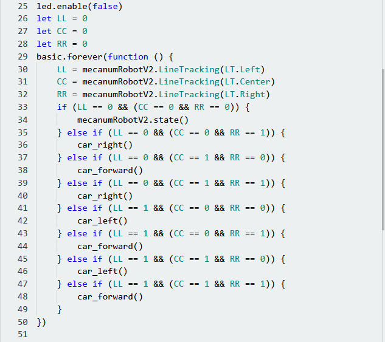
.. |image228| image:: ./media/Ultrasonic1.png
.. |image229| image:: ./media/Ultrasonic2.png
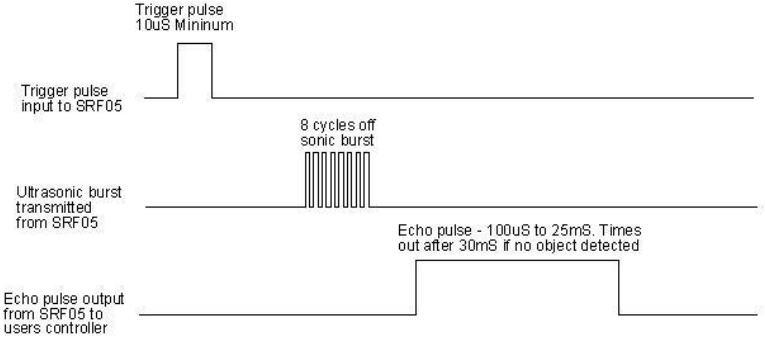
.. |image231| image:: ./media/code30.png
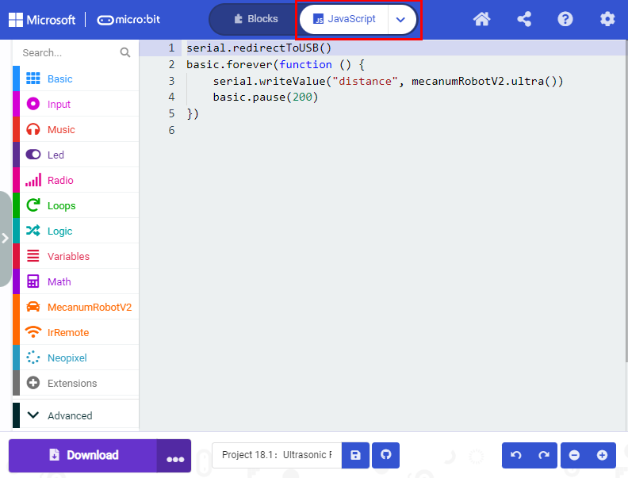
.. |image233| image:: ./media/abc.png
.. |image234| image:: ./media/c8.png
.. |image235| image:: ./media/d10.png

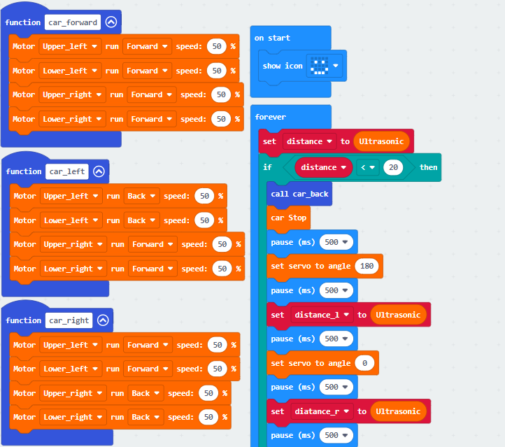

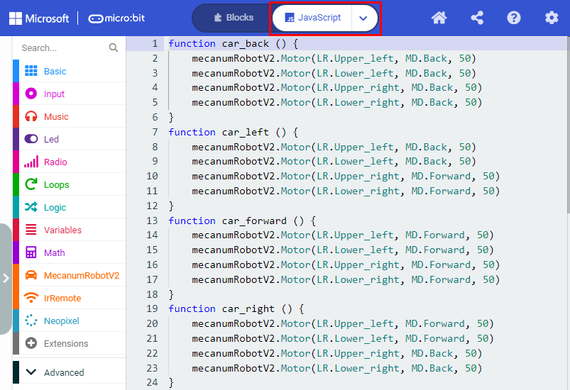
.. |image241| image:: ./media/code31-4.png

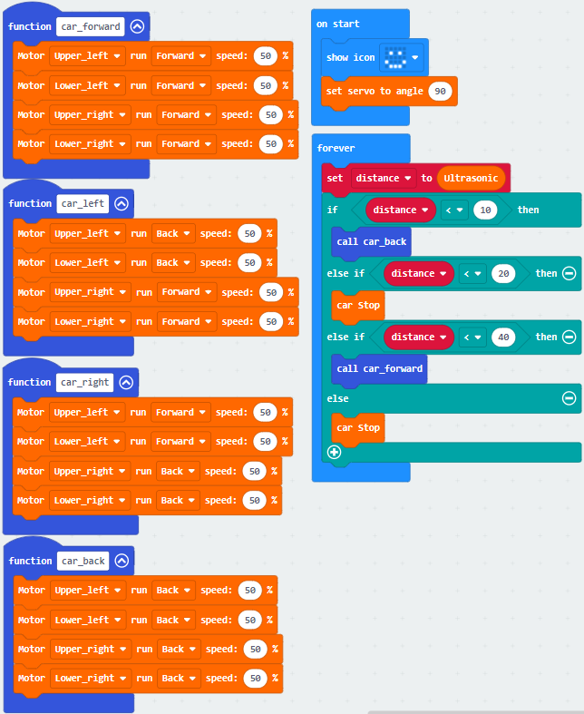

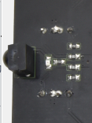
.. |image247| image:: ./media/IR-Control1.png
.. |image248| image:: ./media/code33.png
.. |image249| image:: ./media/code33-1.png
.. |image250| image:: ./media/c0.png
.. |image251| image:: ./media/c1.png
.. |image252| image:: ./media/c10.png

.. |image255| image:: ./media/IR-Control-car.png

.. |image257| image:: ./media/code34.png
.. |image258| image:: ./media/code34-1.png

.. |image260| image:: ./media/button-up.png
.. |image261| image:: ./media/button-left.png

.. |image263| image:: ./media/button-down.png
.. |image264| image:: ./media/button-ok.png
.. |image265| image:: ./media/microbit13.png
.. |image266| image:: ./media/Bluetooth-1.png
.. |image267| image:: ./media/Bluetooth-2.png
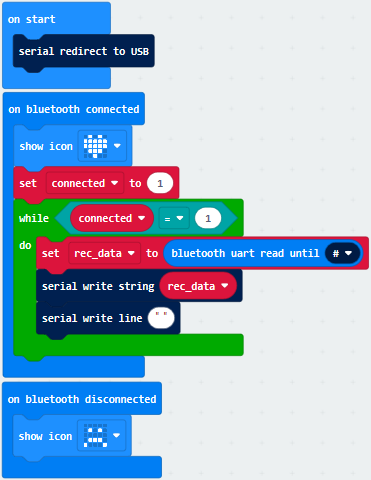
.. |image269| image:: ./media/code36-1.png
.. |image270| image:: ./media/cba.png
.. |image271| image:: ./media/cba1.png
.. |image272| image:: ./media/cba2.png
.. |image273| image:: ./media/e4.png
.. |image274| image:: ./media/e5.png
.. |image275| image:: ./media/QR-code.png
.. |image276| image:: ./media/app1.png
.. |image277| image:: ./media/app2.png
.. |image278| image:: ./media/app3.png
.. |image279| image:: ./media/app4.png
.. |image280| image:: ./media/app5.png
.. |image281| image:: ./media/app6.png
.. |image282| image:: ./media/d12.png
.. |image283| image:: ./media/app7.jpg

.. |image285| image:: ./media/Bluetooth-1.png
.. |image286| image:: ./media/Bluetooth-2.png

.. |image288| image:: ./media/code37-1.png
.. |image289| image:: ./media/abcd.png

